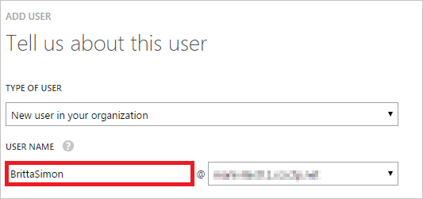

<properties
    pageTitle="教學課程︰ Azure Active Directory 整合矩形色塊瞭解 |Microsoft Azure"
    description="瞭解如何設定單一登入 Azure Active Directory 和矩形色塊瞭解之間。"
    services="active-directory"
    documentationCenter=""
    authors="jeevansd"
    manager="femila"
    editor=""/>

<tags
    ms.service="active-directory"
    ms.workload="identity"
    ms.tgt_pltfrm="na"
    ms.devlang="na"
    ms.topic="article"
    ms.date="09/29/2016"
    ms.author="jeedes"/>

# 教學課程︰ 使用矩形色塊瞭解的 Azure Active Directory 整合

在本教學課程中，您可以瞭解如何將矩形色塊瞭解整合與 Azure Active Directory (Azure AD)。

Azure AD 整合矩形色塊瞭解您提供下列優點︰

- 您可以控制可存取矩形色塊瞭解 Azure AD
- 您可以使用其 Azure AD 帳戶啟用使用者會自動取得登入，在矩形色塊瞭解 （單一登入）
- 您可以管理您的帳戶，在一個中央位置-Azure 傳統入口網站

如果您想要知道 Azure AD SaaS 應用程式整合相關的更多詳細資料，請參閱[什麼是應用程式存取和單一登入與 Azure Active Directory](active-directory-appssoaccess-whatis.md)。

## 必要條件

若要使用矩形色塊瞭解設定 Azure AD 整合，您需要下列項目︰

- Azure AD 訂閱
- 矩形色塊瞭解雲端平台單一登啟用的訂閱

> [AZURE.NOTE] 若要測試此教學課程中的步驟，我們不建議使用生產環境。

若要測試此教學課程中的步驟，您應該先按照這些建議︰

- 您應該使用生產環境，除非這是必要的。
- 如果您沒有安裝 Azure AD 試用環境，您可以在一個月試用[這裡](https://azure.microsoft.com/pricing/free-trial/)取得。

## 案例說明
在本教學課程中，您測試 Azure AD 單一登入的測試環境中。

本教學課程中所述的案例是由兩個主要的建置組塊所組成︰

1. 從圖庫新增 [矩形色塊瞭解
2. 設定及測試 Azure AD 單一登入

## 從圖庫新增 [矩形色塊瞭解
若要設定的矩形色塊瞭解整合到 Azure AD，您需要矩形色塊瞭解從庫新增至您的受管理的 SaaS 應用程式清單。

**若要新增矩形色塊瞭解圖庫，執行下列步驟︰**

1. 在**Azure 傳統入口網站**，在左側的功能窗格中，按一下 [ **Active Directory**]。

    ![Active Directory][1]
2. 從 [**目錄**] 清單中，選取您要啟用目錄整合的目錄。

3. 若要開啟 [應用程式] 檢視中，在 [目錄] 檢視中，按一下 [在上方的功能表中的 [**應用程式**]。

    ![應用程式][2]

4. 按一下 [**新增**頁面的底部。

    ![應用程式][3]

5. 在 [**您想要做什麼**] 對話方塊中，按一下 [**新增應用程式，從圖庫**。

    ![應用程式][4]

6. 在 [搜尋] 方塊中，輸入**矩形色塊瞭解**。

    

7. 在 [結果] 窗格中，選取**矩形色塊瞭解**，，然後按一下 [新增應用程式**完成**。
    
    

##  設定及測試 Azure AD 單一登入
在此區段中，您可以設定並使用矩形色塊瞭解根據稱為 「 許承恩 」 的測試使用者測試 Azure AD 單一登入。

單一登入搭配使用，Azure AD 需要知道什麼對應中的使用者矩形色塊瞭解使用者 Azure AD。 也就是說，必須建立連結和之間的關聯 Azure AD 使用者在矩形色塊瞭解相關的使用者。

所指派**的使用者名稱**的值為矩形色塊瞭解**的使用者名稱**的值 Azure AD 中建立此連結關聯。

若要設定及測試 Azure AD 單一登入與矩形色塊瞭解，必須完成下列建置組塊︰

1. **[Azure AD 設定單一登入](#configuring-azure-ad-single-sign-on)**-若要讓使用者能使用這項功能。
2. **[建立 Azure AD 測試使用者](#creating-an-azure-ad-test-user)**-Azure AD 單一登入與許承恩測試。
3. **[建立矩形色塊瞭解測試使用者](#creating-a-blackboard-learn-test-user)**-有許承恩的對應的矩形色塊瞭解 Azure AD 表示她的連結。
4. **[指派 Azure AD 測試使用者](#assigning-the-azure-ad-test-user)**-啟用許承恩使用 Azure AD 單一登入。
5. **[測試單一登入](#testing-single-sign-on)**-驗證是否設定運作。

### Azure AD 單一登入設定

在此區段中，您可以 Azure AD 單一登入 [傳統] 入口網站中啟用，並在矩形色塊瞭解應用程式中設定單一登入。

矩形色塊瞭解應用程式以特定格式預期 SAML 判斷提示。 請設定此應用程式的下列宣告。 您可以在**「 Atrribute 」**索引標籤上的應用程式管理這些屬性的值。 以下螢幕擷取畫面會顯示這個範例。 

 

**若要使用矩形色塊瞭解設定 Azure AD 單一登入，請執行下列步驟︰**

1. Azure 傳統入口網站，在**矩形色塊瞭解**應用程式整合] 頁面上方的功能表中按一下 [**屬性**]。

     

1. 在 [ **SAML 權杖屬性**] 對話方塊中，顯示在下表中每個資料列執行下列步驟︰ 我們有的專屬使用者屬性對應 Userprincipalname，但您可以將它對應到適當唯一的辨別使用者在組織中的值，對應至矩形色塊瞭解 username 功能變數。

  	| 屬性名稱 | 屬性值 |
  	| --- | --- |    
  	| urn:oid:1.3.6.1.4.1.5923.1.1.1.6  | user.userprincipalname |
   
 
    。 按一下 [開啟 [**新增使用者 Attribure** ] 對話方塊的 [**新增使用者屬性**]。

     

    b。 在 [ **Attrubute 名稱**] 文字方塊中，輸入顯示該資料列的屬性名稱。

    c。 從**屬性值**清單中，selsect 顯示該資料列的屬性值。

    d。 按一下 [**完成**]。  

2. 在 [傳統] 入口網站**（矩形色塊） 瞭解**應用程式整合在頁面上，按一下 [**設定單一登入**以開啟 [**設定單一登入**] 對話方塊。
     
    ![設定單一登入][6] 

3. 在**您要如何登入，矩形色塊瞭解的使用者**] 頁面上，選取**Azure AD 單一登入**，然後按 [**下一步**。

     

4. **設定應用程式設定**] 對話方塊在頁面上，執行下列步驟︰

     

    。 在 [**登入 URL** ] 文字方塊中，輸入您登入使用下列模式矩形色塊瞭解應用程式的使用者所使用的 URL: **https://\<公司名稱價格\>.blackboard.com/**
    
    b。 按一下 [**下一步**
 
5. **設定單一登入在矩形色塊瞭解**在頁面上，執行下列步驟︰

    

    。 按一下**下載的中繼資料**]，然後儲存您的電腦上的檔案。

    b。 按一下 [**下一步**]。

6. 若要取得 SSO 應用程式的設定，連絡矩形色塊瞭解支援小組，並向他們提供下列動作︰

    • 下載的中繼資料

7. 在 [傳統] 入口網站，選取單一登入設定確認，然後按 [**下一步**。
    
    ![Azure AD 單一登入][10]

8. 在**單一登入確認**] 頁面上，按一下 [**完成**]。  
 
    ![Azure AD 單一登入][11]

### 建立 Azure AD 測試使用者
在此區段中，您可以建立在傳統入口網站中名為許承恩測試使用者。

![建立 Azure AD 使用者][20]

**若要建立的測試使用者 Azure AD 中，執行下列步驟︰**

1. 在**Azure 傳統入口網站**，在左側的功能窗格中，按一下 [ **Active Directory**]。

     

2. 從 [**目錄**] 清單中，選取您要啟用目錄整合的目錄。

3. 若要顯示的使用者清單頂端的功能表中，按一下 [**使用者**]。

     

4. 若要開啟 [**新增使用者**] 對話方塊底部的工具列中，按一下 [**新增使用者**]。

     

5. 在 [**告訴我們瞭解此使用者**的對話方塊頁面，請執行下列步驟︰  

    。 為使用者類型，選取您組織中的 [新的使用者]。

    b。 在 [使用者名稱]**文字方塊**中，輸入**BrittaSimon**。

    c。 按一下 [**下一步**]。

6.  在 [**使用者設定檔**] 對話方塊頁面，請執行下列步驟︰ 

    。 在 [**名字**] 文字方塊中輸入**許**。  

    b。 在 [**姓氏**] 文字方塊中輸入，**承恩**。

    c。 在 [**顯示名稱**] 文字方塊中，輸入**許承恩**。

    d。 在 [**角色**] 清單中選取 [**使用者**]。

    e。 按一下 [**下一步**]。

7. 在 [**取得暫時密碼**] 對話方塊頁面上，按一下 [**建立**]。

     

8. **取得暫時密碼**] 對話方塊在頁面上，執行下列步驟︰

     

    。 寫下的值的**新密碼**。

    b。 按一下 [**完成**]。   

### 建立矩形色塊瞭解測試使用者

在此區段中，您可以建立在矩形色塊瞭解稱為許承恩使用者。 

矩形色塊瞭解應用程式支援僅在時間使用者佈建。 請確定您已[設定 Azure AD 單一登入](#configuring-azure-ad-single-sign-on)**的一節所述設定宣告**

### 指派 Azure AD 測試使用者

在此區段中，您可以啟用許承恩 Azure 單一登入使用授與其存取權 （矩形色塊） 瞭解。

![為使用者指派][200] 

**若要指定許承恩矩形色塊瞭解，請執行下列步驟︰**

1. 在 [傳統] 入口網站，若要開啟 [應用程式] 檢視中，在 [目錄] 檢視中，按一下 [**應用程式**頂端的功能表中。

    ![為使用者指派][201] 

2. 在 [應用程式] 清單中，選取**矩形色塊瞭解**。

     

3. 在頂端的功能表，按一下 [**使用者**]。

    ![為使用者指派][203]

4. 在 [使用者] 清單中，選取**許承恩**。

5. 在底部工具列中，按一下 [**指派**]。

    ![為使用者指派][205]

### 測試單一登入

在此區段中，您測試 Azure AD 單一登入設定使用 Access 面板。

矩形色塊瞭解應用程式支援當您按一下矩形色塊瞭解 Access] 面板中的標題時，您應該取得自動登入的矩形色塊瞭解應用程式。

## 其他資源

* [如何與 Azure Active Directory 整合 SaaS 應用程式的教學課程的清單](active-directory-saas-tutorial-list.md)
* [什麼是應用程式存取和單一登入與 Azure Active Directory？](active-directory-appssoaccess-whatis.md)

<!--Image references-->

[1]: ./media/active-directory-saas-blackboard-learn-tutorial/tutorial_general_01.png
[2]: ./media/active-directory-saas-blackboard-learn-tutorial/tutorial_general_02.png
[3]: ./media/active-directory-saas-blackboard-learn-tutorial/tutorial_general_03.png
[4]: ./media/active-directory-saas-blackboard-learn-tutorial/tutorial_general_04.png

[6]: ./media/active-directory-saas-blackboard-learn-tutorial/tutorial_general_05.png
[10]: ./media/active-directory-saas-blackboard-learn-tutorial/tutorial_general_06.png
[11]: ./media/active-directory-saas-blackboard-learn-tutorial/tutorial_general_07.png
[20]: ./media/active-directory-saas-blackboard-learn-tutorial/tutorial_general_100.png

[200]: ./media/active-directory-saas-blackboard-learn-tutorial/tutorial_general_200.png
[201]: ./media/active-directory-saas-blackboard-learn-tutorial/tutorial_general_201.png
[203]: ./media/active-directory-saas-blackboard-learn-tutorial/tutorial_general_203.png
[204]: ./media/active-directory-saas-blackboard-learn-tutorial/tutorial_general_204.png
[205]: ./media/active-directory-saas-blackboard-learn-tutorial/tutorial_general_205.png
