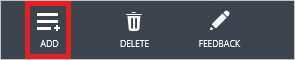

<properties 
    pageTitle="教學課程︰ 使用商務用 Dropbox 的 Azure Active Directory 整合 |Microsoft Azure" 
    description="瞭解如何使用與 Azure Active Directory 的商務用 Dropbox 啟用單一登入、 自動化佈建和更多 ！" 
    services="active-directory" 
    authors="jeevansd"  
    documentationCenter="na" 
    manager="femila"/>
<tags 
    ms.service="active-directory" 
    ms.devlang="na" 
    ms.topic="article" 
    ms.tgt_pltfrm="na" 
    ms.workload="identity" 
    ms.date="08/16/2016" 
    ms.author="jeedes" />

#教學課程︰ 使用商務用 Dropbox 的 Azure Active Directory 整合
  
本教學課程中的目標是以顯示 Azure 和商務用 Dropbox 的整合。  
本教學課程中所述的案例假設您已經有下列項目︰

-   有效的 Azure 訂閱
-   在商務用 Dropbox 中測試租用戶
  
完成後本教學課程中，您指派給 Dropbox 的商務能夠單一的登入您在商務用 Dropbox 應用程式的 Azure AD 使用者公司網站 （服務提供者發起的租用戶登入），或使用[[存取面板簡介](active-directory-saas-access-panel-introduction.md)。
  
本教學課程中所述的案例是由下列建置組塊所組成︰

1.  啟用商務用 Dropbox 的整合應用程式
2.  設定單一登入
3.  設定使用者佈建
4.  將使用者指派

##啟用商務用 Dropbox 的整合應用程式
  
本節的目標是大綱如何啟用用於商務用 Dropbox 整合應用程式。

###若要啟用的商務用 Dropbox 整合應用程式，請執行下列步驟︰

1.  Azure 傳統入口網站中，在左側的功能窗格中，按一下 [ **Active Directory**]。

    

2.  從 [**目錄**] 清單中，選取您要啟用目錄整合的目錄。

3.  若要開啟 [應用程式] 檢視中，在 [目錄] 檢視中，按一下 [在上方的功能表中的 [**應用程式**]。

    

4.  按一下 [**新增**頁面的底部。

    

5.  在 [**您想要做什麼**] 對話方塊中，按一下 [**新增應用程式，從圖庫**。

    

6.  在**搜尋] 方塊**中，輸入**商務用 Dropbox**。

    

7.  在 [結果] 窗格中，選取**商務用 Dropbox**，然後按一下 [新增應用程式**完成**。

    

##設定單一登入
  
本節的目標是大綱如何啟用使用者驗證方法到商務用 Dropbox 帳戶中使用根據 SAML 通訊協定的同盟 Azure AD。

此程序的一部分，您會需要上傳至您的商務租用戶的 Dropbox 的底數 64 編碼的憑證。 如果您不熟悉這個程序，請參閱[如何將轉換成文字檔的二進位憑證](http://youtu.be/PlgrzUZ-Y1o)。

###若要設定單一登入，請執行下列步驟︰

1.  在 [Azure 傳統入口網站，在**商務用 Dropbox**整合應用程式] 頁面，按一下 [**設定單一登入**以開啟 [**設定單一登入**] 對話方塊。

    

2.  在**您要如何登入商務用 Dropbox 的使用者**] 頁面上，選取**Microsoft Azure AD 單一登入**，然後按 [**下一步**。

    

3.  **設定應用程式 URL**在頁面上，執行下列步驟︰

    。 登入到您 Dropbox 商務租用戶。 

    

    b。 在左側功能窗格] 中按一下 [**管理主控台**]。 

    

    c。 在**管理主控台**中，按一下 [在左側的功能窗格中的 [**驗證**]。 

    

    d。 在**單一登入**] 區段中，選取 [**啟用單一登入**]，然後按一下 [**更多**] 以展開 [此節。  

    

    e。 複製**使用者輸入其電子郵件地址，即可登入] 或 [他們可以直接跳到**] 旁的 URL。 

    

    f。 在 Azure 傳統的入口網站中，在**商務用 DropBox 登入**URL 文字方塊中貼上 URL。 

      

4. 在**設定單一登入商務用 Dropbox 在**頁面上，按一下**下載憑證**]，然後儲存您的電腦上的憑證檔案。  

    

5. 在您 Dropbox 商務租用戶，在**單一登入**] 區段的 [**驗證**] 頁面上執行下列步驟︰ 

    

    。 按一下 [**必要**]。

    b。 Azure 傳統入口網站中，在 [**設定單一登入商務用 Dropbox 在**對話方塊頁面，**登入頁面的 URL**值，複製，然後再貼到 [**登入 URL** ] 文字方塊。

    c。 建立**64 基本編碼**檔案從您下載的憑證。 

    > [AZURE.TIP] 如需詳細資訊，請參閱[如何將轉換成文字檔的二進位憑證](http://youtu.be/PlgrzUZ-Y1o)。

    d。 按一下**[選擇憑證]**按鈕，然後瀏覽至您的**64 基本編碼憑證檔案**。

    e。 按一下 [ **] 儲存變更]**按鈕以完成您 DropBox 商務租用戶上的設定]。

6. 在 Azure 傳統的入口網站中，選取單一登入設定確認，然後再按一下**完成**關閉 [**設定單一登入**] 對話方塊。 

    

##設定使用者佈建
  
本節的目標是大綱如何啟用使用者佈建到商務用 Dropbox 的 Active Directory 使用者帳戶。

### 若要設定使用者佈建，執行下列步驟︰

1. Azure 傳統入口網站中，在**商務用 Dropbox**整合應用程式] 頁面，按一下 [開啟 [**設定使用者佈建**] 對話方塊的 [**設定使用者佈建**]。

2. 在啟用使用者佈建到 DropBox 商務] 頁面上，按一下 [啟用使用者佈建以開啟 [登入以 Dropbox 連結 Azure AD] 對話方塊。  

    

3. 在 [**登入 Dropbox Azure AD 與連結**] 對話方塊中，登入您的商務租用戶 Dropbox。 

    

4. 按一下 [授與存取 Dropbox Azure AD 的**儲存格內允許**]。 

    

5. 若要完成設定，請按一下 [**完成**] 按鈕。  

    

##將使用者指派
  
若要測試您的設定，您需要授與 Azure AD 使用者您想要允許使用您的應用程式存取分派給他們。

###若要將使用者指派至商務用 Dropbox 中，執行下列步驟︰

1.  在 Azure 傳統入口網站中建立測試帳戶。

2.  在**商務用 Dropbox**整合應用程式] 頁面，按一下 [**指派給使用者**。

    

3.  選取您測試的使用者、**指派**，請按一下 [，然後按一下**[是]**以確認您的工作分派。

    ![[是]](./media/active-directory-saas-dropboxforbusiness-tutorial/IC767830.png "[是]")
  

您現在應該等待 10 分鐘的時間，並確認帳戶已同步處理到商務用 Dropbox。

驗證，首先，您可以檢查佈建的狀態，按一下 [Azure 傳統入口網站上的**商務用 Dropbox**應用程式整合頁面中的 [**儀表板**。

以相關的狀態，表示順利完成的使用者佈建循環圖。

如果您想要測試您的單一登入設定，開啟 [存取面板。
如需存取畫面的詳細資訊，請參閱[簡介存取面板](active-directory-saas-access-panel-introduction.md)。

## 其他資源

* [如何與 Azure Active Directory 整合 SaaS 應用程式的教學課程的清單](active-directory-saas-tutorial-list.md)
* [什麼是應用程式存取和單一登入與 Azure Active Directory？](active-directory-appssoaccess-whatis.md)