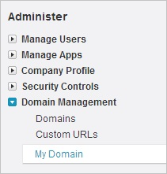
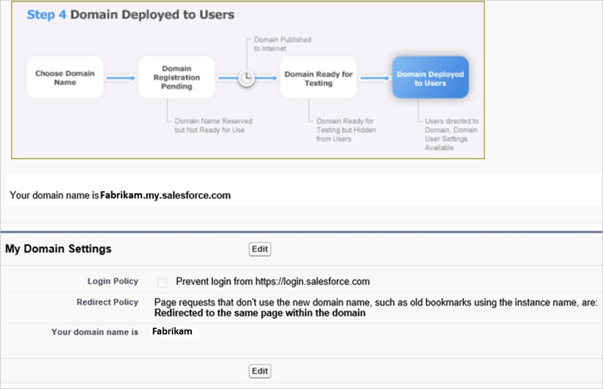
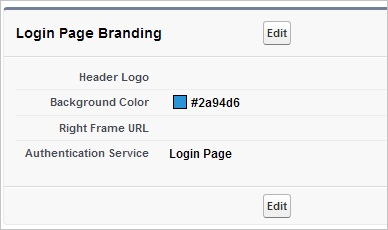
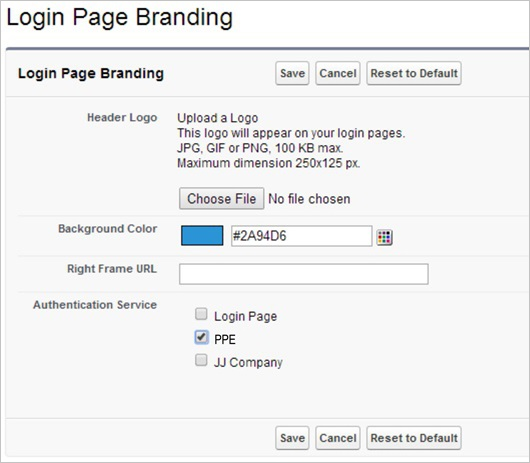
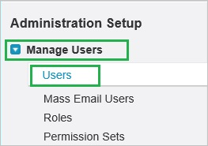

<properties 
    pageTitle="教學課程︰ Azure Active Directory 整合 Jobscience |Microsoft Azure" 
    description="瞭解如何使用 Jobscience 與 Azure Active Directory 啟用單一登入，自動化佈建和更多 ！" 
    services="active-directory" 
    authors="jeevansd"  
    documentationCenter="na" 
    manager="femila"/>
<tags 
    ms.service="active-directory" 
    ms.devlang="na" 
    ms.topic="article" 
    ms.tgt_pltfrm="na" 
    ms.workload="identity" 
    ms.date="09/29/2016" 
    ms.author="jeedes" />

#教學課程︰ 使用 Jobscience 的 Azure Active Directory 整合
  
本教學課程中的目標是以顯示 Azure 和 Jobscience 的整合。  
本教學課程中所述的案例假設您已經有下列項目︰

-   有效的 Azure 訂閱
-   Jobscience 單一登入啟用訂閱
  
完成後本教學課程中，您指派給 Jobscience Azure AD 使用者將能夠單一登入 Jobscience 公司網站 （服務提供者發起的租用戶登入），或使用[[存取面板簡介](active-directory-saas-access-panel-introduction.md)應用程式。
  
本教學課程中所述的案例是由下列建置組塊所組成︰

1.  啟用 Jobscience 應用程式整合
2.  設定單一登入
3.  設定使用者佈建
4.  將使用者指派

##啟用 Jobscience 應用程式整合
  
本節的目標是大綱如何啟用 Jobscience 的整合應用程式。

###若要啟用的 Jobscience 整合應用程式，請執行下列步驟︰

1.  Azure 傳統入口網站中，在左側的功能窗格中，按一下 [ **Active Directory**]。

    

2.  從 [**目錄**] 清單中，選取您要啟用目錄整合的目錄。

3.  若要開啟 [應用程式] 檢視中，在 [目錄] 檢視中，按一下 [在上方的功能表中的 [**應用程式**]。

    

4.  按一下 [**新增**頁面的底部。

    

5.  在 [**您想要做什麼**] 對話方塊中，按一下 [**新增應用程式，從圖庫**。

    

6.  在**搜尋] 方塊**中，輸入**jobscience**。

    

7.  在 [結果] 窗格中，選取**Jobscience**，，然後按一下要新增應用程式**完成**。

    
##設定單一登入
  
本節的目標是大綱如何啟用使用者進行驗證其帳戶中使用根據 SAML 通訊協定的同盟 Azure AD Jobscience。  
設定單一登入的 Jobscience 需要您從憑證擷取指紋值。  
如果您不熟悉這個程序，請參閱[如何擷取的憑證指紋值](http://youtu.be/YKQF266SAxI)。

###若要設定單一登入，請執行下列步驟︰

1.  以系統管理員身分登入您 Jobscience 公司的網站。

2.  移至**設定**。

    

3.  在左側的功能窗格中，在 [**管理**] 區段中，按一下**網域管理**] 以展開相關的區段，然後按一下以開啟 [**我的網域**] 頁面的 [**我的網域**。 

    

4.  若要驗證的網域已設定正確，請確定它是在 「**使用者的步驟 4 部署**「 並檢閱您 [**我的網域設定**]。

    

5.  在不同的網頁瀏覽器視窗中，您 Azure 傳統入口網站登入。

6.  在 [ **Jobscience**應用程式整合] 頁面中，按一下 [**設定單一登入**以開啟 [**設定單一登入**] 對話方塊。

    

7.  在**您要如何登入 Jobscience 的使用者**] 頁面上，選取**Microsoft Azure AD 單一登入**，然後按 [**下一步**。

    

8.  **設定應用程式 URL**在頁面上，在 [ **Jobscience 登入 URL** ] 文字方塊中，輸入您使用下列模式 」*http://company.my.salesforce.com*」 的 URL，然後再按 [**下一步**。

    

9.  在**設定單一登入 Jobscience 在**頁面上，若要下載您的憑證，按一下 [**下載憑證**] 並儲存在本機電腦上的憑證檔案。

    

10. Jobscience 公司網站上，按一下**的安全性控制項**，然後按一下**單一登入設定**。

    

11. 在**單一登入設定**] 區段中，執行下列步驟︰

    

    1.  選取 [ **SAML 啟用**]。
    2.  按一下 [**新增**]。

12. 在 [ **SAML 單一登入設定編輯**] 對話方塊中，執行下列步驟︰

    

    1.  在 [**名稱**] 文字方塊中，輸入您的設定的名稱。
    2.  Azure 傳統入口網站，在 [**設定單一登入在 Jobscience**對話] 頁面中的**發行者 URL**值，複製，然後再貼到 [**簽發者**] 文字方塊
    3.  在**實體 Id** ] 文字方塊中輸入**https://salesforce-jobscience.com**
    4.  按一下 [上傳您的 Azure AD 憑證的 [**瀏覽**]。
    5.  為**SAML 身分識別類型**，選取 [**判斷提示包含同盟 ID 從使用者物件**]。
    6.  為**SAML 身分識別的位置**，選取 [**身分識別 NameIdentfier 項目主旨陳述式中**。
    7.  Azure 傳統入口網站，在 [**設定單一登入在 Jobscience**對話] 頁面中複製 [**遠端登入 URL**的值，，然後再貼到 [**身分識別提供者登入 URL** ] 文字方塊
    8.  Azure 傳統入口網站，在 [**設定單一登入在 Jobscience**對話] 頁面中複製 [**遠端登出 URL**的值，，然後再貼到 [**身分識別提供者登出 URL** ] 文字方塊
    9.  按一下 [**儲存**]。

13. 在左側的功能窗格中，在 [**管理**] 區段中，按一下**網域管理**] 以展開相關的區段，然後按一下以開啟 [**我的網域**] 頁面的 [**我的網域**。 

    

14. 在 [**我的網域**] 頁面中，在 [**登入頁面商標**] 區段中，按一下 [**編輯**]。

    

15. 在 [**登入頁面商標**] 頁面的 [**驗證服務**] 區段中，會顯示**SAML SSO 設定**您的名稱。 選取，然後再按一下 [**儲存**]。

    

16. 在 Azure 傳統的入口網站中，選取單一登入設定確認，然後再按一下**完成**關閉 [**設定單一登入**] 對話方塊。

    
  
若要取得 SP 發起的單一登入 [登入 URL 按一下**安全性控制項**的 [功能表] 區段中的**單一登入設定**。

  
按一下您在上述步驟建立 SSO 設定檔。  
這個頁面會顯示在 URL (例如*https://companyname.my.salesforce.com?so=companyid*) 貴公司的單一登。
##設定使用者佈建
  
若要啟用 Azure AD 使用者登入 Jobscience，他們必須佈建到 Jobscience。  
若是 Jobscience，佈建是手動的工作。

###若要設定使用者佈建，執行下列步驟︰

1.  以系統管理員身分登入您**Jobscience**公司的網站。

2.  移至 [設定

    

3.  移至 [**管理使用者\>使用者**。

    

4.  按一下 [**新增使用者**]。

    

5.  在 [**編輯使用者**] 對話方塊中，執行下列步驟︰

    

    1.  輸入名字、 姓氏、 別名、 電子郵件、 您想要在相關的文字方塊佈建 Azure AD 使用者的使用者名稱] 和 [暱稱屬性。
    2.  按一下 [**儲存**]。

    >[AZURE.NOTE] Azure AD 帳戶擁有者會收到包含確認帳戶，再啟動連結的電子郵件。

>[AZURE.NOTE] 您可以使用任何其他 Jobscience 使用者帳戶建立工具或 Api 提供 Jobscience 佈建 AAD 使用者帳戶。

##將使用者指派
  
若要測試您的設定，您需要授與 Azure AD 使用者您想要允許使用您的應用程式存取分派給他們。

###若要指定 Jobscience 使用者，請執行下列步驟︰

1.  在 Azure 傳統入口網站中建立測試帳戶。

2.  **Jobscience**應用程式整合在頁面上，按一下 [**指派給使用者**。

    

3.  選取您測試的使用者、**指派**，請按一下 [，然後按一下**[是]**以確認您的工作分派。

    ![[是]](./media/active-directory-saas-jobscience-tutorial/IC767830.png "[是]")
  
如果您想要測試您的單一登入設定，開啟 [存取面板。 如需存取畫面的詳細資訊，請參閱[簡介存取面板](active-directory-saas-access-panel-introduction.md)。