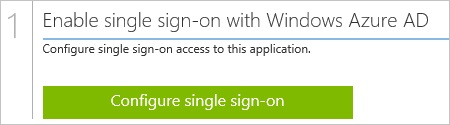

<properties 
    pageTitle="教學課程︰ 使用新的聖器的 Azure Active Directory 整合 |Microsoft Azure" 
    description="瞭解如何使用新的聖器與 Azure Active Directory 啟用單一登入，自動化佈建和更多 ！" 
    services="active-directory" 
    authors="jeevansd"  
    documentationCenter="na" 
    manager="femila"/>
<tags 
    ms.service="active-directory" 
    ms.devlang="na" 
    ms.topic="article" 
    ms.tgt_pltfrm="na" 
    ms.workload="identity" 
    ms.date="09/29/2016" 
    ms.author="jeedes" />

#教學課程︰ 使用新的聖器的 Azure Active Directory 整合
  
本教學課程中的目標是要如何設定 [單一登入 Azure Active Directory 和新聖器之間。
  
本教學課程中所述的案例假設您已經有下列項目︰

-   有效的 Azure 訂閱
-   新的聖器單一登入啟用訂閱
  
完成後本教學課程中，您指派給新聖器的 Azure Active Directory 使用者將能夠單一登入使用 AAD 存取面板。

1.  啟用新聖器應用程式整合
2.  設定單一登入
3.  設定使用者佈建
4.  將使用者指派

##啟用新聖器應用程式整合
  
本節的目標是大綱如何啟用新聖器的整合應用程式。

###若要啟用的新聖器整合應用程式，請執行下列步驟︰

1.  Azure 傳統入口網站中，在左側的功能窗格中，按一下 [ **Active Directory**]。

    

2.  從 [**目錄**] 清單中，選取您要啟用目錄整合的目錄。

3.  若要開啟 [應用程式] 檢視中，在 [目錄] 檢視中，按一下 [在上方的功能表中的 [**應用程式**]。

    

4.  按一下 [**新增**頁面的底部。

    

5.  在 [**您想要做什麼**] 對話方塊中，按一下 [**新增應用程式，從圖庫**。

    

6.  在**搜尋] 方塊**中，輸入**新的聖器**。

    

7.  在 [結果] 窗格中，選取**新的聖器**，，然後按一下 [新增應用程式**完成**。

    
##設定單一登入
  
本節說明如何啟用使用者至新的聖器的 Azure Active Directory，使用 SAML 通訊協定所根據的同盟其帳戶驗證方法。

###若要設定單一登入，請執行下列步驟︰

1.  在 Azure 的傳統入口網站，在**新的聖器**應用程式整合頁面上，按一下 [**設定單一登入**以開啟 [**設定單一登入**] 對話方塊。

    

2.  在**您要如何登入新聖器的使用者**] 頁面上，選取**Microsoft Azure AD 單一登入**，然後按 [**下一步**。

    

3.  **設定應用程式 URL**在頁面上，在 [**新聖器登入的 URL** ] 文字方塊中，輸入您的使用者用來登入您的新聖器應用程式的 URL，然後再按 [**下一步**。 

    應用程式 URL 是您的新聖器租用戶 URL (例如︰ *https://rpm.newrelic.com*):

    

4.  在**設定單一登入新聖器在**頁面上，若要下載您的憑證，按一下**下載憑證**]，然後將憑證檔案儲存到本機電腦。

    

5.  在不同的網頁瀏覽器視窗中，登入您的**新聖器**公司網站以系統管理員。

6.  在頂端的功能表，按一下 [**帳戶設定**]。

    

7.  按一下 [**安全性和驗證**] 索引標籤，然後按一下 [**單一登入**] 索引標籤。

    

8.  在 SAML 對話方塊頁面上，執行下列步驟︰

    

    1.  按一下您要上傳您下載的 Azure Active Directory 憑證**選擇檔案**。
    2.  Azure 的傳統入口網站，在**設定單一登入新聖器在**頁面上，在**遠端登入 URL**值，複製，然後再貼到 [**遠端登入 URL** ] 文字方塊。
    3.  Azure 傳統入口網站中，在**設定單一登入新聖器在**頁面上，複製 [**遠端登出 URL**的值，，然後再貼到 [**登出登陸 URL** ] 文字方塊。
    4.  按一下 [**儲存我的變更**。

9.  在 Azure 傳統的入口網站中，選取單一登入設定確認，然後再按一下**完成**關閉 [**設定單一登入**] 對話方塊。

    
##設定使用者佈建
  
若要啟用 Azure Active Directory 使用者登入新聖器，他們必須佈建到新的聖器。  
若是新聖器，佈建是手動的工作。

###佈建到新的聖器使用者帳戶，請執行下列步驟︰

1.  以系統管理員身分登入您的**新聖器**公司網站。

2.  在頂端的功能表，按一下 [**帳戶設定**]。

    

3.  在 [左側的 [**帳戶**] 窗格中，按一下**摘要**]，然後按一下 [**新增使用者**。

    

4.  在 [**作用中的使用者**] 對話方塊中，執行下列步驟︰

    

    1.  在 [**電子郵件**] 文字方塊中，輸入您想要佈建有效的 Azure Active Directory 使用者的電子郵件地址。
    2.  **角色**選取 [**使用者**]。
    3.  按一下 [**新增此使用者**。

>[AZURE.NOTE]您可以使用任何其他新聖器使用者帳戶建立工具或 Api 提供新聖器佈建 AAD 使用者帳戶。

##將使用者指派
  
若要測試您的設定，您需要授與 Azure AD 使用者您想要允許使用您的應用程式存取分派給他們。

###若要指定新聖器使用者，請執行下列步驟︰

1.  在 Azure 傳統入口網站中建立測試帳戶。

2.  在**新的聖器**應用程式整合頁面上，按一下 [**指派給使用者**。

    

3.  選取您測試的使用者、**指派**，請按一下 [，然後按一下**[是]**以確認您的工作分派。

    ![[是]](./media/active-directory-saas-new-relic-tutorial/IC767830.png "[是]")
  
如果您想要測試您的單一登入設定，開啟 [存取面板。 如需存取畫面的詳細資訊，請參閱[簡介存取面板](active-directory-saas-access-panel-introduction.md)。

