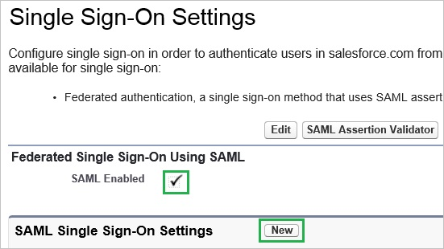

<properties 
    pageTitle="教學課程︰ Azure Active Directory 整合 Salesforce 沙箱 |Microsoft Azure"
    description="瞭解如何使用 Azure Active Directory 中的 Salesforce 沙箱，若要啟用單一登入，自動化佈建和更多 ！。" 
    services="active-directory" 
    authors="jeevansd"  
    documentationCenter="na" 
    manager="femila"/>

<tags 
    ms.service="active-directory" 
    ms.devlang="na" 
    ms.topic="article" 
    ms.tgt_pltfrm="na" 
    ms.workload="identity" 
    ms.date="10/28/2016" 
    ms.author="jeedes" />

#教學課程︰ 使用 [Salesforce 沙箱的 Azure Active Directory 整合
>[AZURE.TIP]意見反應，請按一下[這裡](http://go.microsoft.com/fwlink/?LinkId=521878)。
  
本教學課程中的目標是以顯示 Azure 和 Salesforce 沙箱的整合。  
沙箱可讓您能夠在各種不同的目的，例如開發、 測試和訓練，而不會危害資料和 Salesforce 生產組織中的應用程式的不同環境中建立您組織的多份複本。  
如需詳細資訊，請參閱[沙箱概觀](https://help.salesforce.com/HTViewHelpDoc?id=create_test_instance.htm&language=en_US)
  
本教學課程中所述的案例假設您已經有下列項目︰

-   有效的 Azure 訂閱
-   在 [Salesforce.com 沙箱
  
如果您沒有有效的沙箱 Salesforce.com，還必須連絡 Salesforce。
  
本教學課程中所述的案例是由下列建置組塊所組成︰

1.  啟用應用程式適用於整合 Salesforce 沙箱
2.  設定單一登入
3.  啟用您的網域
4.  設定使用者佈建
5.  將使用者指派

##啟用應用程式適用於整合 Salesforce 沙箱
  
本節的目標是大綱如何啟用的 Salesforce 沙箱整合應用程式。

###若要啟用的 Salesforce 沙箱整合應用程式，請執行下列步驟︰

1.  Azure 傳統入口網站中，在左側的功能窗格中，按一下 [ **Active Directory**]。

    

2.  從 [**目錄**] 清單中，選取您要啟用目錄整合的目錄。

3.  若要開啟 [應用程式] 檢視中，在 [目錄] 檢視中，按一下 [在上方的功能表中的 [**應用程式**]。

    

4.  若要開啟**應用程式組件庫**，按一下 [**新增應用程式**]，再**新增我的組織使用的應用程式**。

    

5.  在**搜尋] 方塊**中，輸入**Salesforce 沙箱**。

    

6.  在 [結果] 窗格中，選取 [ **Salesforce 沙箱**，，然後按一下**完成**新增應用程式。

    
##設定單一登入
  
本節的目標是大綱如何啟用使用者進行驗證其帳戶中使用根據 SAML 通訊協定的同盟 Azure AD Salesforce。

###若要設定單一登入，請執行下列步驟︰

1.  在 Azure 的傳統入口網站， **Salesforce 沙箱**應用程式整合在頁面上，按一下 [**設定單一登入**以開啟 [**設定單一登入**] 對話方塊。

    

2.  在**您要如何登入 Salesforce 沙箱的使用者**] 頁面上，選取**Microsoft Azure AD 單一登入**，然後按 [**下一步**。

    

3.  **設定應用程式 URL**在頁面上，在 [**登入 URL** ] 文字方塊中，輸入您使用下列模式的 URL `http://company.my.salesforce.com`，然後按一下 [**下一步**。

    

4. 如果您已設定單一登入另一個 Salesforce 沙箱執行個體的目錄中，您必須也設定有相同的值的**url 登入****識別碼**。 [**識別碼**] 欄位可找到，請核取 [**顯示進階設定**] 核取方塊] 對話方塊的 [**設定應用程式 URL** ] 頁面上。

4.  在**設定單一登入 Salesforce 沙箱在**頁面上，按一下**下載憑證**]，然後儲存您的電腦上的憑證檔案。

    

5.  在不同的網頁瀏覽器視窗中，以系統管理員身分登入您的 Salesforce 沙箱。

6.  在頂端的功能表，按一下 [**設定**]。

    

7.  在左側功能窗格] 中按一下**的安全性控制項**，然後按一下**單一登入設定**。

    

8.  在 [單一登入設定] 區段中，執行下列步驟︰

    

    。  選取 [ **SAML 啟用**]。
    
    b。  按一下 [**新增**]。

9.  在 [SAML 單一登入設定] 區段中，執行下列步驟︰

    

    。  在 [名稱] 文字方塊中，輸入設定的名稱 (例如︰ *SPSSOWAAD\_測試*)。
    
    b。  Azure 傳統入口網站，在 [**設定單一登入在 Salesforce 沙箱**對話] 頁面中的**發行者 URL**值，複製，然後再貼到 [**簽發者**] 文字方塊。
    
    c。  在**實體 Id** ] 文字方塊中輸入**https://test.salesforce.com** ，如果這是您要新增至您的目錄的第一個 Salesforce 沙箱執行個體。 如果您已新增在**登入 URL**，此格式的執行個體的 Salesforce 沙箱然後**實體識別碼**類型︰`http://company.my.salesforce.com`
    
    d。  按一下 [上傳下載的憑證的 [**瀏覽**]。
    
    e。  為**SAML 身分識別類型**，選取 [**判斷提示包含同盟 ID 從使用者物件**]。
    
    f。  為**SAML 身分識別的位置**，選取 [**身分識別 NameIdentifier 項目主旨陳述式中**。
    
    g。  Azure 傳統入口網站，在 [**設定單一登入在 Salesforce 沙箱**對話] 頁面中複製 [**遠端登入 URL**的值，，然後再貼到 [**身分識別提供者登入 URL** ] 文字方塊。
    
    h。  SFDC 不支援 SAML 登出。  因應措施，貼上 「 https://login.windows.net/common/wsfederation?wa=wsignout1.0 」，將 [**身分識別提供者登出 URL** ] 文字方塊。
    
    我。  為**服務提供者發起的租用戶要求繫結**、 選取 [ **HTTP 文章**]。
    
    j。 按一下 [**儲存**]。

10. 在 Azure 傳統的入口網站中，選取單一登入設定確認，然後再按一下**完成**關閉 [**設定單一登入**] 對話方塊。

    

##啟用您的網域
  
本節假設您有建立網域。  
如需詳細資訊，請參閱[定義您的網域名稱](https://help.salesforce.com/HTViewHelpDoc?id=domain_name_define.htm&language=en_US)。

###若要啟用您的網域，請執行下列步驟︰

1.  左側的功能窗格中，按一下 [**管理網域**]，然後按一下**我的網域。**

    

    >[AZURE.NOTE]請確定已正確地設定您的網域。

2.  在 [**登入頁面設定**] 區段中，按一下 [**編輯**，然後**驗證服務**，從上一節中，選取 SAML 單一登入設定的名稱，最後按一下 [**儲存**]。

    
  
一旦您有設定網域時，您的使用者應使用登入 Salesforce 沙箱網域 URL。  
若要取得 URL 的值，按一下 [上一節中建立 SSO 設定檔]。
##設定使用者佈建
  
本節的目標是大綱如何啟用使用者佈建到 Salesforce 沙箱 Active Directory 使用者帳戶。

###若要設定使用者佈建，執行下列步驟︰

1.  在 [Salesforce] 入口網站的上方導覽列中，選取您的名字，展開您的使用者] 功能表︰

    

2.  從您 [使用者] 功能表中，選取 [**我的設定**]，開啟您 [**我的設定**] 頁面。

3.  在左窗格中，按一下 [**個人**以展開 [個人] 區段，然後按一下 [**重設我的安全性憑證**︰

    

4.  在 [**重設我的安全性憑證**] 頁面上，按一下 [**重設安全性 Token**要求您 Salesforce.com 安全性 token 一封電子郵件]。

    

5.  檢查您的電子郵件收件匣 Salesforce.com 與 「**salesforce.com.com 安全性確認**」 的電子郵件作為主旨。

6.  檢閱這封電子郵件，然後複製安全性 token 值。

7.  在 Azure 的傳統入口網站中**salesforce 沙箱**應用程式整合在頁面上，按一下 [開啟 [**設定使用者佈建**] 對話方塊的 [**設定使用者佈建**]。

    

8.  **輸入您的 Salesforce 沙箱認證，以啟用自動使用者佈建**在頁面上，提供下列設定的設定︰

    

    。  在 [ **Salesforce 沙箱管理員的使用者名稱**] 文字方塊中輸入具有**系統管理員**設定檔中指定的 Salesforce.com Salesforce 沙箱帳戶名稱。

    b。  在 [ **Salesforce 沙箱管理員密碼**] 文字方塊中，輸入此帳戶的密碼。

    c。  在 [**使用者安全性 Token** ] 文字方塊中貼上的安全性 token 值。

    d。  按一下 [**驗證]** ，以驗證您的設定。

    e。  按一下 [**下一步**] 按鈕以開啟 [**確認**] 頁面。

9.  在 [**確認**] 頁面按一下 [**完成**，儲存您的設定]。
##將使用者指派
  
若要測試您的設定，您需要授與 Azure AD 使用者您想要允許使用您的應用程式存取分派給他們。

###若要指定 Salesforce 沙箱使用者，請執行下列步驟︰

1.  在 Azure 傳統入口網站中建立測試帳戶。

2.  在 [ **Salesforce 沙箱**應用程式整合] 頁面中，按一下 [**指派給使用者**。

    

3.  選取您測試的使用者、**指派**，請按一下 [，然後按一下**[是]**以確認您的工作分派。

    ![[是]](./media/active-directory-saas-salesforce-sandbox-tutorial/IC767830.png "[是]")
  
您現在應該等待 10 分鐘的時間，並確認帳戶已同步處理到 Salesforce 沙箱。
  
如果您想要測試您的單一登入設定，開啟 [存取面板。 如需存取畫面的詳細資訊，請參閱[簡介存取面板](https://msdn.microsoft.com/library/dn308586)。
