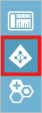

<properties 
    pageTitle="教學課程︰ Azure Active Directory 整合 SmarterU |Microsoft Azure" 
    description="瞭解如何使用 SmarterU 與 Azure Active Directory 啟用單一登入，自動化佈建和更多 ！" 
    services="active-directory" 
    authors="jeevansd"  
    documentationCenter="na" 
    manager="femila"/>
<tags 
    ms.service="active-directory" 
    ms.devlang="na" 
    ms.topic="article" 
    ms.tgt_pltfrm="na" 
    ms.workload="identity" 
    ms.date="09/19/2016" 
    ms.author="jeedes" />

#教學課程︰ 使用 SmarterU 的 Azure Active Directory 整合
  
本教學課程中的目標是以顯示 Azure 和 SmarterU 的整合。  
本教學課程中所述的案例假設您已經有下列項目︰

-   有效的 Azure 訂閱
-   SmarterU 租用戶
  
完成後本教學課程中，您指派給 SmarterU Azure AD 使用者將能夠單一登入 SmarterU 公司網站 （服務提供者發起的租用戶登入），或使用[[存取面板簡介](active-directory-saas-access-panel-introduction.md)應用程式。
  
本教學課程中所述的案例是由下列建置組塊所組成︰

1.  啟用 SmarterU 應用程式整合
2.  設定單一登入
3.  設定使用者佈建
4.  將使用者指派

##啟用 SmarterU 應用程式整合
  
本節的目標是大綱如何啟用 SmarterU 的整合應用程式。

###若要啟用的 SmarterU 整合應用程式，請執行下列步驟︰

1.  Azure 傳統入口網站中，在左側的功能窗格中，按一下 [ **Active Directory**]。

    

2.  從 [**目錄**] 清單中，選取您要啟用目錄整合的目錄。

3.  若要開啟 [應用程式] 檢視中，在 [目錄] 檢視中，按一下 [在上方的功能表中的 [**應用程式**]。

    

4.  按一下 [**新增**頁面的底部。

    

5.  在 [**您想要做什麼**] 對話方塊中，按一下 [**新增應用程式，從圖庫**。

    

6.  在**搜尋] 方塊**中，輸入**SmarterU**。

    

7.  在 [結果] 窗格中，選取**SmarterU**，，然後按一下要新增應用程式**完成**。

    

##設定單一登入
  
本節的目標是大綱如何啟用使用者進行驗證其帳戶中使用根據 SAML 通訊協定的同盟 Azure AD SmarterU。

###若要設定單一登入，請執行下列步驟︰

1.  在 Azure 的傳統入口網站， **SmarterU**應用程式整合在頁面上，按一下 [**設定單一登入**以開啟 [**設定單一登入**] 對話方塊。

    

2.  在**您要如何登入 SmarterU 的使用者**] 頁面上，選取**Microsoft Azure AD 單一登入**，然後按 [**下一步**。

    

3.  在**設定單一登入 SmarterU 在**頁面上，若要下載您的中繼資料中，按一下 [**下載中繼資料**，請與然後資料檔案本機為**c:\\SmarterUMetaData.cer**。

    

4.  在不同的網頁瀏覽器視窗中，以系統管理員身分登入您 SmarterU 公司的網站。

5.  在頂端上工具列中，按一下 [**帳戶設定**]。

    

6.  在 [帳戶設定] 頁面上執行下列步驟︰

    

    1.  選取 [**啟用外部的授權**。
    2.  在 [**母片登入控制項**] 區段中，選取 [ **SmarterU** ] 索引標籤。
    3.  在 [**使用者預設登入資訊**] 區段中，選取 [ **SmarterU** ] 索引標籤。
    4.  選取 [**啟用 Okta**。
    5.  複製下載的中繼資料檔案的內容，然後將其貼入**Okta 中繼資料**文字方塊。
    6.  按一下 [**儲存**]。

7.  在 Azure 傳統的入口網站中，選取單一登入設定確認，然後再按一下**完成**關閉 [**設定單一登入**] 對話方塊。

    

##設定使用者佈建
  
若要啟用 Azure AD 使用者登入 SmarterU，必須被佈建到 SmarterU。  
若是 SmarterU，佈建是手動的工作。

###佈建使用者帳戶，請執行下列步驟︰

1.  登入您的**SmarterU**租用戶。

2.  移至**使用者**。

3.  在 [使用者] 區段中，執行下列步驟︰

    

    1.  按一下 [ **+ 使用者**]。
    2.  下列的文字方塊中輸入 Azure AD 使用者帳戶的相關的屬性值︰**主要電子郵件**、**員工識別碼**、**密碼**、**驗證密碼**、**名稱**、**姓氏**。
    3.  按一下 [**作用中**]。
    4.  按一下 [**儲存**]。

>[AZURE.NOTE] 您可以使用任何其他 SmarterU 使用者帳戶建立工具或 Api 提供 SmarterU 佈建 AAD 使用者帳戶。

##將使用者指派
  
若要測試您的設定，您需要授與 Azure AD 使用者您想要允許使用您的應用程式存取分派給他們。

###若要指定 SmarterU 使用者，請執行下列步驟︰

1.  在 Azure 傳統入口網站中建立測試帳戶。

2.  **SmarterU**應用程式整合在頁面上，按一下 [**指派給使用者**。

    

3.  選取您測試的使用者、**指派**，請按一下 [，然後按一下**[是]**以確認您的工作分派。

    ![[是]](./media/active-directory-saas-smarteru-tutorial/IC767830.png "[是]")
  
如果您想要測試您的單一登入設定，開啟 [存取面板。 如需存取畫面的詳細資訊，請參閱[簡介存取面板](active-directory-saas-access-panel-introduction.md)。