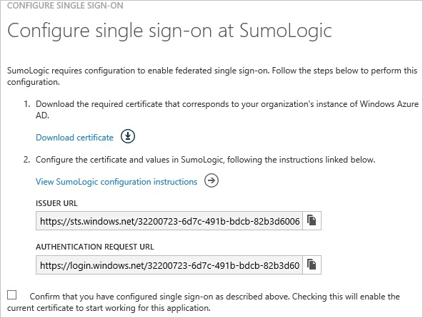
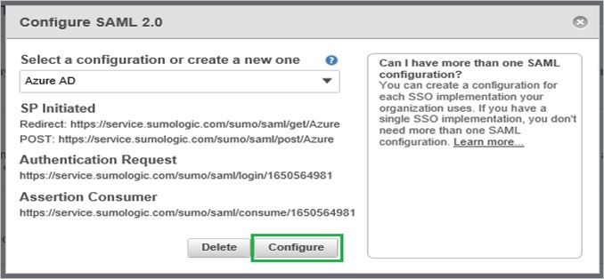
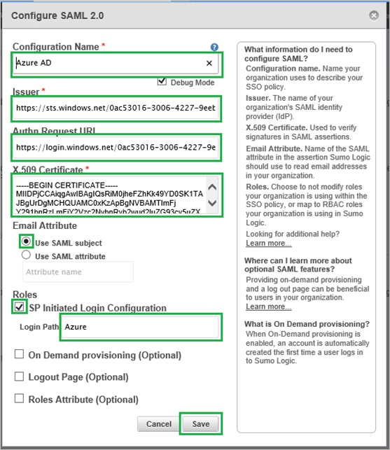

<properties 
    pageTitle="教學課程︰ Azure Active Directory 整合 SumoLogic |Microsoft Azure" 
    description="瞭解如何使用 SumoLogic 與 Azure Active Directory 啟用單一登入，自動化佈建和更多 ！" 
    services="active-directory" 
    authors="jeevansd"  
    documentationCenter="na" 
    manager="femila"/>
<tags 
    ms.service="active-directory" 
    ms.devlang="na" 
    ms.topic="article" 
    ms.tgt_pltfrm="na" 
    ms.workload="identity" 
    ms.date="09/11/2016" 
    ms.author="jeedes" />

#教學課程︰ 使用 SumoLogic 的 Azure Active Directory 整合
  
本教學課程中的目標是以顯示 Azure 和 SumoLogic 的整合。  
本教學課程中所述的案例假設您已經有下列項目︰

-   有效的 Azure 訂閱
-   SumoLogic 租用戶
  
完成後本教學課程中，您指派給 SumoLogicwill 到應用程式，在您 SumoLogic 會能夠使用單一登 Azure AD 使用者公司網站 （服務提供者發起的租用戶登入），或使用[[存取面板簡介](active-directory-saas-access-panel-introduction.md)。
  
本教學課程中所述的案例是由下列建置組塊所組成︰

1.  啟用 SumoLogic 應用程式整合
2.  設定單一登入
3.  設定使用者佈建
4.  將使用者指派

##啟用 SumoLogic 應用程式整合
  
本節的目標是大綱如何啟用 SumoLogic 的整合應用程式。

###若要啟用的 SumoLogic 整合應用程式，請執行下列步驟︰

1.  Azure 傳統入口網站中，在左側的功能窗格中，按一下 [ **Active Directory**]。

    

2.  從 [**目錄**] 清單中，選取您要啟用目錄整合的目錄。

3.  若要開啟 [應用程式] 檢視中，在 [目錄] 檢視中，按一下 [在上方的功能表中的 [**應用程式**]。

    

4.  按一下 [**新增**頁面的底部。

    

5.  在 [**您想要做什麼**] 對話方塊中，按一下 [**新增應用程式，從圖庫**。

    

6.  在**搜尋] 方塊**中，輸入**sumologic**。

    

7.  在 [結果] 窗格中，選取**SumoLogic**，，然後按一下要新增應用程式**完成**。

    

##設定單一登入
  
本節的目標是大綱如何啟用使用者進行驗證其帳戶中使用根據 SAML 通訊協定的同盟 Azure AD SumoLogic。  
此程序的一部分，您會需要上傳至您 SumoLogictenant 的底數 64 編碼的憑證。  
如果您不熟悉這個程序，請參閱[如何轉換成文字檔的二進位憑證](http://youtu.be/PlgrzUZ-Y1o)

###若要設定單一登入，請執行下列步驟︰

1.  在 Azure 的傳統入口網站， **SumoLogic**應用程式整合在頁面上，按一下 [**設定單一登入**以開啟 [**設定單一登入**] 對話方塊。

    

2.  在**您要如何登入 SumoLogic 的使用者**] 頁面上，選取**Microsoft Azure AD 單一登入**，然後按 [**下一步**。

    

3.  **設定應用程式 URL**在頁面上，在 [ **SumoLogic 登入 URL** ] 文字方塊中，輸入您使用下列模式的 URL 「*https://\<租用戶名稱\>。SumoLogic.com*」，然後按一下 [**下一步**。

    

4.  在**設定單一登入 SumoLogic 在**頁面上，若要下載您的憑證，按一下 [**下載憑證**] 並儲存在您的電腦上的憑證檔案。

    

5.  在不同的網頁瀏覽器視窗中，以系統管理員身分登入您 SumoLogic 公司的網站。

6.  移至 [**管理\>安全性**。

    

7.  按一下 [ **SAML**]。

    

8.  從 [**選取設定，或建立新的**清單中，選取**Azure AD**，，然後再按一下 [**設定**]。

    

9.  在 [**設定 SAML 2.0** ] 對話方塊中，執行下列步驟︰

    

    1.  在 [**設定名稱**] 文字方塊中，輸入**Azure AD**。
    2.  選取 [**偵錯模式**]。
    3.  Azure 傳統入口網站，在 [**設定單一登入在 SumoLogic**對話] 頁面中的**發行者 URL**值，複製，然後再貼到 [**簽發者**] 文字方塊。
    4.  Azure 傳統入口網站，在 [**設定單一登入在 SumoLogic**對話] 頁面中複製**驗證要求 URL**的值，並再貼到 [**驗證要求 URL** ] 文字方塊。
    5.  建立**64 基本編碼**檔案從您下載的憑證。  

        >[AZURE.TIP] 如需詳細資訊，請參閱[如何轉換成文字檔的二進位憑證](http://youtu.be/PlgrzUZ-Y1o)

    6.  在記事本中開啟您 64 基本編碼的憑證，將其內容複製到剪貼簿，並貼整個憑證**X.509 憑證**文字方塊。
    7.  為**電子郵件屬性**，請選取 [**使用 SAML 主旨**]。
    8.  選取 [**預存程序發起的租用戶登入設定**]。
    9.  在 [**登入路徑**] 文字方塊中，輸入**Azure**。
    10. 按一下 [**儲存**]。

10. Azure 傳統入口網站，在 [**設定單一登入在 SumoLogic**對話] 頁面中選取單一登入設定確認，然後按 [**完成**。

    

##設定使用者佈建
  
若要啟用 Azure AD 使用者登入 SumoLogic，他們必須提供給 SumoLogic。  
若是 SumoLogic，佈建是手動的工作。

###佈建使用者帳戶，請執行下列步驟︰

1.  登入您的**SumoLogic**租用戶。

2.  移至 [**管理\>使用者**。

    

3.  按一下 [**新增**]。

    

4.  在 [**新增使用者**] 對話方塊中，執行下列步驟︰

    

    1.  輸入您想要將**名字**、**姓氏**及**電子郵件**文字方塊佈建 Azure AD 帳戶的相關的資訊。
    2.  選取 [角色]。
    3.  [**狀態**] 中，選取 [**作用中**。
    4.  按一下 [**儲存**]。

>[AZURE.NOTE] 您可以使用任何其他 SumoLogic 使用者帳戶建立工具或 Api 提供 SumoLogic 佈建 AAD 使用者帳戶。

##將使用者指派
  
若要測試您的設定，您需要授與 Azure AD 使用者想要允許使用您的應用程式存取分派給他們。

###若要指定 SumoLogic 使用者，請執行下列步驟︰

1.  在 Azure 傳統入口網站中建立測試帳戶。

2.  **SumoLogic**應用程式整合在頁面上，按一下 [**指派給使用者**。

    

3.  選取您測試的使用者、**指派**，請按一下 [，然後按一下**[是]**以確認您的工作分派。

    ![[是]](./media/active-directory-saas-sumologic-tutorial/IC767830.png "[是]")
  
如果您想要測試您的單一登入設定，開啟 [存取面板。 如需存取畫面的詳細資訊，請參閱[簡介存取面板](active-directory-saas-access-panel-introduction.md)。