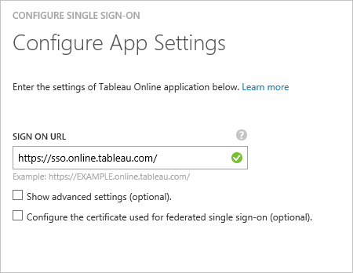

<properties
    pageTitle="教學課程︰ 使用 Tableau Online 的 Azure Active Directory 整合 |Microsoft Azure"
    description="瞭解如何設定單一登入 Azure Active Directory 和 Tableau Online 之間。"
    services="active-directory"
    documentationCenter=""
    authors="jeevansd"
    manager="femila"
    editor=""/>

<tags
    ms.service="active-directory"
    ms.workload="identity"
    ms.tgt_pltfrm="na"
    ms.devlang="na"
    ms.topic="article"
    ms.date="10/18/2016"
    ms.author="jeedes"/>

# 教學課程︰ 使用 Tableau Online 的 Azure Active Directory 整合

在本教學課程中，您可以瞭解如何與 Azure Active Directory (Azure AD) 整合 Tableau 線上。

Azure AD 整合 Tableau 線上為您提供下列優點︰

- 您可以控制可存取 Tableau 線上 Azure AD
- 您可以使用其 Azure AD 帳戶啟用使用者會自動取得登入 Tableau online （單一登入）
- 您可以管理您的帳戶，在一個中央位置-Azure 傳統入口網站

如果您想要知道 Azure AD SaaS 應用程式整合相關的更多詳細資料，請參閱[什麼是應用程式存取和單一登入與 Azure Active Directory](active-directory-appssoaccess-whatis.md)。

## 必要條件

若要設定 Azure AD 整合 Tableau online，您需要下列項目︰

- Azure AD 訂閱
- **線上 Tableau**單一登啟用的訂閱

> [AZURE.NOTE] 若要測試此教學課程中的步驟，我們不建議使用生產環境。

若要測試此教學課程中的步驟，您應該先按照這些建議︰

- 您應該使用生產環境，除非這是必要的。
- 如果您沒有安裝 Azure AD 試用環境，您可以在一個月試用[這裡](https://azure.microsoft.com/pricing/free-trial/)取得。

## 案例說明
在本教學課程中，您測試 Azure AD 單一登入的測試環境中。 本教學課程中所述的案例是由兩個主要的建置組塊所組成︰

1. 從圖庫新增 Tableau 線上
2. 設定及測試 Azure AD 單一登入

## 從圖庫新增 Tableau 線上
若要設定的 Tableau 線上整合到 Azure AD，您需要 Tableau 線上從庫新增至您的受管理的 SaaS 應用程式清單。

**若要新增 Tableau 線上圖庫，執行下列步驟︰**

1. 在**Azure 傳統入口網站**，在左側的功能窗格中，按一下 [ **Active Directory**]。 

    ![Active Directory][1]

2. 從 [**目錄**] 清單中，選取您要啟用目錄整合的目錄。

3. 若要開啟 [應用程式] 檢視中，在 [目錄] 檢視中，按一下 [在上方的功能表中的 [**應用程式**]。

    ![應用程式][2]

4. 按一下 [**新增**頁面的底部。

    ![應用程式][3]

5. 在 [**您想要做什麼**] 對話方塊中，按一下 [**新增應用程式，從圖庫**。

    ![應用程式][4]

6. 在 [搜尋] 方塊中，輸入**Tableau 線上**。

    

7. 在 [結果] 窗格中，選取**Tableau 線上**，然後按一下要新增應用程式**完成**。

    

##  設定及測試 Azure AD 單一登入
在此區段中，您可以設定並使用 Tableau 線上根據稱為 「 許承恩 」 的測試使用者測試 Azure AD 單一登入。

單一登入的工作，需要知道什麼 Tableau Online 中的對應使用者位於使用者 Azure AD Azure AD。 也就是說，必須建立連結和之間的關聯 Azure AD 使用者在線上 Tableau 相關的使用者。
所指派**的使用者名稱**的值為 Tableau Online 中**的使用者名稱**的值 Azure AD 中建立此連結關聯。

若要設定並測試 Azure AD 單一登入與 Tableau Online，您需要完成下列建置組塊︰

1. **[Azure AD 設定單一登入](#configuring-azure-ad-single-single-sign-on)**-若要讓使用者能使用這項功能。
2. **[建立 Azure AD 測試使用者](#creating-an-azure-ad-test-user)**-Azure AD 單一登入與許承恩測試。
4. **[建立 Tableau 線上測試使用者](#creating-a-Tableau-Online-test-user)**-將對應的許承恩 Tableau Online 中的已連結至她的 Azure AD 表示。
5. **[指派 Azure AD 測試使用者](#assigning-the-azure-ad-test-user)**-啟用許承恩使用 Azure AD 單一登入。
5. **[測試單一登入](#testing-single-sign-on)**-驗證是否設定運作。

### Azure AD 單一登入設定

本節的目標是 Azure AD 單一登入 Azure 傳統入口網站中啟用並 Tableau 線上應用程式中設定單一登入。

**若要使用 Tableau Online 設定 Azure AD 單一登入，請執行下列步驟︰**

1. 在頂端的功能表，按一下 [**快速啟動**]。

    ![設定單一登入][6]
2. 在 [傳統] 入口網站， **Tableau 線上**應用程式整合在頁面上，按一下 [**設定單一登入**以開啟 [**設定單一登入**] 對話方塊。

    ![設定單一登入][7] 

3. 在**您要如何登入 Tableau online 的使用者**] 頁面上，選取**Azure AD 單一登入**，然後按 [**下一步**。
    
    

4. **設定應用程式設定**] 對話方塊在頁面上，執行下列步驟︰ 

    

    。 在 [登入 URL] 文字方塊中輸入 URL，請使用下列模式︰`https://sso.online.tableau.com`

    c。 按一下 [**下一步**]。

5. 在**設定單一登入 Tableau Online 在**頁面上，按一下 [**下載中繼資料**，然後儲存您的電腦上的檔案。

    

6. 選取單一登入設定確認，然後按一下 [**下一步**。
    
    ![Azure AD 單一登入][10]

7. 在**單一登入確認**] 頁面上，按一下 [**完成**]。  
    
    ![Azure AD 單一登入][11]
8. 在不同的瀏覽器視窗中，登入 Tableau 線上應用程式。 移至 [**設定**]，然後按一下 [**驗證**

    

9. 在 [**驗證類型**] 區段中。 核取 [啟用 SAML 的**單一登入使用 SAML**核取方塊。

    

10. 向下捲動，直到 [**匯入的中繼資料檔案到 Tableau Online** ] 區段。  按一下 [瀏覽]，然後從 Azure AD 下載的中繼資料檔匯入。 然後按一下 [**套用**]。

    

11. **符合判斷提示**] 區段中，在 [插入對應的身分識別提供者判斷提示名稱的電子郵件地址、 名字和姓氏。 若要從 Azure AD 取得這項資訊︰

    。 回到 Azure AD。 在 Azure 的傳統入口網站中**Tableau 線上**應用程式整合在頁面上的功能表頂端，按一下 [**屬性**]。 複製值的名稱︰ userprincipalname，givenname 及姓氏。
     
    

    b。 切換到線上 Tableau 應用程式，然後將 [ **Tableau 線上屬性**] 區段設為 [待︰
    
    -  電子郵件︰**郵件**] 或 [ **userprincipalname**
    -  第一個名稱︰ **givenname**
    -  姓氏︰**姓氏**

    

### 建立 Azure AD 測試使用者
在此區段中，您可以建立在傳統入口網站中名為許承恩測試使用者。

![建立 Azure AD 使用者][20]

**若要建立的測試使用者 Azure AD 中，執行下列步驟︰**

1. 在**Azure 傳統入口網站**，在左側的功能窗格中，按一下 [ **Active Directory**]。
    
     

2. 從 [**目錄**] 清單中，選取您要啟用目錄整合的目錄。

3. 若要顯示的使用者清單頂端的功能表中，按一下 [**使用者**]。
    
     

4. 若要開啟 [**新增使用者**] 對話方塊底部的工具列中，按一下 [**新增使用者**]。

     

5. 在 [**告訴我們瞭解此使用者**的對話方塊頁面，請執行下列步驟︰
 
     

    。 為使用者類型，選取您組織中的 [新的使用者]。

    b。 在 [使用者名稱]**文字方塊**中，輸入**BrittaSimon**。

    c。 按一下 [**下一步**]。

6.  **使用者設定檔**] 對話方塊在頁面上，執行下列步驟︰

     

    。 在 [**名字**] 文字方塊中輸入**許**。  

    b。 在 [**姓氏**] 文字方塊中輸入，**承恩**。

    c。 在 [**顯示名稱**] 文字方塊中，輸入**許承恩**。

    d。 在 [**角色**] 清單中選取 [**使用者**]。

    e。 按一下 [**下一步**]。

7. 在 [**取得暫時密碼**] 對話方塊頁面上，按一下 [**建立**]。

     

8. **取得暫時密碼**] 對話方塊在頁面上，執行下列步驟︰

     

    。 寫下的值的**新密碼**。

    b。 按一下 [**完成**]。   

### 建立線上 Tableau 測試使用者

在此區段中，您可以建立稱為許承恩 Tableau Online 中的使用者。

1. 在**線上 Tableau**，按一下 [on**設定**]，然後按一下 [**驗證**] 區段。 向下**選取使用者**] 區段捲動。 按一下**[新增使用者**，然後**輸入電子郵件地址**。

    
2. 選取 [**新增使用者的單一登入 (SSO) 驗證**]。 在 [**輸入電子郵件地址**] 文字方塊中新增britta.simon@contoso.com

    

3.  按一下 [**建立**]。

### 指派 Azure AD 測試使用者

在此區段中，您可以啟用許承恩 Azure 單一登入使用其存取權授予 Tableau 線上。

![為使用者指派][200] 

**若要指定許承恩 Tableau online，請執行下列步驟︰**

1. 在 [傳統] 入口網站，若要開啟 [應用程式] 檢視中，在 [目錄] 檢視中，按一下 [**應用程式**頂端的功能表中。

    ![為使用者指派][201] 

3. 在 [應用程式] 清單中，選取 [ **Tableau Online**。

     

4. 在頂端的功能表，按一下 [**使用者**]。

    ![為使用者指派][203] 

5. 在 [所有使用者] 清單中，選取**許承恩**。

6. 在底部工具列中，按一下 [**指派**]。

    ![為使用者指派][205]

### 測試單一登入

本節的目標是測試 Azure AD 單一登入設定使用 Access 面板。

當您按一下 [Access] 面板中的 [Tableau Online] 磚時，您應該取得自動登入 Tableau 線上應用程式。

## 其他資源

* [如何與 Azure Active Directory 整合 SaaS 應用程式的教學課程的清單](active-directory-saas-tutorial-list.md)
* [什麼是應用程式存取和單一登入與 Azure Active Directory？](active-directory-appssoaccess-whatis.md)

<!--Image references-->

[1]: ./media/active-directory-saas-tableauonline-tutorial/tutorial_general_01.png
[2]: ./media/active-directory-saas-tableauonline-tutorial/tutorial_general_02.png
[3]: ./media/active-directory-saas-tableauonline-tutorial/tutorial_general_03.png
[4]: ./media/active-directory-saas-tableauonline-tutorial/tutorial_general_04.png

[5]: ./media/active-directory-saas-tableauonline-tutorial/tutorial_general_05.png
[6]: ./media/active-directory-saas-tableauonline-tutorial/tutorial_general_06.png
[7]:  ./media/active-directory-saas-tableauonline-tutorial/tutorial_general_050.png
[10]: ./media/active-directory-saas-tableauonline-tutorial/tutorial_general_060.png
[11]: ./media/active-directory-saas-tableauonline-tutorial/tutorial_general_070.png
[20]: ./media/active-directory-saas-tableauonline-tutorial/tutorial_general_100.png

[200]: ./media/active-directory-saas-tableauonline-tutorial/tutorial_general_200.png
[201]: ./media/active-directory-saas-tableauonline-tutorial/tutorial_general_201.png
[203]: ./media/active-directory-saas-tableauonline-tutorial/tutorial_general_203.png
[204]: ./media/active-directory-saas-tableauonline-tutorial/tutorial_general_204.png
[205]: ./media/active-directory-saas-tableauonline-tutorial/tutorial_general_205.png
