<properties 
    pageTitle="教學課程︰ Azure Active Directory 整合 TalentLMS |Microsoft Azure" 
    description="瞭解如何使用 TalentLMS 與 Azure Active Directory 啟用單一登入，自動化佈建和更多 ！" 
    services="active-directory" 
    authors="jeevansd"  
    documentationCenter="na" 
    manager="femila"/>
<tags 
    ms.service="active-directory" 
    ms.devlang="na" 
    ms.topic="article" 
    ms.tgt_pltfrm="na" 
    ms.workload="identity" 
    ms.date="09/11/2016" 
    ms.author="jeedes" />

#教學課程︰ 使用 TalentLMS 的 Azure Active Directory 整合
  
本教學課程中的目標是以顯示 Azure 和 TalentLMS 的整合。  
本教學課程中所述的案例假設您已經有下列項目︰

-   有效的 Azure 訂閱
-   TalentLMS 租用戶
  
完成後本教學課程中，您指派給 TalentLMS Azure AD 使用者將能夠單一登入 TalentLMS 公司網站 （服務提供者發起的租用戶登入），或使用[[存取面板簡介](active-directory-saas-access-panel-introduction.md)應用程式。
  
本教學課程中所述的案例是由下列建置組塊所組成︰

1.  啟用 TalentLMS 應用程式整合
2.  設定單一登入
3.  設定使用者佈建
4.  將使用者指派

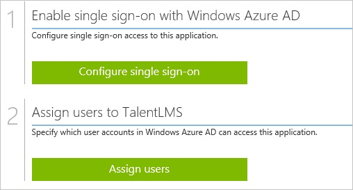

##啟用 TalentLMS 應用程式整合
  
本節的目標是大綱如何啟用 TalentLMS 的整合應用程式。

###若要啟用的 TalentLMS 整合應用程式，請執行下列步驟︰

1.  Azure 傳統入口網站中，在左側的功能窗格中，按一下 [ **Active Directory**]。

    

2.  從 [**目錄**] 清單中，選取您要啟用目錄整合的目錄。

3.  若要開啟 [應用程式] 檢視中，在 [目錄] 檢視中，按一下 [在上方的功能表中的 [**應用程式**]。

    

4.  按一下 [**新增**頁面的底部。

    

5.  在 [**您想要做什麼**] 對話方塊中，按一下 [**新增應用程式，從圖庫**。

    

6.  在**搜尋] 方塊**中，輸入**TalentLMS**。

    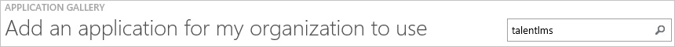

7.  在 [結果] 窗格中，選取**TalentLMS**，，然後按一下要新增應用程式**完成**。

    

##設定單一登入
  
本節的目標是大綱如何啟用使用者進行驗證其帳戶中使用根據 SAML 通訊協定的同盟 Azure AD TalentLMS。 .  
設定單一登入的 TalentLMS 需要您從憑證擷取指紋值。  
如果您不熟悉這個程序，請參閱[如何擷取的憑證指紋值](http://youtu.be/YKQF266SAxI)。

###若要設定單一登入，請執行下列步驟︰

1.  在 Azure 的傳統入口網站， **TalentLMS**應用程式整合在頁面上，按一下 [**設定單一登入**以開啟 [**設定單一登入**] 對話方塊。

    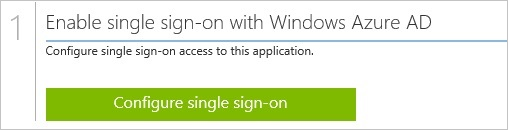

2.  在**您要如何登入 TalentLMS 的使用者**] 頁面上，選取**Microsoft Azure AD 單一登入**，然後按 [**下一步**。

    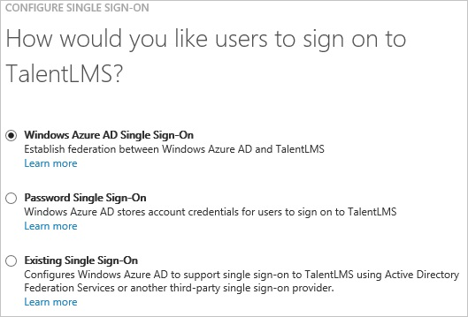

3.  **設定應用程式 URL**在頁面上，在 [ **TalentLMS 登入 URL** ] 文字方塊中，輸入您使用下列模式的 URL 「*https://\<租用戶名稱\>。TalentLMSapp.com*」，然後按一下 [**下一步**。

    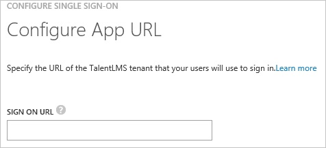

4.  在**設定單一登入 TalentLMS 在**頁面上，若要下載您的憑證，按一下**下載憑證**]，然後憑證檔案儲存至本機為**c:\\TalentLMS.cer**。

    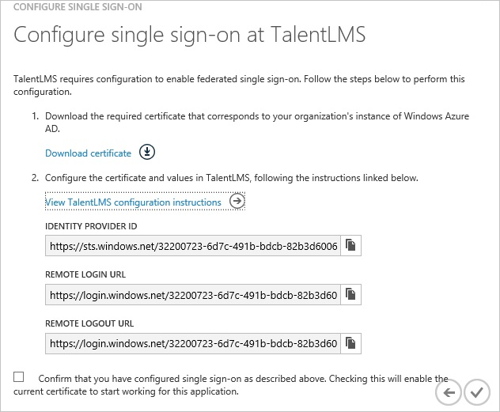

5.  在不同的網頁瀏覽器視窗中，以系統管理員身分登入您 TalentLMS 公司的網站。

6.  在 [**帳戶及設定**] 區段中，按一下 [**使用者**] 索引標籤。

    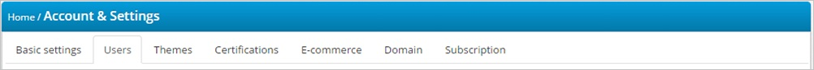

7.  按一下 [**單一登入 (SSO)**，

8.  在單一登入] 區段中，執行下列步驟︰

    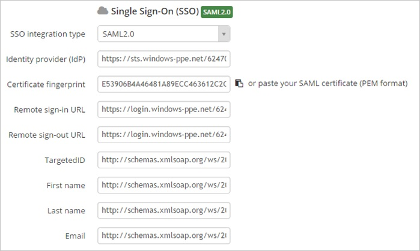

    1.  從 [ **SSO 整合類型**] 清單中，選取 [ **SAML 2.0**]。
    2.  在 Azure 的傳統入口網站中**設定單一登入，TalentLMS** ] 對話方塊在頁面上，複製**身分識別提供者識別碼**值]，並再貼到**身分識別提供者 (IdP)**文字方塊。
    3.  **指紋**值複製匯出的憑證，然後再貼到**憑證指紋**文字方塊。

        >[AZURE.TIP] 如需詳細資訊，請參閱[如何擷取的憑證指紋值](http://youtu.be/YKQF266SAxI)

    4.  在 Azure 的傳統入口網站中**設定單一登入，TalentLMS** ] 對話方塊在頁面上，複製 [**遠端登入 URL**的值，，然後再貼到 [**遠端登入 URL** ] 文字方塊。
    5.  在 Azure 的傳統入口網站中**設定單一登入，TalentLMS** ] 對話方塊在頁面上，複製 [**遠端登出 URL**的值，，然後再貼到 [**遠端教具借出 URL** ] 文字方塊。
    6.  在 [ **TargetedID** ] 文字方塊中，輸入**http://schemas.xmlsoap.org/ws/2005/05/identity/claims/name**
    7.  在 [**名字**] 文字方塊中輸入 [ **http://schemas.xmlsoap.org/ws/2005/05/identity/claims/givenname**
    8.  在 [**姓氏**] 文字方塊中輸入 [ **http://schemas.xmlsoap.org/ws/2005/05/identity/claims/surname**
    9.  在 [**電子郵件**] 文字方塊中，輸入**http://schemas.xmlsoap.org/ws/2005/05/identity/claims/emailaddress**
    10. 按一下 [**儲存**]。

9.  在 Azure 傳統的入口網站中，選取單一登入設定確認，然後再按一下**完成**關閉 [**設定單一登入**] 對話方塊。

    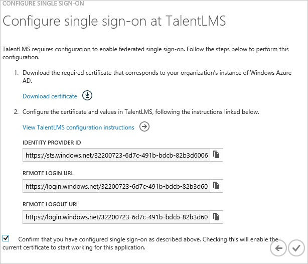

##設定使用者佈建
  
若要啟用 Azure AD 使用者登入 TalentLMS，必須被佈建到 TalentLMS。  
若是 TalentLMS，佈建是手動的工作。

###佈建使用者帳戶，請執行下列步驟︰

1.  登入您的**TalentLMS**租用戶。

2.  按一下 [**使用者**]，然後按一下 [**新增使用者**。

3.  **新增使用者**] 對話方塊在頁面上，執行下列步驟︰

    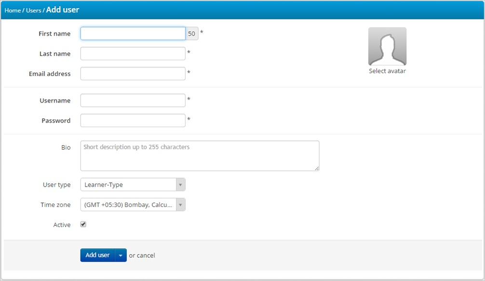

    1.  下列的文字方塊中輸入 Azure AD 使用者帳戶的相關的屬性值︰**名字**、**姓氏**、**電子郵件地址**。
    2.  按一下 [**新增使用者**]。

>[AZURE.NOTE] 您可以使用任何其他 TalentLMS 使用者帳戶建立工具或 Api 提供 TalentLMS 佈建 AAD 使用者帳戶。

##將使用者指派
  
若要測試您的設定，您需要授與 Azure AD 使用者想要允許使用您的應用程式存取分派給他們。

###若要指定 TalentLMS 使用者，請執行下列步驟︰

1.  在 Azure 傳統入口網站中建立測試帳戶。

2.  **TalentLMS**應用程式整合在頁面上，按一下 [**指派給使用者**。

    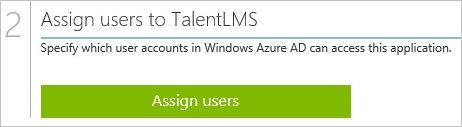

3.  選取您測試的使用者、**指派**，請按一下 [，然後按一下**[是]**以確認您的工作分派。

    ![[是]](./media/active-directory-saas-talentlms-tutorial/IC767830.png "[是]")
  
如果您想要測試您的單一登入設定，開啟 [存取面板。 如需存取畫面的詳細資訊，請參閱[簡介存取面板](active-directory-saas-access-panel-introduction.md)。