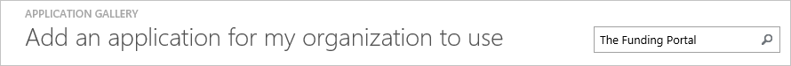
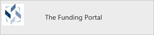
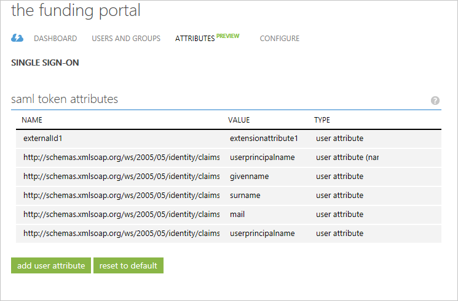
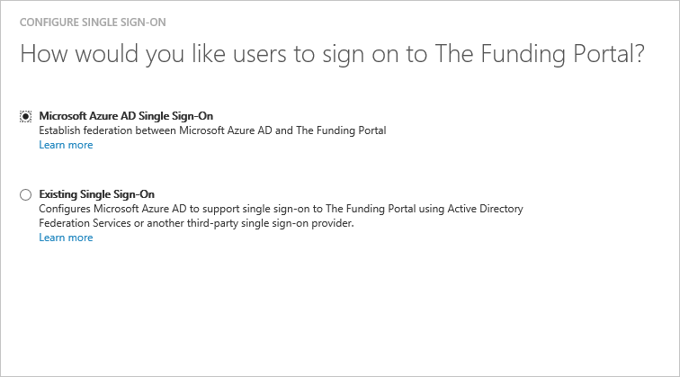

<properties
    pageTitle="教學課程︰ 使用資金入口網站的 Azure Active Directory 整合 |Microsoft Azure"
    description="瞭解如何設定單一登入 Azure Active Directory 和資金入口網站之間。"
    services="active-directory"
    documentationCenter=""
    authors="jeevansd"
    manager="femila"
    editor=""/>

<tags
    ms.service="active-directory"
    ms.workload="identity"
    ms.tgt_pltfrm="na"
    ms.devlang="na"
    ms.topic="article"
    ms.date="09/02/2016"
    ms.author="jeedes"/>

# 教學課程︰ 使用資金入口網站的 Azure Active Directory 整合

在本教學課程中，您可以瞭解如何將資金入口網站整合與 Azure Active Directory (Azure AD)。

Azure AD 與整合資金入口網站提供您下列優點︰

- 您可以控制可存取資金入口網站 Azure AD
- 您可以使用其 Azure AD 帳戶啟用使用者會自動取得登入的資金入口網站，（單一登入）
- 您可以管理您的帳戶，在一個中央位置-Azure 傳統入口網站

如果您想要知道 Azure AD SaaS 應用程式整合相關的更多詳細資料，請參閱[什麼是應用程式存取和單一登入與 Azure Active Directory](active-directory-appssoaccess-whatis.md)。

## 必要條件

若要設定 Azure AD 整合資金入口網站，您需要下列項目︰

- Azure AD 訂閱
- 啟用訂閱**資金入口網站**單一正負號

> [AZURE.NOTE] 若要測試此教學課程中的步驟，我們不建議使用生產環境。

若要測試此教學課程中的步驟，您應該先按照這些建議︰

- 您應該使用生產環境，除非這是必要的。
- 如果您沒有安裝 Azure AD 試用環境，您可以在一個月試用[這裡](https://azure.microsoft.com/pricing/free-trial/)取得。

## 案例說明
在本教學課程中，您測試 Azure AD 單一登入的測試環境中。 本教學課程中所述的案例是由兩個主要的建置組塊所組成︰

1. 從圖庫新增資金入口網站
2. 設定及測試 Azure AD 單一登入

## 從圖庫新增資金入口網站
若要設定資金入口網站整合 Azure AD，您需要從庫新增資金入口網站的受管理的 SaaS 應用程式清單。

**若要從圖庫新增資金入口網站，請執行下列步驟︰**

1. 在**Azure 傳統入口網站**，在左側的功能窗格中，按一下 [ **Active Directory**]。 

    ![Active Directory][1]

2. 從 [**目錄**] 清單中，選取您要啟用目錄整合的目錄。

3. 若要開啟 [應用程式] 檢視中，在 [目錄] 檢視中，按一下 [在上方的功能表中的 [**應用程式**]。

    ![應用程式][2]

4. 按一下 [**新增**頁面的底部。

    ![應用程式][3]

5. 在 [**您想要做什麼**] 對話方塊中，按一下 [**新增應用程式，從圖庫**。

    ![應用程式][4]

6. 在 [搜尋] 方塊中，輸入**資金入口網站**。

    

7. 在 [結果] 窗格中，選取**資金入口網站**，，然後按一下要新增應用程式**完成**。

    

##  設定及測試 Azure AD 單一登入
在此區段中，您可以設定並測試 Azure AD 單一登入資金入口網站以測試使用者稱為 「 許承恩 」。

單一登入的工作，需要知道什麼資金入口網站中的對應使用者位於使用者 Azure AD Azure AD。 也就是說，必須建立連結和之間的關聯 Azure AD 使用者資金入口網站中相關的使用者。
所指派**的使用者名稱**的值為資金入口網站**的使用者名稱**的值 Azure AD 中建立此連結關聯。

若要設定及測試 Azure AD 單一登入資金入口網站，必須完成下列建置組塊︰

1. **[Azure AD 設定單一登入](#configuring-azure-ad-single-single-sign-on)**-若要讓使用者能使用這項功能。
2. **[建立 Azure AD 測試使用者](#creating-an-azure-ad-test-user)**-Azure AD 單一登入與許承恩測試。
4. **[建立資金入口網站測試使用者](#creating-a-the-funding-portal-test-user)**-將對應的許承恩資金入口網站中的已連結至她的 Azure AD 表示。
5. **[指派 Azure AD 測試使用者](#assigning-the-azure-ad-test-user)**-啟用許承恩使用 Azure AD 單一登入。
5. **[測試單一登入](#testing-single-sign-on)**-驗證是否設定運作。

### Azure AD 單一登入設定

本節的目標是 Azure AD 單一登入 Azure 傳統入口網站中啟用並資金入口網站應用程式中設定單一登入。

資金入口網站應用程式預期的 SAML 判斷提示，以包含名稱為 「 externalId1 」 的屬性。 「 ExternalId1 」 的值應該可辨識的 studentID。 請設定此應用程式的 「 externalId1 」 宣告。 您可以在**「 Atrributes 」**索引標籤上的應用程式管理這些屬性的值。 以下螢幕擷取畫面會顯示這個範例。

 

**若要設定 Azure AD 單一登入資金入口網站，請執行下列步驟︰**

1. 在 Azure 的傳統入口網站中**資金入口網站**應用程式整合在頁面上的功能表頂端，按一下 [**屬性**]。
     
    ![設定單一登入][5]

2. 在 [SAML 權杖屬性] 對話方塊中，加上 「 externalId1 」 屬性。

    。 按一下 [開啟 [**新增使用者屬性**] 對話方塊的 [**新增使用者屬性**]。 
    
    

    b。 在 [**屬性名稱**] 文字方塊中，輸入屬性名稱 「 externalId1 」。

    c。 **屬性值**清單中，選取您要用於您的實作的屬性。 例如，如果 ExtensionAttribute1 中儲存 StudentID 值，然後選取 user.extensionattribute1。

    d。 按一下 [**完成**]。 然後按一下 [**套用變更**。

1. 在頂端的功能表，按一下 [**快速啟動**]。

    ![設定單一登入][6]

2. 在 [傳統] 入口網站，**資金入口網站**應用程式整合在頁面上，按一下 [**設定單一登入**以開啟 [**設定單一登入**] 對話方塊。

    ![設定單一登入][7] 

3. 在**您要如何登入資金入口網站的使用者**] 頁面上，選取**Azure AD 單一登入**，然後按 [**下一步**。
    
    

4. **設定應用程式設定**] 對話方塊在頁面上，執行下列步驟︰ 

    

    。 在 [登入 URL 文字] 方塊中，輸入 [使用下列模式的 URL: `https://<subdomain>.regenteducation.net/`。

    b。 按一下 [**下一步**]。

5. 在**設定單一登入在資金入口網站**頁面上，按一下 [**下載中繼資料**，然後儲存您的電腦上的檔案。

    

6. 若要取得 SSO 應用程式的設定，請連絡資金入口網站支援。 他們可協助適當的頻道設定 SSO。 您必須傳送電子郵件並附加的附註請下載中繼資料檔案info@regenteducation.com。

7. 在 [傳統] 入口網站，選取單一登入設定確認，然後按 [**下一步**。
    
    ![Azure AD 單一登入][10]

8. 在**單一登入確認**] 頁面上，按一下 [**完成**]。  
    
    ![Azure AD 單一登入][11]

### 建立 Azure AD 測試使用者
在此區段中，您可以建立在傳統入口網站中名為許承恩測試使用者。

![建立 Azure AD 使用者][20]

**若要建立的測試使用者 Azure AD 中，執行下列步驟︰**

1. 在**Azure 傳統入口網站**，在左側的功能窗格中，按一下 [ **Active Directory**]。
    
     

2. 從 [**目錄**] 清單中，選取您要啟用目錄整合的目錄。

3. 若要顯示的使用者清單頂端的功能表中，按一下 [**使用者**]。
    
     

4. 若要開啟 [**新增使用者**] 對話方塊底部的工具列中，按一下 [**新增使用者**]。

     

5. 在 [**告訴我們瞭解此使用者**的對話方塊頁面，請執行下列步驟︰
 
     

    。 為使用者類型，選取您組織中的 [新的使用者]。

    b。 在 [使用者名稱]**文字方塊**中，輸入**BrittaSimon**。

    c。 按一下 [**下一步**]。

6.  **使用者設定檔**] 對話方塊在頁面上，執行下列步驟︰

     

    。 在 [**名字**] 文字方塊中輸入**許**。  

    b。 在 [**姓氏**] 文字方塊中輸入，**承恩**。

    c。 在 [**顯示名稱**] 文字方塊中，輸入**許承恩**。

    d。 在 [**角色**] 清單中選取 [**使用者**]。

    e。 按一下 [**下一步**]。

7. 在 [**取得暫時密碼**] 對話方塊頁面上，按一下 [**建立**]。

     

8. **取得暫時密碼**] 對話方塊在頁面上，執行下列步驟︰

     

    。 寫下的值的**新密碼**。

    b。 按一下 [**完成**]。   

### 建立資金入口網站測試使用者

在此區段中，您可以建立資金入口網站中名為許承恩使用者。 如果您不知道如何新增許承恩資金入口網站中，請使用新增測試使用者，並啟用 SSO 資金入口網站支援小組。 連絡他們在info@regenteducation.com。

### 指派 Azure AD 測試使用者

在此區段中，您可以啟用許承恩 Azure 單一登入使用其存取權授與資金入口網站。

![為使用者指派][200] 

**若要指定許承恩資金入口網站，請執行下列步驟︰**

1. 在 [傳統] 入口網站，若要開啟 [應用程式] 檢視中，在 [目錄] 檢視中，按一下 [**應用程式**頂端的功能表中。

    ![為使用者指派][201] 

2. 在 [應用程式] 清單中選取**資金入口網站**。

     

1. 在頂端的功能表，按一下 [**使用者**]。

    ![為使用者指派][203] 

1. 在 [所有使用者] 清單中，選取**許承恩**。

2. 在底部工具列中，按一下 [**指派**]。

    ![為使用者指派][205]

### 測試單一登入

本節的目標是測試 Azure AD 單一登入設定使用 Access 面板。

當您按一下 [Access] 面板中的 [資金入口網站] 磚時，您應該取得自動登入資金入口網站應用程式。

## 其他資源

* [如何與 Azure Active Directory 整合 SaaS 應用程式的教學課程的清單](active-directory-saas-tutorial-list.md)
* [什麼是應用程式存取和單一登入與 Azure Active Directory？](active-directory-appssoaccess-whatis.md)

<!--Image references-->

[1]: ./media/active-directory-saas-thefundingportal-tutorial/tutorial_general_01.png
[2]: ./media/active-directory-saas-thefundingportal-tutorial/tutorial_general_02.png
[3]: ./media/active-directory-saas-thefundingportal-tutorial/tutorial_general_03.png
[4]: ./media/active-directory-saas-thefundingportal-tutorial/tutorial_general_04.png

[5]: ./media/active-directory-saas-thefundingportal-tutorial/tutorial_general_05.png
[6]: ./media/active-directory-saas-thefundingportal-tutorial/tutorial_general_06.png
[7]:  ./media/active-directory-saas-thefundingportal-tutorial/tutorial_general_050.png
[10]: ./media/active-directory-saas-thefundingportal-tutorial/tutorial_general_060.png
[11]: ./media/active-directory-saas-thefundingportal-tutorial/tutorial_general_070.png
[20]: ./media/active-directory-saas-thefundingportal-tutorial/tutorial_general_100.png

[200]: ./media/active-directory-saas-thefundingportal-tutorial/tutorial_general_200.png
[201]: ./media/active-directory-saas-thefundingportal-tutorial/tutorial_general_201.png
[203]: ./media/active-directory-saas-thefundingportal-tutorial/tutorial_general_203.png
[204]: ./media/active-directory-saas-thefundingportal-tutorial/tutorial_general_204.png
[205]: ./media/active-directory-saas-thefundingportal-tutorial/tutorial_general_205.png
