<properties 
    pageTitle="教學課程︰ Azure Active Directory 整合 Thirdlight |Microsoft Azure" 
    description="瞭解如何使用 Thirdlight 與 Azure Active Directory 啟用單一登入、 自動化佈建和更多 ！" 
    services="active-directory" 
    authors="jeevansd"  
    documentationCenter="na" 
    manager="femila"/>
<tags 
    ms.service="active-directory" 
    ms.devlang="na" 
    ms.topic="article" 
    ms.tgt_pltfrm="na" 
    ms.workload="identity" 
    ms.date="09/11/2016" 
    ms.author="jeedes" />

#教學課程︰ 使用 Thirdlight 的 Azure Active Directory 整合
  
本教學課程中的目標是以顯示 Azure 和 Thirdlight 的整合。  
本教學課程中所述的案例假設您已經有下列項目︰

-   有效的 Azure 訂閱
-   Thirdlight 單一登入啟用訂閱
  
完成後本教學課程中，您指派給 Thirdlight Azure AD 使用者將能夠單一登入 Thirdlight 公司網站 （服務提供者發起的租用戶登入），或使用[[存取面板簡介](active-directory-saas-access-panel-introduction.md)應用程式。
  
本教學課程中所述的案例是由下列建置組塊所組成︰

1.  啟用 Thirdlight 應用程式整合
2.  設定單一登入
3.  設定使用者佈建
4.  將使用者指派

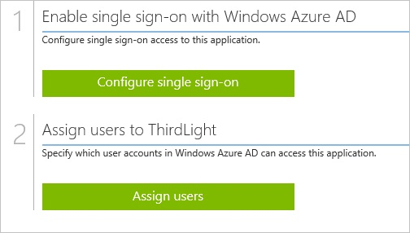

##啟用 Thirdlight 應用程式整合
  
本節的目標是大綱如何啟用 Thirdlight 的整合應用程式。

###若要啟用的 Thirdlight 整合應用程式，請執行下列步驟︰

1.  Azure 傳統入口網站中，在左側的功能窗格中，按一下 [ **Active Directory**]。

    

2.  從 [**目錄**] 清單中，選取您要啟用目錄整合的目錄。

3.  若要開啟 [應用程式] 檢視中，在 [目錄] 檢視中，按一下 [在上方的功能表中的 [**應用程式**]。

    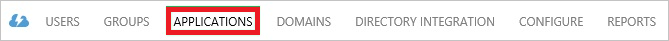

4.  按一下 [**新增**頁面的底部。

    

5.  在 [**您想要做什麼**] 對話方塊中，按一下 [**新增應用程式，從圖庫**。

    

6.  在**搜尋] 方塊**中，輸入**Thirdlight**。

    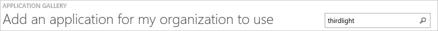

7.  在 [結果] 窗格中，選取**Thirdlight**，，然後按一下要新增應用程式**完成**。

    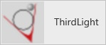

##設定單一登入
  
本節的目標是大綱如何啟用使用者進行驗證其帳戶中使用根據 SAML 通訊協定的同盟 Azure AD Thirdlight。  
設定單一登入的 Thirdlight 需要您從憑證擷取指紋值。  
如果您不熟悉這個程序，請參閱[如何擷取的憑證指紋值](http://youtu.be/YKQF266SAxI)。

###若要設定單一登入，請執行下列步驟︰

1.  在 Azure 的傳統入口網站， **Thirdlight**應用程式整合在頁面上，按一下 [**設定單一登入**以開啟 [**設定單一登入**] 對話方塊。

    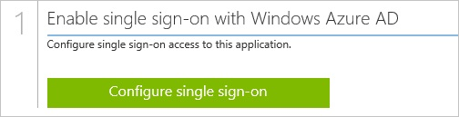

2.  在**您要如何登入 Thirdlight 的使用者**] 頁面上，選取**Microsoft Azure AD 單一登入**，然後按 [**下一步**。

    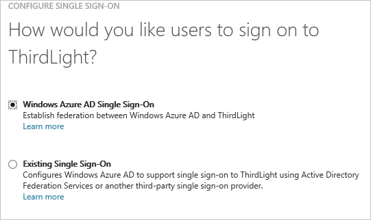

3.  **設定應用程式 URL**在頁面上，在**Thirdlight 登入 URL** ] 文字方塊中輸入您用來 Thirdlight 應用程式登入您的使用者的 URL (例如: 「*http://azuresso2.thirdlight.com/*」)，然後按一下 [**下一步**。

    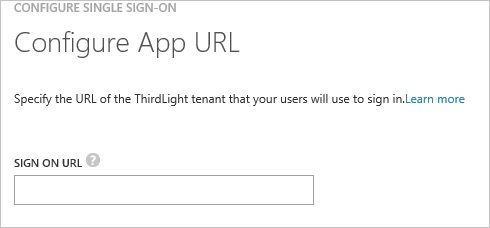

4.  在**設定單一登入 Thirdlight 在**頁面上，若要下載您的中繼資料，按一下**下載的中繼資料**]，然後儲存在本機電腦上的中繼資料檔案。

    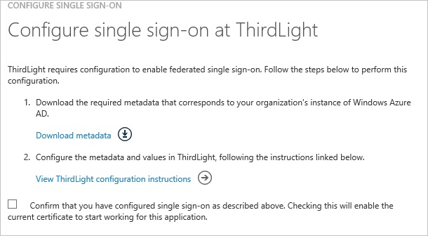

5.  在不同的網頁瀏覽器視窗中，以系統管理員身分登入您 Thirdlight 公司的網站。

6.  移至 [**設定\>系統管理**，然後按一下 [ **SAML2**。

    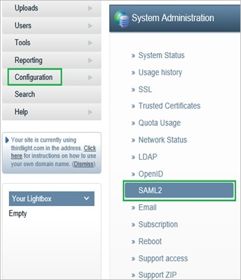

7.  在 [SAML2 組態] 區段中，執行下列步驟︰

    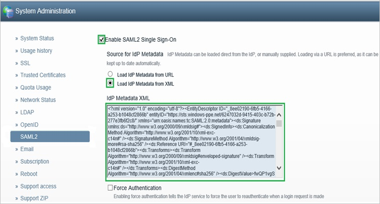

    1.  選取 [**啟用 SAML2 單一登入**]。
    2.  為**IdP 中繼資料來源**]，選取 [**從 XML 載入 IdP 中繼資料**]。
    3.  開啟下載的中繼資料檔案複製內容，，然後將其貼入**IdP 中繼資料 XML**文字方塊。
    4.  按一下 [**儲存 SAML2 設定**]。

8.  在 Azure 傳統的入口網站中，選取單一登入設定確認，然後再按一下**完成**關閉 [**設定單一登入**] 對話方塊。

    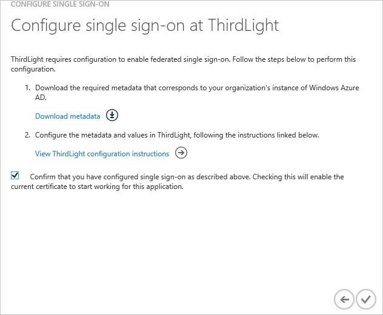

##設定使用者佈建
  
若要啟用 Azure AD 使用者登入 Thirdlight，他們必須佈建到 Thirdlight。  
若是 Thirdlight，佈建是手動的工作。

###若要設定使用者佈建，執行下列步驟︰

1.  以系統管理員身分登入您**Thirdlight**公司的網站。

2.  移至 [**使用者**] 索引標籤。

3.  選取 [**使用者和群組**]。

4.  按一下 [**新增使用者**] 按鈕。

5.  輸入**使用者名稱、 名稱或描述、 電子郵件、 選擇預設或新成員的群組**的有效 AAD 帳戶，您想要進行佈建。

6.  按一下 [**建立**]。

>[AZURE.NOTE] 您可以使用任何其他 Thirdlight 使用者帳戶建立工具或 Api 提供 Thirdlight 佈建 AAD 使用者帳戶。

##將使用者指派
  
若要測試您的設定，您需要授與 Azure AD 使用者想要允許使用您的應用程式存取分派給他們。

###若要指定 Thirdlight 使用者，請執行下列步驟︰

1.  在 Azure 傳統入口網站中建立測試帳戶。

2.  **Thirdlight**應用程式整合在頁面上，按一下 [**指派給使用者**。

    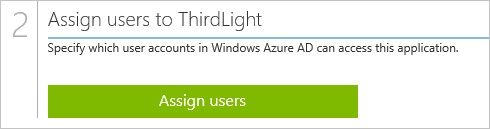

3.  選取您測試的使用者、**指派**，請按一下 [，然後按一下**[是]**以確認您的工作分派。

    ![[是]](./media/active-directory-saas-thirdlight-tutorial/IC767830.png "[是]")
  
如果您想要測試您的單一登入設定，開啟 [存取面板。 如需存取畫面的詳細資訊，請參閱[簡介存取面板](active-directory-saas-access-panel-introduction.md)。