<properties 
    pageTitle="教學課程︰ Azure Active Directory 整合 Thoughtworks 哈拉 |Microsoft Azure" 
    description="瞭解如何使用 Thoughtworks 哈拉與 Azure Active Directory 啟用單一登入，自動化佈建和更多 ！" 
    services="active-directory" 
    authors="jeevansd"  
    documentationCenter="na" 
     manager="femila"/>
<tags 
    ms.service="active-directory" 
    ms.devlang="na" 
    ms.topic="article" 
    ms.tgt_pltfrm="na" 
    ms.workload="identity" 
    ms.date="09/11/2016" 
    ms.author="jeedes" />

#教學課程︰ 使用 Thoughtworks 哈拉的 Azure Active Directory 整合
  
本教學課程中的目標是以顯示 Azure 和 Thoughtworks 哈拉的整合。  
本教學課程中所述的案例假設您已經有下列項目︰

-   有效的 Azure 訂閱
-   Thoughtworks 哈拉租用戶
  
本教學課程中所述的案例是由下列建置組塊所組成︰

1.  啟用 Thoughtworks 哈拉的整合應用程式
2.  設定單一登入
3.  設定使用者佈建
4.  將使用者指派

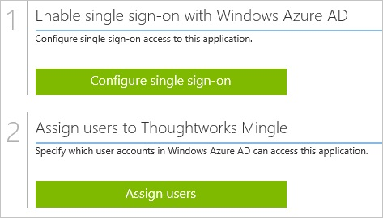

##啟用 Thoughtworks 哈拉的整合應用程式
  
本節的目標是大綱如何啟用的 Thoughtworks 哈拉整合應用程式。

###若要啟用的 Thoughtworks 哈拉整合應用程式，請執行下列步驟︰

1.  Azure 傳統入口網站中，在左側的功能窗格中，按一下 [ **Active Directory**]。

    

2.  從 [**目錄**] 清單中，選取您要啟用目錄整合的目錄。

3.  若要開啟 [應用程式] 檢視中，在 [目錄] 檢視中，按一下 [在上方的功能表中的 [**應用程式**]。

    

4.  按一下 [**新增**頁面的底部。

    

5.  在 [**您想要做什麼**] 對話方塊中，按一下 [**新增應用程式，從圖庫**。

    

6.  在**搜尋] 方塊**中，輸入**thoughtworks 哈拉**。

    

7.  在 [結果] 窗格中，選取**Thoughtworks 哈拉**，，然後按一下要新增應用程式**完成**。

    

##設定單一登入
  
本節的目標是大綱如何啟用使用者進行驗證 Thoughtworks 哈拉以帳戶中使用根據 SAML 通訊協定的同盟 Azure AD。  
此程序的一部分，您需要上傳至 Thoughtworks 哈拉的憑證。

###若要設定單一登入，請執行下列步驟︰

1.  在 [Azure 傳統入口網站， **Thoughtworks 哈拉**應用程式整合在頁面上，按一下 [**設定單一登入**以開啟 [**設定單一登入**] 對話方塊。

    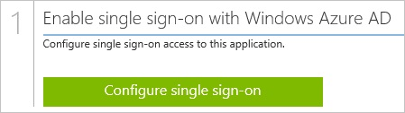

2.  在**您要如何登入 Thoughtworks 哈拉的使用者**] 頁面上，選取**Microsoft Azure AD 單一登入**，然後按 [**下一步**。

    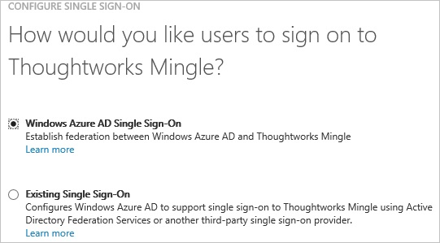

3.  **設定應用程式 URL**在頁面上，在 [ **Thoughtworks 哈拉租用戶 URL** ] 文字方塊中，輸入您使用下列模式 」*http://company.mingle.thoughtworks.com*」 的 URL，然後再按 [**下一步**。

    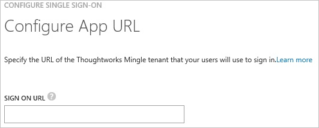

4.  在**設定單一登入 Thoughtworks 哈拉在**頁面上，按一下下載的中繼資料，然後將其儲存在您的電腦上。

    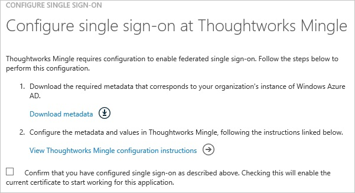

5.  以系統管理員身分登入**Thoughtworks 哈拉**公司網站。

6.  按一下 [**管理**] 索引標籤，然後按一下 [ **SSO Config**。

    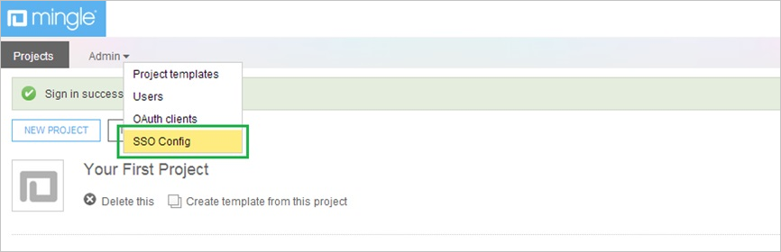

7.  在 [ **SSO Config** ] 區段中，執行下列步驟︰

    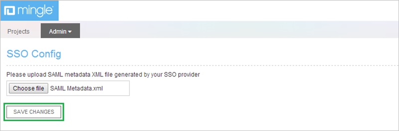

    1.  若要上傳的中繼資料檔案，請按一下 [**選擇檔案**。
    2.  按一下 [**儲存變更**]。

8.  在 Azure 傳統的入口網站中，選取單一登入設定確認，然後再按一下**完成**關閉 [**設定單一登入**] 對話方塊。

    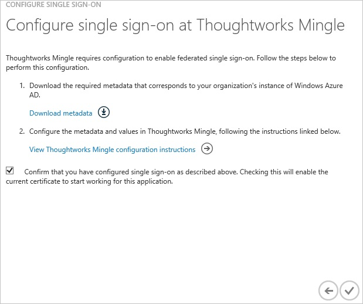

##設定使用者佈建
  
AAD 使用者可以登入，他們必須提供 Thoughtworks 哈拉應用程式使用他們的 Azure Active Directory 使用者名稱。  
若是 Thoughtworks 哈拉，佈建是手動的工作。

###若要設定使用者佈建，執行下列步驟︰

1.  以系統管理員身分登入 Thoughtworks 哈拉公司網站。

2.  按一下 [**設定檔**]。

    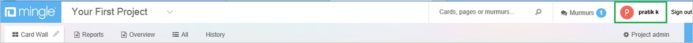

3.  按一下 [**管理員**] 索引標籤，然後按一下 [**使用者**。

    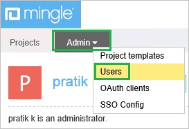

4.  按一下 [**新增使用者**]。

    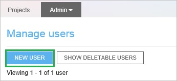

5.  **新的使用者**] 對話方塊在頁面上，執行下列步驟︰

    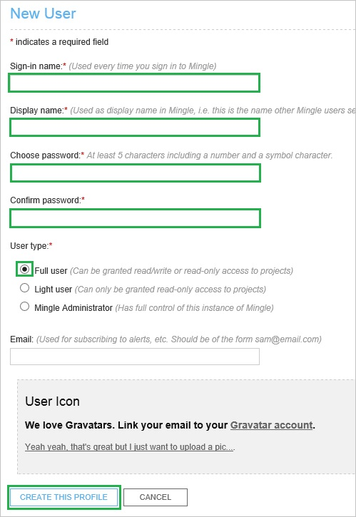

    1.  輸入**登入名稱**、**顯示名稱**、**選擇密碼**、**確認密碼**有效 AAD 您想要的帳戶佈建到相關的文字方塊。
    2.  為**使用者類型**，選取 [**完整的使用者**]。
    3.  按一下 [**建立此設定檔**]。

>[AZURE.NOTE] 您可以使用任何其他 Thoughtworks 哈拉使用者帳戶建立工具或 Api 提供 Thoughtworks 哈拉佈建 AAD 使用者帳戶。

##將使用者指派
  
若要測試您的設定，您需要授與 Azure AD 使用者您想要允許使用您的應用程式存取分派給他們。

###若要指派 Thoughtworks 哈拉的使用者，請執行下列步驟︰

1.  在 Azure 傳統入口網站中建立測試帳戶。

2.  **Thoughtworks 哈拉**應用程式整合在頁面上，按一下 [**指派給使用者**。

    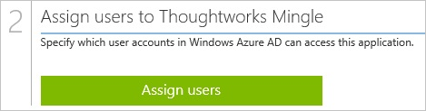

3.  選取您測試的使用者、**指派**，請按一下 [，然後按一下**[是]**以確認您的工作分派。

    ![[是]](./media/active-directory-saas-thoughtworks-mingle-tutorial/IC767830.png "[是]")
  
如果您想要測試您的單一登入設定，開啟 [存取面板。 如需存取畫面的詳細資訊，請參閱[簡介存取面板](active-directory-saas-access-panel-introduction.md)。
