<properties 
    pageTitle="教學課程︰ 使用 Tinfoil 安全性的 Azure Active Directory 整合 |Microsoft Azure"
    description="瞭解如何使用 Azure Active Directory 中的 Tinfoil 安全性，若要啟用單一登入、 自動化佈建和更多 ！。" 
    services="active-directory" 
    authors="jeevansd"  
    documentationCenter="na" 
    manager="femila"/>
<tags 
    ms.service="active-directory" 
    ms.devlang="na" 
    ms.topic="article" 
    ms.tgt_pltfrm="na" 
    ms.workload="identity" 
    ms.date="09/11/2016" 
    ms.author="jeedes" />

#教學課程︰ 使用 Tinfoil 安全性的 Azure Active Directory 整合
  
本教學課程中的目標是以顯示 Azure 和 Tinfoil 安全性的整合。  
本教學課程中所述的案例假設您已經有下列項目︰

-   有效的 Azure 訂閱
-   Tinfoil 安全性單一登入啟用訂閱
  
完成後本教學課程中，您指派給 Tinfoil 安全性 Azure AD 使用者將能夠單一登入 Tinfoil 安全性公司網站 （身分識別提供者發起的租用戶登入），或使用[[存取面板簡介](active-directory-saas-access-panel-introduction.md)應用程式。
  
本教學課程中所述的案例是由下列建置組塊所組成︰

1.  啟用 Tinfoil 安全性的應用程式整合
2.  設定單一登入
3.  設定使用者佈建
4.  將使用者指派

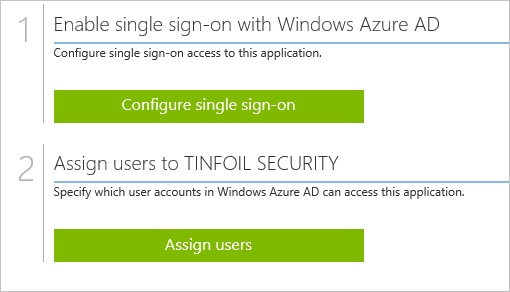

##啟用 Tinfoil 安全性的應用程式整合
  
本節的目標是大綱如何啟用 Tinfoil 安全性整合應用程式。

###若要啟用 Tinfoil 安全性的應用程式整合，請執行下列步驟︰

1.  Azure 傳統入口網站中，在左側的功能窗格中，按一下 [ **Active Directory**]。

    

2.  從 [**目錄**] 清單中，選取您要啟用目錄整合的目錄。

3.  若要開啟 [應用程式] 檢視中，在 [目錄] 檢視中，按一下 [在上方的功能表中的 [**應用程式**]。

    

4.  按一下 [**新增**頁面的底部。

    

5.  在 [**您想要做什麼**] 對話方塊中，按一下 [**新增應用程式，從圖庫**。

    

6.  在**搜尋] 方塊**中，輸入**Tinfoil 安全性**。

    

7.  在 [結果] 窗格中，選取**Tinfoil 安全性**]，然後按一下**完成**新增應用程式。

    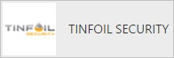

##設定單一登入
  
本節的目標是大綱如何啟用使用者進行驗證其帳戶中使用根據 SAML 通訊協定的同盟 Azure AD Tinfoil 安全性。  
單一登入 Tinfoil 安全性設定您需要從憑證擷取指紋值。  
如果您不熟悉這個程序，請參閱[如何擷取的憑證指紋值](http://youtu.be/YKQF266SAxI)。

###若要設定單一登入，請執行下列步驟︰

1.  在 Azure 的傳統入口網站， **Tinfoil 安全性**應用程式整合在頁面上，按一下 [**設定單一登入**以開啟 [**設定單一登入**] 對話方塊。

    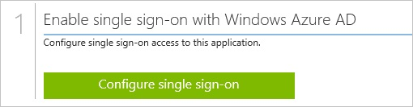

2.  在**您要如何登入 Tinfoil 安全性的使用者**] 頁面上，選取**Microsoft Azure AD 單一登入**，然後按 [**下一步**。

    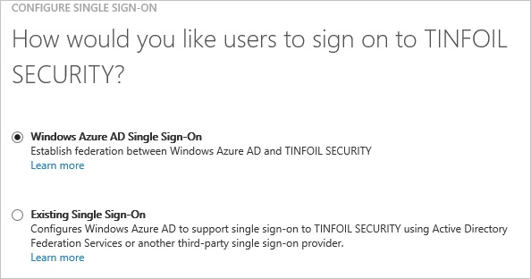

3.  **設定應用程式 URL**在頁面上，在**Tinfoil 安全性回覆 URL** ] 文字方塊中輸入您 Tinfoil 安全性判斷提示消費者服務 (ACS) 的 URL (例如: 「*https://www.tinfoilsecurity.com/saml/consume*」，然後按一下 [**下一步**。

    >[AZURE.NOTE] 您可以從 Tinfoil 安全性中繼資料 (https://www.tinfoilsecurity.com/saml/metadata) 取得 ACS URL。

    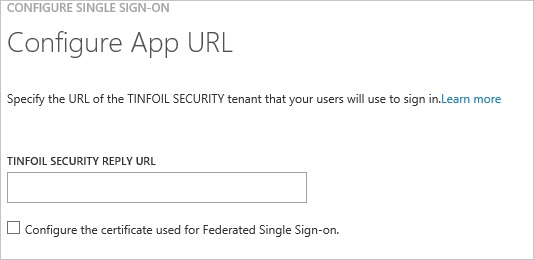

4.  在**設定單一登入 Tinfoil 安全性在**頁面上，若要下載您的憑證，按一下**下載憑證**]，然後憑證檔案儲存至本機為**c:\\Tinfoil Security.cer**。

    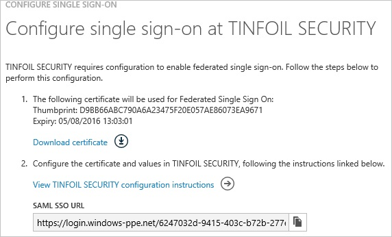

5.  在不同的網頁瀏覽器視窗中，以系統管理員身分登入您 Tinfoil 安全性公司的網站。

6.  在 [工具列] 的 [My **Account**。

    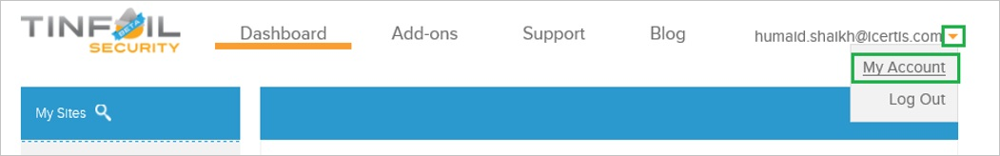

7.  按一下 [**安全性**]。

    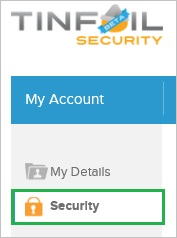

8.  **單一登入**設定] 頁面上，執行下列步驟︰

    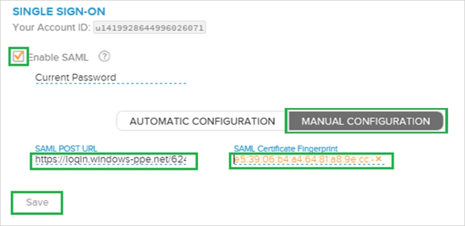

    1.  選取 [**啟用 SAML**。
    2.  按一下 [**手動設定**]。
    3.  在 Azure 的傳統入口網站中**設定單一登入，Tinfoil 安全性**] 對話方塊在頁面上，複製 [ **SAML SSO URL**的值，，然後再貼到 [ **SAML 文章 URL** ] 文字方塊。
    4.  匯出憑證，複製**指紋**值，然後將其貼入**SAML 憑證指紋**文字方塊。  

        >[AZURE.TIP] 如需詳細資訊，請參閱[如何擷取的憑證指紋值](http://youtu.be/YKQF266SAxI)

    5.  複製**您的帳戶識別碼**。
    6.  按一下 [**儲存**]。

9.  在 Azure 傳統的入口網站中，選取單一登入設定確認，然後再按一下**完成**關閉 [**設定單一登入**] 對話方塊。

    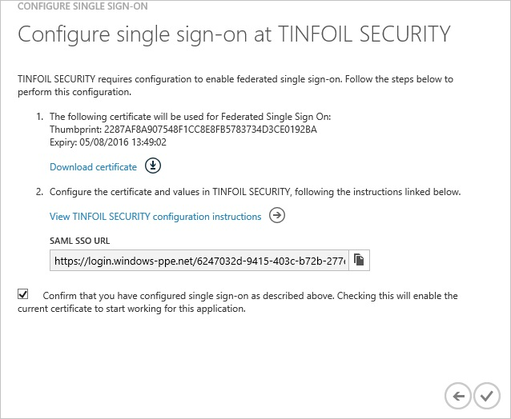

10. 在頂端的功能表，按一下 [**屬性**開啟 [ **SAML 權杖屬性**] 對話方塊。

    

11. 若要新增必要的屬性對應，請執行下列步驟︰

    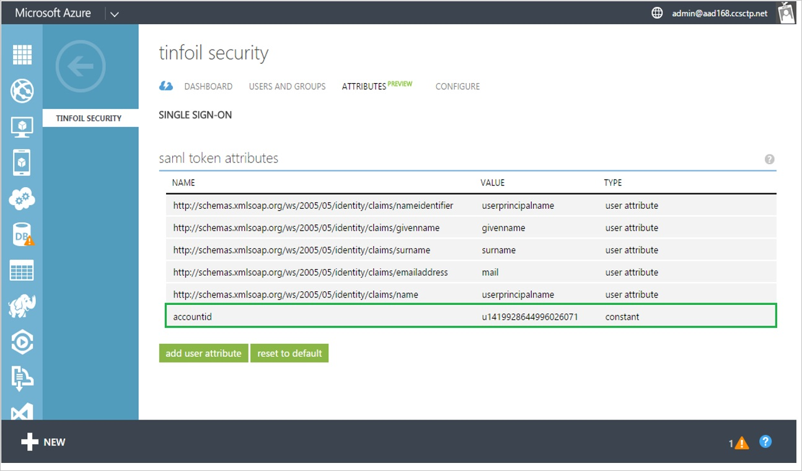

    1.  按一下 [**新增使用者屬性**]。
    2.  在 [**屬性名稱**] 文字方塊中，輸入**accountid**。
    3.  在 [**屬性值**] 文字方塊中貼上您在前一節中複製的帳戶識別碼值。
    4.  按一下 [**完成**]。

12. 按一下 [**套用變更**]。

##設定使用者佈建
  
若要啟用 Azure AD 使用者登入 Tinfoil 安全性，他們必須提供 Tinfoil 安全性。  
若是 Tinfoil 安全性佈建是手動的工作。

###若要取得使用者佈建後，請執行下列步驟︰

1.  如果使用者是企業版帳戶的一部分，您需要連絡 Tinfoil 安全性的支援小組，以取得所建立的使用者帳戶。

2.  如果使用者在一般 Tinfoil 安全性 SaaS 使用者，然後使用者可以新增 collaborator 至任何使用者的網站。 這樣會觸發程序來傳送邀請以指定的電子郵件若要建立新的 Tinfoil 安全性使用者帳戶。

>[AZURE.NOTE] 您可以使用任何其他 Tinfoil 安全性使用者帳戶建立工具或 Api Tinfoil 安全性所提供給佈建 AAD 使用者帳戶。

##將使用者指派
  
若要測試您的設定，您需要授與 Azure AD 使用者您想要允許使用您的應用程式存取分派給他們。

###若要指定 Tinfoil 安全性使用者，請執行下列步驟︰

1.  在 Azure 傳統入口網站中建立測試帳戶。

2.  **Tinfoil 安全性**應用程式整合在頁面上，按一下 [**指派給使用者**。

    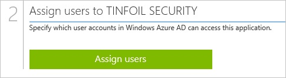

3.  選取您測試的使用者、**指派**，請按一下 [，然後按一下**[是]**以確認您的工作分派。

    ![[是]](./media/active-directory-saas-tinfoil-security-tutorial/IC767830.png "[是]")
  
如果您想要測試您的單一登入設定，開啟 [存取面板。 如需存取畫面的詳細資訊，請參閱[簡介存取面板](active-directory-saas-access-panel-introduction.md)。