<properties 
    pageTitle="教學課程︰ Azure Active Directory 整合 TOPdesk-公用 |Microsoft Azure" 
    description="瞭解如何使用 TOPdesk-公用與 Azure Active Directory 啟用單一登入、 自動化佈建和更多 ！" 
    services="active-directory" 
    authors="jeevansd"  
    documentationCenter="na" 
    manager="femila"/>
<tags 
    ms.service="active-directory" 
    ms.devlang="na" 
    ms.topic="article" 
    ms.tgt_pltfrm="na" 
    ms.workload="identity" 
    ms.date="09/11/2016" 
    ms.author="jeedes" />

#教學課程︰ TOPdesk-公用 Azure 目錄整合

本教學課程中的目標是以顯示 Azure 和 TOPdesk-公用的整合。  
本教學課程中所述的案例假設您已經有下列項目︰

-   有效的 Azure 訂閱
-   TOPdesk-公用單一登入啟用訂閱
  
完成後本教學課程，Azure AD 使用者已指派給 TOPdesk-公用能夠單一的登入您的 TOPdesk-公用公司網站 （服務提供者發起的租用戶登入），或使用[[存取面板簡介](active-directory-saas-access-panel-introduction.md)應用程式]。
  
本教學課程中所述的案例是由下列建置組塊所組成︰

1.  啟用 TOPdesk-公用應用程式整合
2.  設定單一登入
3.  設定使用者佈建
4.  將使用者指派

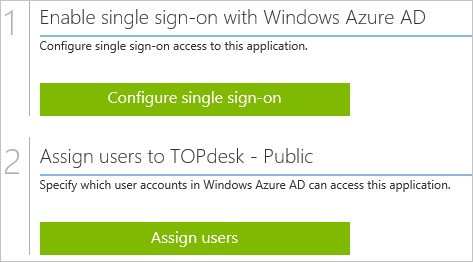

##啟用 TOPdesk-公用應用程式整合
  
本節的目標是大綱如何啟用應用程式適用於整合 TOPdesk-公用。

###若要啟用應用程式適用於整合 TOPdesk-公開，請執行下列步驟︰

1.  Azure 傳統入口網站中，在左側的功能窗格中，按一下 [ **Active Directory**]。

    

2.  從 [**目錄**] 清單中，選取您要啟用目錄整合的目錄。

3.  若要開啟 [應用程式] 檢視中，在 [目錄] 檢視中，按一下 [在上方的功能表中的 [**應用程式**]。

    

4.  按一下 [**新增**頁面的底部。

    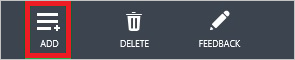

5.  在 [**您想要做什麼**] 對話方塊中，按一下 [**新增應用程式，從圖庫**。

    

6.  在**搜尋] 方塊**中，輸入**TOPdesk-公用**。

    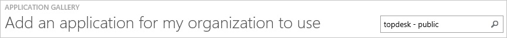

7.  在 [結果] 窗格中，選取**TOPdesk-公用**，，然後按一下要新增應用程式**完成**。

    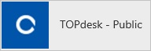

##設定單一登入
  
本節的目標是大綱如何啟用使用者驗證 TOPdesk-公用以中使用根據 SAML 通訊協定的同盟 Azure AD 帳戶。  
設定單一登入的 TOPdesk-公用會要求您上傳標誌圖示檔案。 若要取得圖示檔案，請連絡 TOPdesk 支援小組。

###若要設定單一登入，請執行下列步驟︰

1.  以系統管理員身分登入您**TOPdesk-公用**公司的網站。

2.  在 [ **TOPdesk** ] 功能表中，按一下 [**設定**]。

    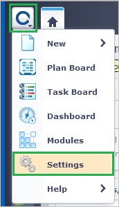

3.  按一下 [**登入設定**]。

    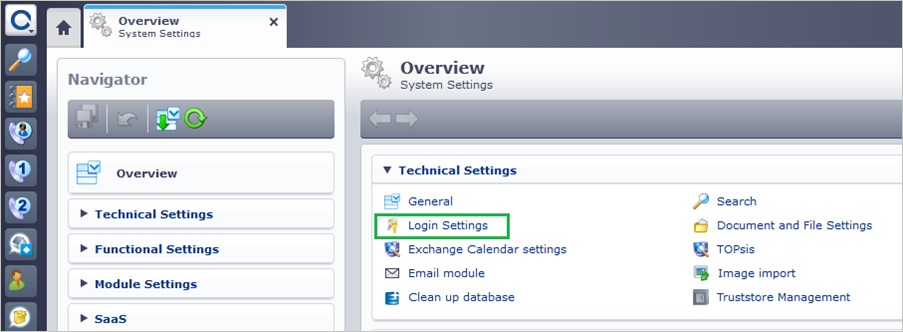

4.  展開 [**登入設定**] 功能表，然後按一下 [**一般**。

    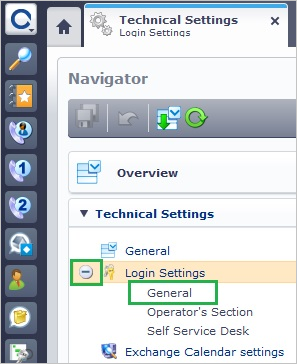

5.  在 [ **SAML 登入**的組態] 區段中的 [**公用**] 區段中，執行下列步驟︰

    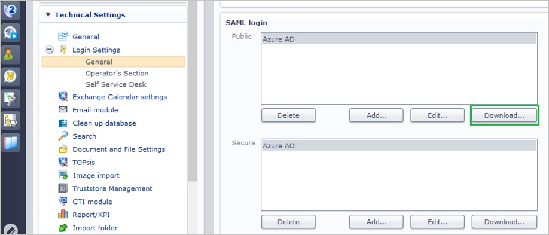

    1.  按一下 [下載公用中繼資料檔案中，[**下載**]，然後將其儲存至本機電腦上。
    2.  開啟 [中繼資料檔案，然後找到 [ **AssertionConsumerService**節點。
        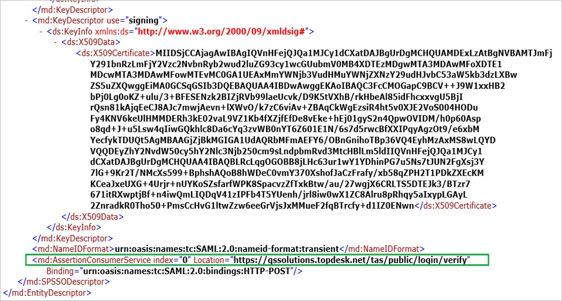
    3.  複製 [ **AssertionConsumerService**值。  

        >[AZURE.NOTE] 稍後在本教學課程中，您將需要**設定應用程式 URL** ] 區段中的值。

6.  在不同的網頁瀏覽器視窗中，以系統管理員身分登入您的**Azure 傳統入口網站**。

7.  在 [ **TOPdesk-公用**應用程式整合] 頁面中，按一下 [**設定單一登入**以開啟 [**設定單一登入**] 對話方塊。

    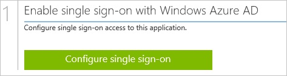

8.  在**您要如何登入 TOPdesk-公用的使用者**] 頁面上，選取**Microsoft Azure AD 單一登入**，然後按 [**下一步**。

    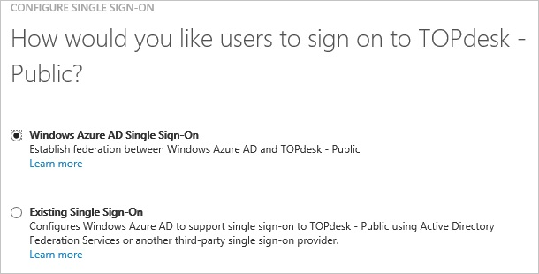

9.  **設定應用程式 URL**在頁面上，執行下列步驟︰

    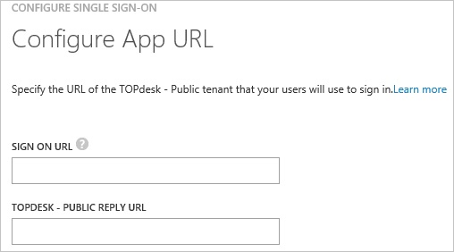

    1.  在**TOPdesk-公用登入 URL** ] 文字方塊中，輸入您的使用者用來登入您的 TOPdesk-公用應用程式的 URL (例如: 「*https://qssolutions.topdesk.net*」)。
    2.  在 [ **TOPdesk – 公用回覆 URL** ] 文字方塊中，貼上**TOPdesk-公用 AssertionConsumerService URL** (例如: 「*https://qssolutions.topdesk.net/tas/public/login/saml*」)
    3.  按一下 [**下一步**]。

10. 在**設定單一登入 TOPdesk-公用在**頁面上，若要下載的中繼資料檔案，按一下**下載的中繼資料**]，然後儲存在本機電腦上的檔案。

    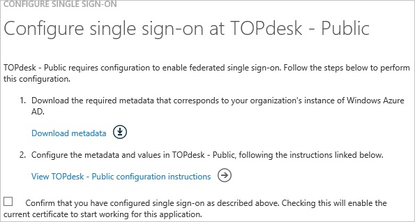

11. 若要建立憑證檔案，請執行下列步驟︰

    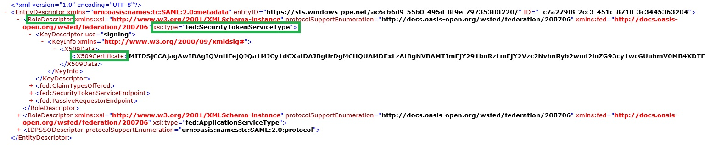

    1.  開啟下載的中繼資料檔案。
    2.  展開的**xsi** **RoleDescriptor**節點**會找出 fed: ApplicationServiceType**。
    3.  複製**509certificate**節點的值。
    4.  將複製的**509certificate**值儲存在您的電腦檔案中的本機。

12. 在您 TOPdesk-公用公司網站、 **TOPdesk** ] 功能表中，按一下 [**設定**]。

    

13. 按一下 [**登入設定**]。

    

14. 展開 [**登入設定**] 功能表，然後按一下 [**一般**。

    

15. 在 [**公用**] 區段中，按一下 [**新增**]。

    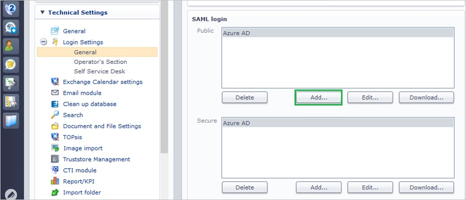

16. **SAML 設定小幫手**] 對話方塊在頁面上，執行下列步驟︰

    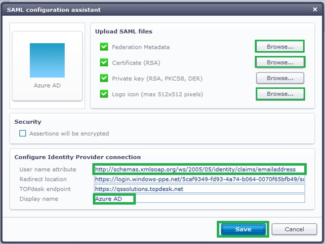

    1.  若要上傳您下載的中繼資料檔案，在**同盟中繼資料**，請按一下 [**瀏覽**]。
    2.  若要上傳您的憑證檔案，在**憑證 (RSA)**，按一下 [**瀏覽**]。
    3.  上傳標誌檔案您向 TOPdesk 的支援小組，[**標誌] 圖示**] 底下，按一下 [**瀏覽**]。
    4.  在 [**使用者名稱屬性**] 文字方塊中，輸入**http://schemas.xmlsoap.org/ws/2005/05/identity/claims/emailaddress**。
    5.  在 [**顯示名稱**] 文字方塊中，輸入您的設定的名稱。
    6.  按一下 [**儲存**]。

17. 在 Azure 傳統的入口網站中，選取單一登入設定確認，然後再按一下**完成**關閉 [**設定單一登入**] 對話方塊。

    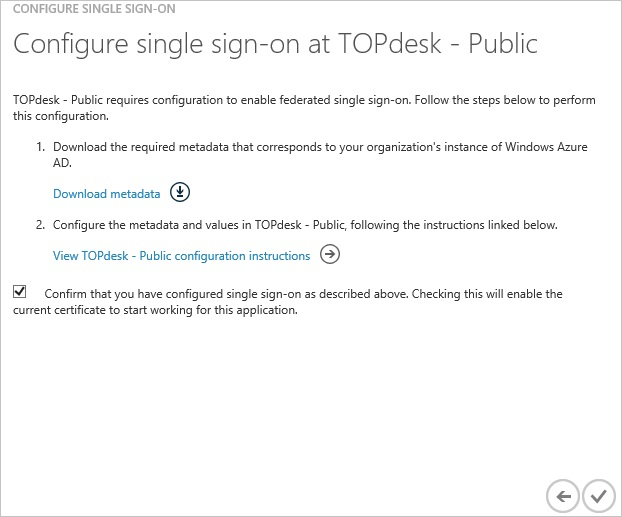

##設定使用者佈建
  
若要讓 Azure AD 使用者登入 TOPdesk-公開，他們必須佈建到 TOPdesk-公用。  
若是 TOPdesk-公開，佈建是手動的工作。

###若要設定使用者佈建，執行下列步驟︰

1.  以系統管理員身分登入您**TOPdesk-公用**公司的網站。

2.  在頂端的功能表，按一下 [ **TOPdesk\>新增\>支援檔案\>人員**。

    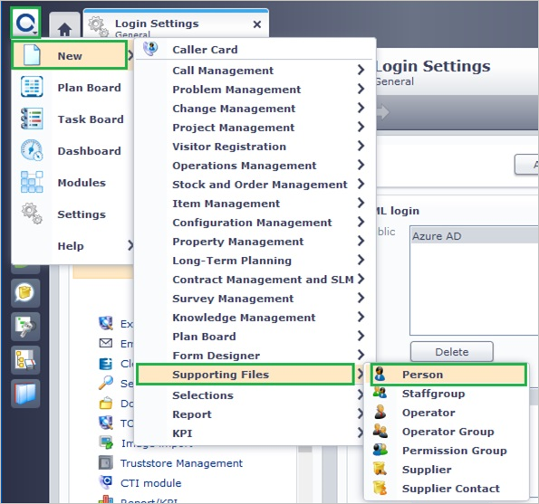

3.  在 [新增連絡人] 對話方塊中，執行下列步驟︰

    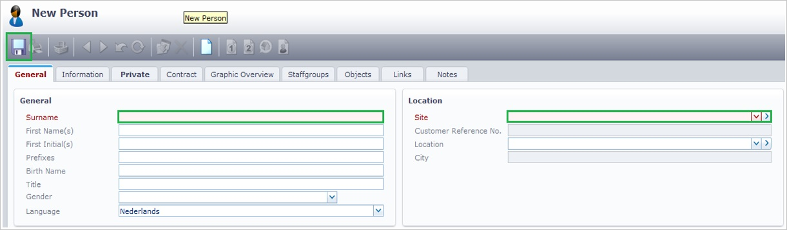

    1.  按一下 [一般] 索引標籤。
    2.  在 [姓氏] 文字方塊中，輸入有效的 Azure Active Directory 帳戶，您想要佈建的姓氏。
    3.  選取**網站**的帳戶。
    4.  按一下 [**儲存**]。

>[AZURE.NOTE] 您可以使用任何其他 TOPdesk-公用使用者帳戶建立工具或 Api 提供 TOPdesk-公用佈建 AAD 使用者帳戶。

##將使用者指派
  
若要測試您的設定，您需要授與 Azure AD 使用者您想要允許使用您的應用程式存取分派給他們。

###若要將使用者指派至 TOPdesk-公開，請執行下列步驟︰

1.  在 Azure 傳統入口網站中建立測試帳戶。

2.  **TOPdesk-公用**應用程式整合在頁面上，按一下 [**指派給使用者**。

    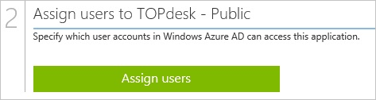

3.  選取您測試的使用者、**指派**，請按一下 [，然後按一下**[是]**以確認您的工作分派。

    ![[是]](./media/active-directory-saas-topdesk-public-tutorial/IC767830.png "[是]")
  
如果您想要測試您的單一登入設定，開啟 [存取面板。 如需存取畫面的詳細資訊，請參閱[簡介存取面板](active-directory-saas-access-panel-introduction.md)。