<properties 
    pageTitle="教學課程︰ 使用 UserVoice 的 Azure Active Directory 整合 |Microsoft Azure" 
    description="瞭解如何使用 UserVoice 與 Azure Active Directory 啟用單一登入，自動化佈建和更多 ！。" 
    services="active-directory" 
    authors="jeevansd"  
    documentationCenter="na" 
    manager="femila"/>
<tags 
    ms.service="active-directory" 
    ms.devlang="na" 
    ms.topic="article" 
    ms.tgt_pltfrm="na" 
    ms.workload="identity" 
    ms.date="09/11/2016" 
    ms.author="jeedes" />

#教學課程︰ 使用 UserVoice 的 Azure Active Directory 整合
  
本教學課程中的目標是以顯示 Azure 和 UserVoice 的整合。  
本教學課程中所述的案例假設您已經有下列項目︰

-   有效的 Azure 訂閱
-   UserVoice 租用戶
  
完成後本教學課程中，您指派給 UserVoice Azure AD 使用者將能夠單一登入 UserVoice 公司網站 （服務提供者發起的租用戶登入），或使用[[存取面板簡介](active-directory-saas-access-panel-introduction.md)應用程式。
  
本教學課程中所述的案例是由下列建置組塊所組成︰

1.  啟用應用程式適用於整合 UserVoice
2.  設定單一登入
3.  設定使用者佈建
4.  將使用者指派

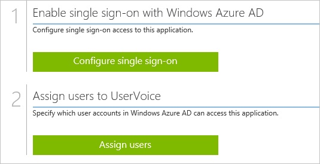

##啟用應用程式適用於整合 UserVoice
  
本節的目標是大綱如何啟用 UserVoice 的整合應用程式。

###若要啟用的 UserVoice 整合應用程式，請執行下列步驟︰

1.  Azure 傳統入口網站中，在左側的功能窗格中，按一下 [ **Active Directory**]。

    

2.  從 [**目錄**] 清單中，選取您要啟用目錄整合的目錄。

3.  若要開啟 [應用程式] 檢視中，在 [目錄] 檢視中，按一下 [在上方的功能表中的 [**應用程式**]。

    

4.  按一下 [**新增**頁面的底部。

    

5.  在 [**您想要做什麼**] 對話方塊中，按一下 [**新增應用程式，從圖庫**。

    

6.  在**搜尋] 方塊**中，輸入**UserVoice**。

    

7.  在 [結果] 窗格中，選取**UserVoice**，，然後按一下 [新增應用程式**完成**。

    

##設定單一登入
  
本節的目標是大綱如何啟用使用者進行驗證其帳戶中使用根據 SAML 通訊協定的同盟 Azure AD UserVoice。  
設定單一登入的 UserVoice 需要您從憑證擷取指紋值。  
如果您不熟悉這個程序，請參閱[如何擷取的憑證指紋值](http://youtu.be/YKQF266SAxI)。

###若要設定單一登入，請執行下列步驟︰

1.  在 Azure 的傳統入口網站， **UserVoice**應用程式整合在頁面上，按一下 [**設定單一登入**以開啟 [**設定單一登入**] 對話方塊。

    

2.  在**您要如何登入 UserVoice 的使用者**] 頁面上，選取**Microsoft Azure AD 單一登入**，然後按 [**下一步**。

    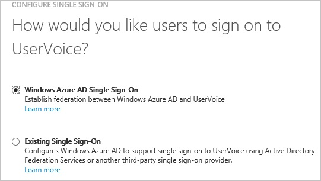

3.  **設定應用程式 URL**在頁面上，在 [ **UserVoice 登入 URL** ] 文字方塊中，輸入您使用下列模式的 URL 「*https://\<租用戶名稱\>。UserVoice.com*」，然後按一下 [**下一步**。

    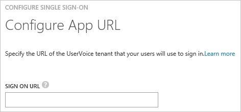

4.  在**設定單一登入 UserVoice 在**頁面上，若要下載您的憑證，按一下**下載憑證**]，然後憑證檔案儲存至本機為**c:\\UserVoice.cer**。

    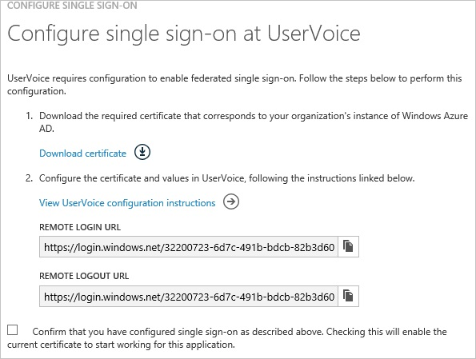

5.  在不同的網頁瀏覽器視窗中，以系統管理員身分登入您 UserVoice 公司的網站。

6.  在 [工具列] 按一下 [設定]，然後選取入口網站] 功能表。

    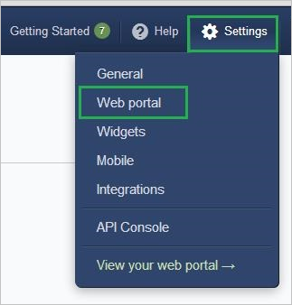

7.  **入口網站**] 索引標籤的 [**使用者驗證**] 區段中，按一下 [**編輯**] 以開啟 [**編輯使用者驗證**] 對話方塊的頁面

    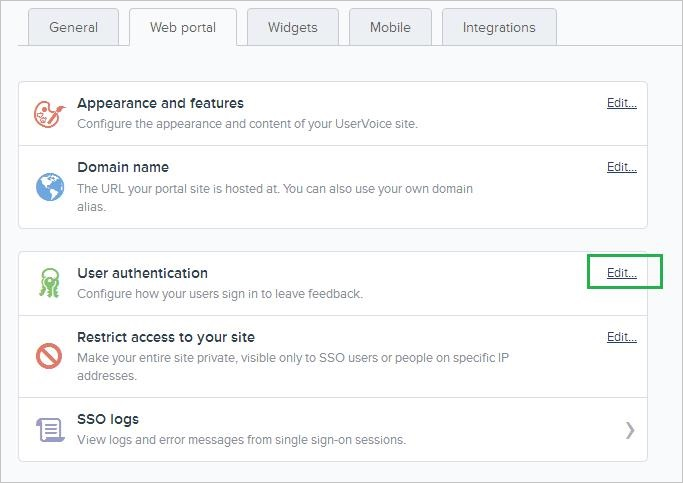

8.  **編輯使用者驗證**] 對話方塊在頁面上，執行下列步驟︰

    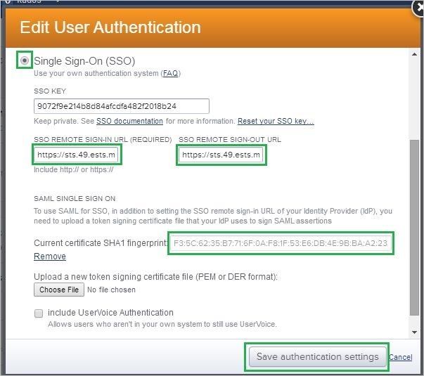

    1.  按一下 [**單一登入 (SSO)**。
    2.  在 Azure 的傳統入口網站中**設定單一登入，UserVoice** ] 對話方塊在頁面上，複製 [**遠端登入 URL**的值，，然後再貼到 [ **SSO 遠端登入**] 文字方塊。
    3.  在 Azure 的傳統入口網站中**設定單一登入，UserVoice** ] 對話方塊在頁面上，複製 [**遠端登出 URL**的值，，然後再貼到**SSO 遠端 Sign-Out 文字方塊**。
    4.  匯出憑證，複製**指紋**值，然後貼到**目前的憑證 SHA1 指紋**文字方塊。  

        >[AZURE.TIP] 如需詳細資訊，請參閱[如何擷取的憑證指紋值](http://youtu.be/YKQF266SAxI)

    5.  按一下 [**儲存驗證設定**。

9.  在 Azure 傳統的入口網站中，選取單一登入設定確認，然後再按一下**完成**關閉 [**設定單一登入**] 對話方塊。

    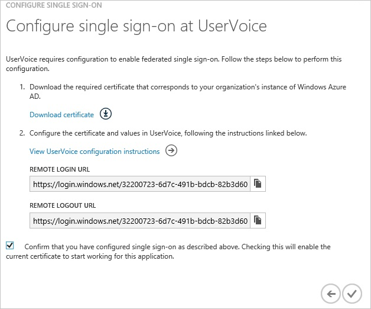

##設定使用者佈建
  
若要啟用 Azure AD 使用者登入 UserVoice，他們必須佈建到 UserVoice。  
若是 UserVoice，佈建是手動的工作。

###佈建使用者帳戶，請執行下列步驟︰

1.  登入您的**UserVoice**租用戶。

2.  移至 [**設定]**。

    

3.  按一下 [**一般**]。

4.  按一下 [**代理程式和權限**]。

    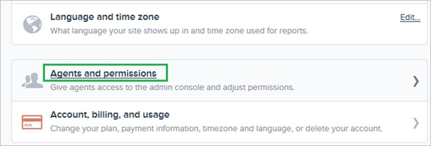

5.  按一下 [**新增管理員**]。

    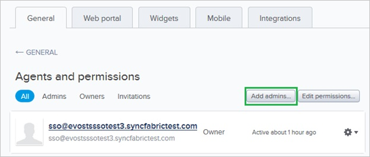

6.  在 [**邀請管理員**] 對話方塊中，執行下列步驟︰

    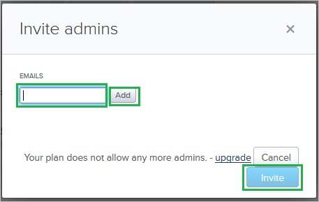

    1.  在電子郵件 texbox 中，輸入您想要佈建，然後再按一下 [**新增**帳戶的電子郵件地址。
    2.  按一下 [**邀請**]。

>[AZURE.NOTE] 您可以使用任何其他 UserVoice 使用者帳戶建立工具或 Api 提供 UserVoice 佈建 AAD 使用者帳戶。

##將使用者指派
  
若要測試您的設定，您需要授與 Azure AD 使用者想要允許使用您的應用程式存取分派給他們。

###若要指定 UserVoice 使用者，請執行下列步驟︰

1.  在 Azure 傳統入口網站中建立測試帳戶。

2.  **UserVoice**應用程式整合在頁面上，按一下 [**指派給使用者**。

    

3.  選取您測試的使用者、**指派**，請按一下 [，然後按一下**[是]**以確認您的工作分派。

    ![[是]](./media/active-directory-saas-uservoice-tutorial/IC767830.png "[是]")
  
如果您想要測試您的單一登入設定，開啟 [存取面板。 如需存取畫面的詳細資訊，請參閱[簡介存取面板](active-directory-saas-access-panel-introduction.md)。