<properties 
    pageTitle="教學課程︰ Azure Active Directory 整合 Veracode |Microsoft Azure" 
    description="瞭解如何使用 Veracode 與 Azure Active Directory 啟用單一登入、 自動化佈建和更多 ！" 
    services="active-directory" 
    authors="jeevansd"  
    documentationCenter="na" 
    manager="femila"/>
<tags 
    ms.service="active-directory" 
    ms.devlang="na" 
    ms.topic="article" 
    ms.tgt_pltfrm="na" 
    ms.workload="identity" 
    ms.date="09/11/2016" 
    ms.author="jeedes" />

#教學課程︰ 使用 Veracode 的 Azure Active Directory 整合
  
本教學課程中的目標是以顯示 Azure 和 Veracode 的整合。 本教學課程中所述的案例假設您已經有下列項目︰

-   有效的 Azure 訂閱
-   Veracode 單一登入啟用訂閱
  
完成後本教學課程中，您指派給 Veracode Azure AD 使用者將能夠[存取面板簡介](active-directory-saas-access-panel-introduction.md)在應用程式中的單一登。
  
本教學課程中所述的案例是由下列建置組塊所組成︰

1.  啟用 Veracode 應用程式整合
2.  設定單一登入
3.  設定使用者佈建
4.  將使用者指派

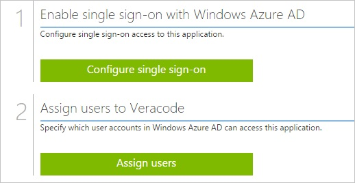

##啟用 Veracode 應用程式整合
  
本節的目標是大綱如何啟用 Veracode 的整合應用程式。

###若要啟用的 Veracode 整合應用程式，請執行下列步驟︰

1.  Azure 傳統入口網站中，在左側的功能窗格中，按一下 [ **Active Directory**]。

    

2.  從 [**目錄**] 清單中，選取您要啟用目錄整合的目錄。

3.  若要開啟 [應用程式] 檢視中，在 [目錄] 檢視中，按一下 [在上方的功能表中的 [**應用程式**]。

    

4.  按一下 [**新增**頁面的底部。

    

5.  在 [**您想要做什麼**] 對話方塊中，按一下 [**新增應用程式，從圖庫**。

    

6.  在**搜尋] 方塊**中，輸入**Veracode**。

    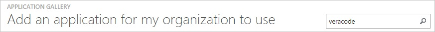

7.  在 [結果] 窗格中，選取**Veracode**，，然後按一下要新增應用程式**完成**。

    

##設定單一登入
  
本節的目標是大綱如何啟用使用者進行驗證其帳戶中使用根據 SAML 通訊協定的同盟 Azure AD Veracode。  
Veracode 應用程式的期待 SAML 判斷提示以特定格式會要求您將自訂屬性對應至**saml 權杖屬性**設定。  
以下螢幕擷取畫面會顯示這個範例。

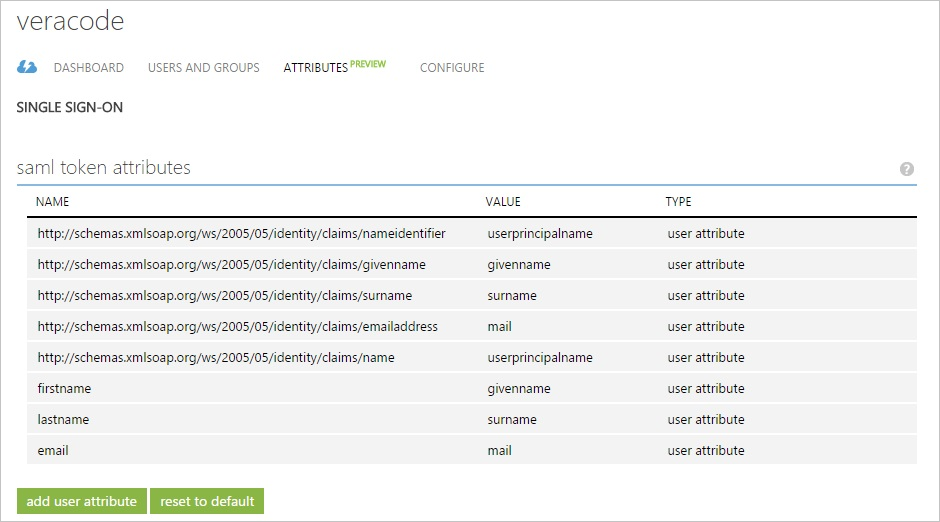

###若要設定單一登入，請執行下列步驟︰

1.  在 Azure 的傳統入口網站， **Veracode**應用程式整合在頁面上，按一下 [**設定單一登入**以開啟 [**設定單一登入**] 對話方塊。

    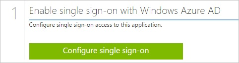

2.  在**您要如何登入 Veracode 的使用者**] 頁面上，選取**Microsoft Azure AD 單一登入**，然後按 [**下一步**。

    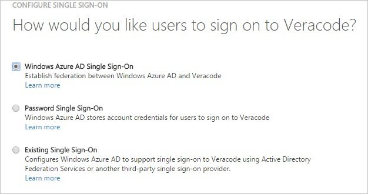

3.  在 [**設定應用程式設定**] 頁面中，按一下 [**下一步**]。

    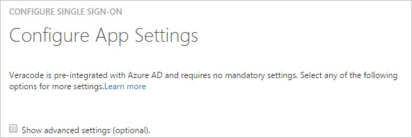

4.  在**設定單一登入 Veracode 在**頁面上，若要下載您的憑證，按一下 [**下載憑證**] 並儲存在本機電腦上的憑證檔案。

    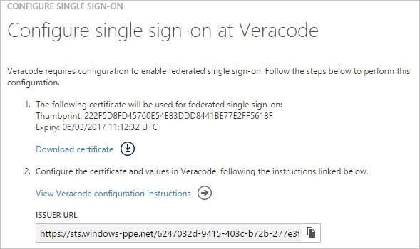

5.  在不同的網頁瀏覽器視窗中，以系統管理員身分登入您 Veracode 公司的網站。

6.  在頂端的功能表，按一下 [**設定**]，然後再按一下 [**管理員**。

    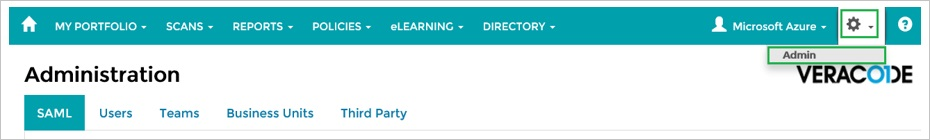

7.  按一下 [ **SAML** ] 索引標籤。

8.  在 [**組織 SAML 設定**] 區段中，執行下列步驟︰

    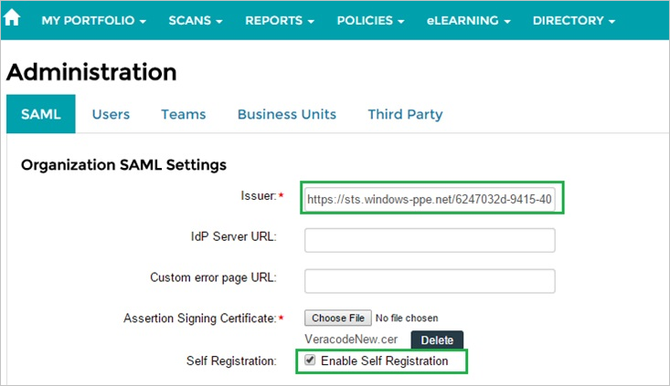

    1.  在 Azure 的傳統入口網站中**設定單一登入，Veracode** ] 對話方塊在頁面上，複製**簽發者 URL**的值，，然後再貼到 [**簽發者**] 文字方塊
    2.  若要上傳您下載的憑證，請按一下 [**選擇 [檔案**]。
    3.  選取 [**啟用自動註冊**]。

9.  在 [**自助註冊設定**] 區段中，執行下列步驟，，然後按一下 [**儲存**︰

    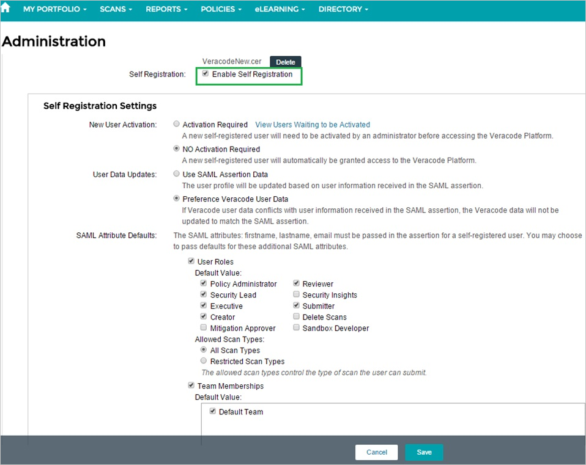

    1.  為**新的使用者啟動**，選取 [**無需要啟用**]。
    2.  為**使用者資料更新**，選取 [**喜好設定 Veracode 使用者資料**]。
    3.  如**SAML 屬性的詳細資訊**，選取下列選項︰
        -   **使用者角色**
        -   **原則管理員**
        -   **檢閱者**
        -   **安全性潛在客戶**
        -   **高階主管**
        -   **傳送者**
        -   **建立者**
        -   **所有掃描類型**
        -   **小組成員資格**
        -   **預設小組**

10. 在 Azure 傳統的入口網站中，選取單一登入設定確認，然後再按一下**完成**關閉 [**設定單一登入**] 對話方塊。

    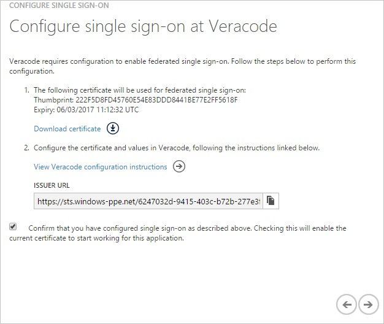

11. 在頂端的功能表，按一下 [**屬性**開啟 [ **SAML 權杖屬性**] 對話方塊。

    

12. 若要新增必要的屬性對應，請執行下列步驟︰

    

  	| 屬性名稱 | 屬性值 |
  	|:---------------|:----------------|
  	| 名字      | User.givenname  |
  	| [姓氏]       | User.surname    |
  	| 電子郵件          | User.mail       |

    1.  每個資料列以上表格中，按一下 [**新增使用者屬性**]。
    
    2.  在 [**屬性名稱**] 文字方塊中，輸入顯示該資料列的屬性名稱。

    3.  在 [**屬性值**] 文字方塊中，選取 [顯示該資料列的屬性值。

    4.  按一下 [**完成**]。

13. 按一下 [**套用變更**]。

##設定使用者佈建
  
若要啟用 Azure AD 使用者登入 Veracode，他們必須佈建到 Veracode。  
若是 Veracode，佈建是 「 自動化的工作。  
沒有您的動作項目。
  
使用者會自動建立必要在第一個單一登入嘗試。

>[AZURE.NOTE] 您可以使用任何其他 Veracode 使用者帳戶建立工具或 Api 提供 Veracode 佈建 AAD 使用者帳戶。

##將使用者指派
  
若要測試您的設定，您需要授與 Azure AD 使用者想要允許使用您的應用程式存取分派給他們。

###若要指定 Veracode 使用者，請執行下列步驟︰

1.  在 Azure 傳統入口網站中建立測試帳戶。

2.  **Veracode**應用程式整合在頁面上，按一下 [**指派給使用者**。

    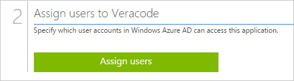

3.  選取您測試的使用者、**指派**，請按一下 [，然後按一下**[是]**以確認您的工作分派。

    ![[是]](./media/active-directory-saas-veracode-tutorial/IC767830.png "[是]")
  
如果您想要測試您的單一登入設定，開啟 [存取面板。 如需存取畫面的詳細資訊，請參閱[簡介存取面板](active-directory-saas-access-panel-introduction.md)。