<properties 
    pageTitle="教學課程︰ Azure Active Directory 整合 Work.com |Microsoft Azure" 
    description="瞭解如何使用 Azure Active Directory 中的 Work.com，若要啟用單一登入、 自動化佈建和更多 ！。" 
    services="active-directory" 
    authors="jeevansd"  
    documentationCenter="na" 
    manager="femila"/>
<tags 
    ms.service="active-directory" 
    ms.devlang="na" 
    ms.topic="article" 
    ms.tgt_pltfrm="na" 
    ms.workload="identity" 
    ms.date="09/11/2016" 
    ms.author="jeedes" />

#教學課程︰ 使用 Work.com 的 Azure Active Directory 整合
  
本教學課程中的目標是以顯示 Azure 和 Work.com 的整合。  
本教學課程中所述的案例假設您已經有下列項目︰

-   有效的 Azure 訂閱
-   Work.com 單一登入啟用訂閱
  
完成本教學課程後, AAD 使用者在您有哪些人指派的 Work.com access 會能夠使用單一登 Work.com 公司網站 （服務提供者發起的租用戶登入），或使用[[存取面板簡介](active-directory-saas-access-panel-introduction.md)應用程式。
  
本教學課程中所述的案例是由下列建置組塊所組成︰

1.  啟用 Work.com 應用程式整合
2.  設定單一登入
3.  設定使用者佈建
4.  將使用者指派

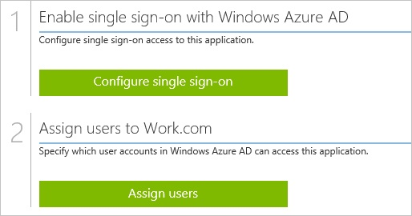

##啟用 Work.com 應用程式整合
  
本節的目標是大綱如何啟用 Work.com 的整合應用程式。

###若要啟用的 Work.com 整合應用程式，請執行下列步驟︰

1.  Azure 傳統入口網站中，在左側的功能窗格中，按一下 [ **Active Directory**]。

    

2.  從 [**目錄**] 清單中，選取您要啟用目錄整合的目錄。

3.  若要開啟 [應用程式] 檢視中，在 [目錄] 檢視中，按一下 [在上方的功能表中的 [**應用程式**]。

    

4.  按一下 [**新增**頁面的底部。

    

5.  在 [**您想要做什麼**] 對話方塊中，按一下 [**新增應用程式，從圖庫**。

    

6.  在**搜尋] 方塊**中，輸入**Work.com**。

    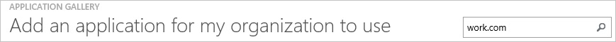

7.  在 [結果] 窗格中，選取**Work.com**，，然後按一下 [新增應用程式**完成**。

    

##設定單一登入
  
本節的目標是大綱如何啟用使用者進行驗證其帳戶中使用根據 SAML 通訊協定的同盟 Azure AD Work.com。  
此程序的一部分，您需要上傳至 Work.com.com 的憑證。

>[AZURE.NOTE] 若要設定單一登入，您需要尚未設定自訂 Work.com 網域名稱。 您需要定義至少有一個網域名稱，測試您的網域名稱，然後將其部署到整個組織。

###若要設定單一登入，請執行下列步驟︰

1.  您的 Work.com 租用戶系統管理員身分登入。

2.  移至**設定**。

    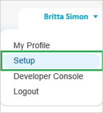

3.  在左側的功能窗格中，在 [**管理**] 區段中，按一下**網域管理**] 以展開相關的區段，然後按一下以開啟 [**我的網域**] 頁面的 [**我的網域**。 

    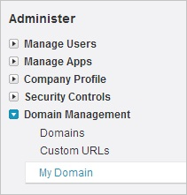

4.  若要驗證的網域已設定正確，請確定它是在 「**使用者的步驟 4 部署**「 並檢閱您 [**我的網域設定**]。

    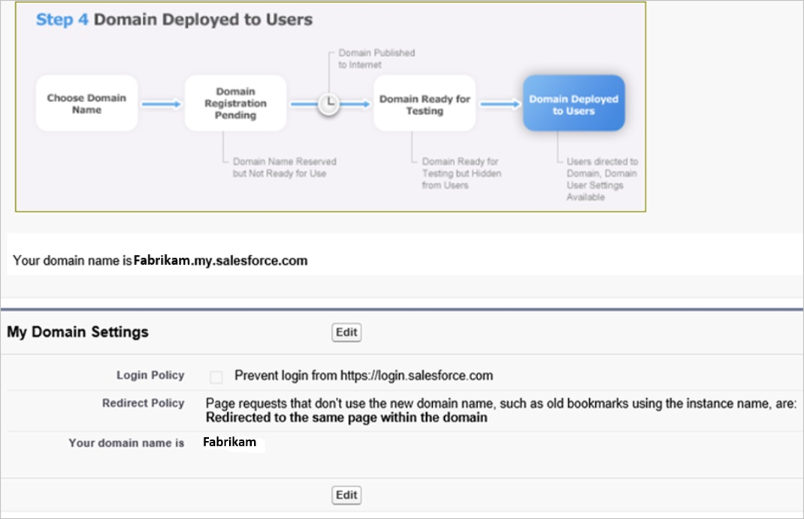

5.  在不同的網頁瀏覽器視窗中，您 Azure 傳統入口網站登入。

6.  在 [ **Work.com**應用程式整合] 頁面中，按一下 [**設定單一登入**以開啟 [**設定單一登入**] 對話方塊。

    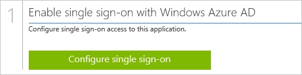

7.  在**您要如何登入 Work.com 的使用者**] 頁面上，選取**Microsoft Azure AD 單一登入**，然後按 [**下一步**。

    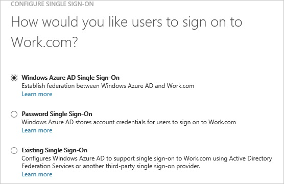

8.  **設定應用程式 URL**在頁面上， **Work.com 登入 URL** ] 文字方塊中，輸入您的使用者用來登入 Work.com 應用程式的 URL (例如: 「 *http://company.my.salesforce.com*」)，然後按一下 [**下一步**︰ 

    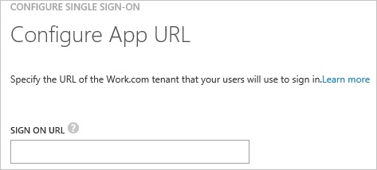

9.  在**設定單一登入 Work.com 在**頁面上，若要下載您的憑證，按一下 [**下載憑證**] 並儲存在本機電腦上的憑證檔案。

    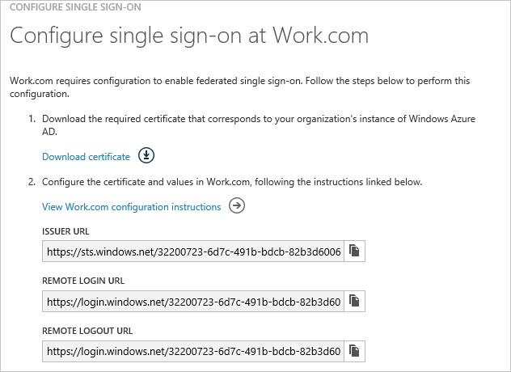

10. 登入您的 Work.com 租用戶。

11. 移至**設定**。

    

12. 展開 [**安全性控制**] 功能表，然後按一下 [**單一登入設定**。

    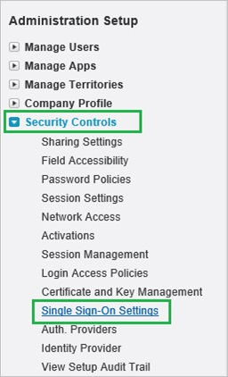

13. 單一登入] 對話方塊在**設定**頁面上，執行下列步驟︰

    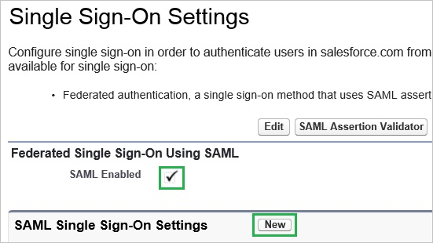

    1.  選取 [ **SAML 啟用**]。
    2.  按一下 [**新增**]。

14. 在 [ **SAML 單一登入設定**] 區段中，執行下列步驟︰

    

    1.  在 [**名稱**] 文字方塊中，輸入您的設定的名稱。  

        >[AZURE.NOTE] 提供值的**名稱**會自動填入 [ **API 名稱**] 文字方塊。

    2.  在 Azure 的傳統入口網站中**設定單一登入，Work.com** ] 對話方塊在頁面上，複製**簽發者 URL**的值，，然後再貼到 [**簽發者**] 文字方塊。
    3.  若要上傳下載的憑證，請按一下 [**瀏覽**]。
    4.  在**實體 Id** ] 文字方塊中輸入**https://salesforce-work.com**。
    5.  為**SAML 身分識別類型**，選取 [**判斷提示包含同盟 ID 從使用者物件**]。
    6.  為**SAML 身分識別的位置**，選取 [**身分識別 NameIdentfier 項目主旨陳述式中**。
    7.  在 Azure 的傳統入口網站中**設定單一登入，Work.com** ] 對話方塊在頁面上，複製 [**遠端登入 URL**的值，，然後再貼到 [**身分識別提供者登入 URL** ] 文字方塊。
    8.  在 Azure 的傳統入口網站中**設定單一登入，Work.com** ] 對話方塊在頁面上，複製 [**遠端登出 URL**的值，，然後再貼到 [**身分識別提供者登出 URL** ] 文字方塊。
    9.  為**服務提供者發起的租用戶要求繫結**、 選取 [ **HTTP 文章**]。
    10. 按一下 [**儲存**]。

15. 在您 Work.com 傳統入口網站中，在左側的功能窗格中，按一下 [**網域管理**] 以展開相關的區段中，，然後按一下以開啟 [**我的網域**] 頁面的 [**我的網域**。 

    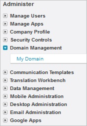

16. 在 [**我的網域**] 頁面中，在 [**登入頁面商標**] 區段中，按一下 [**編輯**]。

    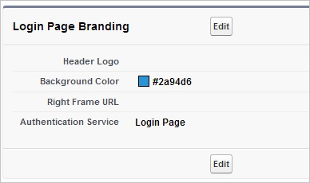

17. 在 [**登入頁面商標**] 頁面的 [**驗證服務**] 區段中，會顯示**SAML SSO 設定**您的名稱。 選取，然後再按一下 [**儲存**]。

    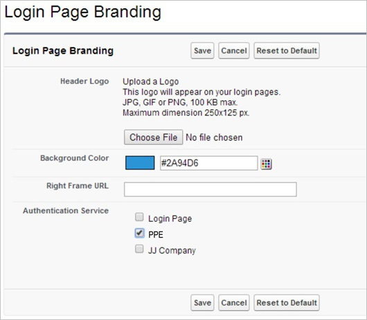

18. 在 Azure 傳統的入口網站中，選取單一登入設定確認，然後再按一下**完成**關閉 [**設定單一登入**] 對話方塊。

    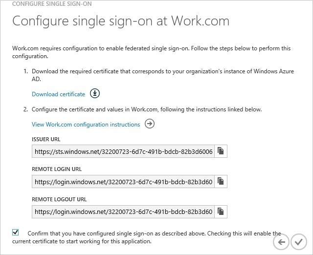

##設定使用者佈建
  
Azure Active Directory 使用者無法登入，他們必須提供給 Work.com。  
若是 Work.com，佈建是手動的工作。

###若要設定使用者佈建，執行下列步驟︰

1.  以系統管理員身分登入您 Work.com 公司的網站。

2.  移至**設定**。

    

3.  移至 [**管理使用者\>使用者**。

    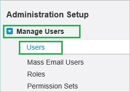

4.  按一下 [**新增使用者**]。

    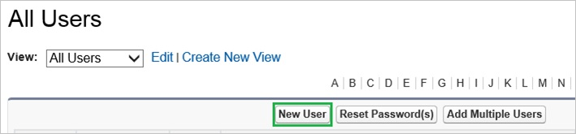

5.  在 [編輯使用者] 區段中，執行下列步驟︰

    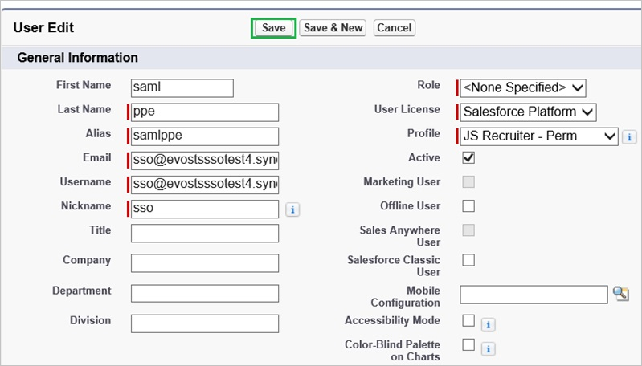

    1.  輸入**姓氏**、 **alias （別名）**、**電子郵件**、**使用者名稱**和有效的 Azure Active Directory 帳戶，您想要佈建到相關的文字方塊的**暱稱**屬性。
    2.  選取 [**角色**、**使用者授權**及**設定檔**]。
    3.  按一下 [**儲存**]。  

        >[AZURE.NOTE] Azure Active Directory 帳戶擁有者會收到電子郵件包含確認帳戶，再將其成為使用中的連結。

>[AZURE.NOTE] 您可以使用任何其他 Work.com 使用者帳戶建立工具或 Api 提供 Work.com 佈建 AAD 使用者帳戶。

##將使用者指派
  
若要測試您的設定，您需要授與 Azure AD 使用者您想要允許使用您的應用程式存取分派給他們。

###若要指定 Work.com 使用者，請執行下列步驟︰

1.  在 Azure 傳統入口網站中建立測試帳戶。

2.  Work.com 應用程式整合在頁面上，按一下 [**指派給使用者**。

    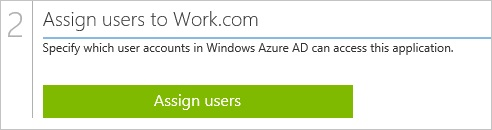

3.  選取您測試的使用者、**指派**，請按一下 [，然後按一下**[是]**以確認您的工作分派。

    ![[是]](./media/active-directory-saas-work-com-tutorial/IC767830.png "[是]")
  
您現在應該等待 10 分鐘的時間，並確認帳戶已同步處理至 Work.com.com。
  
如果您想要測試您的單一登入設定，開啟 [存取面板。 如需存取畫面的詳細資訊，請參閱[簡介存取面板](active-directory-saas-access-panel-introduction.md)。