<properties 
    pageTitle="教學課程︰ 針對輸入同步處理設定 Workday |Microsoft Azure" 
    description="瞭解如何使用的身分識別的資料來源的工作日的 Azure Active Directory。" 
    services="active-directory" 
    authors="MarkusVi"  
    documentationCenter="na" 
    manager="femila"/>
<tags 
    ms.service="active-directory" 
    ms.devlang="na" 
    ms.topic="article" 
    ms.tgt_pltfrm="na" 
    ms.workload="identity" 
    ms.date="10/10/2016" 
    ms.author="markvi" />

#教學課程︰ 設定工作日的連入同步處理

本教學課程中的目標是以顯示您所需執行 Workday 和 Azure AD 匯入 Azure AD 人員 Workday sharepoint 中的步驟。 

本教學課程中所述的案例假設您已經有下列項目︰

-   有效的 Azure AD 進階版訂閱
-   租用戶中 Workday
  
本教學課程中所述的案例是由下列建置組塊所組成︰

1. 啟用整合應用程式的工作日 

2. 建立整合系統使用者 

3. 建立安全性群組 

4. 指派整合系統使用者的安全性群組 

5. 設定安全性群組選項 

6. 啟動安全性原則變更 

7. Azure AD 中設定的使用者匯入 

##啟用整合應用程式的工作日
  
本節的目標是大綱如何啟用整合應用程式的工作日。

### 步驟︰

1.  Azure 傳統入口網站中，在左側的功能窗格中，按一下 [ **Active Directory**]。

    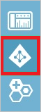

2.  從 [**目錄**] 清單中，選取您要啟用目錄整合的目錄。

3.  若要開啟 [應用程式] 檢視中，在 [目錄] 檢視中，按一下 [在上方的功能表中的 [**應用程式**]。

    

4.  按一下 [**新增**頁面的底部。

    

  
5. 在 [搜尋] 方塊中，輸入**Workday**。

    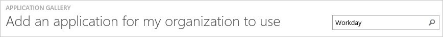

6. 在 [結果] 窗格中，選取工作日]，然後按一下新增應用程式完成。

    

## 建立整合系統使用者

### 步驟︰

1. 在 [ **Workday 工作**中，輸入建立使用者的搜尋方塊中，然後再按一下 [**建立整合系統的使用者**。 

    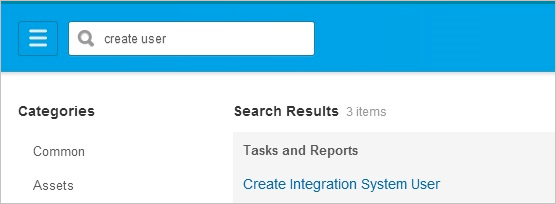

2. 完成**建立整合系統使用者**工作，為新的整合系統使用者提供使用者名稱和密碼。  將在下一個登入] 選項，需要的新密碼保留未選取，因為此使用者會被登入以程式設計方式。 讓它的預設值為 0，會防止使用者的工作階段逾時提前工作階段逾時分鐘數。 

    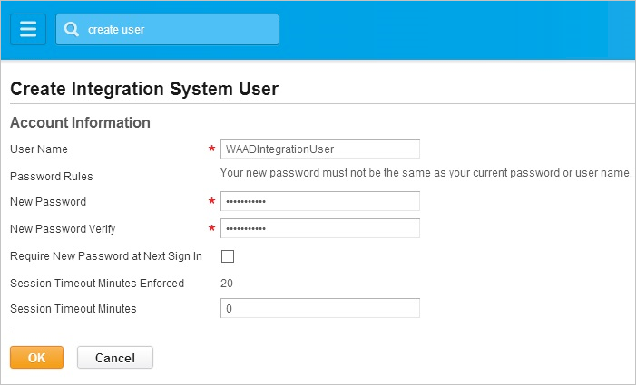
 

## 建立安全性群組

本教學課程中所述的案例中，您需要建立不受限制的整合系統安全性群組，並為其指派給使用者。

### 步驟︰

1. 輸入建立安全性群組的搜尋方塊中，然後再按一下 [**建立安全性群組**。 

    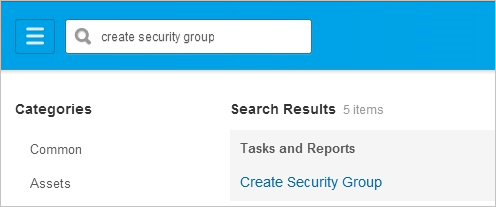
 

2. 完成建立安全性群組的工作。  選取 [整合系統安全性群組，受限制地從類型的 Tenanted 安全性群組] 下拉式清單中，若要建立或修改的群組成員會明確加入。 

    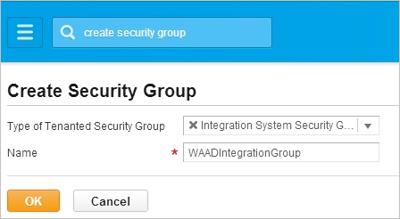
 

## 指派整合系統使用者的安全性群組

### 步驟︰

1. 在 [搜尋] 方塊中輸入編輯 [安全性] 群組，然後按一下 [**編輯安全性群組**。 

    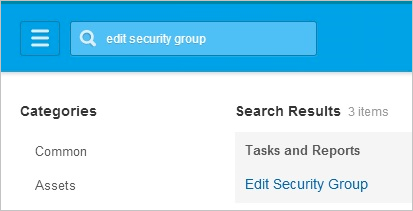
 
 

2. 搜尋，並選取新的整合安全性群組名稱。 

    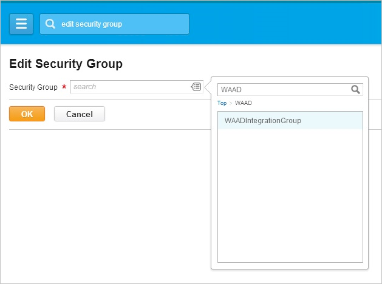

 

3. 新增新的整合系統使用者至新的安全性群組。 

    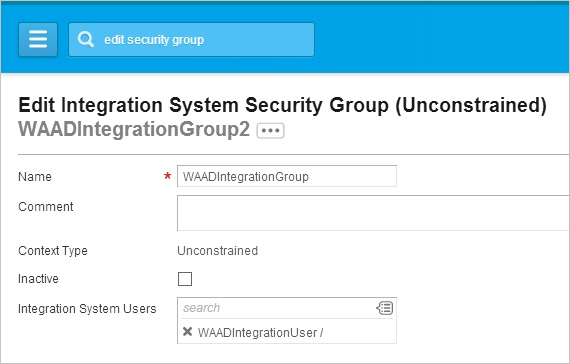  

## 設定安全性群組選項

在此步驟中，您授與給新的安全性群組權限為下列的網域安全性原則受保護的物件上**取得**，並**將**作業︰

- 外部帳戶佈建

- 背景工作資料︰ 公用工作報表

- 背景工作資料︰ 所有位置

- 專業人員的資訊工作者資料︰ 目前

- 在背景工作設定檔的工作者資料︰ 商務標題

 
### 步驟︰

1. 在 [搜尋] 方塊中輸入網域安全性原則，然後按一下連結，也就是網域安全性原則功能區上的。  

    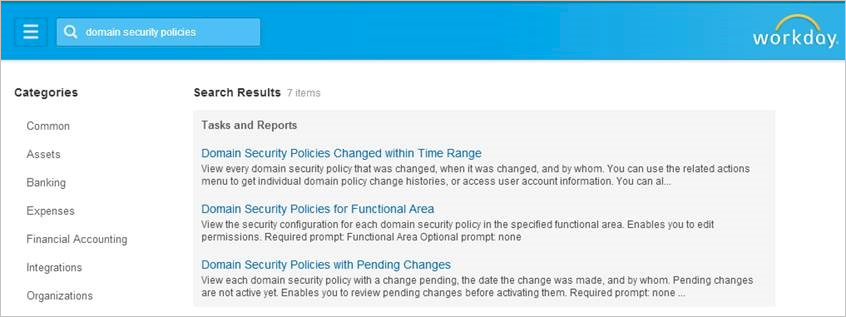  
 

2. 搜尋系統，並選取 [**系統**的功能區。  按一下**[確定]**。  

    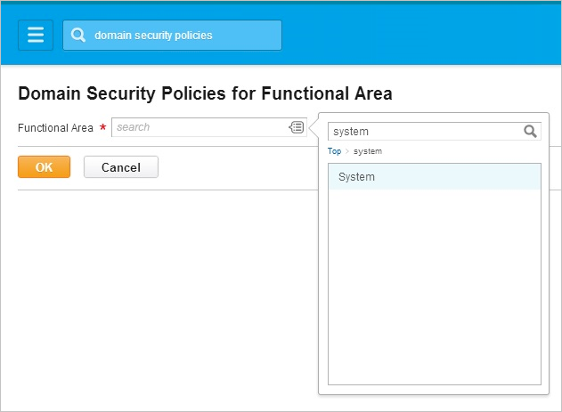  

3. 在清單中的 [系統] 功能區域的安全性原則，展開安全性管理並選取網域安全性原則，外部帳戶佈建。  

    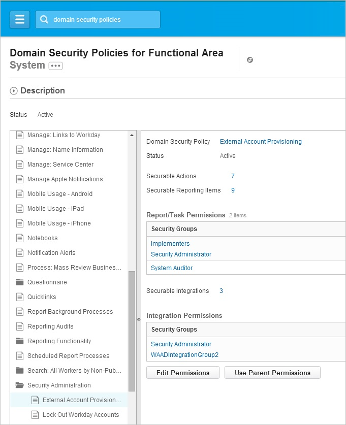  

4. 按一下 [**編輯權限**]，然後**編輯權限**] 對話方塊在頁面上，將新的安全性群組新增至安全性群組，以**取得**，並**將**整合權限的清單。 

    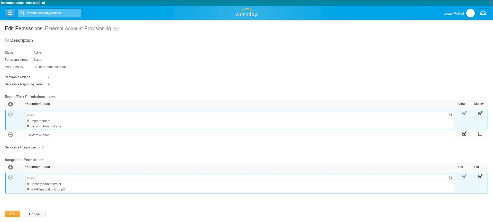  

 

5. 重複上述步驟 1，返回 [選取功能區，畫面並這次請搜尋人員，選取 [Staffing 功能] 區域中，按一下**[確定**]。

    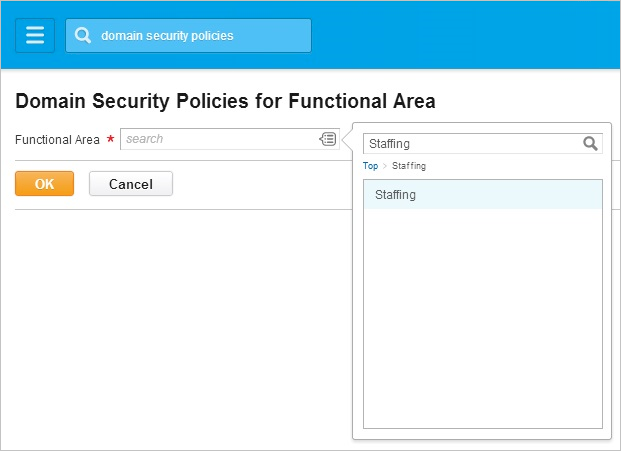  
 

6. 在清單中的 Staffing 功能區域的安全性原則，展開 [背景工作資料︰ Staffing，然後重複步驟 4 上方，每個剩餘安全性原則︰

     - 背景工作資料︰ 公用工作報表

     - 背景工作資料︰ 所有位置

     - 專業人員的資訊工作者資料︰ 目前

     - 在背景工作設定檔的工作者資料︰ 商務標題

    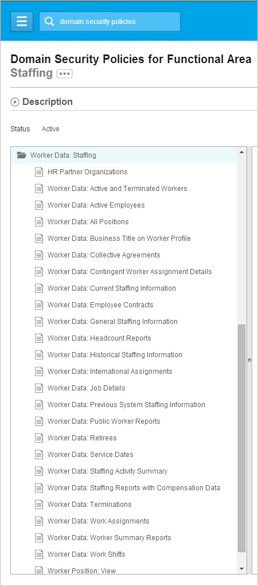  

## 啟動安全性原則變更

### 步驟︰

1. 輸入啟動 [搜尋] 方塊中，然後按一下 [連結，啟動擱置的安全性原則變更。 

    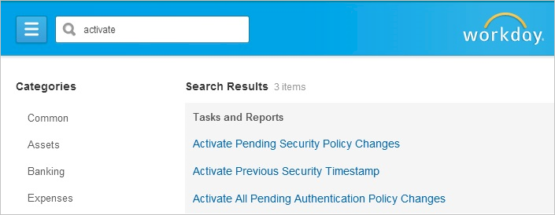 
 

2. 輸入註解稽核作業，以開始啟動擱置的安全性原則變更任務，然後按一下**[確定]**。 

    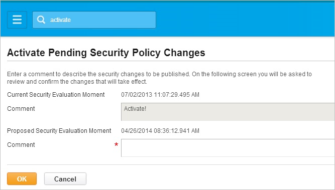   
 

3. 完成下一個畫面上的工作，請核取 [標示為確認，核取方塊，然後按一下**[確定]**。 

    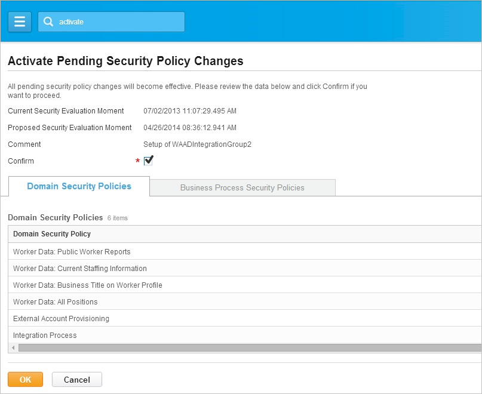  

## Azure AD 中設定的使用者匯入

本節的目標是大綱如何設定 Azure AD 從 Workday 匯入的人員。

### 步驟︰

1. **Workday**應用程式整合在頁面上，按一下 [開啟 [**設定佈建**] 對話方塊的 [**設定使用者匯入**。

2. 在**設定及管理認證**] 頁面上，執行下列步驟，然後再按 [**下一步**︰ 

    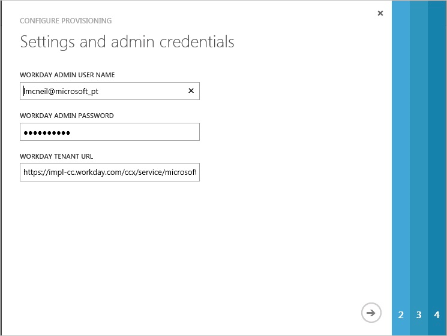  
 
    。 在 [Workday 管理員使用者名稱] 文字方塊中，輸入您建立中所建立的使用者名稱整合系統使用者] 區段。

    b。 在 [Workday 管理員密碼] 文字方塊中，輸入您在建立使用者的密碼整合系統使用者] 區段。

    c。 在 [Workday 租用戶 URL] 文字方塊中輸入 URL 或 Workday 租用戶。

3. 在**[測試連線]**頁面上，按一下 [**開始測試**確認連線，然後按 [**下一步**。 

    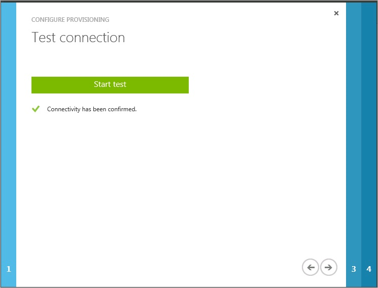  
 

4. 在 [**提供**] 選項頁面中，按一下 [**下一步**]。 

    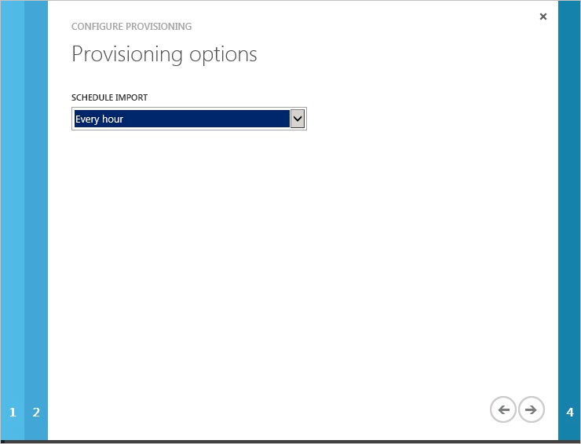

5. 在 [**開始佈建**] 對話方塊中，按一下 [**完成**]。 

    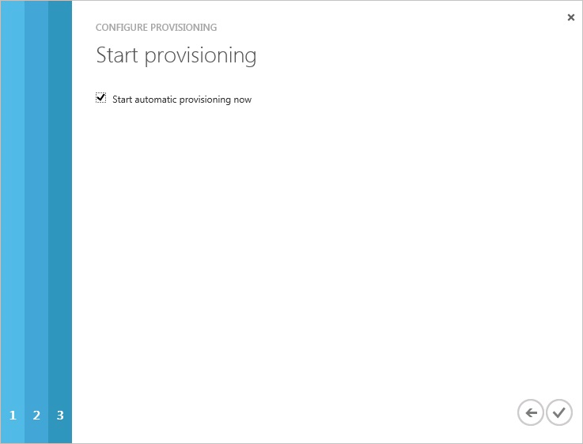
 

您現在可以移至 [**使用者**] 區段，並檢查是否已匯入您 Workday 使用者。

## 其他資源

* [如何與 Azure Active Directory 整合 SaaS 應用程式的教學課程的清單](active-directory-saas-tutorial-list.md)
* [什麼是應用程式存取和單一登入與 Azure Active Directory？](active-directory-appssoaccess-whatis.md)
