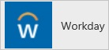
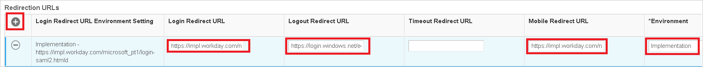

<properties 
    pageTitle="教學課程︰ Azure Active Directory 整合 Workday |Microsoft Azure" 
    description="瞭解如何使用 Azure Active Directory 中的工作日，來啟用單一登入、 自動化佈建和更多 ！。" 
    services="active-directory" 
    authors="jeevansd"  
    documentationCenter="na" 
    manager="femila"/>
<tags 
    ms.service="active-directory" 
    ms.devlang="na" 
    ms.topic="article" 
    ms.tgt_pltfrm="na" 
    ms.workload="identity" 
    ms.date="09/09/2016" 
    ms.author="jeedes" />

#教學課程︰ 使用 Workday 的 Azure Active Directory 整合
  
本教學課程中的目標是以顯示 Azure 和 Workday 的整合。 本教學課程中所述的案例假設您已經有下列項目︰

-   有效的 Azure 訂閱
-   租用戶中 Workday
  
本教學課程中所述的案例是由下列建置組塊所組成︰

1.  啟用整合應用程式的工作日
2.  設定單一登入
3.  設定使用者佈建
4.  設定使用者佈建

##啟用整合應用程式的工作日
  
本節的目標是大綱如何啟用的 Salesforce 整合應用程式。

###若要啟用整合應用程式的工作日，請執行下列步驟︰

1.  Azure 傳統入口網站中，在左側的功能窗格中，按一下 [ **Active Directory**]。

    

2.  從 [**目錄**] 清單中，選取您要啟用目錄整合的目錄。

3.  若要開啟 [應用程式] 檢視中，在 [目錄] 檢視中，按一下 [在上方的功能表中的 [**應用程式**]。

    

4.  若要開啟**應用程式組件庫**，請按一下 [**新增應用程式**]，，，然後按一下 [**新增我的組織使用的應用程式**。

    

5.  在**搜尋] 方塊**中，輸入**Workday**。

    

6.  在 [結果] 窗格中，選取**工作日**，，然後按一下要新增應用程式**完成**。

    

##設定單一登入
  
本節的目標是大綱如何啟用使用者進行驗證其帳戶中使用根據 SAML 通訊協定的同盟 Azure AD Workday。  
此程序的一部分，您所需建立 64 基本編碼的憑證。  
如果您不熟悉這個程序，請參閱[如何將轉換成文字檔的二進位憑證](http://youtu.be/PlgrzUZ-Y1o)。

###若要設定單一登入，請執行下列步驟︰

1.  在 [ **Workday**應用程式整合] 頁面中，按一下 [**設定單一登入**以開啟 [**設定單一登入**] 對話方塊。

    

2.  在**您要如何登入 Workday 的使用者**] 頁面上，選取**Microsoft Azure AD 單一登入**，然後按 [**下一步**。

    

3.  在 [**設定應用程式 URL** ] 頁面中，執行下列步驟，，然後按 [**下一步**。

    

    。 在 [**登入 URL** ] 文字方塊中，輸入您的使用者用來登入 Workday 使用下列模式的 URL:`https://impl.workday.com/<tenant>/login-saml2.htmld`

    b。  在 [ **Workday 回覆 URL** ] 文字方塊中輸入的 Workday 回覆 URL 使用下列模式︰`https://impl.workday.com/<tenant>/login-saml.htmld`

    >[AZURE.NOTE]您的回覆 URL 必須有子網域 (例如︰ www，wd2，wd3，wd3 impl wd5、 wd5 impl)。 
    >使用類似 「*http://www.myworkday.com*」 運作，但不會 「*http://myworkday.com*」。 
 
4.  在**設定單一登入 Workday 在**頁面上，若要下載您的憑證，按一下 [**下載憑證**] 並儲存在您的電腦上的憑證檔案。

    

5.  在不同的網頁瀏覽器視窗中，以系統管理員身分登入您 Workday 公司的網站。

6.  移至 [**功能表\>工作**。

    

7.  移至 [**帳號管理**。

    

8.  移至**編輯租用戶設定 – 安全性**。

    

9.  在 [**重新導向 Url** ] 區段中，執行下列步驟︰

    

    。 按一下 [**新增列**]。

    b。 在 [**登入重新導向 URL** ] 文字方塊和**行動電話重新導向 URL** ] 文字方塊中，輸入您所輸入的**設定應用程式 URL** Azure 傳統入口網站頁面的**工作日租用戶 URL** 。
    
    c。 在 Azure 傳統入口網站中，**設定單一登入，Workday** ] 對話方塊在頁面上，複製**單一 Sign-Out 服務的 URL**，然後再貼到 [**登出重新導向 URL** ] 文字方塊。

    d。  在**環境**] 文字方塊中輸入環境名稱。  

    >[AZURE.NOTE] 繫結值的租用戶 URL 環境屬性的值︰
    >
    >-   如果 Workday 租用戶的網域名稱的 URL 第一句 impl (例如︰ *https://impl.workday.com/\<租用戶\>/login-saml2.htmld*)，**環境**屬性必須設定為 [實作。
    >-   如果網域名稱的其他項目，您需要連絡以取得的相符的**環境**值的工作日。

10. 在 [ **SAML 安裝程式**] 區段中，執行下列步驟︰

    

    。  選取 [**啟用 SAML 驗證**。

    b。  按一下 [**新增列**]。

11. 在 [SAML 身分識別提供者] 區段中，執行下列步驟︰

    

    。 在 [身分識別提供者名稱] 文字方塊中，輸入 [提供者名稱 (例如︰ *SPInitiatedSSO*)。

    b。 Azure 傳統入口網站，在 [**設定單一登入，Workday**對話方塊] 頁面中的**身分識別提供者識別碼**值，複製，然後再貼到 [**簽發者**] 文字方塊。

    c。 選取 [**啟用 Workday Initialted 登出**。

    d。 在 Azure 的傳統入口網站中**設定單一登入在 Workday** ] 對話方塊在頁面上，複製 [**單一 Sign-Out 服務 URL**的值，，然後再貼到 [**登出要求 URL** ] 文字方塊。

    e。 按一下 [**身分識別提供者公用金鑰憑證**]，然後按一下 [**建立**。 

    

    f。 按一下 [**建立 x509 公開金鑰**。 
        
    

1. 在 [**檢視 x509 公開金鑰**] 區段中，執行下列步驟︰ 

     

    。 在 [**名稱**] 文字方塊中，輸入您的憑證的名稱 (例如︰ *PPE\_預存程序*)。
        
    b。 在**有效的**文字方塊中輸入有效的從您的憑證的屬性值。
    
    c。  在 [**有效**] 文字方塊中，輸入有效的憑證的屬性值。
        
    >[AZURE.NOTE] 您可以取得有效的日期和有效日期下載憑證連按兩下。 日期會列在 [**詳細資料**] 索引標籤。

    d。 建立**64 基本編碼**檔案從您下載的憑證。  

    >[AZURE.TIP] 如需詳細資訊，請參閱[如何轉換成文字檔的二進位憑證](http://youtu.be/PlgrzUZ-Y1o)

    e。  在 [記事本] 中開啟您 64 基本編碼的憑證，然後複製 [其內容。
    
    f。  在 [**憑證**] 文字方塊中貼上剪貼簿的內容。
    
    g。  按一下**[確定]**。

12.  執行下列步驟︰ 

    

    。  啟用**x509 私密金鑰對**。

    b。  在 [**服務提供者 ID** ] 文字方塊中，輸入**http://www.workday.com**。

    c。  選取 [**啟用 SP 發起的租用戶 SAML 驗證**]。

    d。  在 Azure 的傳統入口網站中**設定單一登入，Workday** ] 對話方塊在頁面上，複製 [**單一登入服務 URL**的值，，然後再貼到 [ **IdP SSO 服務 URL** ] 文字方塊。
     
    e。 選取 [**不上平凹預存程序啟動驗證要求**]。

    f。 **驗證要求簽章方法**，請選取 [ **SHA256**]。 
        
     
 
    g。 按一下**[確定]**。 
        
    

12. Azure 傳統入口網站中，在**設定單一登入 Workday 在**頁面上，按一下 [**下一步**]。 

    

13. 在**單一登入確認**] 頁面上，按一下 [**完成**]。 

    

##設定使用者佈建
  
若要取得測試使用者將 Workday 佈建後，您需要連絡 Workday 支援小組。  
Workday 支援小組會為您建立使用者。

##將使用者指派
  
若要測試您的設定，您需要授與 Azure AD 使用者您想要允許使用您的應用程式存取分派給他們。

###若要指定工作日的使用者，請執行下列步驟︰

1.  在 Azure 傳統入口網站中建立測試帳戶。

2.  **Workday**應用程式整合在頁面上，按一下 [**指派給使用者**。

    

3.  選取您測試的使用者、**指派**，請按一下 [，然後按一下**[是]**以確認您的工作分派。

    ![[是]](./media/active-directory-saas-workday-tutorial/IC767830.png "[是]")
  
如果您想要測試您的單一登入設定，開啟 [存取面板。 如需存取畫面的詳細資訊，請參閱[簡介存取面板](active-directory-saas-access-panel-introduction.md)。