<properties 
    pageTitle="教學課程︰ Azure Active Directory 與整合 xMatters 視需要 |Microsoft Azure"
    description="瞭解如何使用 xMatters 視需要與 Azure Active Directory 啟用單一登入、 自動化佈建和更多 ！" 
    services="active-directory" 
    authors="jeevansd"  
    documentationCenter="na" 
    manager="femila"/>
<tags 
    ms.service="active-directory" 
    ms.devlang="na" 
    ms.topic="article" 
    ms.tgt_pltfrm="na" 
    ms.workload="identity" 
    ms.date="09/09/2016" 
    ms.author="jeedes" />

#教學課程︰ Azure Active Directory 與整合 xMatters 視需要
  
本教學課程中的目標是以顯示 Azure 和 xMatters 視需要的整合。 本教學課程中所述的案例假設您已經有下列項目︰

-   有效的 Azure 訂閱
-   XMatters 視需要租用戶
  
完成後本教學課程中，您指派給 xMatters 視需要 Azure AD 使用者將能夠單一登入 xMatters 視需要公司網站 （服務提供者發起的租用戶登入），或使用[[存取面板簡介](active-directory-saas-access-panel-introduction.md)應用程式。
  
本教學課程中所述的案例是由下列建置組塊所組成︰

1.  啟用 xMatters 視需要的應用程式整合
2.  設定單一登入
3.  設定使用者佈建
4.  將使用者指派

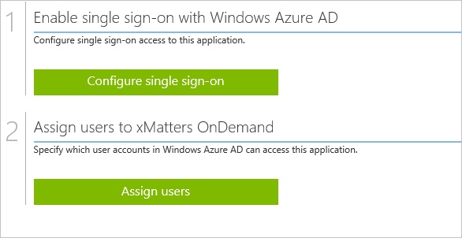

##啟用 xMatters 視需要的應用程式整合
  
本節的目標是大綱如何啟用 xMatters 視需要的應用程式整合。

###若要讓應用程式適用於整合 xMatters 視需要，請執行下列步驟︰

1.  Azure 傳統入口網站中，在左側的功能窗格中，按一下 [ **Active Directory**]。

    

2.  從 [**目錄**] 清單中，選取您要啟用目錄整合的目錄。

3.  若要開啟 [應用程式] 檢視中，在 [目錄] 檢視中，按一下 [在上方的功能表中的 [**應用程式**]。

    

4.  按一下 [**新增**頁面的底部。

    

5.  在 [**您想要做什麼**] 對話方塊中，按一下 [**新增應用程式，從圖庫**。

    

6.  在**搜尋] 方塊**中，輸入**xMatters 視需要**。

    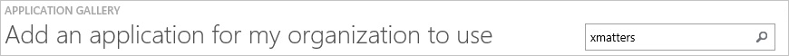

7.  在 [結果] 窗格中，選取**XMatters 視需要**，，然後按一下要新增應用程式**完成**。

    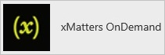

##設定單一登入
  
本節的目標是大綱如何啟用使用者進行驗證其帳戶中使用根據 SAML 通訊協定的同盟 Azure AD XMatters 視需要。

###若要設定單一登入，請執行下列步驟︰

1.  在 Azure 的傳統入口網站， **XMatters 視需要**應用程式整合在頁面上，按一下 [**設定單一登入**以開啟 [**設定單一登入**] 對話方塊。

    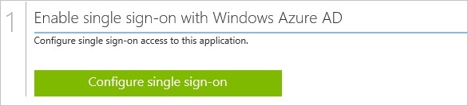

2.  在**您要如何登入 XMatters 視需要的使用者**] 頁面上，選取**Microsoft Azure AD 單一登入**，然後按 [**下一步**。

    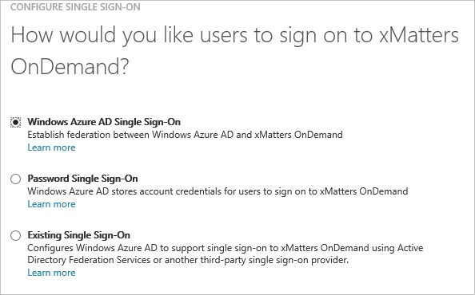

3.  **設定應用程式 URL**在頁面上，執行下列步驟︰

    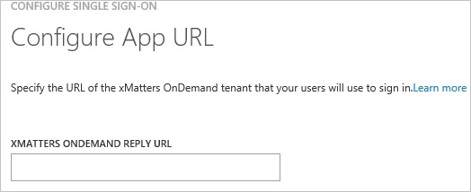

    。 在 [ **XMatters 視需要登入 URL** ] 文字方塊中，輸入您使用下列模式的 URL:`https://<tenant-name>.XMattersOnDemandapp.com`

    b。 按一下 [**下一步**]。

4.  在**設定單一登入 XMatters 視需要在**頁面上，若要下載您的憑證，按一下**下載憑證**]，然後憑證檔案儲存至本機為**c:\\XMatters OnDemand.cer**。

    >[AZURE.IMPORTANT] 您要轉寄給 xMatters 支援小組的憑證。 憑證需要單一登入設定完成程序之前上傳 xMatters 支援小組。

    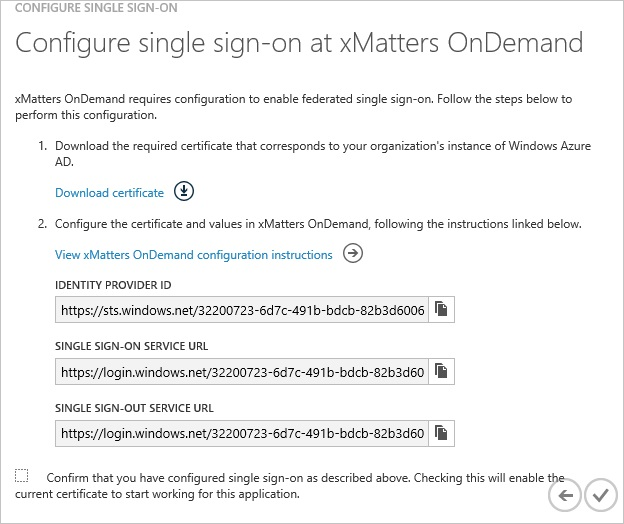

5.  在不同的網頁瀏覽器視窗中，以系統管理員身分登入您 XMatters 視需要公司的網站。

6.  在頂端的 [工具列] 按一下 [**管理員**] 下，，然後按一下**公司的詳細資料**在左側導覽列中。

    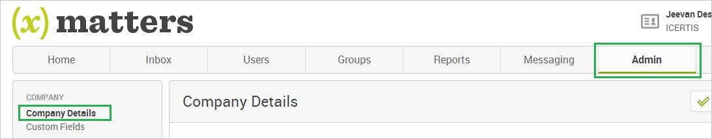

7.  在 [ **SAML 設定**] 頁面上執行下列步驟︰

    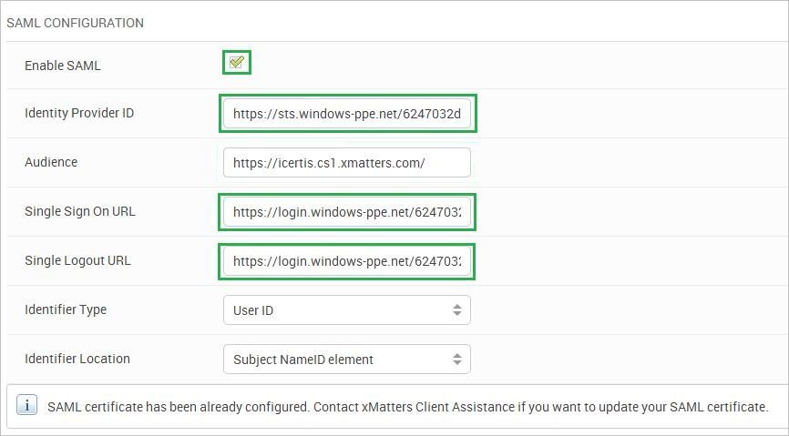

    1.  選取 [**啟用 SAML**。
    2.  Azure 傳統入口網站，在 [**設定單一登入 XMatters 視需要在**對話方塊] 頁面中的**身分識別提供者識別碼**值，複製，然後再貼到 [**身分識別提供者 ID** ] 文字方塊。
    3.  Azure 傳統入口網站，在 [**設定單一登入 XMatters 視需要在**對話方塊] 頁面中的**單一登入服務 URL**值，複製，然後再貼到**單一登入 URL** ] 文字方塊。
    4.  在 Azure 的傳統入口網站中**設定單一登入 XMatters 視需要在**對話方塊在頁面上，複製 [**單一 Sign-Out 服務 URL**的值，，然後再貼到**單一登出 URL** ] 文字方塊。
    5.  在公司的詳細資料頁面上，在頂端，按一下 [**儲存變更**。
        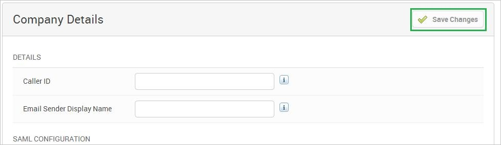

8.  在 Azure 傳統的入口網站中，選取單一登入設定確認，然後再按一下**完成**關閉 [**設定單一登入**] 對話方塊。

    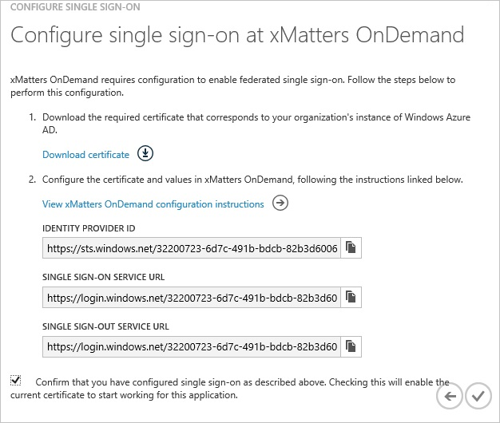

##設定使用者佈建
  
若要啟用 Azure AD 使用者登入 XMatters 視需要，請他們必須提供 XMatters 視需要將。  
若是 XMatters 視需要，佈建是手動的工作。

###佈建使用者帳戶，請執行下列步驟︰

1.  登入您的**XMatters 視需要**租用戶。

2.  按一下 [**使用者**] 索引標籤。

3.  按一下 [**新增使用者**]。

    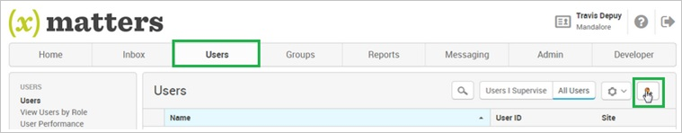

4.  選取 [**作用中**]。

5.  在 [**新增使用者**] 區段中，執行下列步驟︰

    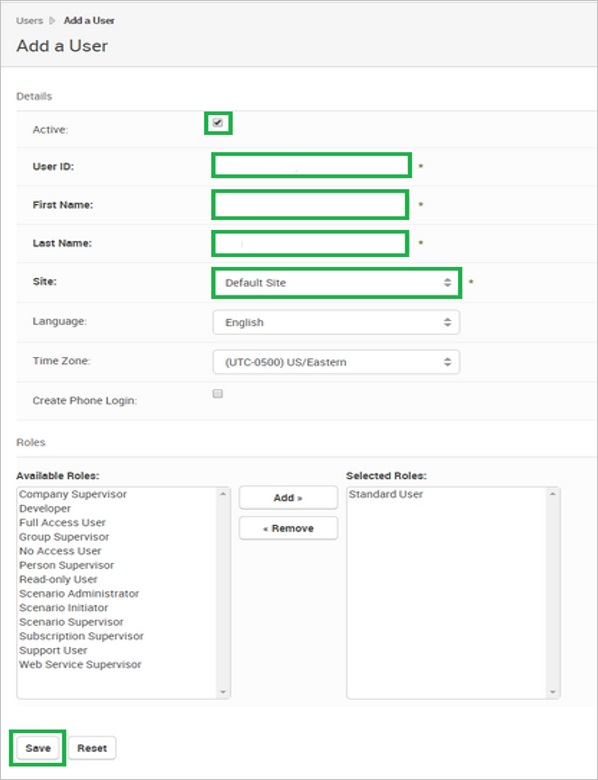

    1.  輸入**使用者識別碼**、**名字**、**姓氏**、 您想要佈建有效 AAD 帳戶的**網站**。
    2.  按一下 [**儲存**]。

>[AZURE.NOTE] 您可以使用任何其他 XMatters 視需要使用者帳戶建立工具或 Api 提供 XMatters 視需要佈建 AAD 使用者帳戶。

##將使用者指派
  
若要測試您的設定，您需要授與 Azure AD 使用者想要允許使用您的應用程式存取分派給他們。

###若要指定 XMatters 視需要使用者，請執行下列步驟︰

1.  在 Azure 傳統入口網站中建立測試帳戶。

2.  **XMatters 視需要**應用程式整合在頁面上，按一下 [**指派給使用者**。

    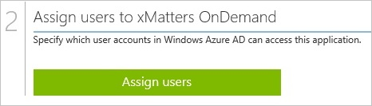

3.  選取您測試的使用者、**指派**，請按一下 [，然後按一下**[是]**以確認您的工作分派。

    ![[是]](./media/active-directory-saas-xmatters-ondemand-tutorial/IC767830.png "[是]")
  
如果您想要測試您的單一登入設定，開啟 [存取面板。 如需存取畫面的詳細資訊，請參閱[簡介存取面板](active-directory-saas-access-panel-introduction.md)。