<properties 
    pageTitle="教學課程︰ 使用縮放的 Azure Active Directory 整合 |Microsoft Azure" 
    description="瞭解如何使用 Azure Active Directory 中的縮放，若要啟用單一登入、 自動化佈建和更多 ！。" 
    services="active-directory" 
    authors="jeevansd"  
    documentationCenter="na" 
    manager="femila"/>
<tags 
    ms.service="active-directory" 
    ms.devlang="na" 
    ms.topic="article" 
    ms.tgt_pltfrm="na" 
    ms.workload="identity" 
    ms.date="08/16/2016" 
    ms.author="jeedes" />

#教學課程︰ 使用縮放的 Azure Active Directory 整合
  
本教學課程中的目標是以顯示 Azure 和縮放的整合。  
本教學課程中所述的案例假設您已經有下列項目︰

-   有效的 Azure 訂閱
-   縮放租用戶
  
完成後本教學課程中，您已指派到縮放 Azure AD 使用者將能夠單一的登入您的縮放公司網站 （服務提供者發起的租用戶登入），或使用[[存取面板簡介](active-directory-saas-access-panel-introduction.md)的應用程式
  
本教學課程中所述的案例是由下列建置組塊所組成︰

1.  啟用整合應用程式的顯示比例
2.  設定單一登入
3.  設定使用者佈建
4.  將使用者指派

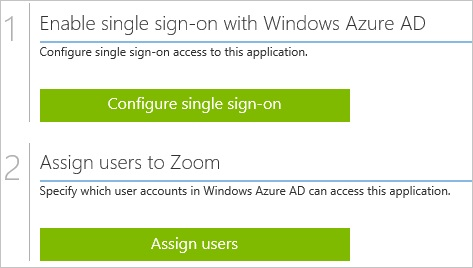

##啟用應用程式適用於整合縮放
  
本節的目標是大綱如何啟用應用程式適用於整合縮放。

###若要啟用的縮放整合應用程式，請執行下列步驟︰

1.  Azure 傳統入口網站中，在左側的功能窗格中，按一下 [ **Active Directory**]。

    

2.  從 [**目錄**] 清單中，選取您要啟用目錄整合的目錄。

3.  若要開啟 [應用程式] 檢視中，在 [目錄] 檢視中，按一下 [在上方的功能表中的 [**應用程式**]。

    

4.  按一下 [**新增**頁面的底部。

    

5.  在 [**您想要做什麼**] 對話方塊中，按一下 [**新增應用程式，從圖庫**。

    

6.  在**搜尋] 方塊**中，輸入**縮放**。

    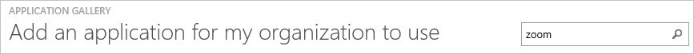

7.  在 [結果] 窗格中，選取 [**顯示比例**]，然後按一下**完成**新增應用程式。

    

##設定單一登入
  
本節的目標是大綱如何啟用使用者進行驗證其帳戶中使用根據 SAML 通訊協定的同盟 Azure AD 縮放。  
此程序的一部分，您所需建立 64 基本編碼的憑證檔案。  
如果您不熟悉這個程序，請參閱[如何將轉換成文字檔的二進位憑證](http://youtu.be/PlgrzUZ-Y1o)。

###若要設定單一登入，請執行下列步驟︰

1.  在 Azure 的傳統入口網站，**縮放**應用程式整合在頁面上，按一下 [**設定單一登入**以開啟 [**設定單一登入**] 對話方塊。

    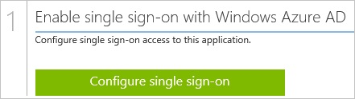

2.  **如何將您想要縮放登入的使用者**] 頁面上選取**Microsoft Azure AD 單一登入**，然後按 [**下一步**。

    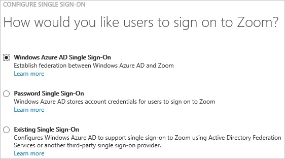

3.  **設定應用程式 URL**在頁面上，在 [**縮放登入 URL** ] 文字方塊中，輸入您使用下列模式 」*http://company.zoom.us*」 的 URL，然後再按 [**下一步**。

    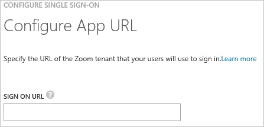

4.  在**設定單一登入縮放在**頁面上，按一下**下載憑證**]，然後儲存您的電腦上的憑證檔案。

    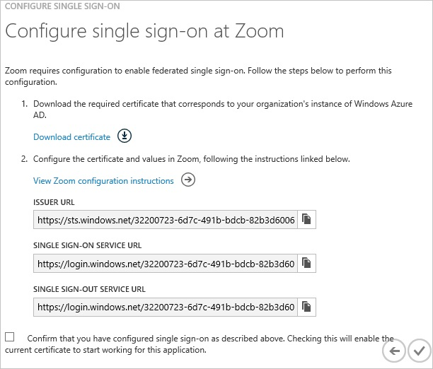

5.  在不同的網頁瀏覽器視窗中，以系統管理員身分登入您的縮放公司網站。

6.  按一下 [**單一登入**] 索引標籤。

    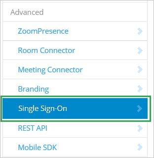

7.  按一下 [**安全性控制**] 索引標籤，然後移至 [**單一登入**] 設定。

8.  在單一登入] 區段中，執行下列步驟︰

    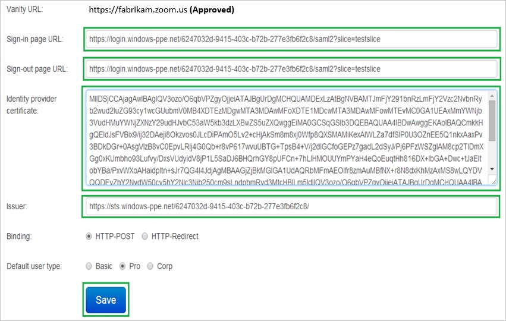

    1.  在 Azure 的傳統入口網站中**設定單一登入在 [顯示比例**] 對話方塊在頁面上，將**單一登入服務 URL**值，複製，然後再貼到 [**登入頁面的 URL** ] 文字方塊。
    2.  在 Azure 的傳統入口網站中**設定單一登入在 [顯示比例**] 對話方塊在頁面上，將**單一 Sign-Out 服務 URL**值，複製，然後再貼到 [**教具借出頁面的 URL** ] 文字方塊。
    3.  建立**64 基本編碼**檔案從您下載的憑證。  

        >[AZURE.TIP] 如需詳細資訊，請參閱[如何轉換成文字檔的二進位憑證](http://youtu.be/PlgrzUZ-Y1o)

    4.  在記事本中開啟您 64 基本編碼的憑證，將其內容複製到剪貼簿，然後將其貼到**身分識別提供者的憑證**文字方塊
    5.  在 Azure 的傳統入口網站中**設定單一登入在 [顯示比例**] 對話方塊在頁面上，將**發行者 URL**值，複製，然後再貼到 [**簽發者**] 文字方塊。
    6.  按一下 [**儲存**]。

9.  在 Azure 傳統的入口網站中，選取單一登入設定確認，然後再按一下**完成**關閉 [**設定單一登入**] 對話方塊。

    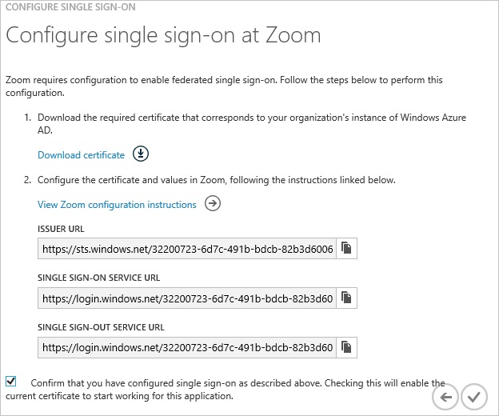

##設定使用者佈建
  
若要啟用 Azure AD 使用者登入縮放，他們必須提供將縮放。  
顯示比例]，若是佈建是手動的工作。

###佈建使用者帳戶，請執行下列步驟︰

1.  以系統管理員身分登入您的 [**顯示比例**的公司網站。

2.  按一下 [**管理帳戶**] 索引標籤，然後按一下 [**管理使用者**。

3.  在 [使用者管理] 區段中，按一下 [**新增使用者**]。

    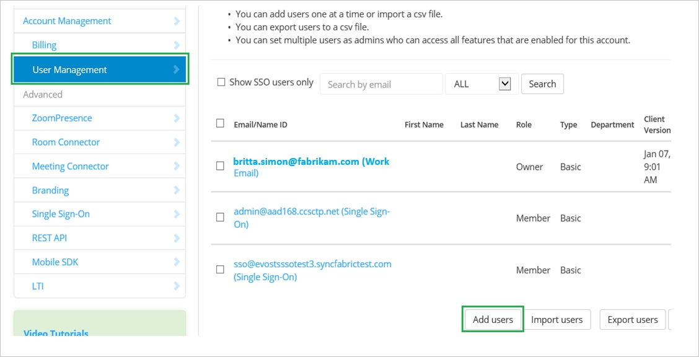

4.  在 [**新增使用者**] 頁面上執行下列步驟︰

    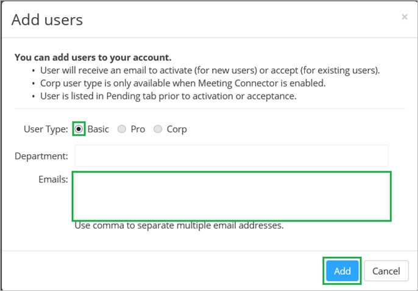

    1.  為**使用者類型**，選取 [**基本**]。
    2.  在 [**電子郵件**] 文字方塊中，輸入您想要佈建有效 AAD 帳戶的電子郵件地址。
    3.  按一下 [**新增**]。

>[AZURE.NOTE] 您可以使用任何其他縮放使用者帳戶建立工具或縮放至佈建 AAD 所提供的 Api 使用者帳戶。

##將使用者指派
  
若要測試您的設定，您需要授與 Azure AD 使用者想要允許使用您的應用程式存取分派給他們。

###若要指定縮放使用者，請執行下列步驟︰

1.  在 Azure 傳統入口網站中建立測試帳戶。

2.  **縮放**應用程式整合在頁面上，按一下 [**指派給使用者**。

    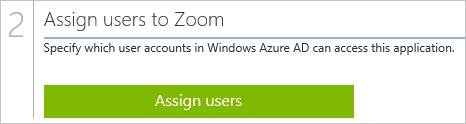

3.  選取您測試的使用者、**指派**，請按一下 [，然後按一下**[是]**以確認您的工作分派。

    ![[是]](./media/active-directory-saas-zoom-tutorial/IC767830.png "[是]")
  
如果您想要測試您的單一登入設定，開啟 [存取面板。 如需存取畫面的詳細資訊，請參閱[簡介存取面板](active-directory-saas-access-panel-introduction.md)。