<properties 
    pageTitle="教學課程︰ Azure Active Directory 整合 Zscaler |Microsoft Azure" 
    description="瞭解如何使用 Azure Active Directory 中的 Zscaler，若要啟用單一登入、 自動化佈建和更多 ！。" 
    services="active-directory" 
    authors="jeevansd"  
    documentationCenter="na" 
    manager="femila"/>
<tags 
    ms.service="active-directory" 
    ms.devlang="na" 
    ms.topic="article" 
    ms.tgt_pltfrm="na" 
    ms.workload="identity" 
    ms.date="08/16/2016" 
    ms.author="jeedes" />

#教學課程︰ 使用 Zscaler 的 Azure Active Directory 整合
  
本教學課程中的目標是以顯示 Azure 和 Zscaler 的整合。 本教學課程中所述的案例假設您已經有下列項目︰

-   有效的 Azure 訂閱
-   在 [Zscaler 租用戶
  
本教學課程中所述的案例是由下列建置組塊所組成︰

1.  啟用 Zscaler 應用程式整合
2.  設定單一登入
3.  設定 proxy 設定
4.  設定使用者佈建
5.  將使用者指派

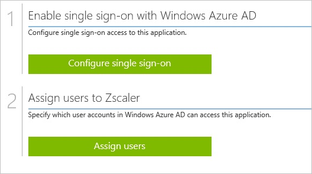

##啟用 Zscaler 應用程式整合
  
本節的目標是大綱如何啟用 Zscaler 的整合應用程式。

###若要啟用的 Zscaler 整合應用程式，請執行下列步驟︰

1.  Azure 傳統入口網站中，在左側的功能窗格中，按一下 [ **Active Directory**]。

    

2.  從 [**目錄**] 清單中，選取您要啟用目錄整合的目錄。

3.  若要開啟 [應用程式] 檢視中，在 [目錄] 檢視中，按一下 [在上方的功能表中的 [**應用程式**]。

    

4.  按一下 [**新增**頁面的底部。

    

5.  在 [**您想要做什麼**] 對話方塊中，按一下 [**新增應用程式，從圖庫**。

    

6.  在**搜尋] 方塊**中，輸入**Zscaler**。

    

7.  在 [結果] 窗格中，選取**Zscaler**，，然後按一下要新增應用程式**完成**。

    

##設定單一登入
  
本節的目標是大綱如何啟用使用者進行驗證其帳戶中使用根據 SAML 通訊協定的同盟 Azure AD Zscaler。  
此程序的一部分，您需要上傳至 Zscaler 的憑證。

###若要設定單一登入，請執行下列步驟︰

1.  在 Azure 的傳統入口網站， **Zscaler**應用程式整合在頁面上，按一下 [**設定單一登入**以開啟 [**設定單一登入**] 對話方塊。

    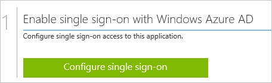

2.  在**您要如何登入 Zscaler 的使用者**] 頁面上，選取**Microsoft Azure AD 單一登入**，然後按 [**下一步**。

    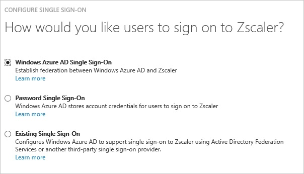

3.  **設定應用程式 URL**在頁面上，在 [ **Zscaler 登入 URL** ] 文字方塊中，輸入您的登從 Zscaler，取得的 url，然後按 [**下一步**︰ 

    >[AZURE.NOTE] 請如果您不知道您的登入的 URL 是什麼，連絡 Zscaler 支援小組。

    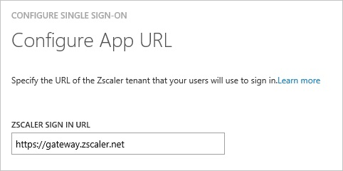

4.  在**設定單一登入 Zscaler 在**頁面上，執行下列步驟︰

    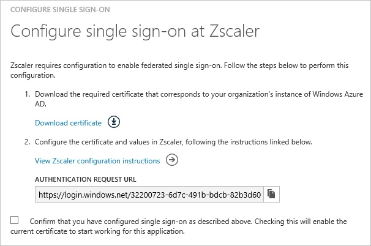

    1.  按一下 [**下載憑證**]，然後儲存本機憑證檔案作為**c:\\Zscaler.cer**。
    2.  **驗證要求 URL**複製到剪貼簿。

5.  登入您的 Zscaler 租用戶。

6.  在頂端的功能表，按一下 [**管理**]。

    

7.  按一下 [**管理管理員和角色**] 底下的 [**管理使用者與驗證**]。

    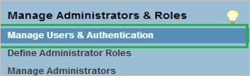

8.  在 [**選擇 [驗證] 選項為您的組織**] 區段中，執行下列步驟︰

    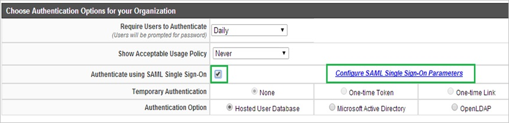

    1.  選取 [**驗證使用 SAML 單一登入**]。
    2.  按一下 [**設定 SAML 單一登入參數**。

9.  **設定 SAML 單一登入參數**] 對話方塊在頁面上，執行下列步驟，然後按 [**完成**︰

    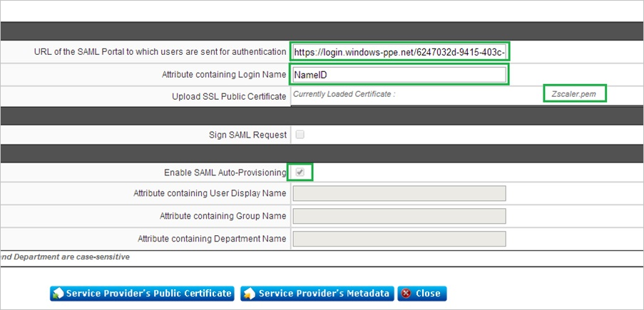

    1.  在 [**驗證使用者會傳送到 [SAML 入口網站的 URL** ] 文字方塊中貼上 [從 Azure 傳統入口網站的 [**驗證要求 URL** ] 欄位的值。
    2.  在 [**屬性包含登入名稱**] 文字方塊中輸入**NameID**。
    3.  在 [**上傳 SSL 公用憑證**] 欄位中上, 傳您已從 Azure 傳統入口網站下載的憑證。
    4.  選取 [**啟用 SAML 自動提供**。

10. **設定使用者驗證**] 對話方塊在頁面上，執行下列步驟︰

    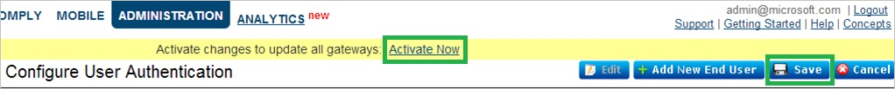

    1.  按一下 [**儲存**]。
    2.  按一下 [**立即啟用**]。

11. 在 Azure 傳統的入口網站中，選取單一登入設定確認，然後再按一下**完成**關閉 [**設定單一登入**] 對話方塊。

    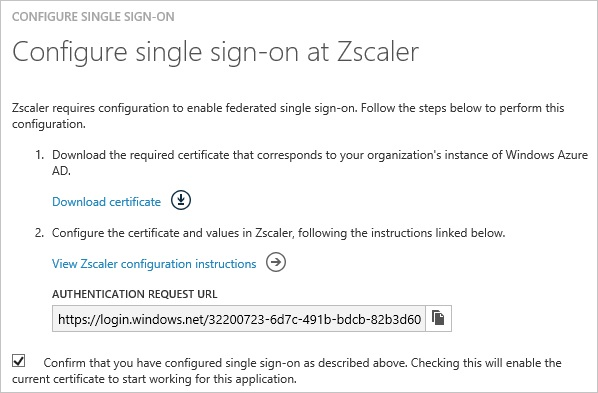

##設定 proxy 設定

###若要在 Internet Explorer 設定 proxy 設定

1.  啟動**Internet Explorer**。

2.  選取 [**網際網路選項**，以開啟 [**網際網路選項**] 對話方塊的 [**工具**] 功能表中。

    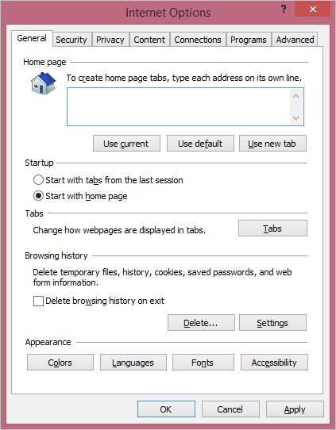

3.  按一下 [**連線**] 索引標籤。

    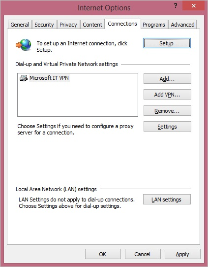

4.  按一下 [ **LAN 設定**]，以開啟 [ **LAN 設定**] 對話方塊。

5.  在 Proxy 伺服器] 區段中，執行下列步驟︰

    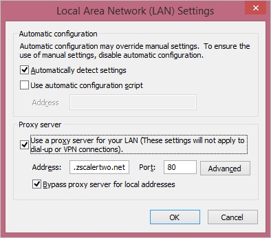

    1.  選取您的區域網路使用 proxy 伺服器。
    2.  在 [地址] 文字方塊中，輸入**gateway.zscalertwo.net**。
    3.  在 [連接埠] 文字方塊中，輸入**80**。
    4.  選取 [**不使用 proxy 伺服器本機的地址**]。
    5.  按一下**[確定**] 關閉 [**區域網路 (LAN) 設定**] 對話方塊。

6.  按一下**[確定**] 關閉 [**網際網路選項**] 對話方塊。

##設定使用者佈建
  
若要啟用 Azure AD 使用者登入 Zscaler，他們必須佈建到 Zscaler。  
若是 Zscaler，佈建是手動的工作。

###若要設定使用者佈建，執行下列步驟︰

1.  登入您的**Zscaler**租用戶。

2.  按一下 [**管理**]。

    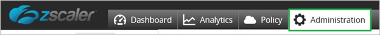

3.  按一下 [**管理使用者**]。

    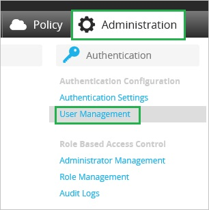

4.  在 [**使用者**] 索引標籤中，按一下 [**新增**]。

    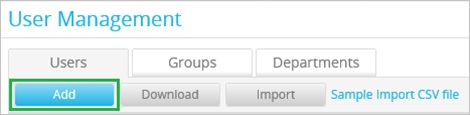

5.  在 [新增使用者] 區段中，執行下列步驟︰

    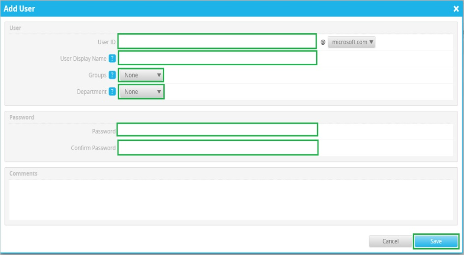

    1.  輸入**使用者識別碼**、**使用者顯示名稱**、**密碼**、**確認密碼**]，然後選取**群組**與**部門**有效 AAD 您想要的帳戶佈建。
    2.  按一下 [**儲存**]。

>[AZURE.NOTE] 您可以使用任何其他 Zscaler 使用者帳戶建立工具或 Api 提供 Zscaler 佈建 AAD 使用者帳戶。

##將使用者指派
  
若要測試您的設定，您需要授與 Azure AD 使用者想要允許使用您的應用程式存取分派給他們。

###若要指定 Zscaler 使用者，請執行下列步驟︰

1.  在 Azure 傳統入口網站中建立測試帳戶。

2.  **Zscaler**應用程式整合在頁面上，按一下 [**指派給使用者**。

    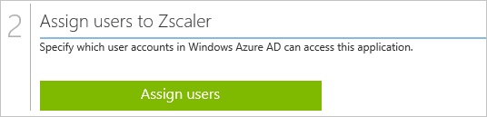

3.  選取您測試的使用者、**指派**，請按一下 [，然後按一下**[是]**以確認您的工作分派。

    ![[是]](./media/active-directory-saas-zscaler-tutorial/IC767830.png "[是]")
  
如果您想要測試您的單一登入設定，開啟 [存取面板。 如需存取畫面的詳細資訊，請參閱[簡介存取面板](active-directory-saas-access-panel-introduction.md)。
