<properties 
    pageTitle="教學課程︰ Azure Active Directory 整合 Zscaler ZSCloud |Microsoft Azure"
    description="瞭解如何使用 Azure Active Directory 中的 Zscaler ZSCloud，若要啟用單一登入、 自動化佈建和更多 ！。" 
    services="active-directory" 
    authors="jeevansd"  
    documentationCenter="na" 
    manager="femila"/>
<tags 
    ms.service="active-directory" 
    ms.devlang="na" 
    ms.topic="article" 
    ms.tgt_pltfrm="na" 
    ms.workload="identity" 
    ms.date="08/16/2016" 
    ms.author="jeedes" />

#教學課程︰ 使用 Zscaler ZSCloud 的 Azure Active Directory 整合
  
本教學課程中的目標是以顯示 Azure 和 ZScaler ZSCloud 的整合。  
本教學課程中所述的案例假設您已經有下列項目︰

-   有效的 Azure 訂閱
-   ZScaler ZSCloud 單一登入啟用訂閱
  
完成後本教學課程中，您指派給 ZScaler ZSCloud Azure AD 使用者將能夠單一登入 ZScaler ZSCloud 公司網站 （服務提供者發起的租用戶登入），或使用[[存取面板簡介](active-directory-saas-access-panel-introduction.md)應用程式
  
本教學課程中所述的案例是由下列建置組塊所組成︰

1.  啟用 ZScaler ZSCloud 應用程式整合
2.  設定單一登入
3.  設定 proxy 設定
4.  設定使用者佈建
5.  將使用者指派

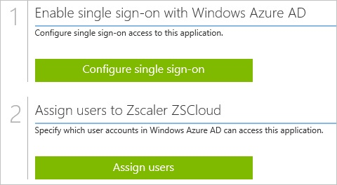

##啟用 ZScaler ZSCloud 應用程式整合
  
本節的目標是大綱如何啟用 ZScaler ZSCloud 的整合應用程式。

###若要啟用的 ZScaler ZSCloud 整合應用程式，請執行下列步驟︰

1.  Azure 傳統入口網站中，在左側的功能窗格中，按一下 [ **Active Directory**]。

    

2.  從 [**目錄**] 清單中，選取您要啟用目錄整合的目錄。

3.  若要開啟 [應用程式] 檢視中，在 [目錄] 檢視中，按一下 [在上方的功能表中的 [**應用程式**]。

    

4.  按一下 [**新增**頁面的底部。

    

5.  在 [**您想要做什麼**] 對話方塊中，按一下 [**新增應用程式，從圖庫**。

    

6.  在**搜尋] 方塊**中，輸入**ZScaler ZSCloud**。

    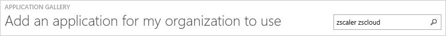

7.  在 [結果] 窗格中，選取**ZScaler ZSCloud**，，然後按一下要新增應用程式**完成**。

    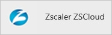

##設定單一登入
  
本節的目標是大綱如何啟用使用者進行驗證其帳戶中使用根據 SAML 通訊協定的同盟 Azure AD ZScaler ZSCloud。  
此程序的一部分，您會需要上傳至您的 ZScaler ZSCloud 租用戶的底數 64 編碼的憑證。  
如果您不熟悉這個程序，請參閱[如何轉換成文字檔的二進位憑證](http://youtu.be/PlgrzUZ-Y1o)

###若要設定單一登入，請執行下列步驟︰

1.  在 Azure 的傳統入口網站， **ZScaler ZSCloud**應用程式整合在頁面上，按一下 [**設定單一登入**以開啟 [**設定單一登入**] 對話方塊。

    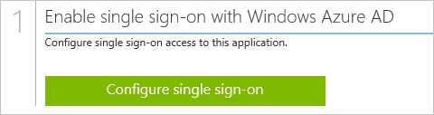

2.  在**您要如何登入 ZScaler ZSCloud 的使用者**] 頁面上，選取**Microsoft Azure AD 單一登入**，然後按 [**下一步**。

    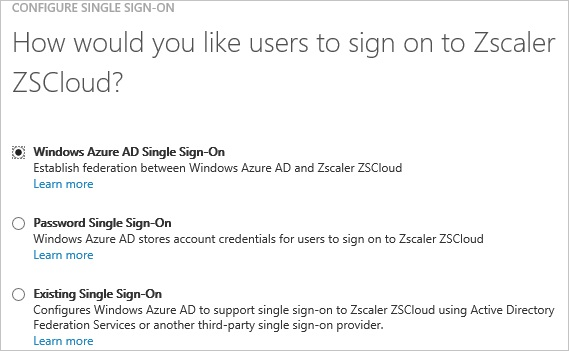

3.  **設定應用程式 URL**在頁面上，在 [ **ZScaler ZSCloud 登入 URL** ] 文字方塊中，輸入您登入您的 ZScaler ZSCloud 應用程式的使用者所使用的 URL，然後再按 [**下一步**。

    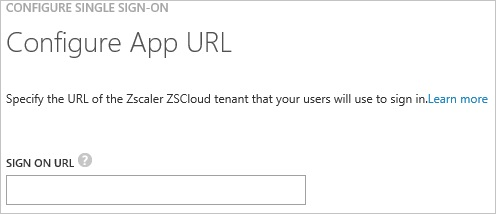

    >[AZURE.NOTE] 如果您需要可以從 ZScaler ZSCloud 支援小組取得您的環境的實際值。

4.  在**設定單一登入 ZScaler ZSCloud 在**頁面上，若要下載您的憑證，按一下 [**下載憑證**] 並儲存在您的電腦上的憑證檔案。

    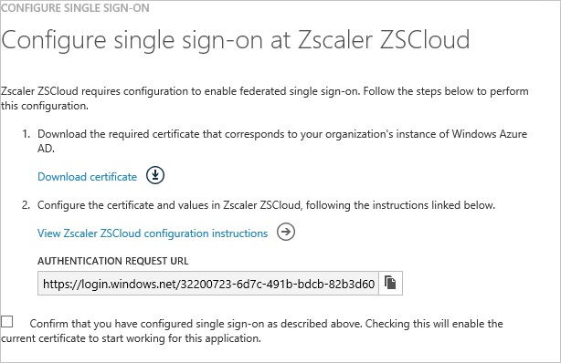

5.  在不同的網頁瀏覽器視窗中，以系統管理員身分登入您 ZScaler ZSCloud 公司的網站。

6.  在頂端的功能表，按一下 [**管理**]。

    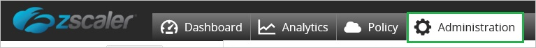

7.  按一下 [**管理管理員和角色**] 底下的 [**管理使用者與驗證**]。

    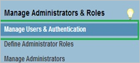

8.  在 [**選擇您的組織的驗證選項**] 區段中，執行下列步驟︰

    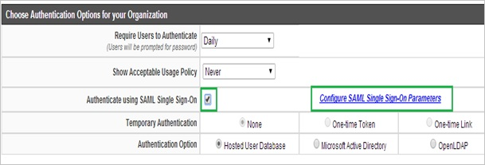

    1.  選取 [**驗證使用 SAML 單一登入**]。
    2.  按一下 [**設定 SAML 單一登入參數**。

9.  **設定 SAML 單一登入參數**] 對話方塊在頁面上，執行下列步驟，然後按 [**完成**︰

    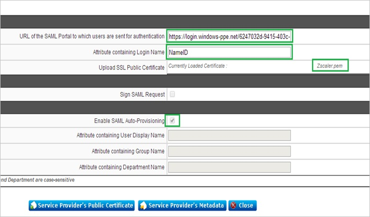

    1.  在 Azure 的傳統入口網站中**設定單一登入在 ZScaler ZSCloud** ] 對話方塊在頁面上，**驗證要求 URL**值，複製，然後再貼到 [**驗證使用者會傳送到 [SAML 入口網站的 URL** ] 文字方塊。
    2.  在 [**屬性包含登入名稱**] 文字方塊中輸入**NameID**。
    3.  若要上傳您下載的憑證，請按一下**Zscaler pem**。
    4.  選取 [**啟用 SAML 自動提供**。

10. **設定使用者驗證**] 對話方塊在頁面上，執行下列步驟︰

    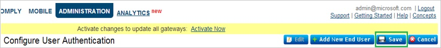

    1.  按一下 [**儲存**]。
    2.  按一下 [**立即啟用**]。

11. 在 Azure 的傳統入口網站中**設定單一登入在 ZScaler ZSCloud** ] 對話方塊在頁面上，選取單一登入設定確認，然後按 [**完成**。

    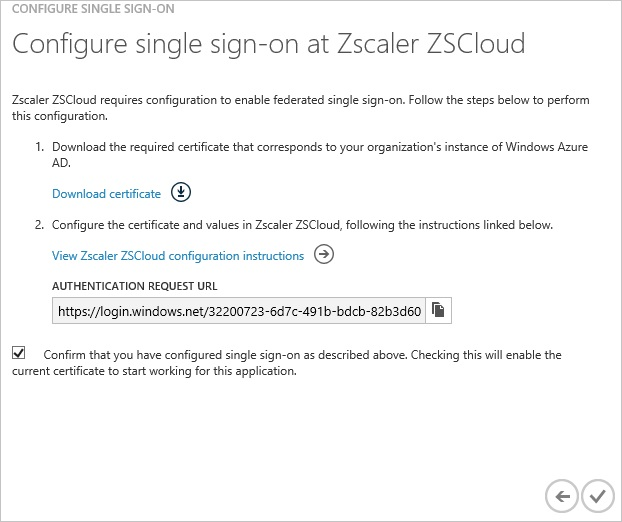

##設定 proxy 設定

###若要在 Internet Explorer 設定 proxy 設定

1.  啟動**Internet Explorer**。

2.  選取 [**網際網路選項**，以開啟 [**網際網路選項**] 對話方塊的 [**工具**] 功能表中。

    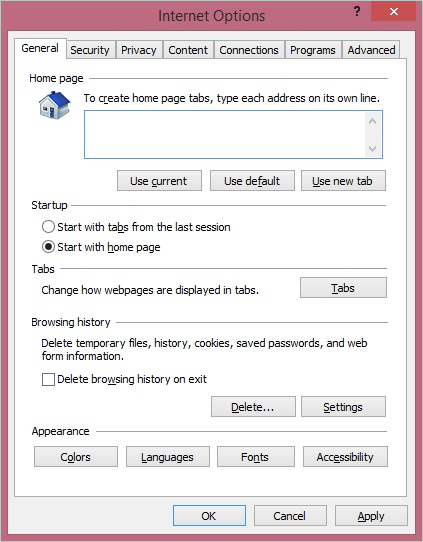

3.  按一下 [**連線**] 索引標籤。

    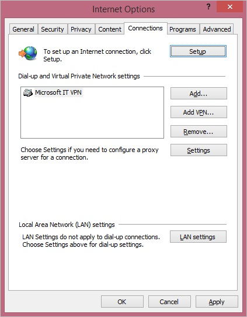

4.  按一下 [ **LAN 設定**]，以開啟 [ **LAN 設定**] 對話方塊。

5.  在 Proxy 伺服器] 區段中，執行下列步驟︰

    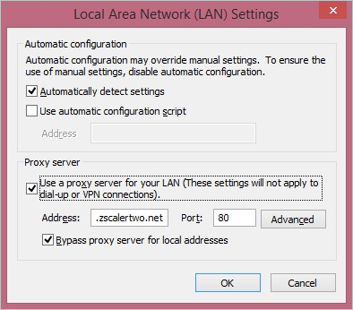

    1.  選取您的區域網路使用 proxy 伺服器。
    2.  在 [地址] 文字方塊中，輸入**gateway.zscalerone.net**。
    3.  在 [連接埠] 文字方塊中，輸入**80**。
    4.  選取 [**不使用 proxy 伺服器本機的地址**]。
    5.  按一下**[確定**] 關閉 [**區域網路 (LAN) 設定**] 對話方塊。

6.  按一下**[確定**] 關閉 [**網際網路選項**] 對話方塊。

##設定使用者佈建
  
若要啟用 Azure AD 使用者登入 ZScaler ZSCloud，他們必須提供給 ZScaler ZSCloud。  
若是 ZScaler ZSCloud 佈建是手動的工作。

###若要設定使用者佈建，執行下列步驟︰

1.  登入您的**Zscaler**租用戶。

2.  按一下 [**管理**]。

    

3.  按一下 [**管理使用者**]。

    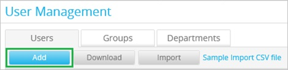

4.  在 [**使用者**] 索引標籤中，按一下 [**新增**]。

    

5.  在 [新增使用者] 區段中，執行下列步驟︰

    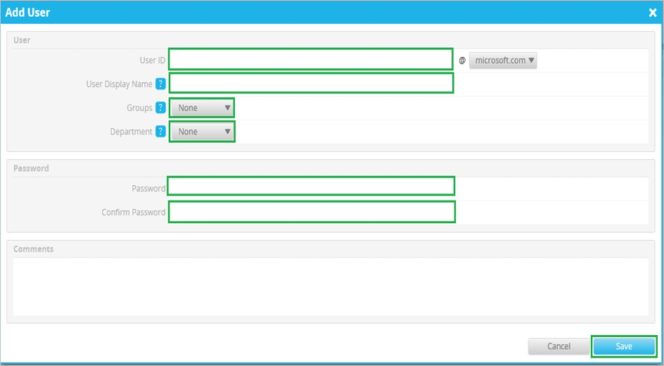

    1.  輸入**使用者識別碼**、**使用者顯示名稱**、**密碼**、**確認密碼**]，然後選取**群組**與**部門**有效 AAD 您想要的帳戶佈建。
    2.  按一下 [**儲存**]。

>[AZURE.NOTE] 您可以使用任何其他 ZScaler ZSCloud 使用者帳戶建立工具或 Api 提供 ZScaler ZSCloud 佈建 AAD 使用者帳戶。

##將使用者指派
  
若要測試您的設定，您需要授與 Azure AD 使用者想要允許使用您的應用程式存取分派給他們。

###若要指定 ZScaler ZSCloud 使用者，請執行下列步驟︰

1.  在 Azure 傳統入口網站中建立測試帳戶。

2.  **ZScaler ZSCloud**應用程式整合在頁面上，按一下 [**指派給使用者**。

    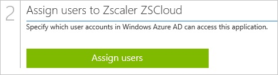

3.  選取您測試的使用者、**指派**，請按一下 [，然後按一下**[是]**以確認您的工作分派。

    ![[是]](./media/active-directory-saas-zscaler-zscloud-tutorial/IC767830.png "[是]")
  
如果您想要測試您的單一登入設定，開啟 [存取面板。 如需存取畫面的詳細資訊，請參閱[簡介存取面板](active-directory-saas-access-panel-introduction.md)。