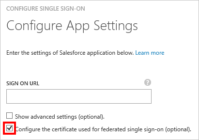
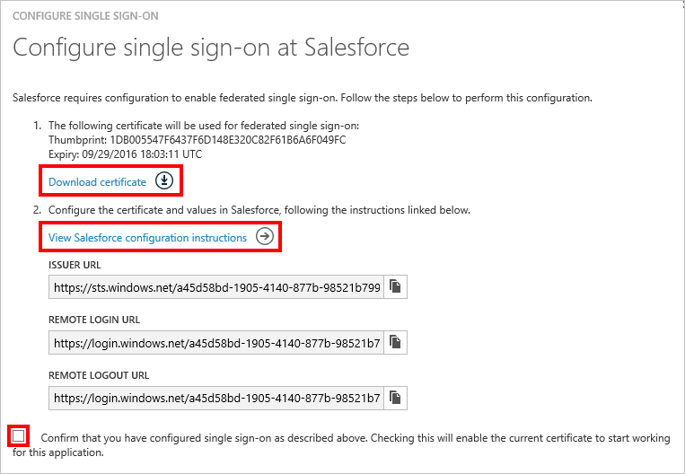

<properties
    pageTitle="如何管理同盟憑證中 Azure AD |Microsoft Azure"
    description="瞭解如何將自訂的到期日您同盟的憑證，以及如何更新即將到期的憑證。"
    services="active-directory"
    documentationCenter=""
    authors="asmalser-msft"
    manager="femila"
    editor=""/>

<tags
    ms.service="active-directory"
    ms.workload="identity"
    ms.tgt_pltfrm="na"
    ms.devlang="na"
    ms.topic="article"
    ms.date="02/09/2016"
    ms.author="asmalser-msft"/>

#管理同盟單一登入的 Azure Active Directory 中的憑證

本文涵蓋與 Azure Active Directory，會以建立同盟單一登入 (SSO) SaaS 應用程式建立的憑證相關的常見問題。

本文只是相關應用程式設定成使用**Azure AD 單一登入**，在下面的範例所示︰

##如何為您的同盟憑證自訂的到期日

根據預設，憑證會設定為兩年後過期。 您可以依照下列步驟，選擇不同的到期日您的憑證。 包含的螢幕擷取畫面使用 Salesforce 為範例，但這些步驟適用於任何同盟 SaaS 應用程式。

1. Azure Active Directory，在您的應用程式快速入門] 頁面上按一下中**設定單一登入**。

    

2. **Azure AD 單一登入**，選取，然後按一下 [**下一步**。

3. 輸入應用程式的**登入 URL** ，然後選取核取方塊，用於**設定憑證的同盟單一登入**。 然後按一下 [**下一步**。

    

4. 在下一個頁面上，選取**產生新的憑證**]，然後選取您要多久是有效的憑證。 然後按一下 [**下一步**。

    

5. 接下來，按一下**下載憑證**。 若要瞭解如何上傳至特定 SaaS 應用程式的憑證，按一下 [**檢視設定指示**。

    

6. 不會啟用憑證，直到您選取] 對話方塊底部的確認核取方塊，然後按 [提交]。

##如何更新即將到期的憑證

為您的使用者不嚴重停機時間應該理想產生以下所示的更新步驟。 在此區段功能 Salesforce 作為範例，但這些步驟的螢幕擷取畫面，可以套用任何同盟 SaaS 應用程式。

1. Azure Active Directory，在您的應用程式快速入門] 頁面上按一下中**設定單一登入**。

    

2. 在對話方塊的第一個頁面上， **Azure AD 單一登入**應該是已經選取，因此，按一下 [**下一步**。

3. 在第二個頁面上，選取**用來同盟單一登入的憑證設定**] 核取方塊。 然後按一下 [**下一步**。

    

4. 在下一個頁面上，選取**產生新的憑證**]，然後選取您要多久適用於新的憑證。 然後按一下 [**下一步**。

    

5. 按一下 [**下載憑證**]。 若要順利 rewnew 您的憑證，您必須執行下列兩個步驟︰

    - 將新的憑證上傳至 SaaS 應用程式的單一登入設定] 畫面。 若要瞭解如何進行此動作特定 SaaS 應用程式，請按一下 [**檢視設定指示**]。

    - 在 Azure AD，選取 [啟用新的憑證] 對話方塊底部的確認核取方塊，然後按一下 [**下一步**提交。

    > [AZURE.IMPORTANT] 單一登入應用程式將會停用這兩個步驟的其中一項森已完成，但它會再次啟用完成的第二步。 因此，若要最小化停機時間，請準備簡短彼此的時間內完成兩個步驟。

    

## 相關的文章

- [Azure Active Directory 中的應用程式管理文件索引](active-directory-apps-index.md)
- [應用程式存取和單一登入與 Azure Active Directory](active-directory-appssoaccess-whatis.md)
- [以 SAML 為基礎單一登入的疑難排解](active-directory-saml-debugging.md)
