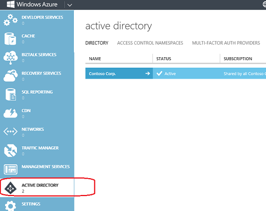

<properties
   pageTitle="疑難排解: 「 Active Directory' 項目會遺失或不提供 |Microsoft Azure "
   description="Active Directory] 功能表項目沒有出現在 Azure 管理入口網站時要做什麼。"
   services="active-directory"
   documentationCenter="na"
   authors="bryanla"
   manager="mbaldwin"
   editor=""/>

<tags
   ms.service="active-directory"
   ms.devlang="na"
   ms.topic="article"
   ms.tgt_pltfrm="na"
   ms.workload="identity"
   ms.date="09/16/2016"
   ms.author="mbaldwin"/>

# 疑難排解: 「 Active Directory' 項目會遺失或無法使用

使用 Azure Active Directory 功能及服務的指示許多開頭 「 移至 Azure 管理入口網站和按一下**Active Directory**」。 但是，該怎麼辦若未出現的 Active Directory 分機號碼或功能表項目，或已標示**無法使用**？ 本主題被為了協助。 它描述的條件的**Active Directory**不會出現或無法使用，並說明如何進行。

## Active Directory 不見了

一般而言， **Active Directory**項目會出現在左側的導覽功能表。 Azure Active Directory 程序中的指示進行假設此項目] 檢視中。

當下列條件為 true 時，Active Directory 項目會出現在左側的導覽功能表。 否則，項目就不會出現。

* 目前的使用者登 Microsoft 帳戶 （先前稱為 Windows Live ID）。

    OR

* Azure 租用戶擁有目錄，且目前的帳戶為目錄管理員。

    OR

* Azure 租用戶有一個以上的 Azure AD 存取控制 (ACS) 命名空間。 如需詳細資訊，請參閱[Access 控制項的命名空間](https://msdn.microsoft.com/library/azure/gg185908.aspx)。

    OR

* Azure 租用戶有一個以上的 Azure 多重因素驗證提供者。 如需詳細資訊，請參閱[管理的 Azure 多重因素驗證提供者](../multi-factor-authentication/multi-factor-authentication-get-started-cloud.md)。

若要建立 Access 控制項的命名空間或多重因素驗證提供者，請按一下 [ **+ 新增** > **應用程式服務** > **Active Directory**。

若要取得系統管理權限的目錄，讓系統管理員的系統管理員角色指派給您的帳戶。 如需詳細資訊，請參閱[指派管理員角色](active-directory-assign-admin-roles.md)。

## Active Directory 無法使用

當您按一下 [ **+ 新增** > **應用程式服務**、 **Active Directory**項目會出現。 具體來說，任何 Active Directory 功能，例如目錄、 存取控制項或多重因素驗證提供者，可用於目前的使用者時出現的 Active Directory 項目。

不過，同時在網頁載入時，項目] 變成灰色，並且標示 [**無法使用**。 這是暫存的狀態。 如果您稍待片刻後，就可以使用 [項目。 如果延長延遲，通常重新整理網頁可以解決問題。

