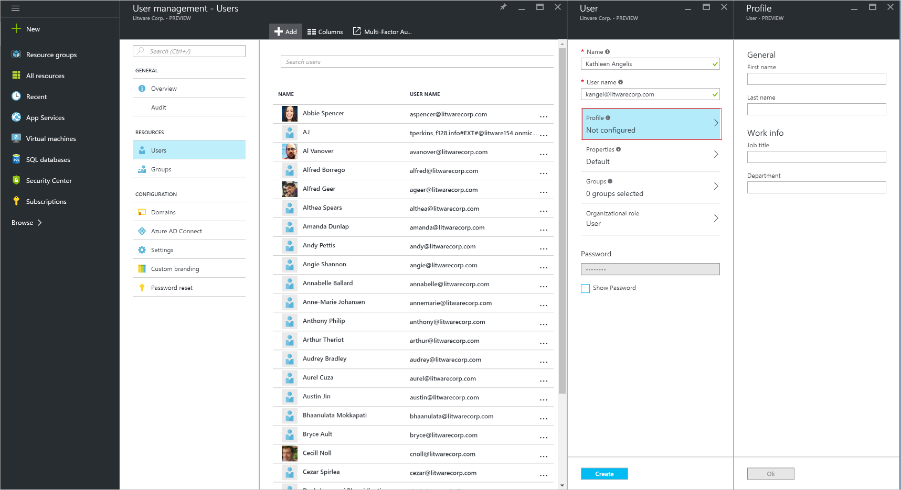
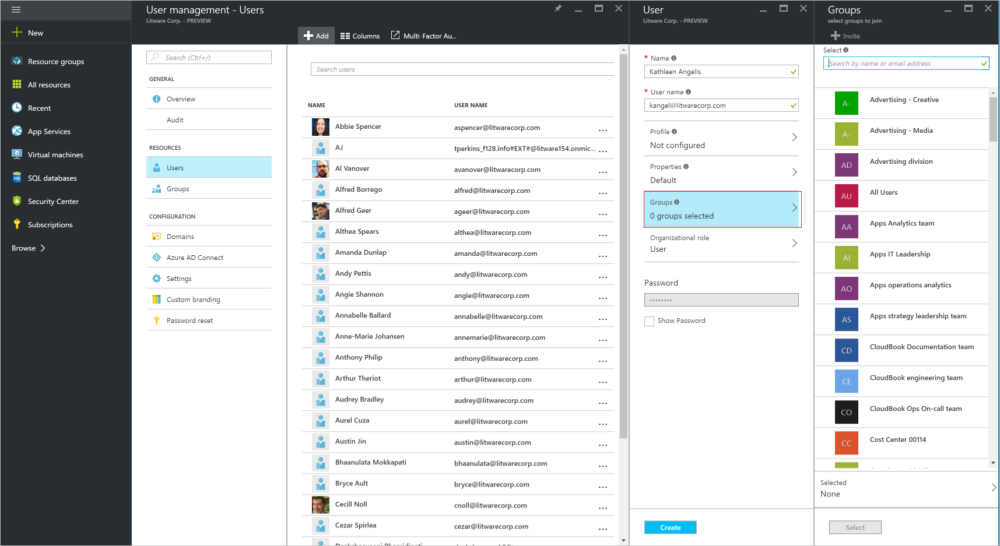

<properties
    pageTitle="將使用者新增其他目錄或合作夥伴公司的 Azure Active Directory 預覽 |Microsoft Azure"
    description="說明如何新增使用者或變更使用者的 Azure Active Directory，包括外部和來賓使用者的資訊。"
    services="active-directory"
    documentationCenter=""
    authors="curtand"
    manager="femila"
    editor=""/>

<tags
    ms.service="active-directory"
    ms.workload="identity"
    ms.tgt_pltfrm="na"
    ms.devlang="na"
    ms.topic="article"
    ms.date="09/12/2016"
    ms.author="curtand"/>

# 從其他目錄或合作夥伴公司 Azure Active Directory 預覽中的新增使用者

> [AZURE.SELECTOR]
- [Azure 入口網站](active-directory-users-create-external-azure-portal.md)
- [Azure 傳統入口網站](active-directory-create-users-external.md)

本文說明如何新增使用者，從 Azure Active Directory (Azure AD) 預覽中的其他目錄或合作夥伴。 [什麼是在預覽中？](active-directory-preview-explainer.md) 瞭解如何新增您組織中的新使用者，並新增 Microsoft 帳戶的使用者的資訊，請參閱[Azure Active Directory 新增新使用者](active-directory-users-create-azure-portal.md)。 新增的使用者不具有管理員權限，根據預設，但您可以隨時為其指派角色。

## 新增使用者

1.  [Azure 入口網站](https://portal.azure.com)的目錄是全域管理員帳戶登入。

2.  選取**更多服務**中 [文字] 方塊中，輸入**使用者和群組]** ，然後按下**enter 鍵**。

    

3.  在 [**使用者和群組**刀中，選取**使用者**]，然後選取 [**新增**。

    ![選取 [新增] 命令](./media/active-directory-users-create-external-azure-portal/create-users-add-command.png)

4. 在**使用者**刀中，輸入**名稱**中的顯示名稱和使用者的登入名稱**的使用者**名稱。

5. 複製或，讓您可以讓使用者在此程序完成之後，否則請注意產生的使用者的密碼。

6. 您也可以選取 [第一次新增使用者及姓氏的**設定檔**與工作標題、 部門名稱。
    
    

    - 選取要將使用者新增至一或多個群組的**群組**。

        

    - 選取**組織的角色**指派到角色的使用者，從 [**角色**] 清單。 如需關於使用者和管理員角色的詳細資訊，請參閱[指派管理員角色中 Azure AD](active-directory-assign-admin-roles.md)。

        

7. 選取 [**建立**]。

8. 安全地發佈給新使用者所產生的密碼，讓使用者可以登入。

> [AZURE.IMPORTANT] 如果您的組織使用一個以上的網域，您應該瞭解下列問題當您新增使用者帳戶︰
>
> - 若要在網域新增有相同的使用者主要名稱 (UPN) 的使用者帳戶，**第一**新增，例如geoffgrisso@contoso.onmicrosoft.com,**後面** geoffgrisso@contoso.com。
> - **不要**加上geoffgrisso@contoso.com您加入之前geoffgrisso@contoso.onmicrosoft.com。 此順序的重要性，並可以很難復原。

如果您變更的使用者的身分識別您內部部署的 Active Directory 服務進行同步處理的資訊時，您無法變更 Azure 傳統入口網站中的使用者資訊。 若要變更的使用者資訊，請使用您的內部部署 Active Directory 管理工具。

## 下一步是什麼

- [新增使用者](active-directory-users-create-azure-portal.md)
- [重設使用者的密碼，新的 Azure 入口網站](active-directory-users-reset-password-azure-portal.md)
- [Azure AD 中指派角色的使用者](active-directory-users-assign-role-azure-portal.md)
- [變更使用者的公司資訊](active-directory-users-work-info-azure-portal.md)
- [管理使用者設定檔](active-directory-users-profile-azure-portal.md)
- [Azure AD 中刪除使用者](active-directory-users-delete-user-azure-portal.md)
