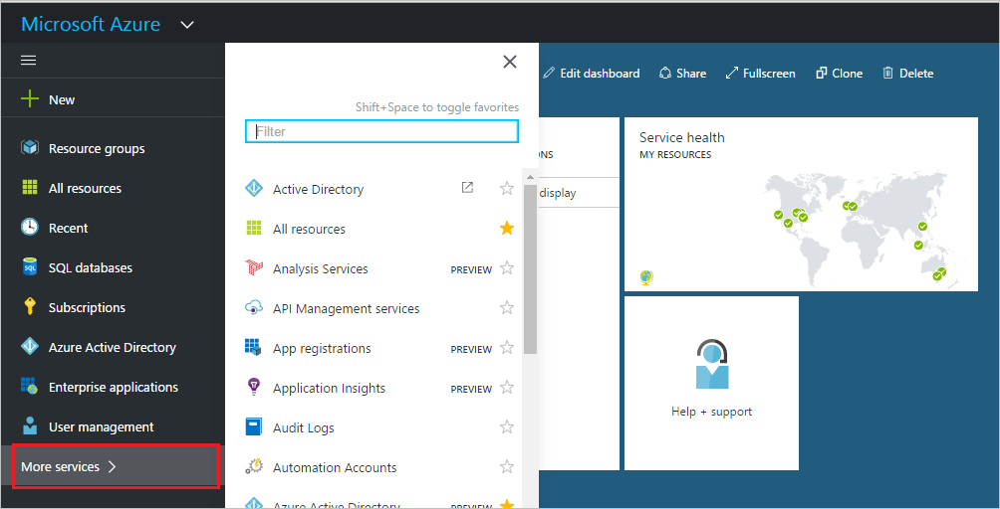

<properties
    pageTitle="從 Azure Active Directory 預覽中的目錄中刪除使用者 |Microsoft Azure"
    description="說明如何刪除 Azure Active Directory 中的使用者，所有的資訊"
    services="active-directory"
    documentationCenter=""
    authors="curtand"
    manager="femila"
    editor=""/>

<tags
    ms.service="active-directory"
    ms.workload="identity"
    ms.tgt_pltfrm="na"
    ms.devlang="na"
    ms.topic="article"
    ms.date="09/12/2016"
    ms.author="curtand"/>

# 刪除使用者從 Azure Active Directory 預覽中的目錄

本文說明如何刪除使用者從 Azure Active Directory (Azure AD) 預覽中的目錄。 [什麼是在預覽中？](active-directory-preview-explainer.md) 瞭解您組織中新增新使用者的資訊，請參閱[新增到 Azure Active Directory 的新使用者](active-directory-users-create-azure-portal.md)。

## 刪除使用者

1.  [Azure 入口網站](https://portal.azure.com)的目錄是全域管理員帳戶登入。

2.  選取**更多服務**中 [文字] 方塊中，輸入**使用者和群組]** ，然後按下**enter 鍵**。

    

3.  在 [**使用者和群組**刀中，選取 [**使用者**]。

    

4. 在 [**使用者和群組-使用者**刀，請從清單中選取使用者。

5. 在所選使用者刀，選取 [**概觀**]，，然後在 [命令] 列中，選取 [**刪除**。

    ![選取 [刪除] 命令](./media/active-directory-users-delete-user-azure-portal/create-users-delete-command.png)

## 下一步是什麼

- [新增使用者](active-directory-users-create-azure-portal.md)
- [重設使用者的密碼，新的 Azure 入口網站](active-directory-users-reset-password-azure-portal.md)
- [Azure AD 中指派角色的使用者](active-directory-users-assign-role-azure-portal.md)
- [變更使用者的公司資訊](active-directory-users-work-info-azure-portal.md)
- [管理使用者設定檔](active-directory-users-profile-azure-portal.md)
