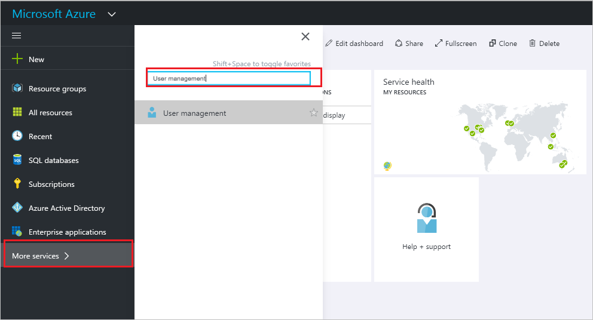

<properties
    pageTitle="重設密碼的 Azure Active Directory 預覽中的使用者 |Microsoft Azure"
    description="說明如何重設 Azure Active Directory 中的使用者的密碼"
    services="active-directory"
    documentationCenter=""
    authors="curtand"
    manager="femila"
    editor=""/>

<tags
    ms.service="active-directory"
    ms.workload="identity"
    ms.tgt_pltfrm="na"
    ms.devlang="na"
    ms.topic="article"
    ms.date="10/13/2016"
    ms.author="curtand"/>

# 重設 Azure Active Directory 預覽中的使用者的密碼

> [AZURE.SELECTOR]
- [Azure 入口網站](active-directory-users-reset-password-azure-portal.md)
- [Azure 傳統入口網站](active-directory-create-users-reset-password.md)

## 如何重設使用者的密碼

1.  [Azure 入口網站](https://portal.azure.com)的目錄是全域管理員帳戶登入。

2.  選取**更多服務**中 [文字] 方塊中，輸入**使用者和群組]** ，然後按下**enter 鍵**。

    

3.  在 [**使用者和群組**刀中，選取 [**使用者**]。

    

4. 在 [**使用者和群組-使用者**刀，請從清單中選取使用者。

5. 在所選使用者刀，選取 [**概觀**]，，然後在 [命令] 列中，選取 [**重設密碼**。

    ![選取 [重設密碼] 命令](./media/active-directory-users-reset-password-azure-portal/create-users-reset-password-command.png)

6. 在 [**重設密碼**刀中，選取 [**重設密碼**]。

## 下一步是什麼

- [新增使用者](active-directory-users-create-azure-portal.md)
- [Azure AD 中指派角色的使用者](active-directory-users-assign-role-azure-portal.md)
- [變更使用者的公司資訊](active-directory-users-work-info-azure-portal.md)
- [管理使用者設定檔](active-directory-users-profile-azure-portal.md)
- [Azure AD 中刪除使用者](active-directory-users-delete-user-azure-portal.md)
