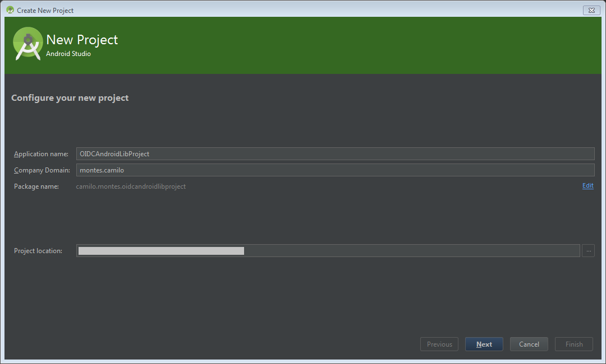
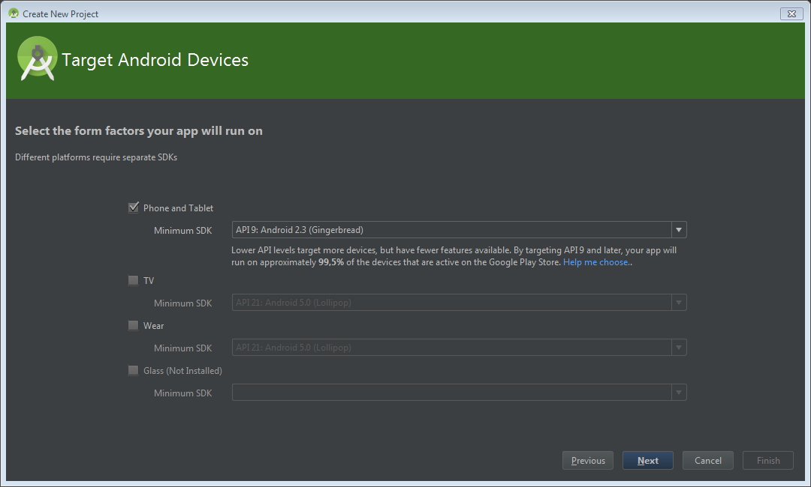
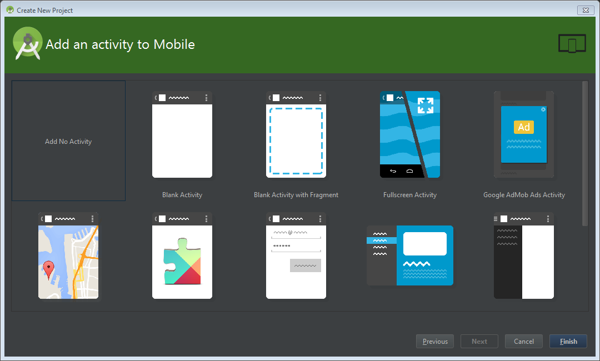
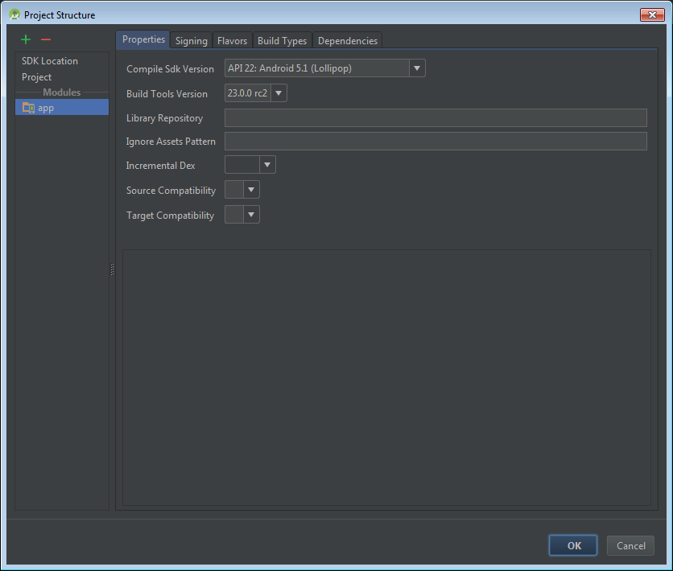
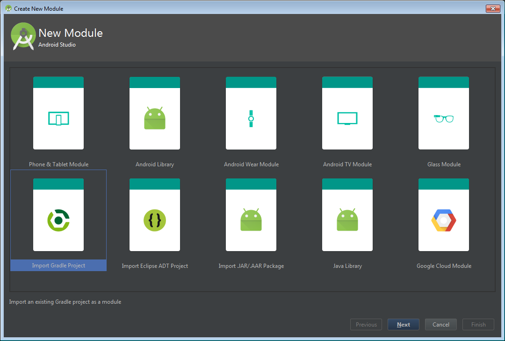
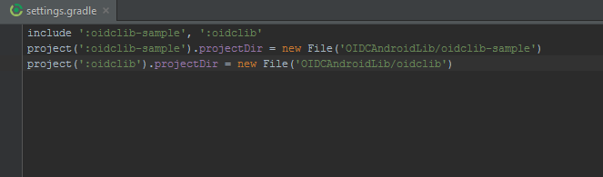

<properties
    pageTitle="Azure Active Directory v2.0 Android 應用程式 |Microsoft Azure"
    description="如何建立使用協力廠商文件庫中使用個人 Microsoft 帳戶與工作或學校帳戶和通話圖形 API 的使用者登入 Android 應用程式。"
    services="active-directory"
    documentationCenter=""
    authors="brandwe"
    manager="mbaldwin"
    editor=""/>

<tags
    ms.service="active-directory"
    ms.workload="identity"
    ms.tgt_pltfrm="na"
    ms.devlang="na"
    ms.topic="article"
    ms.date="09/16/2016"
    ms.author="brandwe"/>

#  <a name="add-sign-in-to-an-android-app-using-a-third-party-library-with-graph-api-using-the-v20-endpoint"></a>登入新增至 Android 應用程式使用 v2.0 端點的圖形 API 搭配使用協力廠商的文件庫

Microsoft 身分識別平台採用開啟的標準，例如 OAuth2 和 OpenID 連線。 開發人員可以使用他們想要與我們的服務整合任何文件的庫。 若要協助開發人員使用我們的平台與其他文件庫，我們已撰寫如下所示，示範如何以設定連線至 Microsoft 身分識別平台的協力廠商文件庫的幾個逐步解說。 實作[RFC6749 OAuth2 規格](https://tools.ietf.org/html/rfc6749)的大部分文件庫可以連線至 Microsoft 身分識別平台。

此逐步解說所建立的應用程式，使用者可以登入組織，然後搜尋自行讓組織中使用圖表 API。

如果您是新 OAuth2 或 OpenID 連線，此範例設定的可能無法對您有意義。 我們建議您閱讀[2.0 通訊協定-OAuth 2.0 授權碼流程](active-directory-v2-protocols-oauth-code.md)的背景。

> [AZURE.NOTE] 我們的平台的運算式有 OAuth2 或 OpenID 連線標準，例如條件存取和 Intune 原則管理] 中的某些功能需要您使用我們開啟來源 Microsoft Azure 身分識別文件庫。

不支援 v2.0 端點，所有的 Azure Active Directory 案例和功能。

> [AZURE.NOTE] 若要判斷是否您應該使用 v2.0 端點，請閱讀有關[v2.0 限制](active-directory-v2-limitations.md)。


## <a name="download-the-code-from-github"></a>從 GitHub 下載的程式碼
本教學課程中的程式碼是來維護[GitHub](https://github.com/Azure-Samples/active-directory-android-native-oidcandroidlib-v2)。  若要遵循，您可以[下載應用程式的基本架構為.zip](https://github.com/Azure-Samples/active-directory-android-native-oidcandroidlib-v2/archive/skeleton.zip)或複製基本架構︰

```
git clone --branch skeleton git@github.com:Azure-Samples/active-directory-android-native-oidcandroidlib-v2.git
```

您也可以下載的範例，而且立刻開始︰

```
git@github.com:Azure-Samples/active-directory-android-native-oidcandroidlib-v2.git
```

## <a name="register-an-app"></a>登錄應用程式
在[應用程式註冊入口網站](https://apps.dev.microsoft.com/?referrer=https://azure.microsoft.com/documentation/articles&deeplink=/appList)中，建立新的應用程式，或依照[如何註冊與 v2.0 端點應用程式](active-directory-v2-app-registration.md)的詳細的步驟。  請確定︰

- 複製**應用程式識別碼**，因為您將需要推出指派給您的應用程式。
- 新增您的應用程式的**行動**平台。

> 附註︰ 應用程式註冊入口網站提供**重新導向 URI**值。 不過，在此範例中您必須使用的預設值`https://login.microsoftonline.com/common/oauth2/nativeclient`。


## <a name="download-the-nxoauth2-third-party-library-and-create-a-workspace"></a>下載 NXOAuth2 協力廠商的文件庫，並建立工作區

在此逐步解說，您會使用 OIDCAndroidLib 從 GitHub，這是依據 OpenID 連線的程式碼的 Google OAuth2 文件庫。 它會實作原生應用程式的設定檔，而且支援使用者的授權端點。 這些是您需要整合與 Microsoft 身分識別平台的所有項目。

複製到您的電腦 OIDCAndroidLib repo。

```
git@github.com:kalemontes/OIDCAndroidLib.git
```


## <a name="set-up-your-android-studio-environment"></a>設定您的 Android Studio 環境

1. 建立新的 Android Studio 專案，並接受精靈中的預設值。

    

    

    

2. 若要設定您專案的模組，將複製的 repo 移到專案的位置。 您可以同時建立專案，然後複製直接到專案的位置。

    

3. 使用內容功能表，或使用 Ctrl + Alt + Maj + S 快速鍵，請開啟 [專案模組設定]。

    

4. 移除預設應用程式模組，因為您只想專案容器設定。

    

5. 從匯入模組複製 repo 至目前專案。

    
    

6. 重複這些步驟`oidlib-sample`模組。

7. 查看 oidclib 相依性`oidlib-sample`模組。

    

8. 按一下**[確定]** ，並等待 gradle 同步處理。

    您 settings.gradle 看起來應該像︰

    

9. 建立範例應用程式，請確定順利執行範例。

    您將無法使用此與 Azure Active Directory 尚未。 我們需要先設定某些結束點。 這是以確定您沒有安裝 Android Studio 問題，我們開始自訂範例應用程式。

10. 建立並執行`oidlib-sample`為 Android Studio 中的目標。

    

11. 刪除`app `左因為 Android Studio 安全性並不會刪除它，從專案移除模組時的目錄。

    

12. 開啟 [**編輯設定**] 功能表，移除也左，當您從專案移除模組執行的設定。

    ![編輯設定] 功能表](media/active-directory-android-native-oidcandroidlib-v2/SetUpSample10.PNG)
    

## <a name="configure-the-endpoints-of-the-sample"></a>設定結束點的樣本

您已經有`oidlib-sample`順利執行，讓我們來編輯某些端點，以開始與 Azure Active Directory 此工作。

### <a name="configure-your-client-by-editing-the-oidcclientconfxml-file"></a>設定您的用戶端編輯 oidc_clientconf.xml 檔案

1. 因為您正在使用 OAuth2 流來取得權杖和呼叫圖形 API，設定用戶端只執行 OAuth2。 OIDC 會是您的更新版本的範例。

    ```xml
        <bool name="oidc_oauth2only">true</bool>
    ```

2. 設定您的用戶端識別碼所收到的註冊入口網站。

    ```xml
        <string name="oidc_clientId">86172f9d-a1ae-4348-aafa-7b3e5d1b36f5</string>
        <string name="oidc_clientSecret"></string>
    ```

3. 設定與您重新導向 URI 下方。

    ```xml
        <string name="oidc_redirectUrl">https://login.microsoftonline.com/common/oauth2/nativeclient</string>
    ```

4. 設定您所需存取圖形 API 的範圍。

    ```xml
        <string-array name="oidc_scopes">
            <item>openid</item>
            <item>https://graph.microsoft.com/User.Read</item>
            <item>offline_access</item>
        </string-array>
    ```

`User.Read`中的值`oidc_scopes`可讓您閱讀基本的設定檔中使用者的簽名。
您可以進一步瞭解所有可用的領域，在[Microsoft Graph 權限的範圍](https://graph.microsoft.io/docs/authorization/permission_scopes)。

如果您想要說明的相關`openid`或`offline_access`中 OpenID 連線的範圍，請參閱[2.0 通訊協定-OAuth 2.0 授權的程式碼流程](active-directory-v2-protocols-oauth-code.md)。

### <a name="configure-your-client-endpoints-by-editing-the-oidcendpointsxml-file"></a>設定您的用戶端端點編輯 oidc_endpoints.xml 檔案

- 開啟`oidc_endpoints.xml`檔案，然後進行下列變更︰

    ```xml
    <!-- Stores OpenID Connect provider endpoints. -->
    <resources>
        <string name="op_authorizationEnpoint">https://login.microsoftonline.com/common/oauth2/v2.0/authorize</string>
        <string name="op_tokenEndpoint">https://login.microsoftonline.com/common/oauth2/v2.0/token</string>
        <string name="op_userInfoEndpoint">https://www.example.com/oauth2/userinfo</string>
        <string name="op_revocationEndpoint">https://www.example.com/oauth2/revoketoken</string>
    </resources>
    ```

如果您使用您的通訊協定 OAuth2，永遠不應該變更這些端點。

> [AZURE.NOTE]
端點`userInfoEndpoint`和`revocationEndpoint`目前不支援的 Azure Active Directory。 如果您將保留這些預設 example.com 值，您會收到它們的不在此範例中:-)


## <a name="configure-a-graph-api-call"></a>設定圖表 API 通話

- 開啟`HomeActivity.java`檔案，然後進行下列變更︰

    ```Java
       //TODO: set your protected resource url
        private static final String protectedResUrl = "https://graph.microsoft.com/v1.0/me/";
    ```

以下一個簡單的圖表 API 呼叫傳回我們的資訊。

這些是您需要執行的所有變更。 執行`oidlib-sample`應用程式中，按一下 [**登入**。

您已驗證成功後，請選取 [以測試您的電話轉接到圖形 API**邀請受保護的資源**] 按鈕。

## <a name="get-security-updates-for-our-product"></a>取得產品的安全性更新

我們建議您以取得安全性事件的通知，造訪[安全性技術中心](https://technet.microsoft.com/security/dd252948)訂閱安全性提示警示。
