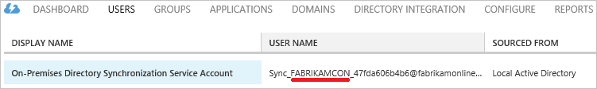

<properties
   pageTitle="Azure AD Connect︰ 帳戶及權限 |Microsoft Azure"
   description="本主題說明的使用和建立帳戶及所需的權限。"
   services="active-directory"
   documentationCenter=""
   authors="billmath"
   manager="femila"
   editor=""/>

<tags
   ms.service="active-directory"  
   ms.workload="identity"
   ms.tgt_pltfrm="na"
   ms.devlang="na"
   ms.topic="article"
   ms.date="10/04/2016"
   ms.author="billmath"/>

# Azure AD Connect︰ 帳戶及權限
Azure AD Connect 安裝精靈提供兩個不同的路徑︰

- 中快速設定，此精靈會需要更多的權限，讓它可以輕鬆地設定您的設定，而不需要您建立使用者或分別設定權限。

- 在自訂設定精靈提供更多選項及選項]，但您要確認您擁有正確的權限自己某些情況下。

## 相關文件
如果您不未讀取的[整合您的內部部署識別與 Azure Active Directory](../active-directory-aadconnect.md)的文件下, 表提供相關主題的連結。

主題 |  
--------- | ---------
安裝使用快速設定 | [Express 安裝 Azure AD Connect](active-directory-aadconnect-get-started-express.md)
安裝使用自訂設定 | [自訂安裝 Azure AD Connect](active-directory-aadconnect-get-started-custom.md)
從 DirSync 升級 | [從 Azure AD 同步處理工具 (DirSync) 升級](active-directory-aadconnect-dirsync-upgrade-get-started.md)

## 快速設定安裝
快速設定，安裝精靈詢問 AD DS 企業系統管理員認證，您的內部部署 Active Directory 可以設定的必要的權限的 Azure AD Connect。 如果您從 DirSync 升級，AD DS 企業系統管理員認證用來重設 DirSync 所使用的帳戶的密碼。 您也需要 Azure AD 全域管理員認證。

精靈頁面  | 收集的認證 | 必要的權限| 用於
------------- | ------------- |------------- |-------------
N/A|執行安裝精靈中的使用者| 本機伺服器的系統管理員| <li>建立本機帳戶做為[同步處理引擎服務帳戶](#azure-ad-connect-sync-service-account)。
Azure ad 連線| Azure AD directory 認證 | Azure AD 中的全域管理員角色 | <li>啟用 Azure AD 目錄中的同步處理。</li>  <li>建立用於 Azure AD 中進行同步處理作業[Azure AD 帳戶](#azure-ad-service-account)。</li>
連線至 AD DS | 內部部署 Active Directory 認證 | 在 Active Directory 中的企業系統管理員 (EA)] 群組的成員| <li>在 Active Directory 中建立[帳戶](#active-directory-account)並授與權限。 建立帳戶這用來讀取和寫入目錄同步處理期間的資訊。</li>

### 企業系統管理員認證
安裝完成後，使用和只在安裝期間使用這些認證。 是企業系統管理員，且不網域管理員，以確定可在所有的網域設定 Active Directory 中的權限。

### 全域管理員認證
這些認證只能在安裝期間，並安裝完成後，不會使用。 它會用來建立用來同步處理變更 Azure AD [Azure AD 帳戶](#azure-ad-service-account)。 帳戶同時也會依 Azure AD 中啟用同步處理功能。

### 建立 AD DS 的權限帳戶快速設定
建立用於讀取和寫入到 AD DS 的[帳戶](#active-directory-account)有下列權限時建立快速設定︰

權限 | 用於
---- | ----
<li>複寫目錄的變更</li><li>複寫的目錄會變更所有 | 密碼同步處理
讀/寫所有使用者的屬性 | 匯入及 Exchange 混合式部署
讀/寫所有內容需要 | 匯入及 Exchange 混合式部署
讀/寫所有屬性都群組 | 匯入及 Exchange 混合式部署
請連絡讀/寫所有屬性 | 匯入及 Exchange 混合式部署
重設密碼 | 準備進行啟用密碼回寫

## 自訂設定安裝
使用自訂設定，必須建立用來連線到 Active Directory 帳戶安裝之前。 您必須授與此帳戶的權限可以集中[建立 AD DS 帳戶](#create-the-ad-ds-account)。

精靈頁面  | 收集的認證 | 必要的權限| 用於
------------- | ------------- |------------- |-------------
N/A | 執行安裝精靈中的使用者|<li>本機伺服器的系統管理員</li><li>如果使用完整的 SQL Server，使用者必須是系統管理員 (SA) 在 SQL 中</li>| 根據預設，會建立本機帳戶做為[同步處理引擎服務帳戶](#azure-ad-connect-sync-service-account)。 管理員未指定特定的帳戶時，只會建立帳戶。
安裝同步處理服務，服務帳戶] 選項 | AD 或本機的使用者帳戶認證 | 使用者權限授與 [安裝] 精靈 | 如果管理員是指定帳戶，此帳戶用於與服務帳戶同步處理服務。
Azure ad 連線 | Azure AD directory 認證| Azure AD 中的全域管理員角色| <li>啟用 Azure AD 目錄中的同步處理。</li>  <li>建立用於 Azure AD 中進行同步處理作業[Azure AD 帳戶](#azure-ad-service-account)。</li>
將您的目錄的連線 | 內部部署 Active Directory 認證，每個樹系 Azure AD 連線 | 哪些功能在您啟用，並可以在[建立 AD DS 帳戶](#create-the-ad-ds-account)中找到，相依權限 |此帳戶用來讀取和寫入目錄同步處理期間的資訊。
AD FS 伺服器 | 在清單中每個伺服器，精靈會收集認證執行精靈之使用者的登入認證不足，無法連線時 | 網域系統管理員 | 安裝和設定 AD FS 伺服器角色。
Web 應用程式 proxy 伺服器 |在清單中每個伺服器，精靈會收集認證執行精靈之使用者的登入認證不足，無法連線時 | 在目標電腦上的本機管理員 | 安裝和設定 WAP 伺服器角色。
Proxy 信任認證 |同盟服務信任認證 （認證 proxy 註冊用於 FS 從信任的憑證 |本機系統管理員 AD FS server 的網域帳戶 | 初始 FS WAP 信任憑證註冊。
AD FS 服務帳戶頁面上，[使用網域的使用者帳戶選項] | AD 使用者帳戶認證 | 網域使用者 | AD 使用者帳戶所提供的認證，作為 AD FS 服務的登入帳戶。

### 建立 AD DS 帳戶
當您安裝 Azure AD Connect 時，您指定在**您的目錄的連線**] 頁面的帳戶必須 Active Directory 中，而且必須授與權限。 在安裝精靈無法驗證的權限及任何問題只同步處理期間找到。

您需要哪些權限而定的選擇性功能，您啟用。 如果您有多個網域，則必須授與權限樹系中所有的網域。 如果您未啟用任何這些功能，就會足夠的預設**網域使用者**權限。

功能 | 權限
------ | ------
密碼同步處理 | <li>複寫目錄的變更</li>  <li>複寫的目錄會變更所有
Exchange 混合式部署 | 寫入權限的使用者、 群組和連絡人記錄中[Exchange 混合式回寫](../active-directory-aadconnectsync-attributes-synchronized.md#exchange-hybrid-writeback)的屬性。
密碼回寫 | 文件中[快速入門密碼管理](../active-directory-passwords-getting-started.md#step-4-set-up-the-appropriate-active-directory-permissions)使用者屬性寫入權限。
裝置回寫 | [裝置回寫](../active-directory-aadconnect-feature-device-writeback.md)所述的 PowerShell 指令碼授與權限。
群組回寫 | 讀取、 建立、 更新及刪除的 OU 應該位於 [發佈] 群組中的群組物件。

## 升級
當您從 Azure AD Connect 版本升級至新的版本時，您會需要下列權限︰

主要 | 必要的權限 | 用於
---- | ---- | ----
執行安裝精靈中的使用者 | 本機伺服器的系統管理員 | 更新的二進位檔案。
執行安裝精靈中的使用者 | ADSyncAdmins 的成員 | 同步處理規則和其他設定進行變更。
執行安裝精靈中的使用者 | 如果您是使用完整的 SQL server: DBO （或類似） 的同步處理引擎資料庫 | 請資料庫層級的變更，例如更新與新的資料行的資料表。

## 更多關於建立的帳戶資訊

### Active Directory 帳戶
如果您使用快速設定，用於同步處理的 Active Directory 中建立帳戶。 建立的帳戶位於使用者容器中樹系根網域，並有其名稱前面加上**MSOL_**。 不會過期的時間有多長複雜密碼以建立帳戶。 如果您有密碼原則，在您的網域，請確定長，此帳戶才能複雜的密碼。

### Azure AD Connect 同步處理服務帳戶
（除非您指定要使用自訂設定中的帳戶），則安裝精靈會建立本機服務帳戶。 帳戶是**AAD_**做為前置字元，並以執行用於實際的同步處理服務。 如果您安裝 Azure AD Connect 網域控制站時，該帳戶會建立在網域]。 如果您使用遠端執行 SQL server] 或 [如果您使用需要驗證的 proxy 伺服器，必須位於**AAD_**服務帳戶，在網域]。

不會過期的時間有多長複雜密碼以建立帳戶。

此帳戶用來儲存安全的方式的其他帳戶的密碼。 這些其他帳戶的密碼會儲存在資料庫加密。 使用 Windows 資料保護 API (DPAPI) 加密服務私密金鑰加密受保護的私密金鑰加密金鑰。 Windows 然後會損毀基於安全性理由加密金鑰之後，您不應該重設服務帳戶的密碼。

如果您使用完整的 SQL Server，服務帳戶是資料庫的建立對同步處理引擎 DBO。 有任何其他權限所預期，將無法運作的服務。 也會建立 SQL 登入。

帳戶也會授與檔案、 登錄機碼及其他物件同步處理引擎相關的權限。

### Azure AD 服務帳戶
Azure AD 中的帳戶是自動建立同步處理服務使用。 可以依顯示名稱，確定此帳戶。

可中的使用者名稱的第二部分識別該帳戶會用在伺服器的名稱。 圖片中的伺服器名稱是 FABRIKAMCON。 如果您用的伺服器，每個伺服器擁有自己的帳戶。 Azure AD 有 10 個同步處理服務帳戶的限制。

服務帳戶會建立不會過期的時間有多長複雜密碼。 它會授與特殊的角色具有執行目錄同步處理工作的權限的**目錄同步處理帳戶**。 此特殊的內建角色無法授與外部 Azure AD Connect 精靈和 Azure 入口網站會顯示**使用者**的角色與此帳戶。

## 後續步驟

進一步瞭解[整合您的內部部署識別與 Azure Active Directory](../active-directory-aadconnect.md)。
