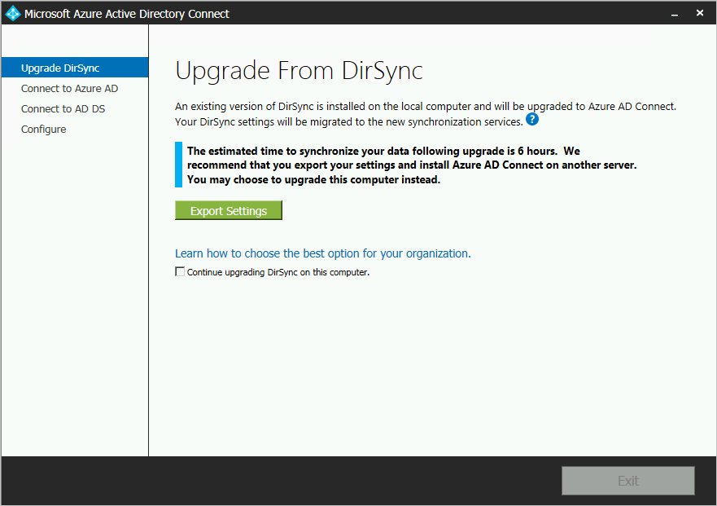
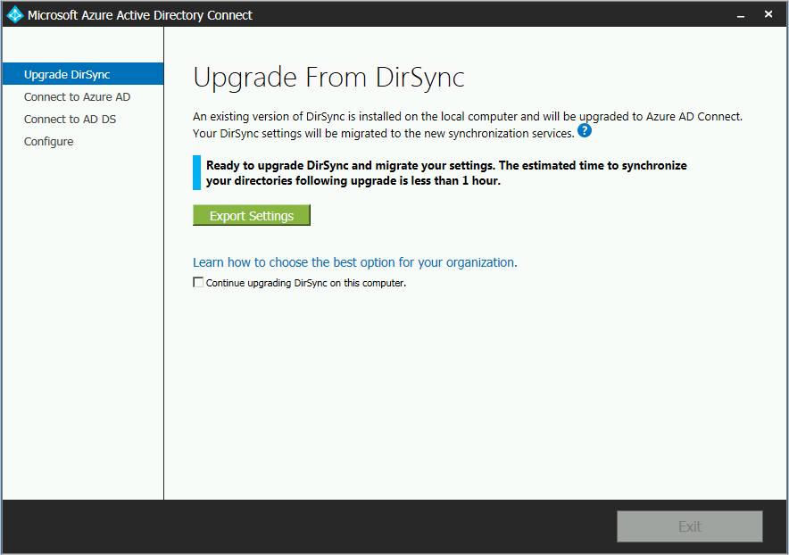
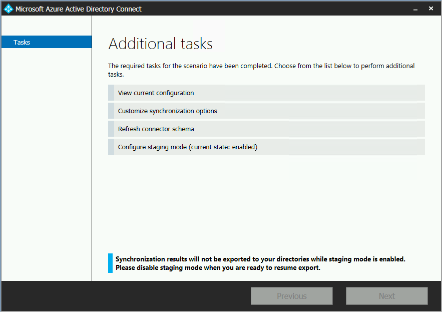

<properties
   pageTitle="Azure AD Connect︰ 從 DirSync 升級 |Microsoft Azure"
   description="瞭解如何從 DirSync 升級至 Azure AD Connect。 本文說明從 DirSync 升級為 Azure AD Connect 的步驟。"
   services="active-directory"
   documentationCenter=""
   authors="andkjell"
   manager="femila"
   editor=""/>

<tags
   ms.service="active-directory"
   ms.workload="identity"
   ms.tgt_pltfrm="na"
   ms.devlang="na"
   ms.topic="get-started-article"
   ms.date="08/19/2016"
   ms.author="shoatman;billmath"/>

# Azure AD Connect︰ 升級目錄同步
Azure AD Connect 是 DirSync 後續。 您會發現您可以從 DirSync 本主題中升級的方式。 升級從另一個版本的 Azure AD Connect 或 Azure AD Sync，無法使用這些步驟。

開始安裝 Azure AD Connect 之前，務必先[下載 Azure AD Connect](http://go.microsoft.com/fwlink/?LinkId=615771)和完整的必要條件步驟[Azure AD Connect︰ 硬體和先決條件](../active-directory-aadconnect-prerequisites.md)。 特別是您想要瞭解下列動作，因為這些區域是不同的目錄同步︰

- 必要的.Net 和 PowerShell 版本。 較新版本，才能比目錄同步處理方式無須伺服器上。
- Proxy 伺服器設定。 如果您使用 proxy 伺服器連接網際網路時，升級之前，必須將設定這項設定。 目錄同步一律會使用 proxy 伺服器設定為使用者安裝，但 Azure AD Connect 用途機器設定改為。
- 必須在 proxy 伺服器開啟 Url。 基本情況下，也支援 DirSync，這些需求的相同。 如果您想要使用任何 Azure AD Connect 隨附的新功能，必須先開啟一些新的 Url。

如果您不從 DirSync 升級，請參閱[相關的文件](#related-documentation)的其他案例。

## 從 DirSync 升級
根據您目前的目錄同步部署中，有不同的升級的選項。 如果預期的升級時間少於三個小時，然後建議您執行就地升級。 如果預期的升級時間超過三個小時的時間，然後建議您執行的其他伺服器上的平行部署。 估計，如果您有超過 50000 物件花費超過三個小時來執行升級。

案例 |  
---- | ----
[就地升級](#in-place-upgrade)  | 如果預期升級需要小於 3 小時慣用的選項。
[平行部署](#parallel-deployment) | 如果預期升級需要多個 3 小時慣用的選項。

>[AZURE.NOTE] 當您規劃 DirSync 從 Azure AD Connect 升級時，請解除安裝目錄同步自己升級之前先。 Azure AD Connect 會閱讀從 DirSync 移轉設定，並解除安裝之後檢查伺服器。

**就地升級**  
精靈會顯示預期的時間才能完成升級。 此估計值根據假設花完成 50000 物件 （使用者、 連絡人和群組） 為資料庫升級的三個小時。 如果您的資料庫中的物件數目少於 50000，Azure AD Connect 建議以就地升級。 如果您決定要繼續，您的目前設定就會自動套用升級期間，您的伺服器時，自動繼續作用中的同步處理。

如果您想要執行設定移轉，並執行平行的部署，您就可以取代就地升級建議。 例如，您可能需要有機會在重新整理硬體與作業系統。 請參閱[平行部署](#parallel-deployment)如需詳細資訊。

**平行部署**  
如果您有超過 50000 的物件，然後在平行部署建議。 如此可避免，讓使用者經驗豐富的任何作業延遲。 Azure AD Connect 安裝嘗試估計停機時間升級，但如果您已在過去升級 DirSync，有可能最佳指南您自己的體驗。

### 若要升級的支援目錄同步設定
升級 DirSync 支援變更下列設定︰

- 網域和 OU 篩選
- 替代識別碼 (UPN)
- 密碼同步處理和 Exchange 混合式設定
- 樹系/網域和 Azure AD 設定
- 篩選依據使用者屬性

無法升級下列的變更。 如果您有此設定時，會封鎖升級︰

- 不支援的 DirSync 的變更，例如中移除屬性，並使用自訂擴充功能 DLL

在這些情況下，建議安裝新的 Azure AD Connect 伺服器[臨時模式](../active-directory-aadconnectsync-operations.md#staging-mode)，並確認舊 DirSync 與新 Azure AD Connect 設定。 [Azure AD 連線同步處理的自訂設定](../active-directory-aadconnectsync-whatis.md)中所述，請重新套用使用自訂設定，任何變更。

使用目錄同步服務帳戶的密碼無法擷取，並不會移轉。 在升級過程中會全部重設密碼。

### 從 DirSync 升級為 Azure AD Connect 高層級的步驟

1. 歡迎使用 Azure AD 連線
2. 目前的目錄同步設定的分析
3. 收集 Azure AD 全域管理員密碼
4. 收集針對企業系統管理員帳戶認證 （只在 Azure AD Connect 您在安裝期間使用）
5. 安裝的 Azure AD 連線
    * 解除安裝目錄同步 （或暫時停用）
    * 安裝 Azure AD 連線
    * 您也可以開始同步處理

額外的步驟是必要︰

* 您目前使用的完整的 SQL Server-本機或遠端
* 您的同步處理的範圍內有超過 50000 物件

## 就地升級

1. 啟動 Azure AD Connect installer (MSI)。
2. 檢閱並同意授權合約與隱私權注意事項。

3. 若要開始您現有的目錄同步安裝的分析按一下 [下一步]。

4. 分析完成時，您會看到建議如何繼續。  
    - 如果您使用 SQL Server Express，必須小於 50000 物件時，會顯示下列畫面︰
    - 如果您使用 DirSync 完整的 SQL Server，請改為您看到此頁面︰  
會顯示正在使用 DirSync 的現有 SQL Server 資料庫伺服器的相關資訊。 如有需要請進行適當的調整。 按一下 [**下一步**繼續安裝。
    - 如果您有超過 50000 的物件，請改為您看到這個畫面︰  
若要繼續就地升級，請按一下 [這封郵件旁邊的核取方塊︰**繼續升級 DirSync 這台電腦上。**
若要改為執行[平行部署](#parallel-deployment)，您匯出目錄同步設定的設定，並將新的伺服器設定。
5. 提供您目前使用 Azure ad 連線的帳戶的密碼。 這必須是 DirSync 目前使用的帳戶。
  
如果您收到錯誤訊息，並有連線問題，請參閱[疑難排解連線問題](../active-directory-aadconnect-troubleshoot-connectivity.md)。
6. 提供適用於 Active Directory 的企業系統管理員帳戶。

7. 現在，您準備好要設定。 當您按一下 [**升級**] 時，在解除安裝目錄同步和 Azure AD Connect 設定妥當，並開始同步處理。

8. 安裝完成之後，請登出並再次登入 windows 使用同步處理服務管理員，同步處理規則編輯器] 中，或嘗試進行任何變更其他設定。

## 平行部署

### 匯出目錄同步設定
**平行部署超過 50000 物件**

如果您有超過 50000 的物件，然後 Azure AD Connect 安裝建議的平行部署。

隨後會顯示類似下列畫面︰

如果您想要繼續進行平行部署，您需要執行下列步驟︰

- 按一下 [**匯出的設定**] 按鈕。 當您在不同的伺服器上安裝 Azure AD Connect 時，就會從您目前的目錄同步這些設定移轉至新的 Azure AD Connect 安裝。

一旦您的設定匯出成功，您可以結束 Azure AD Connect 精靈 DirSync 伺服器上。 繼續進行下一個步驟來[安裝不同的伺服器上的 Azure AD Connect](#installation-of-azure-ad-connect-on-separate-server)

**平行部署小於 50000 物件**

如果您有小於 50000 的物件，但仍要執行平行部署中，然後執行下列動作︰

1. 執行 Azure AD Connect installer (MSI)。
2. 當您看到**Azure AD Connect 歡迎使用**] 畫面時，請按一下視窗的右上角中的 「 X 」 結束安裝精靈。
3. 開啟命令提示字元。
4. 從 Azure AD Connect 的安裝位置 (預設︰ C:\Program Files\Microsoft Azure Active Directory 連線) 執行下列命令︰  `AzureADConnect.exe /ForceExport`。
5. 按一下 [**匯出的設定**] 按鈕。  當您在不同的伺服器上安裝 Azure AD Connect 時，就會從您目前的目錄同步這些設定移轉至新的 Azure AD Connect 安裝。

一旦您的設定匯出成功，您可以結束 Azure AD Connect 精靈 DirSync 伺服器上。 繼續進行下一個步驟來[安裝不同的伺服器上的 Azure AD Connect](#installation-of-azure-ad-connect-on-separate-server)

### 在個別的伺服器上安裝 Azure AD Connect

當您在新的伺服器上安裝 Azure AD Connect 時，假設是您想要執行的 Azure AD Connect 安裝。 由於您想要使用 DirSync 設定，有需要採取一些額外步驟︰

1. 執行 Azure AD Connect installer (MSI)。
2. 當您看到**Azure AD Connect 歡迎使用**] 畫面時，請按一下視窗的右上角中的 「 X 」 結束安裝精靈。
3. 開啟命令提示字元。
4. 從 Azure AD Connect 的安裝位置 (預設︰ C:\Program Files\Microsoft Azure Active Directory 連線) 執行下列命令︰  `AzureADConnect.exe /migrate`。
    Azure AD Connect 安裝精靈會啟動，並會顯示下列畫面︰ 
5. 選取 [從您的目錄同步安裝匯出的設定檔]。
6. 設定任何進階的選項，包括︰
    - Azure AD Connect 自訂安裝位置。
    - 現有的 SQL Server 執行個體 (預設︰ Azure AD Connect 會安裝 SQL Server 2012 Express)。 務必為您的目錄同步伺服器使用相同的資料庫執行個體。
    - 指定帳戶給服務用來連線到 SQL Server，（如果您的 SQL Server 資料庫遠端此帳戶必須是網域服務帳戶）。
可以在此畫面上看到這些選項︰ 
7. 按一下 [**下一步**]。
8. 在 [**準備好設定**] 頁面 [離開**開始同步處理程序完成設定為**核取。 伺服器現在[臨時模式](../active-directory-aadconnectsync-operations.md#staging-mode)中，變更不會匯出至 Azure AD。
9. 按一下 [**安裝**]。
10. 安裝完成之後，請登出並再次登入 windows 使用同步處理服務管理員，同步處理規則編輯器] 中，或嘗試進行任何變更其他設定。

>[AZURE.NOTE] Windows Server Active Directory 和 Azure Active Directory 之間的同步處理開始，但 Azure AD 匯出的任何變更。 只有一個同步處理工具可以積極匯出的變更，一次。 此狀態稱為[臨時模式](../active-directory-aadconnectsync-operations.md#staging-mode)。

### 驗證 Azure AD Connect 已準備好開始同步處理

若要確認 Azure AD Connect 已從 DirSync 接手，您需要開啟**同步處理服務管理員**] 群組中**Azure AD Connect**從 [開始] 功能表。

在應用程式中，移至 [**作業**] 索引標籤。 在此索引標籤中，確認已完成下列作業︰

- 匯入 AD 連接器
- Azure AD 連接器上的匯入
- 在 AD 連接器的完整同步處理
- Azure AD 連接器上完整的同步處理

檢閱這些作業的結果，並確保沒有錯誤。

如果您想要查看並檢查關於匯出至 Azure AD，然後閱讀如何混合式部署設定在[暫存模式](../active-directory-aadconnectsync-operations.md#staging-mode)] 底下的變更。 您沒有看到預期的任何項目之前進行必要的設定變更。

您就可以從 DirSync 切換至 Azure AD，當您完成這些步驟，並滿意結果。

### 解除安裝 DirSync （舊版伺服器）

- 在 [**程式和功能**尋找**Windows Azure Active Directory 同步處理工具**
- 解除安裝**Windows Azure Active Directory 同步處理工具**
- 解除安裝，可能需要 15 分鐘，才能完成。

如果您想要稍後解除安裝目錄同步，但您也暫時會關閉伺服器，或停用的服務。 如果發生錯誤，此方法可讓您重新啟用。 不過，不需要讓此應該不需要的下一步會失敗。

解除安裝，或停用 DirSync，就沒有作用中的伺服器匯出至 Azure AD。 您內部部署的 Active Directory 中的任何變更會繼續進行同步處理至 Azure AD 之前，必須先完成啟用 Azure AD Connect 的下一個步驟。

### 啟用 Azure AD Connect （新的伺服器）
安裝完成後，再重新開啟 Azure AD 連線會讓您進行其他設定變更。 從 [開始] 功能表或從桌面上的捷徑，請啟動**Azure AD Connect** 。 請確定您不嘗試再次執行安裝 MSI。

您應該會看到下列動作︰

- 選取 [**設定臨時模式**]。
- 關閉臨時取消核取 [**啟用暫存模式**] 核取方塊。

- 按一下 [**下一步**] 按鈕
- 在確認頁面上，按一下 [**安裝**] 按鈕。

Azure AD Connect 現在作用中的伺服器。

## 後續步驟
現在，您有安裝 Azure AD Connect 可以[驗證安裝並指派授權](../active-directory-aadconnect-whats-next.md)。

進一步瞭解這些新功能，與安裝已啟用︰[自動升級](../active-directory-aadconnect-feature-automatic-upgrade.md)，[防止意外刪除](../active-directory-aadconnectsync-feature-prevent-accidental-deletes.md)，並[Azure AD 連線狀況](../active-directory-aadconnect-health-sync.md)。

進一步瞭解這些常見的主題︰[排程器，以及如何觸發同步處理](../active-directory-aadconnectsync-feature-scheduler.md)。

進一步瞭解[整合您的內部部署識別與 Azure Active Directory](../active-directory-aadconnect.md)。

## 相關文件

主題 |  
--------- | ---------
Azure AD Connect 概觀 | [整合您的內部部署識別與 Azure Active Directory](../active-directory-aadconnect.md)
從舊版連線升級 | [從舊版連線升級](../active-directory-aadconnect-upgrade-previous-version.md)
安裝使用快速設定 | [Express 安裝 Azure AD Connect](active-directory-aadconnect-get-started-express.md)
安裝使用自訂的設定 | [自訂安裝 Azure AD Connect](active-directory-aadconnect-get-started-custom.md)
安裝所用的帳戶 | [Azure AD Connect 帳戶和權限的詳細資訊](active-directory-aadconnect-accounts-permissions.md)
