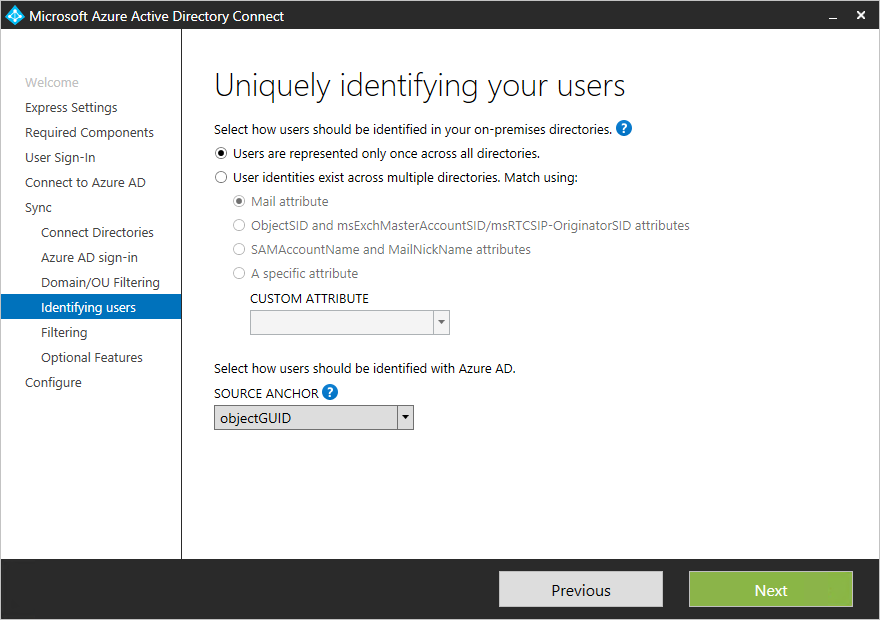
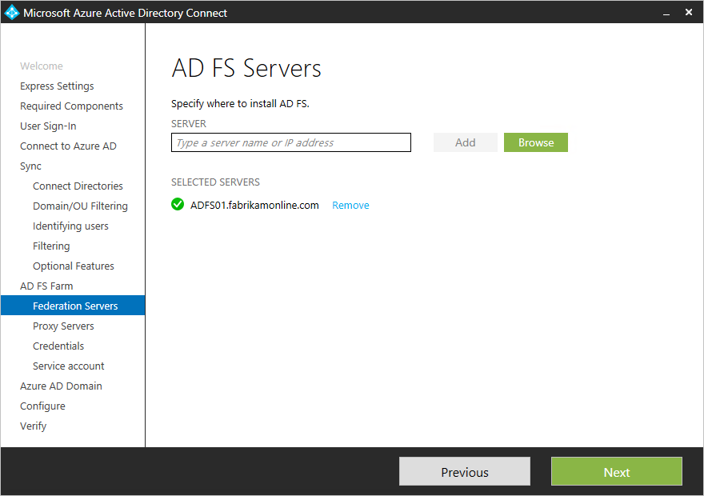
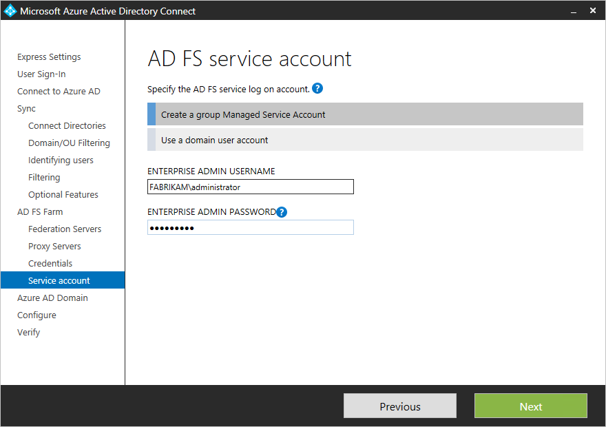

<properties
    pageTitle="Azure AD Connect︰ 自訂安裝 |Microsoft Azure"
    description="這份文件詳細資料 Azure AD Connect 的自訂安裝選項]。 您可以使用這些指示來安裝透過 Azure AD Connect Active Directory。"
    services="active-directory"
    keywords="什麼是 Azure AD Connect，請安裝 Active Directory 的 Azure AD 必要元件"
    documentationCenter=""
    authors="andkjell"
    manager="femila"
    editor="curtand"/>

<tags
    ms.service="active-directory"  
    ms.workload="identity"
    ms.tgt_pltfrm="na"
    ms.devlang="na"
    ms.topic="get-started-article"
    ms.date="09/13/2016"
    ms.author="billmath"/>

# 自訂安裝 Azure AD Connect
您想要更多選項來安裝時，會使用 azure AD 連線**自訂設定**。 如果您有多個，或如果您想要設定選擇性功能，快速安裝中使用。 在所有位置[**快速安裝**](active-directory-aadconnect-get-started-express.md)選項不符合您的部署或拓撲的情況下使用。

開始安裝 Azure AD Connect 之前，務必先[下載 Azure AD Connect](http://go.microsoft.com/fwlink/?LinkId=615771)和完整的必要條件步驟[Azure AD Connect︰ 硬體和先決條件](../active-directory-aadconnect-prerequisites.md)。 請確定您具有必要的可用述[Azure AD Connect 帳戶及權限](active-directory-aadconnect-accounts-permissions.md)的帳戶。

如果自訂設定不符拓撲，例如升級目錄同步，請參閱其他案例的 [[相關文件](#related-documentation)。

## Azure AD Connect 的自訂設定安裝

### 快速設定
在此頁面上，按一下 [**自訂**開始設定自訂的安裝。

### 安裝必要的元件
當您安裝的同步處理服務時，您可以將選用組態] 區段中取消核取並 Azure AD Connect 設定所有項目會自動。 將其設定的 SQL Server 2012 Express LocalDB 執行個體，建立適當的群組，並指派權限。 如果您想要變更預設值，您可以使用下表若要瞭解可選用的設定選項。

選用的設定  | 描述
------------- | -------------
使用現有的 SQL Server | 可讓您指定的 SQL 伺服器名稱及執行個體名稱。 如果您已經有您想要使用的資料庫伺服器，請選擇此選項。 輸入執行個體名稱後面逗號和連接埠號碼**執行個體名稱**中，如果您的 SQL Server 沒有啟用瀏覽]。
使用現有的服務帳戶 | 依預設 Azure AD Connect 會建立本機服務帳戶同步處理服務使用。 密碼不會自動產生與未知安裝 Azure AD Connect 的人。 如果您使用遠端的 SQL server，或是使用需要驗證的 proxy，您需要服務帳戶]，在網域]，並知道密碼。 在這些情況下，輸入要使用的服務帳戶。 確認執行安裝的使用者是以 SQL SA 可以建立服務帳戶的登入。 請參閱[Azure AD Connect 帳戶及權限](active-directory-aadconnect-accounts-permissions.md#custom-settings-installation)
指定自訂的同步處理 | 依預設 Azure AD Connect 建立四個群組的伺服器本機同步處理服務是安裝。 這些群組是︰ 管理員群組與運算子群組、 瀏覽] 群組中，[密碼重設] 群組。 您可以指定自己的群組。 群組必須在伺服器上的本機，而且找不到在網域]。

### 使用者登入
安裝後所需的元件，會要求您選取使用者單一登入方法。 下表提供可用的選項的簡短描述。 如需登入方法的完整描述，請參閱[使用者登入](../active-directory-aadconnect-user-signin.md)。

單一登入選項 | 描述
------------- | -------------
密碼同步處理 | 使用者都能登入 Microsoft 雲端服務，例如 Office 365，請使用他們的內部部署網路中使用相同的密碼。 Azure ad 密碼雜湊為同步處理的使用者密碼，然後在雲端進行驗證。 如需詳細資訊，請參閱[密碼同步處理](../active-directory-aadconnectsync-implement-password-synchronization.md)。
AD FS 同盟 | 使用者都能登入 Microsoft 雲端服務，例如 Office 365，請使用他們的內部部署網路中使用相同的密碼。  使用者會被重新導向至其內部部署 AD FS 執行個體登入驗證發生與內部部署。
未設定 | 未安裝和設定功能。 如果您已經有第 3 的廠商同盟伺服器或其他現有的方案中的位置，請選擇此選項。

### Azure ad 連線
在 [連線至 Azure AD] 畫面中，輸入全域管理員帳戶與密碼。 如果您在前一頁上選取**AD FS 同盟**，不使用您計劃啟用同盟的網域帳戶登入。 建議的做法是在預設**onmicrosoft.com**網域，隨附 Azure AD 目錄使用的帳戶。

此帳戶只會用來建立 Azure AD 服務帳戶，然後完成精靈後，不會使用。  

如果您的全域管理員帳戶有啟用 MFA，您需要提供一次在登入快顯功能表中的密碼，並完成 MFA 挑戰。 提供驗證碼或電話時，可能的挑戰。  

全域管理員帳戶，也可以有[權限的身分識別管理](../active-directory-privileged-identity-management-getting-started.md)啟用。

如果您收到錯誤訊息，並有連線問題，請參閱[疑難排解連線問題](../active-directory-aadconnect-troubleshoot-connectivity.md)。

## 在同步處理] 區段底下的頁面

### 將您的目錄的連線
若要連線到您 Active Directory 網域服務，Azure AD Connect 必須有足夠的權限的帳戶認證。 您可以輸入網域部分 NetBios 或 FQDN 格式，也就是 FABRIKAM\syncuser 或 fabrikam.com\syncuser。 此帳戶可一般使用者帳戶，因為它只需要預設的讀取權限。 不過，根據您的狀況，您可能需要更多的權限。 如需詳細資訊，請參閱[Azure AD 連線帳戶及權限](../active-directory-aadconnect-accounts-permissions.md#create-the-ad-ds-account)

### Azure AD 登入設定
此頁面可讓您檢閱簡報內部部署 UPN 網域 AD DS 和驗證 Azure AD 中。 此頁面也可讓您設定要用於 userPrincipalName 屬性。

  
檢閱每一個標示為**未新增**及**驗證**的網域。 請確定您使用的網域已驗證 Azure AD 中。 已確認您的網域，請按一下 [重新整理符號]。 如需詳細資訊，請參閱[新增及驗證網域](../active-directory-add-domain.md)

**UserPrincipalName**屬性 userPrincipalName 是屬性使用者使用當使用者登入 Azure AD 和 Office 365。 使用網域也稱為 UPN 尾碼，應該 Azure AD 前使用者會同步處理中完成驗證了。 Microsoft 建議保留預設屬性 userPrincipalName。 如果這個屬性非路由，而且無法驗證，則可以選擇其他屬性。 例如可選電子郵件與屬性拿著登入 id。 **替代的識別碼**就是使用 userPrincipalName 比其他屬性。 替代識別碼屬性值必須遵循 RFC822 標準。 使用密碼同步處理] 與 [同盟可替代的識別碼。

>[AZURE.WARNING]
使用替代的識別碼不相容的所有 Office 365 工作負載均。 如需詳細資訊，請參閱[設定替代的登入 ID](https://technet.microsoft.com/library/dn659436.aspx)。

### 網域和 OU 篩選
依預設會同步處理所有的網域和 Ou。 如果有一些網域或您不想要同步處理到 Azure AD Ou，您可以取消選取這些網域和 Ou。  
精靈中的此頁面設定網域為基礎的篩選。 如需詳細資訊，請參閱[網域為基礎的篩選](../active-directory-aadconnectsync-configure-filtering.md#domain-based-filtering)。

您也可一些網域不是由於防火牆限制存取。 這些網域依預設會未選取，並有警告。  
  
如果您看到這則警告，確定這些網域是確實無法連線，且預期會出現警告。

### 可唯一識別您的使用者
跨樹系功能符合可讓您定義您 AD DS 樹系的使用者如何以 Azure AD。 使用者可能會表示一次在所有樹系之間，或有啟用及停用的帳戶的組合。 使用者也可能表示某些樹系中的連絡人。

設定 | 描述
------------- | -------------
[使用者會只所有樹系過一次表示](../active-directory-aadconnect-topologies.md#multiple-forests-separate-topologies) | Azure AD 中，為個別的物件建立的所有使用者。 物件沒有斷加入。
[郵件屬性](../active-directory-aadconnect-topologies.md#multiple-forests-full-mesh-with-optional-galsync) | 如果郵件屬性不同樹系中有相同的值，此選項會加入使用者及連絡人。 當有使用 GALSync 建立您的連絡人時，請使用這個選項。
[ObjectSID 和 msExchangeMasterAccountSID / 受影響 OriginatorSid](../active-directory-aadconnect-topologies.md#multiple-forests-account-resource-forest) | 這個選項，將連結與資源樹系中已停用使用者帳戶樹系中的啟用的使用者。 在 Exchange，此設定稱為連結的信箱。 如果您只使用 Lync 與 Exchange 沒有出現在資源樹系，也可以使用這個選項。
sAMAccountName 和 MailNickName | 這個選項聯結預期可以找到使用者的登入 ID 的屬性。
特定的屬性 | 這個選項可讓您選取您自己的屬性。 **限制︰**請務必挑選已經可以找到斷屬性。 如果您選擇的自訂屬性 （不在 metaverse) 時，無法完成精靈。

**來源錨點**屬性 sourceAnchor 是在使用者物件的生命週期的不變。 是主索引鍵中 Azure AD 連結內部部署使用者的使用者。 由於您無法變更屬性，您必須規劃建議使用屬性。 適合是 objectguid 資訊。 這個屬性不會變更，除非樹系/網域之間移動的使用者帳戶。 在多樹系環境中您將帳戶移樹系之間，另一個屬性必須使用，例如 [員工識別碼] 屬性。 避免將人員 marries 時變更，或變更工作分派的屬性。 您無法使用的屬性與@-sign,讓電子郵件和 userPrincipalName 不能使用。 屬性也會區分大小寫，因此當您樹系之間移動物件，請務必保留 upper/小寫。 二進位屬性 base64 編碼，但其他類型的屬性會保留在未編碼的狀態。 在同盟案例及某些 Azure AD 介面，也就是這個屬性會 immutableID。 在[設計概念](../active-directory-aadconnect-design-concepts.md#sourceAnchor)找來源錨點的詳細資訊。

### 同步處理篩選依據群組
群組功能篩選可讓您在試驗計畫同步處理一小部分的物件。 若要使用此功能，請針對這個目的，在您的內部部署 Active Directory 中建立群組。 然後新增使用者及群組，應同步處理 Azure ad 為直接成員。 您稍後可以新增和移除使用者，此群組，若要維持物件應該出現在 Azure AD 的清單。 您想要同步處理的所有物件都必須都是直接群組的成員。 使用者、 群組、 連絡人及電腦/裝置都必須直接成員。 不會解析巢狀的群組成員資格。 當您新增群組成員，本身的群組會新增並不其成員。

>[AZURE.WARNING]
這項功能只能用於支援試驗部署。 不要使用其完整生產部署中。

在成熟生產部署中，它會無法維持同步處理的所有物件的一個群組。 您應該改用其中一個方法在中[設定篩選](../active-directory-aadconnectsync-configure-filtering.md)。

### 選用的功能
這個畫面，可讓您選取 [在特定案例選用的功能。

>[AZURE.WARNING]
如果您目前擁有 DirSync 或作用中的 Azure AD Sync，請啟動任何 Azure AD Connect 回寫功能。

選用的功能 | 描述
------------------- | -------------
Exchange 混合式部署 | Exchange 混合式部署功能可讓同事 Exchange 信箱是否存在兩個內部部署及 Office 365 中。 Azure AD Connect 將特定組 Azure AD[屬性](../active-directory-aadconnectsync-attributes-synchronized.md#exchange-hybrid-writeback)的同步處理至您的內部部署目錄。
Azure AD 應用程式和屬性篩選 | 啟用 Azure AD 應用程式和屬性篩選時，可以量身打造的同步處理的屬性設定。 這個選項會加入精靈中的兩個更多設定頁面。 如需詳細資訊，請參閱[Azure AD 應用程式和屬性篩選](#azure-ad-app-and-attribute-filtering)。
密碼同步處理 | 如果您選取同盟登入解決方案時，您可以啟用此選項。 密碼同步處理可作為備份選項。 如需詳細資訊，請參閱[密碼同步處理](../active-directory-aadconnectsync-implement-password-synchronization.md)。
密碼回寫 | 啟用密碼回寫，來自 Azure AD 中變更密碼就會寫入到您的內部部署目錄。 如需詳細資訊，請參閱[快速入門密碼管理](../active-directory-passwords-getting-started.md)。
群組回寫 | 如果您使用**Office 365 群組**功能，您可以讓您內部部署的 Active Directory 中表示這些群組。 只当您有出現在您的內部部署 Active Directory 中的 Exchange，才能使用這個選項。 如需詳細資訊，請參閱[群組回寫](../active-directory-aadconnect-feature-preview.md#group-writeback)。
裝置回寫 | 可讓您在 [條件式存取案例的到您的內部部署 Active Directory Azure AD 回寫裝置物件。 如需詳細資訊，請參閱[Azure AD Connect 啟用裝置回寫](../active-directory-aadconnect-feature-device-writeback.md)。
目錄副檔名屬性同步處理 | 讓目錄副檔名屬性同步處理，以指定的屬性是同步處理到 Azure AD。 如需詳細資訊，請參閱[目錄副檔名](../active-directory-aadconnectsync-feature-directory-extensions.md)。

### Azure AD 應用程式和屬性篩選
如果您想要限制要同步處理到 Azure AD 哪些屬性，然後先選取您要使用的服務。 如果您在此頁面變更設定，新服務必須明確選取，以重新執行安裝精靈。

根據在上一個步驟中選取的服務，此頁面會顯示同步處理之所有屬性。 這是清單進行同步處理所有的物件類型的組合。 如果您要同步處理某些特定屬性，您可以取消選取這些屬性。

>[AZURE.WARNING]
移除屬性可能會影響的功能。 最佳作法與建議，請參閱[同步處理的屬性](../active-directory-aadconnectsync-attributes-synchronized.md#attributes-to-synchronize)。

### 目錄副檔名屬性同步處理
您可以延伸 Azure AD 結構描述，以新增您的組織或 Active Directory 中的其他屬性的自訂屬性。 若要使用此功能，選取 [**目錄副檔名屬性同步處理****選用的功能**] 頁面上。 您可以選取同步處理此頁面上的其他屬性。

如需詳細資訊，請參閱[目錄副檔名](../active-directory-aadconnectsync-feature-directory-extensions.md)。

## 使用 AD FS 設定同盟
Azure AD Connect 設定 AD FS 很簡單按幾下滑鼠。 下列都必須先設定。

- 啟用遠端管理同盟伺服器的 Windows Server 2012 R2 伺服器
- 啟用遠端管理 Web 應用程式 Proxy 伺服器的 Windows Server 2012 R2 伺服器
- 您想要使用 (例如 sts.contoso.com) 同盟服務名稱的 SSL 憑證

### AD FS 設定必要條件
若要設定使用 Azure AD Connect AD FS 陣列，確定 WinRM 已啟用遠端伺服器上。 此外，幫助[資料表 3-Azure AD Connect 和同盟伺服器/WAP](../active-directory-aadconnect-ports.md#table-3---azure-ad-connect-and-federation-serverswap)中所列的連接埠需求。

### 建立新的 AD FS 伺服器陣列，或使用現有的 AD FS 伺服器陣列
您可以使用現有的 AD FS 伺服器陣列，或者您可以選擇建立新的 AD FS 伺服器陣列。 如果您選擇要建立新的範本，您必須提供的 SSL 憑證。 密碼保護的 SSL 憑證，如果系統提示您輸入密碼。

如果您選擇使用現有的 AD FS 伺服器陣列，將您導向直接設定 AD FS 和 Azure AD 螢幕間的信任關係。

### 指定 AD FS 伺服器
輸入您想要安裝 AD FS 上的伺服器。 您可以新增一或多個伺服器根據您規劃需求的容量。 加入到 Active Directory 所有伺服器，才能執行這項設定。 Microsoft 建議安裝單一 AD FS 伺服器的測試和試驗部署。 然後新增及部署以符合初始設定後再執行 Azure AD Connect 的縮放比例需要更多的伺服器。

>[AZURE.NOTE]
請確定您的伺服器連接至 AD 網域之前進行這項設定。

### 指定的 Web 應用程式 Proxy 伺服器
輸入您想要為您的 Web 應用程式 proxy 伺服器的伺服器。 Web 應用程式 proxy 伺服器部署在您 DMZ （外部網路面對），以及支援驗證要求從外部網路。 您可以新增一或多個伺服器根據您規劃需求的容量。 Microsoft 建議安裝測試和試驗部署單一 Web 應用程式 proxy 伺服器。 然後新增及部署以符合初始設定後再執行 Azure AD Connect 的縮放比例需要更多的伺服器。 我們建議您無法滿足從內部網路的驗證的 proxy 伺服器等數。

>[AZURE.NOTE]
<li> 如果您使用的帳戶不是在 AD FS 伺服器上的本機管理員，系統會提示您的管理員認證。</li>
<li> 請確定有 HTTP/HTTPS Azure AD Connect 伺服器與 Web 應用程式 Proxy 伺服器連線才能執行此步驟。</li>
<li> 確保 HTTP/HTTPS 允許通過驗證要求的 Web 應用程式伺服器和 AD FS server 之間的連線。</li>

系統會提示您輸入認證，以便 web 應用程式伺服器可以建立安全連線至 AD FS server。 這些認證必須 AD FS server 的本機系統管理員。

### 指定 AD FS 服務服務帳戶
AD FS 服務要求來驗證使用者和查閱使用者資訊，在 Active Directory 網域服務帳戶。 可支援服務帳戶的兩種類型︰

- **群組管理服務帳戶**的 Active Directory 網域服務與 Windows Server 2012 中推出。 此類型的帳戶提供服務，例如 AD FS，而不需要定期更新的帳戶密碼，以單一帳戶。 如果您已經有網域屬於您 AD FS server 的 Windows Server 2012 網域控制站，請使用這個選項。
- **網域使用者帳戶**此類型的帳戶需要您輸入密碼，並變更或過期的密碼時，定期更新的密碼。 只有在您沒有在網域] 將 AD FS 伺服器屬於 Windows Server 2012 網域控制站時，請使用這個選項。

如果您選取群組受管理的服務帳戶從未 Active Directory 中使用此功能，系統會提示企業系統管理員認證。 若要啟動金鑰存放區，並啟用 Active Directory 中的功能會使用這些認證。

### 選取您想要建立同盟的 Azure AD 網域
此設定用來設定 AD FS 和 Azure AD 的同盟關係。 它會設定 AD FS Azure ad 問題安全性權杖，及設定 Azure AD 信任此特定 AD FS 執行個體的權杖。 僅限此頁面可讓您設定一個網域中的初始安裝。 您可以稍後再執行 Azure AD Connect 設定更多網域。

### 驗證 Azure AD 網域同盟選取
當您選取要同盟網域時，Azure AD Connect 提供您所需的資訊，請確認未經驗證的網域。 請參閱[新增及驗證網域](../active-directory-add-domain.md)如何使用這項資訊。

>[AZURE.NOTE]
驗證網域的設定階段嘗試 AD 連線。 如果您繼續但不新增必要的 DNS 記錄設定，不能完成設定精靈。

## 設定和驗證頁面
在此頁面上，這時設定。

>[AZURE.NOTE]
繼續安裝前，及設定同盟，請確定您已設定[同盟伺服器的名稱解析](../active-directory-aadconnect-prerequisites.md#name-resolution-for-federation-servers)。

### 臨時模式
若要設定新的同步處理伺服器和臨時模式平行可能是。 僅支援匯出至雲端中的某個目錄同步處理伺服器。 但如果您想要將另一個伺服器，例如一執行 DirSync，然後您可以啟用 Azure AD Connect 中臨時模式。 啟用時，同步處理引擎匯入及同步處理資料為標準，但它不會匯出任何項目至 Azure AD 或 AD。 在執行模式停用功能密碼同步處理和密碼回寫。

在執行模式時，可能是必要的變更進行同步處理引擎，並檢閱什麼是匯出。 當設定看起來不錯時，再次執行 [安裝] 精靈，並停用暫存的模式。 Azure ad 此伺服器從現在匯出資料。 請務必同時，因此只有一個伺服器積極匯出停用其他伺服器。

如需詳細資訊，請參閱[臨時模式](../active-directory-aadconnectsync-operations.md#staging-mode)。

### 驗證您的同盟設定
Azure AD Connect 驗證您的 DNS 設定，當您按一下 [驗證] 按鈕。

此外，請執行下列步驟︰

- 驗證您可以從內部網路上的網域連接機器從瀏覽器登入︰ 連線至 https://myapps.microsoft.com 及驗證的登入您的登入帳戶。 內建的 AD DS 系統管理員帳戶未同步處理，並不能以供驗證。
- 驗證您可以從外部網路的裝置登入。 在家用電腦或行動裝置上，連線到 https://myapps.microsoft.com 並提供您的認證。
- 驗證豐富型用戶端登入]。 連線至 https://testconnectivity.microsoft.com，選擇 [ **Office 365** ] 索引標籤並選擇 [ **Office 365 單一登入測試**。

## 後續步驟
安裝完成之後，請登出並再次登入 windows 之前，您使用同步處理服務管理員或同步處理規則編輯器。

現在，您有安裝 Azure AD Connect 可以[驗證安裝並指派授權](../active-directory-aadconnect-whats-next.md)。

進一步瞭解這些功能，與安裝已啟用︰[防止意外刪除](../active-directory-aadconnectsync-feature-prevent-accidental-deletes.md)和[Azure AD 連線狀況](../active-directory-aadconnect-health-sync.md)。

進一步瞭解這些常見的主題︰[排程器，以及如何觸發同步處理](../active-directory-aadconnectsync-feature-scheduler.md)。

進一步瞭解[整合您的內部部署識別與 Azure Active Directory](../active-directory-aadconnect.md)。

## 相關文件

主題 |  
--------- | ---------
Azure AD Connect 概觀 | [整合您的內部部署識別與 Azure Active Directory](../active-directory-aadconnect.md)
安裝使用快速設定 | [Express 安裝 Azure AD Connect](active-directory-aadconnect-get-started-express.md)
從 DirSync 升級 | [從 Azure AD 同步處理工具 (DirSync) 升級](active-directory-aadconnect-dirsync-upgrade-get-started.md)
安裝所用的帳戶 | [Azure AD Connect 帳戶和權限的詳細資訊](active-directory-aadconnect-accounts-permissions.md)
