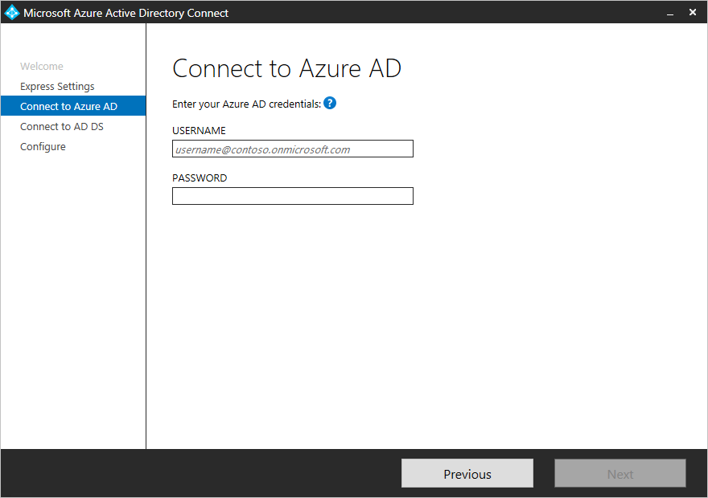

<properties
    pageTitle="Azure AD Connect︰ 使用快速設定快速入門 |Microsoft Azure"
    description="瞭解如何下載、 安裝及執行設定精靈的 Azure AD Connect。"
    services="active-directory"
    documentationCenter=""
    authors="andkjell"
    manager="femila"
    editor="curtand"/>

<tags
    ms.service="active-directory"
    ms.workload="identity"
    ms.tgt_pltfrm="na"
    ms.devlang="na"
    ms.topic="get-started-article"
    ms.date="09/13/2016"
    ms.author="billmath"/>

# 使用快速設定 Azure AD Connect 快速入門
您有單一樹系拓撲與驗證[密碼同步處理](../active-directory-aadconnectsync-implement-password-synchronization.md)時，會使用 azure AD 連線**快速設定**。 **快速設定**是預設的選項，並用於最常部署案例。 您是只按幾簡短下離開來擴充至雲端您內部部署的目錄。

開始安裝 Azure AD Connect 之前，務必先[下載 Azure AD Connect](http://go.microsoft.com/fwlink/?LinkId=615771)和完整的必要條件步驟[Azure AD Connect︰ 硬體和先決條件](../active-directory-aadconnect-prerequisites.md)。

如果快速設定不符拓撲，請參閱[相關的文件](#related-documentation)的其他案例。

## Express 安裝 Azure AD Connect
您可以看到 [[視訊](#videos)] 區段中的動作這些步驟。

1. 您想要在安裝 Azure AD Connect 伺服器本機系統管理員身分登入。 您應該在您想要同步處理伺服器的伺服器上執行此動作。
2. 瀏覽至並按兩下**AzureADConnect.msi**。
3. 在 [歡迎使用] 畫面上選取 [同意授權條款] 方塊，然後按一下 [**繼續**]。  
4. 在 [快速設定] 畫面中，按一下 [**使用快速設定**。  

5. 在 [連線至 Azure AD] 畫面中，輸入您 Azure AD 的使用者名稱和密碼全域管理員。 按一下 [**下一步**]。  
如果您收到錯誤訊息，並且有連線問題，請參閱[疑難排解連線問題](../active-directory-aadconnect-troubleshoot-connectivity.md)。
6. 在 [連線至 AD DS] 畫面中，輸入使用者名稱和密碼的企業系統管理員帳戶。 您可以輸入網域部分 NetBios 或 FQDN 格式，也就是 FABRIKAM\administrator 或 fabrikam.com\administrator。 按一下 [**下一步**]。  

7. [**登入設定 Azure AD**](../active-directory-aadconnect-user-signin.md#azure-ad-sign-in-configuration)頁面只會顯示是否您未完成[的先決條件](../active-directory-aadconnect-prerequisites.md)中的 [[驗證您的網域](../active-directory-add-domain.md)。
  
如果您看到此頁面，然後檢閱每一個標示為**未新增**及**驗證**的網域。 請確定您使用的網域已驗證 Azure AD 中。 已確認您的網域，請按一下 [重新整理符號]。
8. 在 [準備好設定畫面，按一下 [**安裝**]。
    - 您也可以在 [準備好設定] 頁面，您可以取消選取 [**開始同步處理程序完成設定為**核取方塊。 如果您想要執行其他設定，例如[篩選](../active-directory-aadconnectsync-configure-filtering.md)，您應該取消選取此核取方塊。 如果您取消選取這個選項，精靈會設定同步處理，但保留停用排程器。 它不會執行，直到您將它啟用手動重新執行[安裝精靈](../active-directory-aadconnectsync-installation-wizard.md)。
    - 如果您有 Exchange 您內部部署的 Active Directory 中時，您也可以啟用[**Exchange 混合式部署**](https://technet.microsoft.com/library/jj200581.aspx)的選項。 如果您打算在雲端和內部部署同時的 Exchange 信箱，請啟用此選項。

9. 安裝完成後，請按一下 [**結束**]。
10. 安裝完成後，登入並再次登入才能使用同步處理服務管理員或同步處理規則編輯器。

## 視訊

使用快速安裝的影片，請參閱︰

>[AZURE.VIDEO azure-active-directory-connect-express-settings]

## 後續步驟
現在，您有安裝 Azure AD Connect 可以[驗證安裝並指派授權](../active-directory-aadconnect-whats-next.md)。

進一步瞭解這些功能，與安裝已啟用︰[自動升級](../active-directory-aadconnect-feature-automatic-upgrade.md)、[防止意外刪除](../active-directory-aadconnectsync-feature-prevent-accidental-deletes.md)和[Azure AD 連線狀況](../active-directory-aadconnect-health-sync.md)。

進一步瞭解這些常見的主題︰[排程器，以及如何觸發同步處理](../active-directory-aadconnectsync-feature-scheduler.md)。

進一步瞭解[整合您的內部部署識別與 Azure Active Directory](../active-directory-aadconnect.md)。

## 相關文件

主題 |  
--------- | ---------
Azure AD Connect 概觀 | [整合您的內部部署識別與 Azure Active Directory](../active-directory-aadconnect.md)
安裝使用自訂的設定 | [自訂安裝 Azure AD Connect](active-directory-aadconnect-get-started-custom.md)
從 DirSync 升級 | [從 Azure AD 同步處理工具 (DirSync) 升級](active-directory-aadconnect-dirsync-upgrade-get-started.md)
安裝所用的帳戶 | [Azure AD Connect 帳戶和權限的詳細資訊](active-directory-aadconnect-accounts-permissions.md)
