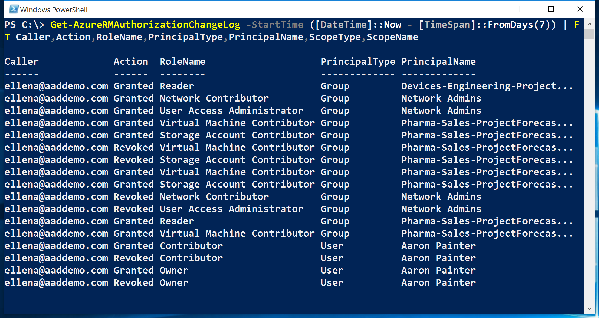

<properties
    pageTitle="建立 access 變更歷程記錄報表 |Microsoft Azure"
    description="產生報告，列出的存取權具有過去 90 天的角色型存取控制您 Azure 訂閱中的所有變更。"
    services="active-directory"
    documentationCenter=""
    authors="kgremban"
    manager="femila"
    editor=""/>

<tags
    ms.service="active-directory"
    ms.devlang="na"
    ms.topic="article"
    ms.tgt_pltfrm="na"
    ms.workload="identity"
    ms.date="08/03/2016"
    ms.author="kgremban"/>

# <a name="create-an-access-change-history-report"></a>建立 access 變更歷程記錄報表

當某人授與或撤銷存取您的訂閱中所做的變更取得登入 Azure 事件。 您可以建立 access 變更歷程記錄報表，以查看所有變更過去 90 天。

## <a name="create-a-report-with-azure-powershell"></a>使用 PowerShell 的 Azure 建立報表
若要建立 PowerShell access 變更歷程記錄報表中使用`Get-AzureRMAuthorizationChangeLog`] 命令。 需此 cmdlet 的詳細資訊，可在[PowerShell 圖庫](https://www.powershellgallery.com/packages/AzureRM.Storage/1.0.6/Content/ResourceManagerStartup.ps1)中。

當您呼叫此命令時，您可以指定您想要列，包括下列的工作分派的屬性︰

| 屬性 | 描述 |
| -------- | ----------- |
| **巨集指令** | Access 是否已授權或撤銷 |
| **來電者** | 負責存取變更擁有者 |
| **日期** | Access 已變更的時間與日期 |
| **DirectoryName** | Azure Active Directory 目錄 |
| **PrincipalName** | 使用者、 群組中或應用程式的名稱 |
| **PrincipalType** | 工作分派是否已使用者、 群組中，或應用程式 |
| **RoleId** | GUID 的已授權或撤銷的角色 |
| **角色名稱** | 已授權或撤銷角色 |
| **ScopeName** | 訂閱、 資源] 群組中或資源的名稱 |
| **ScopeType** | 工作分派是否已在訂閱、 資源] 群組中或資源範圍 |
| **SubscriptionId** | Azure 訂閱的 GUID |
| **SubscriptionName** | Azure 訂閱的名稱 |

此範例命令清單過去七天的訂閱中的所有 access 變更︰

```
Get-AzureRMAuthorizationChangeLog -StartTime ([DateTime]::Now - [TimeSpan]::FromDays(7)) | FT Caller,Action,RoleName,PrincipalType,PrincipalName,ScopeType,ScopeName
```



## <a name="create-a-report-with-azure-cli"></a>使用 Azure CLI 建立報表
若要建立 access 變更歷程記錄報表 Azure 命令列介面 (CLI)，請使用`azure role assignment changelog list`] 命令。

## <a name="export-to-a-spreadsheet"></a>匯出至試算表
若要儲存報表時，或管理資料]、 [匯出至.csv 檔案的存取變更。 您可以檢視報表以供檢閱試算表。


## <a name="see-also"></a>另請參閱
- 開始使用[Azure Role-Based 存取控制](role-based-access-control-configure.md)
- 使用[自訂 Azure RBAC 角色](role-based-access-control-custom-roles.md)
