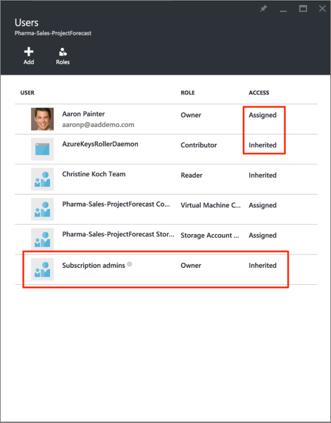
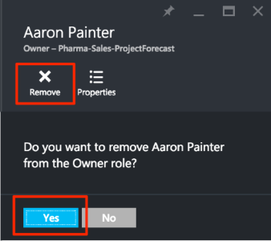

<properties
    pageTitle="Azure 入口網站中使用角色型存取控制 |Microsoft Azure"
    description="快速入門中存取管理 Azure 入口網站中的角色型存取控制。 若要將權限指派給您的資源使用角色指派。"
    services="active-directory"
    documentationCenter=""
    authors="kgremban"
    manager="femila"
    editor=""/>

<tags
    ms.service="active-directory"
    ms.devlang="na"
    ms.topic="get-started-article"
    ms.tgt_pltfrm="na"
    ms.workload="identity"
    ms.date="10/10/2016"
    ms.author="kgremban"/>

# 使用角色指派管理 Azure 訂閱資源的存取權

> [AZURE.SELECTOR]
- [管理存取權的使用者或群組](role-based-access-control-manage-assignments.md)
- [資源管理存取權](role-based-access-control-configure.md)

Azure 角色型存取控制 (RBAC) 可讓 Azure 精密存取管理。 使用 RBAC，您可以授與存取的數量，使用者需要執行工作。 本文可協助您快速上手的 RBAC Azure 入口網站中。 若要瞭解如何 RBAC 可協助您管理存取權的更多詳細資料，請參閱[什麼是角色型存取控制](role-based-access-control-what-is.md)。

## 檢視存取權
您可以看到哪些人擁有存取資源、 資源] 群組中，或訂閱從主刀[Azure 入口網站](https://portal.azure.com)中。 例如，我們想要查看誰有權存取我們資源群組的其中一個︰

1. 選取 [左側導覽列中的 [**資源群組**]。  
    
2. 從 [**資源群組**刀選取 [資源] 群組的名稱。
3. 選取左邊的功能表**存取控制 (IAM)** 。  
4. Access 控制項刀列出所有使用者、 群組和資源群組有權存取的應用程式。  

    

部分使用者已**指派**的通知他人**繼承**時可以存取。 Access 特別指派給資源群組，或繼承上層訂閱的工作分派。

> [AZURE.NOTE] 傳統訂閱管理員和共同管理員會被視為新 RBAC 模型中的訂閱的擁有者。

## 加入存取權限
您授與資源、 資源] 群組中或訂閱的角色指派的範圍內從 access。

1. 選取 [存取控制刀上的 [**新增**]。  
2. 選取您想要從**選取的角色**刀指派角色。
3. 選取您想要授與存取權的目錄中的使用者、 群組或應用程式。 您可以搜尋目錄的顯示名稱、 電子郵件地址，與物件識別碼。  

    

4. 選取**[確定**] 建立工作分派。 **新增使用者**快顯追蹤進度。  
    

在成功新增角色指派之後, 會出現在**使用者**刀。

## 移除存取

1. 選取上存取控制刀的角色指派。
2. 在 [工作分派的詳細資料刀中，選取 [**移除**]。  
3. 選取 [ **]**以確認移除。  
    

無法移除繼承的作業。 請注意，在下圖中的 [移除] 按鈕呈現灰色。 不過，查看**指派在**詳細資料。 移至要移除的角色指派那里列出的資源。

![使用者刀-繼承的存取停用移除] 按鈕的螢幕擷取畫面](./media/role-based-access-control-configure/remove-access2.png)

## 其他工具來管理存取權
您可以指派角色，並管理的 Azure RBAC 命令，在 [工具] 以外的 Azure 入口網站的存取權。  請深入瞭解必要條件並開始使用 Azure RBAC 命令的連結。

- [Azure PowerShell](role-based-access-control-manage-access-powershell.md)
- [Azure 命令列介面](role-based-access-control-manage-access-azure-cli.md)
- [REST API](role-based-access-control-manage-access-rest.md)

## 後續步驟
- [建立 access 變更歷程記錄報表](role-based-access-control-access-change-history-report.md)
- 請參閱[RBAC 內建的角色](role-based-access-built-in-roles.md)
- 定義自己的[自訂 Azure RBAC 角色](role-based-access-control-custom-roles.md)
