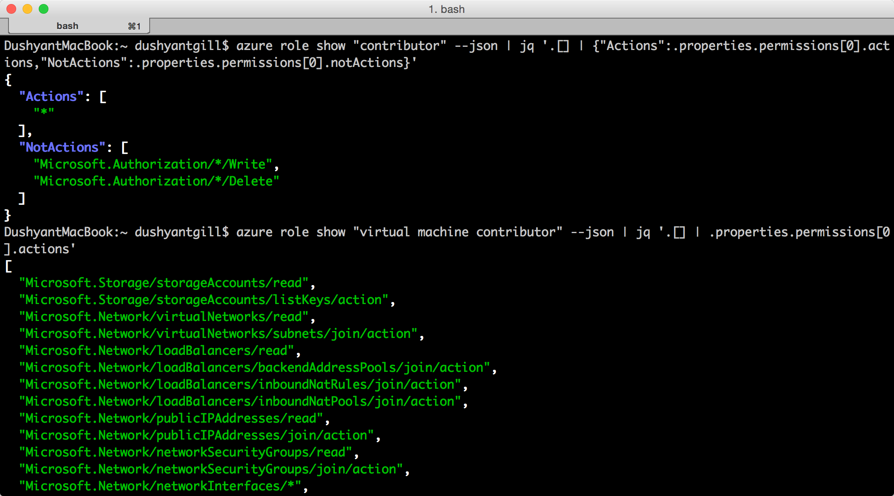
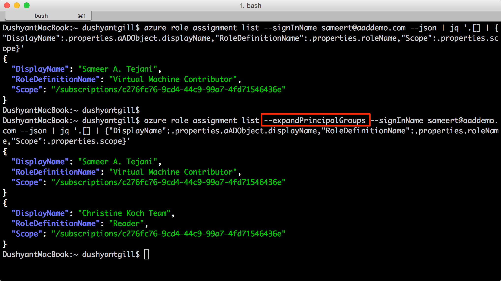
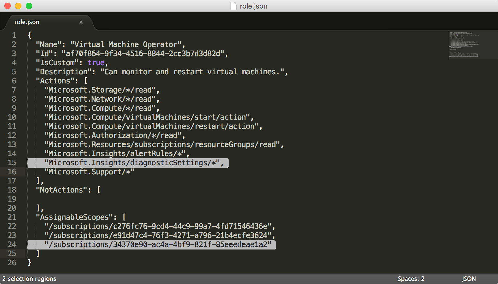
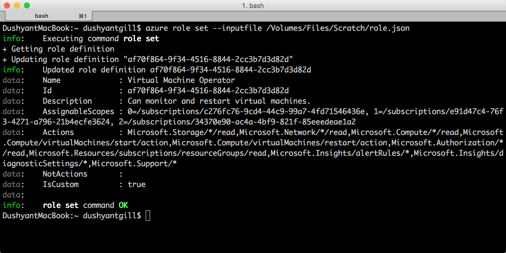
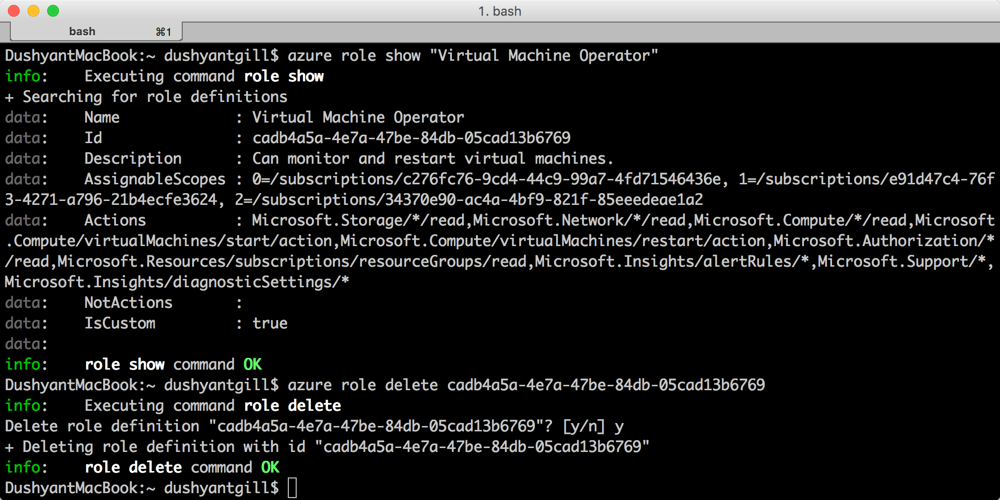

<properties
    pageTitle="管理角色型存取控制 (RBAC) 與 Azure CLI |Microsoft Azure"
    description="瞭解如何管理角色型存取控制 (RBAC) Azure 的命令列介面，列出角色和角色動作，並將角色指派給訂閱與應用程式的範圍。"
    services="active-directory"
    documentationCenter=""
    authors="kgremban"
    manager="femila"
    editor=""/>

<tags
    ms.service="active-directory"
    ms.devlang="na"
    ms.topic="article"
    ms.tgt_pltfrm="na"
    ms.workload="identity"
    ms.date="07/22/2016"
    ms.author="kgremban"/>

# <a name="manage-role-based-access-control-with-the-azure-command-line-interface"></a>管理角色型存取控制 Azure 的命令列介面

> [AZURE.SELECTOR]
- [PowerShell](role-based-access-control-manage-access-powershell.md)
- [Azure CLI](role-based-access-control-manage-access-azure-cli.md)
- [REST API](role-based-access-control-manage-access-rest.md)

您可以使用角色型存取控制 (RBAC)，在 Azure 入口網站和 Azure 資源管理員 API 管理存取您的訂閱和精密的層級的資源。 使用此功能，您都可以在特定範圍，指派給他們的某些角色來授與 Active Directory 使用者、 群組或服務原則的存取權。

您可以使用 Azure 的命令列介面 (CLI) 來管理 RBAC 之前，您必須具備下列項目︰

- Azure CLI 0.8.8 版本或更新版本。 若要安裝最新版本，並將它與 Azure 訂閱關聯，請參閱[安裝及設定 Azure CLI](../xplat-cli-install.md)。
- Azure Azure CLI 中的 [資源管理員。 如需詳細資訊，請移至[使用 Azure CLI 與資源管理員](../xplat-cli-azure-resource-manager.md)。

## <a name="list-roles"></a>清單中的角色

### <a name="list-all-available-roles"></a>列出所有可用的角色
若要在清單中所有可用的角色，使用︰

        azure role list

下列範例會顯示*所有可用的角色*的清單。

```
azure role list --json | jq '.[] | {"roleName":.properties.roleName, "description":.properties.description}'
```


### <a name="list-actions-of-a-role"></a>清單動作的角色
若要在清單中的角色動作，使用︰

    azure role show "<role name>"

下列範例顯示的*參與者*和*虛擬機器參與者*的角色的動作。

```
azure role show "contributor" --json | jq '.[] | {"Actions":.properties.permissions[0].actions,"NotActions":properties.permissions[0].notActions}'

azure role show "virtual machine contributor" --json | jq '.[] | .properties.permissions[0].actions'
```



##  <a name="list-access"></a>清單存取
### <a name="list-role-assignments-effective-on-a-resource-group"></a>清單角色指派有效資源群組
若要存在於資源群組中的角色指派] 清單中，使用︰

    azure role assignment list --resource-group <resource group name>

下列範例會顯示 [ *pharma-銷售-projecforcast* ] 群組中的角色指派。

```
azure role assignment list --resource-group pharma-sales-projecforcast --json | jq '.[] | {"DisplayName":.properties.aADObject.displayName,"RoleDefinitionName":.properties.roleName,"Scope":.properties.scope}'
```

![RBAC Azure 命令列 azure 角色指派清單] 群組中的螢幕擷取畫面](./media/role-based-access-control-manage-access-azure-cli/4-azure-role-assignment-list-1.png)

### <a name="list-role-assignments-for-a-user"></a>清單中，為使用者的角色指派
若要在清單中的特定使用者的角色指派及指派給使用者的群組的工作分派，使用︰

    azure role assignment list --signInName <user email>

您也可以查看繼承修改] 命令以群組的角色指派︰

    azure role assignment list --expandPrincipalGroups --signInName <user email>

下列範例顯示的角色指派授權給*sameert@aaddemo.com*使用者。 這包含直接指派給使用者的角色和繼承自群組的角色。

```
azure role assignment list --signInName sameert@aaddemo.com --json | jq '.[] | {"DisplayName":.properties.aADObject.DisplayName,"RoleDefinitionName":.properties.roleName,"Scope":.properties.scope}'

azure role assignment list --expandPrincipalGroups --signInName sameert@aaddemo.com --json | jq '.[] | {"DisplayName":.properties.aADObject.DisplayName,"RoleDefinitionName":.properties.roleName,"Scope":.properties.scope}'
```



##  <a name="grant-access"></a>授與存取權
若要授與存取權之後您找出您想要指派的角色,，使用︰

    azure role assignment create

### <a name="assign-a-role-to-group-at-the-subscription-scope"></a>將角色指派給在訂閱的範圍內的群組
若要在訂閱的範圍內群組指派角色，請使用︰

    azure role assignment create --objectId  <group object id> --roleName <name of role> --subscription <subscription> --scope <subscription/subscription id>

下列範例會將*讀取者*角色指派給*Christine Koch 小組*在*訂閱*的範圍內。


### <a name="assign-a-role-to-an-application-at-the-subscription-scope"></a>在訂閱的範圍內的應用程式中指派角色
若要指派角色訂閱範圍的應用程式，請使用︰

    azure role assignment create --objectId  <applications object id> --roleName <name of role> --subscription <subscription> --scope <subscription/subscription id>

下列範例會授與所選的訂閱*Azure AD*應用程式的*參與者*角色。

 

### <a name="assign-a-role-to-a-user-at-the-resource-group-scope"></a>角色指派給使用者在 [資源] 群組中的範圍
若要在資源] 群組中的範圍內使用者指派角色，請使用︰

    azure role assignment create --signInName  <user email address> --roleName "<name of role>" --resourceGroup <resource group name>

下列範例會授與的*虛擬機器參與者*角色*samert@aaddemo.com* *Pharma-銷售-ProjectForcast*資源群組範圍的使用者。


### <a name="assign-a-role-to-a-group-at-the-resource-scope"></a>指派資源範圍內群組的角色
若要在資源的範圍內群組指派角色，請使用︰

    azure role assignment create --objectId <group id> --role "<name of role>" --resource-name <resource group name> --resource-type <resource group type> --parent <resource group parent> --resource-group <resource group>

下列範例會是*Azure AD*群組在*子網路*上的*虛擬機器參與者*角色。


##  <a name="remove-access"></a>移除存取
若要移除的角色指派，請使用︰

    azure role assignment delete --objectId <object id to from which to remove role> --roleName "<role name>"

下列範例會移除中的*虛擬機器參與者*角色指派*sammert@aaddemo.com* *Pharma-銷售-ProjectForcast*資源群組的使用者。
範例會從訂閱群組，然後移除的角色指派。


## <a name="create-a-custom-role"></a>建立自訂的角色
若要建立自訂的角色，請使用︰

    azure role create --inputfile <file path>

下列範例會建立自訂的角色，稱為 「*虛擬機器運算子*。 自訂角色授與存取權的*Microsoft.Compute* *Microsoft.Storage*，與*Microsoft.Network*資源提供者所有讀取作業授與存取權開始，請重新啟動，並監控虛擬機器。 在訂閱中兩個可自訂的角色。 此範例使用 JSON 檔案做為輸入。


## <a name="modify-a-custom-role"></a>修改自訂的角色

若要修改自訂角色，首先請使用`azure role show`擷取角色定義] 命令。 第二，進行所要的變更角色定義檔案。 最後，請使用`azure role set`儲存已修改的角色定義。

    azure role set --inputfile <file path>

下列範例會新增至**動作**和 Azure **AssignableScopes**訂閱的虛擬機器運算子自訂角色的*Microsoft.Insights/diagnosticSettings/*作業。





## <a name="delete-a-custom-role"></a>刪除自訂的角色

若要刪除自訂的角色，請先使用`azure role show`命令，以決定角色的**識別碼**。 接著，使用`azure role delete`指定**識別碼**，刪除該角色的命令。

下列範例會移除自訂*的虛擬機器運算子*的角色。



## <a name="list-custom-roles"></a>自訂清單的角色

若要在清單中所使用的範圍的工作分派的角色，使用`azure role list`] 命令。

下列範例會列出所有角色所使用的工作分派在選取的訂閱。

```
azure role list --json | jq '.[] | {"name":.properties.roleName, type:.properties.type}'
```


在下列範例中，因為該訂閱不在該角色**AssignableScopes** ，無法使用*Production4*訂閱中的*虛擬機器運算子*自訂角色。

```
azure role list --json | jq '.[] | if .properties.type == "CustomRole" then .properties.roleName else empty end'
```


## <a name="rbac-topics"></a>RBAC 主題
[AZURE.INCLUDE [role-based-access-control-toc.md](../../includes/role-based-access-control-toc.md)]
