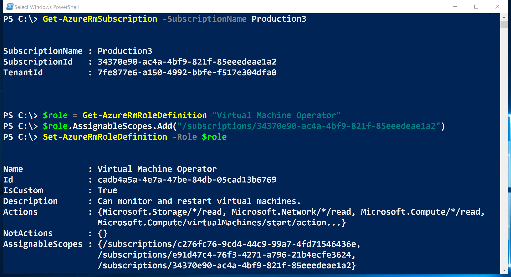

<properties
    pageTitle="管理角色型存取控制 (RBAC) 使用 PowerShell 的 Azure |Microsoft Azure"
    description="如何管理 RBAC 使用 PowerShell 的 Azure，包括列出角色、 指派角色，以及刪除角色指派。"
    services="active-directory"
    documentationCenter=""
    authors="kgremban"
    manager="femila"
    editor=""/>

<tags
    ms.service="active-directory"
    ms.devlang="na"
    ms.topic="article"
    ms.tgt_pltfrm="na"
    ms.workload="identity"
    ms.date="07/22/2016"
    ms.author="kgremban"/>

# <a name="manage-role-based-access-control-with-azure-powershell"></a>管理角色型存取控制使用 Azure PowerShell

> [AZURE.SELECTOR]
- [PowerShell](role-based-access-control-manage-access-powershell.md)
- [Azure CLI](role-based-access-control-manage-access-azure-cli.md)
- [REST API](role-based-access-control-manage-access-rest.md)


您可以使用角色型存取控制 (RBAC)，在 Azure 入口網站和 Azure 資源管理 API 來管理您的訂閱精密的層級的存取權。 使用此功能，您都可以在特定範圍，指派給他們的某些角色來授與 Active Directory 使用者、 群組或服務原則的存取權。

您可以使用 PowerShell 來管理 RBAC 之前，您必須具備下列項目︰

- Azure PowerShell 0.8.8 版本或更新版本。 若要安裝最新版本，並將它與 Azure 訂閱關聯，請參閱[如何安裝和設定 PowerShell 的 Azure](../powershell-install-configure.md)。

- Azure 資源管理員 cmdlet。 安裝在 PowerShell 的[Azure 資源管理員 cmdlet](https://msdn.microsoft.com/library/mt125356.aspx) 。

## <a name="list-roles"></a>清單中的角色

### <a name="list-all-available-roles"></a>列出所有可用的角色
可供工作分派，若要檢查的作業他們授與存取權，使用清單 RBAC 角色`Get-AzureRmRoleDefinition`。

```
Get-AzureRmRoleDefinition | FT Name, Description
```


### <a name="list-actions-of-a-role"></a>清單動作的角色
若要在清單中特定角色的動作，使用`Get-AzureRmRoleDefinition <role name>`。

```
Get-AzureRmRoleDefinition Contributor | FL Actions, NotActions

(Get-AzureRmRoleDefinition "Virtual Machine Contributor").Actions
```


## <a name="see-who-has-access"></a>誰有權存取
若要 RBAC 存取工作分派] 清單中，使用`Get-AzureRmRoleAssignment`。

### <a name="list-role-assignments-at-a-specific-scope"></a>在特定範圍內的清單角色指派
您可以看到指定的訂閱、 資源] 群組中，或資源的所有 access 工作分派。 例如，若要查看作用中的所有工作分派的資源群組，請使用`Get-AzureRmRoleAssignment -ResourceGroupName <resource group name>`。

```
Get-AzureRmRoleAssignment -ResourceGroupName Pharma-Sales-ProjectForcast | FL DisplayName, RoleDefinitionName, Scope
```


### <a name="list-roles-assigned-to-a-user"></a>清單角色指派給使用者
若要在清單中所有的角色指派給指定的使用者並指派給使用者所屬的群組的角色，使用`Get-AzureRmRoleAssignment -SignInName <User email> -ExpandPrincipalGroups`。

```
Get-AzureRmRoleAssignment -SignInName sameert@aaddemo.com | FL DisplayName, RoleDefinitionName, Scope

Get-AzureRmRoleAssignment -SignInName sameert@aaddemo.com -ExpandPrincipalGroups | FL DisplayName, RoleDefinitionName, Scope
```


### <a name="list-classic-service-administrator-and-coadmin-role-assignments"></a>清單傳統服務管理員和 coadmin 角色指派
清單存取工作分派的傳統訂閱系統管理員和 coadministrators，使用︰

    Get-AzureRmRoleAssignment -IncludeClassicAdministrators

## <a name="grant-access"></a>授與存取權
### <a name="search-for-object-ids"></a>搜尋物件識別碼
若要指派角色，您需要找出物件 （使用者、 群組或應用程式） 和範圍。

如果您不知道訂閱 ID，您可以在 Azure 入口網站上**的訂閱**刀中找到它。 若要瞭解如何查詢訂閱 id，請參閱 MSDN 上的[取得 AzureSubscription](https://msdn.microsoft.com/library/dn495302.aspx) 。

若要取得 Azure AD 群組物件識別碼，請使用︰

    Get-AzureRmADGroup -SearchString <group name in quotes>

若要取得 Azure AD 服務主要或應用程式的物件識別碼，請使用︰

    Get-AzureRmADServicePrincipal -SearchString <service name in quotes>

### <a name="assign-a-role-to-an-application-at-the-subscription-scope"></a>在訂閱的範圍內的應用程式中指派角色
若要授與存取權在訂閱的範圍內的應用程式，使用︰

    New-AzureRmRoleAssignment -ObjectId <application id> -RoleDefinitionName <role name> -Scope <subscription id>


### <a name="assign-a-role-to-a-user-at-the-resource-group-scope"></a>角色指派給使用者在 [資源] 群組中的範圍
若要存取權授與使用者在 [資源] 群組中的範圍，請使用︰

    New-AzureRmRoleAssignment -SignInName <email of user> -RoleDefinitionName <role name in quotes> -ResourceGroupName <resource group name>


### <a name="assign-a-role-to-a-group-at-the-resource-scope"></a>指派資源範圍內群組的角色
若要存取權授與群組在資源的範圍內，使用︰

    New-AzureRmRoleAssignment -ObjectId <object id> -RoleDefinitionName <role name in quotes> -ResourceName <resource name> -ResourceType <resource type> -ParentResource <parent resource> -ResourceGroupName <resource group name>


## <a name="remove-access"></a>移除存取
若要移除的使用者、 群組和應用程式存取，請使用︰

    Remove-AzureRmRoleAssignment -ObjectId <object id> -RoleDefinitionName <role name> -Scope <scope such as subscription id>


## <a name="create-a-custom-role"></a>建立自訂的角色
若要建立自訂的角色，請使用`New-AzureRmRoleDefinition`] 命令。

當您使用 PowerShell 來建立自訂的角色時，您需要啟動的其中一個[內建的角色](role-based-access-built-in-roles.md)。 編輯以新增*動作*、 *notActions*或*範圍*] 屬性，然後儲存變更為新的角色。

下列範例的*虛擬機器參與者*角色與啟動，並使用它來建立自訂的角色，稱為 「*虛擬機器運算子*。 新的角色授與存取權的*Microsoft.Compute* *Microsoft.Storage*，與*Microsoft.Network*資源提供者所有讀取作業授與存取權開始，請重新啟動，並監控虛擬機器。 在訂閱中兩個可自訂的角色。

```
$role = Get-AzureRmRoleDefinition "Virtual Machine Contributor"
$role.Id = $null
$role.Name = "Virtual Machine Operator"
$role.Description = "Can monitor and restart virtual machines."
$role.Actions.Clear()
$role.Actions.Add("Microsoft.Storage/*/read")
$role.Actions.Add("Microsoft.Network/*/read")
$role.Actions.Add("Microsoft.Compute/*/read")
$role.Actions.Add("Microsoft.Compute/virtualMachines/start/action")
$role.Actions.Add("Microsoft.Compute/virtualMachines/restart/action")
$role.Actions.Add("Microsoft.Authorization/*/read")
$role.Actions.Add("Microsoft.Resources/subscriptions/resourceGroups/read")
$role.Actions.Add("Microsoft.Insights/alertRules/*")
$role.Actions.Add("Microsoft.Support/*")
$role.AssignableScopes.Clear()
$role.AssignableScopes.Add("/subscriptions/c276fc76-9cd4-44c9-99a7-4fd71546436e")
$role.AssignableScopes.Add("/subscriptions/e91d47c4-76f3-4271-a796-21b4ecfe3624")
New-AzureRmRoleDefinition -Role $role
```


## <a name="modify-a-custom-role"></a>修改自訂的角色
若要修改自訂角色，請先使用`Get-AzureRmRoleDefinition`擷取的角色定義] 命令。 第二，對角色定義所需的變更。 最後，請使用`Set-AzureRmRoleDefinition`儲存已修改的角色定義] 命令。

下列範例會`Microsoft.Insights/diagnosticSettings/*`作業的*虛擬機器運算子*自訂角色。

```
$role = Get-AzureRmRoleDefinition "Virtual Machine Operator"
$role.Actions.Add("Microsoft.Insights/diagnosticSettings/*")
Set-AzureRmRoleDefinition -Role $role
```


下列範例會加入的*虛擬機器運算子*自訂角色指派的範圍中的 Azure 的訂閱。

```
Get-AzureRmSubscription - SubscriptionName Production3

$role = Get-AzureRmRoleDefinition "Virtual Machine Operator"
$role.AssignableScopes.Add("/subscriptions/34370e90-ac4a-4bf9-821f-85eeedead1a2"
Set-AzureRmRoleDefinition -Role $role)
```



## <a name="delete-a-custom-role"></a>刪除自訂的角色

若要刪除自訂的角色，請使用`Remove-AzureRmRoleDefinition`] 命令。

下列範例會移除自訂*的虛擬機器運算子*的角色。

```
Get-AzureRmRoleDefinition "Virtual Machine Operator"

Get-AzureRmRoleDefinition "Virtual Machine Operator" | Remove-AzureRmRoleDefinition
```


## <a name="list-custom-roles"></a>自訂清單的角色
若要在清單中所使用的範圍的工作分派的角色，使用`Get-AzureRmRoleDefinition`] 命令。

下列範例會列出所有角色所使用的工作分派在選取的訂閱。

```
Get-AzureRmRoleDefinition | FT Name, IsCustom
```


在下列範例中，因為該訂閱不在該角色**AssignableScopes** ，無法使用*Production4*訂閱中的*虛擬機器運算子*自訂角色。


## <a name="see-also"></a>另請參閱
- [使用 Azure PowerShell 的 Azure 資源管理員](../powershell-azure-resource-manager.md)
[AZURE.INCLUDE [role-based-access-control-toc.md](../../includes/role-based-access-control-toc.md)]
