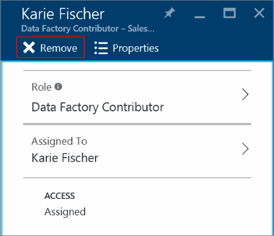

<properties
    pageTitle="檢視 Azure 資源存取分派 |Microsoft Azure"
    description="檢視及管理的任何使用者或群組 Azure 入口網站中的所有角色型存取控制作業"
    services="active-directory"
    documentationCenter=""
    authors="kgremban"
    manager="femila"
    editor="jeffsta"/>

<tags
    ms.service="active-directory"
    ms.devlang="na"
    ms.topic="article"
    ms.tgt_pltfrm="na"
    ms.workload="identity"
    ms.date="10/10/2016"
    ms.author="kgremban"/>

# 使用者和群組 Azure 入口網站-公用預覽中的檢視 access 工作分派

> [AZURE.SELECTOR]
- [管理存取權的使用者或群組](role-based-access-control-manage-assignments.md)
- [資源管理存取權](role-based-access-control-configure.md)

使用角色型存取控制 (RBAC) Azure Active Directory 預覽中，您可以管理存取 Azure 資源。 [什麼是在預覽中？](active-directory-preview-explainer.md)

存取 RBAC 指派給是微調，因為您可以限制權限的兩種方式︰

- **範圍︰**範圍只限 RBAC 角色指派到特定的訂閱、 資源] 群組中或資源。 提供存取到單一資源的使用者無法存取同一份訂閱中的任何其他資源。
- **角色︰**存取範圍縮小範圍內的作業，可以將角色指派。 角色可以是高層級的例如擁有者，或特定，例如虛擬機器閱讀程式。

訂閱、 資源] 群組中或資源工作分派的範圍內只能從指派角色。 但您可以在單一位置檢視特定的使用者或群組的所有 access 工作分派。

取得有關如何[使用角色指派管理 Azure 訂閱資源的存取權](role-based-access-control-configure.md)的詳細資訊。

##  檢視 access 工作分派

若要尋找的單一使用者或群組的存取指派，啟動[Azure 入口網站](http://portal.azure.com)中的 Azure Active Directory 中。

1. 選取 [ **Azure Active Directory**]。 如果功能清單上看不到 [此選項，選取 [**更多服務**]，然後向下尋找**Azure Active Directory**捲動。
2. 選取 [**使用者和群組]**，然後再是**所有使用者**或**所有群組**。 例如，我們焦點放在個別的使用者。
    
3. 使用名稱或使用者名稱搜尋使用者。
4. 選取 [使用者刀上的 [ **Azure 資源**]。 會顯示該使用者的所有 access 工作分派。

### 若要檢視的工作分派的讀取權限

此頁面只會顯示您有讀取權限存取工作分派。 例如，您有訂閱的 「 讀取 」 權限，並移至 Azure 資源刀檢查使用者的工作分派。 您可以查看其存取權的工作分派訂閱，但不會看到她也有訂閱 b 的存取權的工作分派

## 刪除存取工作分派

從這個刀，您可以刪除直接指派給使用者或群組的存取工作分派。 Access 的指定繼承自父群組，如果您要移至 [訂閱的資源，及管理工作分派那里。

1. 從清單中的使用者或群組的所有 access 作業，選取您想要刪除的項目。
2. **移除**選取，然後選取**[是]**以確認。
    

## 相關的主題

- [使用管理 Azure 訂閱資源的存取權的角色指派](role-based-access-control-configure.md)角色型存取控制快速入門
- 請參閱[RBAC 內建的角色](role-based-access-built-in-roles.md)
