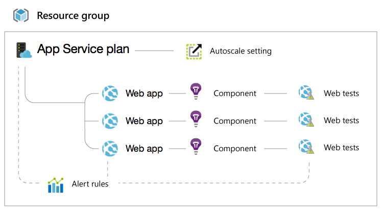

<properties
    pageTitle="角色存取控制疑難排解 |Microsoft Azure"
    description="取得問題或角色基礎存取控制資源的相關問題的說明。"
    services="azure-portal"
    documentationCenter="na"
    authors="kgremban"
    manager="femila"
    editor=""/>

<tags
    ms.service="active-directory"
    ms.workload="identity"
    ms.tgt_pltfrm="na"
    ms.devlang="na"
    ms.topic="article"
    ms.date="07/12/2016"
    ms.author="kgremban"/>

# 角色型存取控制疑難排解

## 簡介

[角色型存取控制](role-based-access-control-configure.md)是一種強大的功能，可讓您微調代理人 Azure 中的資源。 這表示您可以覺得自信授與特定人員的權限使用完全他們的需求，而不需。 不過，有時候 Azure 資源的資源模型可能很複雜，很難瞭解完全什麼您要授予權限。

這份文件可讓您知道 Azure 入口網站中使用的某些角色時，發生的事。 下列三種角色涵蓋所有的資源類型︰

- 擁有者  
- 參與者  
- 閱讀程式  

擁有者和參與者的完整存取權的管理體驗，但是參與者無法存取權授與其他使用者或群組。 變得更有趣的讀取者角色，，因此我們將會花點時間。 如何授與存取權，請參閱[角色型存取控制取得使用文章](role-based-access-control-configure.md)︰ 如需詳細資訊。

## 應用程式服務負載

### 寫入存取權的功能

如果您授與使用者唯讀存取權的單一 web 應用程式時，某些功能已停用，您可能未預期。 下列管理功能需要**寫入**存取權 （參與者或擁有者），在 web 應用程式，並在任何唯讀的案例中無法使用。

- 命令 （例如開始、 停止等）
- 變更設定，例如一般設定、 縮放設定、 備份設定]，並監控設定
- 存取發佈的認證與其他機密等應用程式設定] 和 [連線字串
- 串流記錄
- 診斷記錄設定
- 主控台 （在 [命令提示字元中）
- 作用中] 與 [最近的部署 （適用於本機給連續部署）
- 估計花
- Web 測試
- 虛擬網路 （僅限讀取程式如果虛擬網路先前已設定與寫入存取權的使用者可看到）。

如果您無法存取任何這些磚，您將必須要求您的系統管理員參與者存取 web 應用程式。

### 處理相關資源

Web 應用程式會更複雜的幾個不同的資源 interplay。 以下是幾個網站的一般資源群組︰

因此，如果您授與其他人的存取權只 web 應用程式時，大部分的網站刀 Azure 入口網站中的功能將會停用。

這些項目需要**寫入**存取權對應到您的網站**應用程式服務方案**︰  

- 檢視 web 應用程式的價格層 （免費或標準）  
- 縮放比例設定 （數字的執行個體虛擬機器大小、 設定自動調整大小）  
- 配額 （儲存空間，頻寬，CPU）  

這些項目需要**寫入**存取權包含您的網站的整個**資源群組**︰  

- SSL 憑證和繫結 （這是因為 SSL 憑證可以共用相同的 [資源] 群組中的網站和地理位置之間）  
- 通知的規則  
- 自動調整大小的設定  
- 應用程式的深入見解元件  
- Web 測試  

## 虛擬機器負載

很像使用 web apps 虛擬機器刀的部分功能需要寫入存取權的虛擬機器，或 [資源] 群組中的其他資源。

虛擬機器相關的網域名稱、 虛擬網路、 儲存帳戶和通知的規則。

這些項目需要**寫入**存取權**的虛擬機器**︰

- 結束點  
- IP 位址  
- 磁碟  
- 副檔名  

這些需要**寫入**存取權**虛擬機器**中，與**資源群組**（以及網域名稱），則中︰  

- 顯示狀態設定  
- 負載平衡的設定  
- 通知的規則  

如果您無法存取任何這些磚，您將必須要求您的系統管理員的參與者存取資源群組。

## 查看更多
- [以存取控制項的角色](role-based-access-control-configure.md)︰ 快速入門 RBAC Azure 入口網站中。
- [內建的角色](role-based-access-built-in-roles.md)︰ 取得標準 RBAC 中的角色的相關詳細資料。
- [Azure RBAC 自訂角色](role-based-access-control-custom-roles.md)︰ 了解如何建立自訂的角色，以符合您的 access 需求。
- [建立 access 變更記錄報告](role-based-access-control-access-change-history-report.md)︰ 追蹤的變更 RBAC 中的角色指派。
