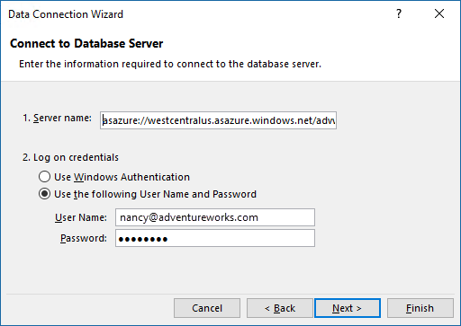
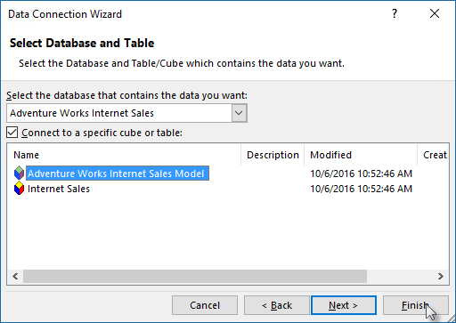

<properties
   pageTitle="從 Azure Analysis Services 取得資料 |Microsoft Azure"
   description="瞭解如何連線到，並從 Analysis Services 伺服器 Azure 中取得資料。"
   services="analysis-services"
   documentationCenter=""
   authors="minewiskan"
   manager="erikre"
   editor=""
   tags=""/>
<tags
   ms.service="analysis-services"
   ms.devlang="NA"
   ms.topic="article"
   ms.tgt_pltfrm="NA"
   ms.workload="na"
   ms.date="10/24/2016"
   ms.author="owend"/>

# <a name="get-data-from-azure-analysis-services"></a>從 Azure Analysis Services 取得資料
Azure 中建立伺服器並部署的表格式模型之後，您組織中的使用者準備好連線並開始探索資料。

Azure Analysis Services 支援使用[更新物件模型](#client-libraries); 的用戶端連線TOM、 AMO、 Adomd.Net 或 MSOLAP，透過 xmla 至伺服器的連線。 例如，Power BI、 Power BI Desktop、 Excel 或任何支援的物件模型的協力廠商用戶端應用程式。

## <a name="server-name"></a>伺服器名稱
當您建立的 Analysis Services 伺服器 Azure 中時，您可以指定唯一的名稱和伺服器可建立區域。 指定連線的伺服器名稱，伺服器命名配置時︰
```
<protocol>://<region>/<servername>
```
 通訊協定是字串**asazure**，地區是 Uri 建立伺服器的區域 (例如西美國，westus.asazure.windows.net) 和伺服器名稱是您唯一的伺服器的區域內的名稱。

## <a name="get-the-server-name"></a>取得的伺服器名稱
在連接之前，您需要取得的伺服器名稱。 **Azure 入口網站**中 > 伺服器 >**概觀** > **伺服器名稱**，複製整個伺服器名稱。 如果貴組織中的其他使用者太連線到此伺服器，您要與其共用此伺服器名稱。 指定 [伺服器名稱，必須使用完整路徑。


## <a name="connect-in-power-bi-desktop"></a>在 Power BI Desktop 中連線

> [AZURE.NOTE] 這項功能預覽。

1. 在[Power BI Desktop](https://powerbi.microsoft.com/desktop/)中，按一下 [**取得資料** > **資料庫** > **Azure Analysis Services**。

2. 在 [**伺服器**] 中，貼上剪貼簿中的伺服器名稱。

3. 在**資料庫**中，如果您知道表格式模型資料庫或您要連線的觀點來看的名稱，貼上，在這裡。 否則，您可以將此欄位保留空白。 您可以選取資料庫或觀點來看下一個畫面。

4. 預設**連線 live**選項保持選取，然後按下**連線**。 如果系統提示您輸入帳戶，請輸入您的組織帳戶。

5. 在 [**導覽]**中，展開伺服器，然後選取 [模型] 或 [您要連線的觀點來看，然後按一下 [**連線**]。 按一下模型或檢視方塊上的顯示檢視的所有的物件。


## <a name="connect-in-power-bi"></a>在 Power BI 中連線
1. 建立您的伺服器有連線至您的模型的 Power BI Desktop 檔案。

2. 在[Power BI](https://powerbi.microsoft.com)，按一下 [**取得資料** > **檔案**。 找出並選取您的檔案。


## <a name="connect-in-excel"></a>在 Excel 中連線
使用 Excel 2016 中的 [取得資料] 或 [在舊版中的 Power Query 連線到 Excel 中的 Azure Analysis Services 伺服器支援。 需要[MSOLAP.7 提供者](https://aka.ms/msolap)。 不支援使用 Power Pivot 中的匯入資料表精靈連線。

1. 在 Excel 2016 中的 [**資料**] 功能區中，按一下 [**取得外部資料** > **從其他來源** > **從 Analysis Services**。

2. 在 [資料連線精靈中，在 [**伺服器名稱**貼上剪貼簿中的伺服器名稱。 然後在 [**登入認證**，選取 [**使用下列的使用者名稱和密碼**，然後再輸入組織的使用者名稱，例如nancy@adventureworks.com,和密碼。

    

4. 在**選取資料庫及表格**，請選取資料庫及模型或觀點來看，，然後按一下 [**完成]**。

    

## <a name="connection-string"></a>連線字串
連接至 Azure Analysis Services 使用表格式物件模型時，請使用下列的連線字串格式︰

###### <a name="integrated-azure-active-directory-authentication"></a>整合式的 Azure Active Directory 驗證
```
"Provider=MSOLAP;Data Source=<Azure AS instance name>;"
```
如果使用的 Azure Active Directory 認證快取挑選整合式的驗證。 如果沒有，會顯示 Azure 登入視窗。

###### <a name="azure-active-directory-authentication-with-username-and-password"></a>Azure Active Directory 驗證的使用者名稱和密碼
```
"Provider=MSOLAP;Data Source=<Azure AS instance name>;User ID=<user name>;Password=<password>;Persist Security Info=True; Impersonation Level=Impersonate;";
```

## <a name="client-libraries"></a>用戶端文件庫
在 Excel 或其他介面，例如明揚、 AsCmd、 ADOMD.NET，以連線至 Azure Analysis Services，您可能需要安裝最新的提供者用戶端文件庫。 取得最新︰  

[MSOLAP (amd64)](https://go.microsoft.com/fwlink/?linkid=829576)</br>
[MSOLAP (x86)](https://go.microsoft.com/fwlink/?linkid=829575)</br>
[AMO](https://go.microsoft.com/fwlink/?linkid=829578)</br>
[ADOMD](https://go.microsoft.com/fwlink/?linkid=829577)</br>


## <a name="next-steps"></a>後續步驟
[管理您的伺服器](analysis-services-manage.md)
