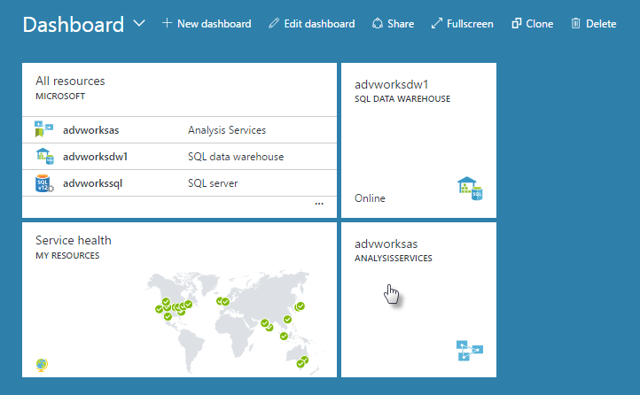

<properties
   pageTitle="Azure 中建立的 Analysis Services 伺服器 |Microsoft Azure"
   description="瞭解如何建立 Azure 中的 Analysis Services 伺服器執行個體。"
   services="analysis-services"
   documentationCenter=""
   authors="minewiskan"
   manager="erikre"
   editor=""
   tags=""/>
<tags
   ms.service="analysis-services"
   ms.devlang="NA"
   ms.topic="article"
   ms.tgt_pltfrm="NA"
   ms.workload="na"
   ms.date="10/24/2016"
   ms.author="owend"/>

# 建立 Analysis Services 伺服器
本文會引導您 Azure 訂閱中建立新的 Analysis Services 伺服器資源。

## 開始之前
若要開始，您需要︰

- **Azure 訂閱**︰ 造訪[Azure 免費試用版](https://azure.microsoft.com/offers/ms-azr-0044p/)建立帳戶。
- **資源群組**︰ 使用您已經有的資源群組或[建立新的範本](../azure-resource-manager/resource-group-overview.md)。

> [AZURE.NOTE] 建立 Analysis Services 伺服器，可能會導致計費服務]。 若要深入瞭解，請參閱 Analysis Services 價格。

## 建立 Analysis Services 伺服器

1. [Azure 入口網站](https://portal.azure.com)登入。

2. 按一下 [ **+ 新增** > **智慧 + 分析** > **Analysis Services**。

3. 在**Analysis Services**刀中，[必要] 欄位中填滿，然後按下**建立**。

    

    - **伺服器名稱**︰ 輸入唯一的名稱，用來參照到伺服器。

    - **訂閱**︰ 選取 [的訂閱此伺服器帳單，以]。

    - **資源群組**︰ 這些是設計用來協助您管理 Azure 資源的集合容器。 若要深入瞭解，請參閱[資源群組](../resource-group-overview.md)。

    - **位置**︰ 此 Azure 資料中心位置主控伺服器。 選取最接近您最大的使用者基底的位置。

    - **價格層**︰ 選取價格層。 最多 100 GB 的表格式模型支援。 您可以稍後變更您的價格層。

4. 按一下 [**建立**]。

建立通常會在幾分鐘。通常只需要幾個的秒數。 如果您選取 [**新增至入口網站**，瀏覽至您的入口網站，以查看您的新伺服器。 或者，您也可以瀏覽至 [**更多服務** > **Analysis Services**以查看您的伺服器是否已準備。 如果重新整理清單，它不會出現。

 

## 後續步驟
建立您的伺服器之後，您可以對它進行[部署模型](analysis-services-deploy.md)使用 SSDT 或 SSMS。

如果您部署至伺服器的模型連線到內部部署資料來源時，必須安裝在您的網路的電腦上的[內部部署資料閘道器](analysis-services-gateway.md)。
