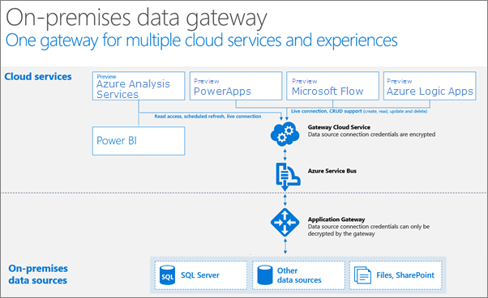

<properties
   pageTitle="內部部署資料閘道 |Microsoft Azure"
   description="在內部部署閘道器時需要您 Azure 中的 Analysis Services 伺服器會連接到內部部署資料來源。"
   services="analysis-services"
   documentationCenter=""
   authors="minewiskan"
   manager="erikre"
   editor=""
   tags=""/>
<tags
   ms.service="analysis-services"
   ms.devlang="NA"
   ms.topic="article"
   ms.tgt_pltfrm="NA"
   ms.workload="na"
   ms.date="10/24/2016"
   ms.author="owend"/>

# <a name="on-premises-data-gateway"></a>內部部署資料閘道器

內部部署資料閘道器就像是橋，提供之間的內部部署資料來源和 Azure Analysis Services 伺服器在雲端安全的資料傳輸。

在您的網路的電腦上安裝的閘道器。 一個閘道器必須安裝您擁有您 Azure 訂閱中每個 Azure Analysis Services 伺服器。 例如，如果您有兩個 Azure 訂閱中的伺服器的連接到內部部署資料來源，閘道器必須安裝在您的網路中的兩個不同的電腦上。

## <a name="requirements"></a>需求

**最低需求︰**

- .NET 4.5 framework
- 64 位元版本 Windows 7 / Windows Server 2008 R2 （或更新版本）

**建議︰**

- 8 核心 CPU
- 8 GB 的記憶體
- 64 位元版本的 Windows 2012 R2 （或更新版本）

**重要的考量事項︰**

- 閘道器無法安裝網域控制站。

- 只有一個閘道器可以在一部電腦上安裝。

- 閘道器的電腦上安裝會保留在上並不會繼續休眠。 如果電腦上不是，您 Azure Analysis Services 伺服器無法連線至您的內部部署資料來源，以重新整理資料。

- 不要無線連線到您的網路的電腦上安裝的閘道器。 效能可以降低。

- 若要變更的閘道器之已設定的伺服器名稱，您需要重新安裝及設定新的閘道器。

- 在某些情況下，使用原生的提供者，例如 SQL Server Native Client (SQLNCLI11) 的資料來源連線的表格式模型，可能會傳回錯誤。 若要深入瞭解，請參閱[資料來源連線](analysis-services-datasource.md)。

## <a name="supported-on-premises-data-sources"></a>支援內部部署資料來源
預覽，請閘道器支援 Azure Analysis Services 伺服器與下列內部部署資料來源之間的連線︰

- SQL Server
- SQL Data Warehouse
- 是否
- Oracle
- Teradata


## <a name="download"></a>下載
 [下載閘道器](https://aka.ms/azureasgateway)


## <a name="install-and-configure"></a>安裝和設定

1. 執行安裝程式。

2. 選擇安裝位置，並接受授權合約。

3. 登入 Azure。

4. 指定您 Azure 分析伺服器名稱。 您只可以指定每閘道器的一個伺服器。 按一下 [**設定**]，您現在已經就緒。

    


## <a name="how-it-works"></a>運作方式
閘道器會以 Windows 服務中，**內部部署資料閘道器**，貴組織的網路中的電腦上執行。 閘道器安裝用於 Azure Analysis Services 為基礎的其他服務，例如 Power BI 用的相同閘道，但有一些差異的方式設定。



查詢和資料流程工時像這樣︰

1.  使用加密認證雲端服務，針對內部部署資料來源建立查詢。 然後傳送到佇列中的閘道器至 [處理程序。

2.  閘道器雲端服務分析查詢，並將要求[Azure 服務匯流排](https://azure.microsoft.com/documentation/services/service-bus/)推入。

3.  內部部署資料閘道輪詢 Azure 服務匯流排的擱置的要求。

4.  閘道器取得查詢，會將認證，解密並連線到資料來源使用這些認證。

5.  閘道器會將查詢傳送到執行的資料來源。

6.  回到閘道器，然後拖曳到雲端服務，結果會傳送資料來源。

## <a name="windows-service-account"></a>Windows 服務帳戶

內部部署資料閘道器設定為使用*NT SERVICE\PBIEgwService* Windows 服務登入認證。 根據預設，有右邊的登入以服務;在您要將閘道器安裝在電腦的內容。 此認證不是用來連線到內部部署資料來源的同一個帳戶或您 Azure 帳戶。  

如果您的 proxy 伺服器因為驗證發生問題，您可能會想要變更的 Windows 服務帳戶網域使用者或管理服務帳戶。

## <a name="ports"></a>連接埠

閘道器建立 Azure 服務匯流排輸出連線。 通訊輸出的連接埠︰ TCP 443 （預設）、 5671，5672，透過 9354 9350。  閘道器時，不需要輸入的連接埠。

建議您 whitelist IP 位址的防火牆中您資料的地區。 您可以下載[Microsoft Azure 資料中心 IP 清單](https://www.microsoft.com/download/details.aspx?id=41653)。 這份清單是每週更新。

> [AZURE.NOTE]  Azure 資料中心 IP] 清單中列出的 IP 位址是 CIDR 法。 例如，10.0.0.0/24 不表示透過 10.0.0.24 10.0.0.0。 進一步瞭解[CIDR 標記法](http://whatismyipaddress.com/cidr)。

以下是用的閘道器的完整的網域名稱。

|網域名稱|輸出的連接埠|描述|
|---|---|---|
|*。 powerbi.com|80|HTTP 用於下載安裝程式。|
|*。 powerbi.com|443|HTTPS|
|*。 analysis.windows.net|443|HTTPS|
|*。 login.windows.net|443|HTTPS|
|*。 servicebus.windows.net|5671 5672|進階的訊息佇列通訊協定 (AMQP)|
|*。 servicebus.windows.net|443、 9350 9354|TCP （存取控制 token 取得的需要 443） 上的服務匯流排轉送上接聽|
|*。 frontend.clouddatahub.net|443|HTTPS|
|*。 core.windows.net|443|HTTPS|
|login.microsoftonline.com|443|HTTPS|
|*。 msftncsi.com|443|用來測試閘道器無法連到 Power BI 服務的網際網路連線。|
|*.microsoftonline p.com|443|用於驗證根據設定而定。|


### <a name="forcing-https-communication-with-azure-service-bus"></a>強制 Azure 服務匯流排 HTTPS 通訊

您可以強制與 Azure 服務匯流排，而不直接 TCP; 使用 HTTPS 通訊的閘道器不過，這可以大幅降低效能。 您需要修改*Microsoft.PowerBI.DataMovement.Pipeline.GatewayCore.dll.config*檔案。 變更值`AutoDetect`至`Https`。 根據預設，在*C:\Program Files\On 內部部署資料閘道*，位於此檔案。

```
<setting name="ServiceBusSystemConnectivityModeString" serializeAs="String">
    <value>Https</value>
</setting>
```


## <a name="troubleshooting"></a>疑難排解
顯示進階設定，用於連線至您的內部部署資料來源的 Azure Analysis Services 的內部部署資料閘道器會使用 Power BI 用的同一個閘道。

如果您遇到問題時安裝和設定閘道器，，請務必請參閱[疑難排解 Power BI 閘道器](https://powerbi.microsoft.com/documentation/powerbi-gateway-onprem-tshoot/)。 如果您認為您的防火牆所遇到問題，請參閱防火牆或 proxy 節。

如果您認為您遇到 proxy 問題閘道器，請參閱[Power BI 閘道器設定 proxy 設定](https://powerbi.microsoft.com/documentation/powerbi-gateway-proxy.md)。

## <a name="next-steps"></a>後續步驟
- [管理 Analysis Services](analysis-services-manage.md)
- [從 Azure Analysis Services 取得資料](analysis-services-connect.md)
