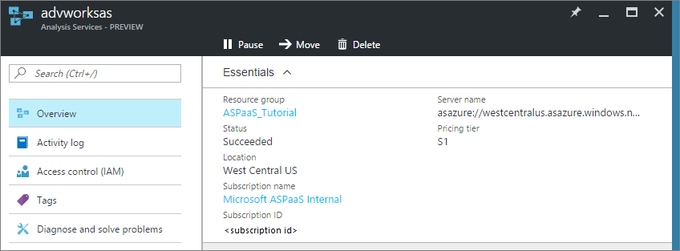

<properties
   pageTitle="管理 Azure Analysis Services |Microsoft Azure"
   description="瞭解如何管理 Azure 中的 Analysis Services 伺服器。"
   services="analysis-services"
   documentationCenter=""
   authors="minewiskan"
   manager="erikre"
   editor=""
   tags=""/>
<tags
   ms.service="analysis-services"
   ms.devlang="NA"
   ms.topic="article"
   ms.tgt_pltfrm="NA"
   ms.workload="na"
   ms.date="10/24/2016"
   ms.author="owend"/>

# <a name="manage-analysis-services"></a>管理 Analysis Services

Azure 中建立的 Analysis Services 伺服器之後，可能是您需要執行立即或某個簡言之某些管理工作。 例如，執行處理重新整理資料，控制可以存取您的伺服器上的模型或監控伺服器的狀況。 一些管理工作只能在 Azure 入口網站中其他人在 SQL Server 管理 Studio (SSMS)，並可在其中完成部分工作。

## <a name="azure-portal"></a>Azure 入口網站
[Azure 入口網站](http://portal.azure.com/)可讓您可以建立及刪除伺服器、 監控伺服器資源、 變更大小]，管理誰有權存取您的伺服器。  如果您有一些問題，您也可以提交支援要求。



## <a name="sql-server-management-studio"></a>SQL Server Management Studio 中
連線到您的伺服器 Azure 中就如同連線到您自己的組織中的伺服器執行個體。 從 SSMS，您可以執行許多相同的工作，例如程序資料或建立處理指令碼、 管理角色和使用 PowerShell。


 放大差異的內容之一是您使用連線到您的伺服器驗證。 若要連線至 Azure Analysis Services 伺服器，必須先選取**Active Directory 密碼驗證**。

### <a name="to-connect-with-ssms"></a>若要使用 SSMS 連線
1. 在連接之前，您需要取得的伺服器名稱。 **Azure 入口網站**中 > 伺服器 >**概觀** > **伺服器名稱**，將複製的伺服器名稱。

    

2. 在 [SSMS >**物件總管**] 中，按一下 [**連線**] > **Analysis Services**。

3. 在 [**伺服器的連線**] 對話方塊中，貼上在 [伺服器名稱，然後在 [**驗證]**，選擇下列其中一項︰

    若要使用單一登入與 Active Directory Azure Active Directory federation **Active Directory 整合式驗證**。

    **Active Directory 密碼驗證**，才能使用組織帳戶。 例如，從非網域連線加入時電腦。

    注意︰ 如果您沒有看到 Active Directory 驗證，您可能需要[啟用 Azure Active Directory 驗證](#enable-azure-active-directory-authentication)SSMS 中。

    

管理您的伺服器 Azure 中使用 SSMS 非常管理內部部署伺服器，我們不要進入以下詳細資料。 所有說明您需要都找 MSDN 上的[Analysis Services 執行個體管理](https://msdn.microsoft.com/library/hh230806.aspx)。

## <a name="server-administrators"></a>伺服器管理員
您可以為您的伺服器 SSMS Azure 入口網站中使用**Analysis Services 管理員**控制項刀，管理伺服器管理員。 Analysis Services 管理員是資料庫伺服器管理員以一般的資料庫系統管理工作，例如新增和移除資料庫及管理使用者的權限。 根據預設，Azure 入口網站中建立伺服器的使用者會自動新增為 Analysis Services 管理員]。

您也應該知道︰

-   Windows Live ID 是不受支援的身分識別的類型 Azure Analysis Services。  
-   Analysis Services 管理員必須是有效的 Azure Active Directory 使用者。
-   如果建立 Azure Analysis Services 伺服器透過 Azure 資源管理員範本，Analysis Services 管理員採用 JSON 陣列的使用者應以管理員身分加入。

Analysis Services 管理員可以從 Azure 資源管理員可以管理 Azure 訂閱的資源不同。 這會保留與現有 XMLA TSML 的相容性管理 Analysis Services 中的行為，以及可讓您將 Azure 資源管理和分析之間的職責服務資料庫管理。

若要檢視所有的角色，並存取 Azure Analysis Services 資源類型，請使用控制項刀存取控制 (IAM)。

## <a name="database-users"></a>資料庫使用者
Azure Analysis Services 模型資料庫使用者必須是您的 Azure Active Directory 中。 指定模型資料庫的使用者名稱必須是由組織的電子郵件地址或 UPN。 這是不同的內部部署模型資料庫支援的 Windows 網域的使用者名稱的使用者。

使用[Azure Active Directory 中的角色指派](../active-directory/role-based-access-control-configure.md)或 SQL Server Management Studio 中使用[表格式模型指令碼語言](https://msdn.microsoft.com/library/mt614797.aspx)(TMSL)，您可以新增使用者。

**範例 TMSL 指令碼**

```
{
  "createOrReplace": {
    "object": {
      "database": "SalesBI",
      "role": "Users"
    },
    "role": {
      "name": "Users",
      "description": "All allowed users to query the model",
      "modelPermission": "read",
      "members": [
        {
          "memberName": "user1@contoso.com",
          "identityProvider": "AzureAD"
        },
        {
          "memberName": "group1@contoso.com",
          "identityProvider": "AzureAD"
        }
      ]
    }
  }
}
```

## <a name="enable-azure-active-directory-authentication"></a>啟用 Azure Active Directory 驗證
若要啟用 SSMS 登錄中的 Azure Active Directory 驗證功能，建立名為 EnableAAD.reg 的文字檔案，然後複製並貼上下列︰


```
Windows Registry Editor Version 5.00
[HKEY_CURRENT_USER\Software\Microsoft\Microsoft SQL Server\Microsoft Analysis Services\Settings]
"AS AAD Enabled"="True"
```

儲存並執行檔案。


## <a name="next-steps"></a>後續步驟
如果您已經尚未部署的表格式模型至新伺服器，如此良好的時間。 若要深入瞭解，請參閱[部署至 Azure Analysis Services](analysis-services-deploy.md)。

如果您已部署模型至您的伺服器，您準備好要使用的用戶端或瀏覽器連線。 若要深入瞭解，請參閱[取得資料從 Azure Analysis Services 伺服器](analysis-services-connect.md)。
