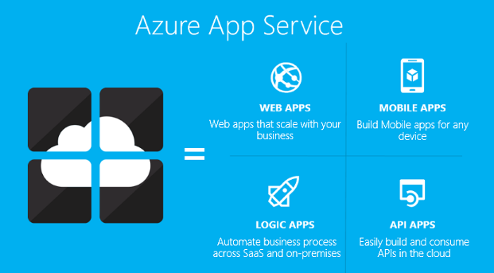

<properties 
    pageTitle="API 應用程式簡介 |Microsoft Azure" 
    description="了解 Azure 應用程式服務如何協助您開發主機和取用 RESTful Api。" 
    services="app-service\api" 
    documentationCenter=".net" 
    authors="tdykstra" 
    manager="wpickett" 
    editor=""/>

<tags 
    ms.service="app-service-api" 
    ms.workload="web" 
    ms.tgt_pltfrm="na" 
    ms.devlang="na" 
    ms.topic="get-started-article" 
    ms.date="08/23/2016" 
    ms.author="rachelap"/>

# API 應用程式概觀

Azure 應用程式服務中的 API 應用程式提供更容易開發 host （主機），及使用內部部署與雲端中的 Api 的功能。 API 應用程式與您取得企業級安全性、 簡單存取控制、 混合式連線、 自動 SDK 產生及與[邏輯應用程式](../app-service-logic/app-service-logic-what-are-logic-apps.md)的緊密整合。

[Azure 應用程式服務](../app-service/app-service-value-prop-what-is.md)是完全受管理的平台的網頁，行動裝置，並在整合案例。 API 應用程式是[Azure 應用程式服務](../app-service/app-service-value-prop-what-is.md)所提供的四個應用程式類型。

## 為什麼要使用 API 應用程式？

以下是 API 應用程式的一些主要功能︰

- **將為您現有的 API-是**-沒有變更任何您現有的 Api 善用 API 應用程式--只要將您的程式碼部署 API 應用程式中的程式碼。 您的 API 可以使用任何語言或應用程式服務，包括 ASP.NET 和 C#、 Java、 PHP、 Node.js，以及 Python 支援架構。

- **輕鬆消耗** [Swagger API](http://swagger.io/)中繼資料的整合支援可讓您 Api 輕鬆適用於各種不同的用戶端。  自動產生您各種不同的語言包括 C#、 Java 和 Javascript api 的用戶端程式碼。 輕鬆地設定[CORS](app-service-api-cors-consume-javascript.md) ，而不變更您的程式碼。 如需詳細資訊，請參閱[API 搜索與程式碼產生的應用程式服務 API 應用程式中繼資料](app-service-api-metadata.md)和[消耗從使用 CORS JavaScript API 應用程式](app-service-api-cors-consume-javascript.md)。 

- **簡單的存取控制**-API 應用程式防止未經授權存取任何變更，您的程式碼。 內建的驗證服務會保護 Api 的存取其他服務，或用戶端代表使用者。 支援的身分識別提供者包括 Azure Active Directory、 Facebook、 Twitter、 Google，與 Microsoft 帳戶。 用戶端可以使用 Active Directory 驗證文件庫 (ADAL) 或行動應用程式 SDK。 如需詳細資訊，請參閱[驗證和 Azure 應用程式服務中的 API 應用程式授權](app-service-api-authentication.md)。

- **Visual Studio 整合**專用的工具，在 Visual Studio 簡化建立、 部署、 分成、 偵錯，及管理的 API 應用程式的工作。 如需詳細資訊，請參閱[宣佈使用 Azure SDK.net 2.8.1](/blog/announcing-azure-sdk-2-8-1-for-net/)。

- **整合邏輯應用程式與**您所建立的 API 應用程式可以使用[應用程式服務邏輯應用程式](../app-service-logic/app-service-logic-what-are-logic-apps.md)。  如需詳細資訊，請參閱[的使用您自訂的 API 裝載於邏輯應用程式的應用程式服務](../app-service-logic/app-service-logic-custom-hosted-api.md)] 和 [[新結構描述版本 2015年-08-01-預覽](../app-service-logic/app-service-logic-schema-2015-08-01.md)。

此外，API 應用程式可以利用所提供的[Web 應用程式](../app-service-web/app-service-web-overview.md)與[Mobile 應用程式](../app-service-mobile/app-service-mobile-value-prop.md)的功能。 反向也是如此︰ 如果您使用的 web 應用程式或行動應用程式裝載 API，就可以利用 API 應用程式功能，例如 Swagger 中繼資料的用戶端程式碼產生和 CORS 跨網域瀏覽器存取。 唯一三個應用程式類型 （[行動網路中的 [API） 之間的差別 [名稱] 和 [他們 Azure 入口網站中所使用的圖示。

## 什麼是 API 應用程式和 Azure API 管理之間的差異？

API 應用程式和[Azure API 管理](../api-management/api-management-key-concepts.md)是互補服務︰

* 管理的 Api，則 API 管理。 您將 API 管理前端 API 在監視器與流速的使用狀況、 管理輸入與輸出、 將多個 Api 合併到一個端點，等等。 受管理的 Api 可以裝載任何一處。
* 有關裝載 Api，是 API 應用程式。 服務包括功能，可協助開發和耗用的 Api，但它不會進行類型的監控、 節流、 處理或彙總的 API 管理會。 如果您不需要 API 管理功能，您可以在 API 應用程式中主控 Api，而不使用 API 管理項目。

以下是圖表，以說明 Api 裝載於 API 應用程式中其他位置所用的 API 管理。

API 管理及 API 應用程式中的某些功能有類似的函數。  例如，同時可以自動化 CORS 支援。 當您在一起使用兩種服務時，您可使用 API 管理 CORS 因為它是做為前端 API 應用程式。 

## 快速入門

若要開始使用 API 應用程式部署到其中的程式碼範例，請參閱不論您想要的架構教學課程︰

* [ASP.NET](app-service-api-dotnet-get-started.md) 
* [Node.js](app-service-api-nodejs-api-app.md) 
* [Java](app-service-api-java-api-app.md) 

若要 API 應用程式中詢問問題，開始執行緒中的[API 應用程式論壇](https://social.msdn.microsoft.com/Forums/en-US/home?forum=AzureAPIApps)。 
