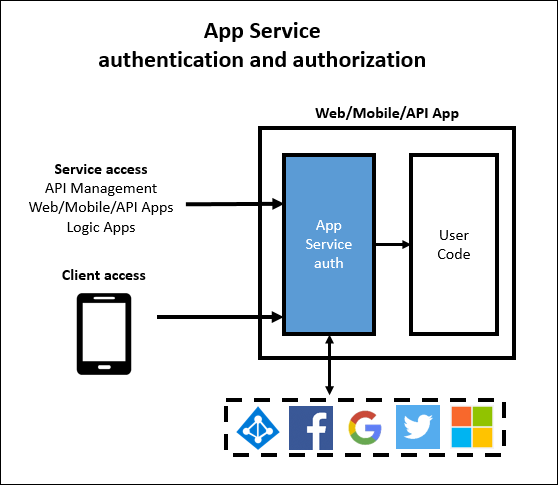

<properties
    pageTitle="驗證與授權的 API Azure 應用程式服務中的應用程式 |Microsoft Azure"
    description="深入瞭解驗證與授權服務 Azure 應用程式服務所提供的 API 應用程式。"
    services="app-service\api"
    documentationCenter=".net"
    authors="tdykstra"
    manager="wpickett"
    editor=""/>

<tags
    ms.service="app-service-api"
    ms.workload="na"
    ms.tgt_pltfrm="na"
    ms.devlang="na"
    ms.topic="article"
    ms.date="05/23/2016"
    ms.author="rachelap"/>

# 驗證和 Azure 應用程式服務中的 API 應用程式授權

## 概觀 

> [AZURE.NOTE] 本主題將也會移轉至合併[應用程式服務驗證 / 授權](../app-service/app-service-authentication-overview.md)主題說明網頁、 行動電話，以及 API 應用程式。

Azure 的應用程式服務會提供實作[OAuth 2.0](#oauth)和[OpenID 連線](#oauth)的內建驗證與授權服務。 本文將說明的服務和 Azure 應用程式服務中的 API 應用程式可用的選項。

下圖顯示應用程式服務驗證的一些主要的特性︰

* 它前置處理傳入的 API 邀請，這表示其運作方式與任何語言或架構支援的應用程式服務。
* 它提供數種選項多少驗證使用您想要在自己的程式碼中執行。
* 這也適用於使用者與服務帳戶驗證。 
* 支援五個身分識別提供者︰ Azure Active Directory、 Facebook、 Google、 Twitter 與 Microsoft 帳戶。
* 其運作方式相同 API 應用程式、 Web 應用程式，以及行動應用程式。

## 語言診斷

應用程式服務驗證處理後，才能邀請達到 API 應用程式，也就是說，驗證功能使用的任何語言或架構所撰寫的 API 應用程式。  您的 API 可以根據 ASP.NET、 Java、 Node.js 或應用程式服務支援任何架構。

應用程式服務會傳遞 HTTP 要求，授權標頭中 JSON web 權杖 (JWT)，並在任何語言或架構撰寫程式碼可以從權杖取得所需的資訊。 此外，應用程式服務可讓您更容易存取最常使用的宣告設定某些特殊的標題，如下所示︰

* X-MS-用戶端-主要-名稱
* X-MS-用戶端-本金-識別碼
* X-MS-TOKEN-FACEBOOK-ACCESS-TOKEN
* X-MS-TOKEN-FACEBOOK-EXPIRES-ON
 
在 API，您可以使用`Authorize`屬性，並對細微授權，您可以輕鬆地撰寫程式碼根據的宣告因為宣告資訊會為您填入.NET 類別中。

## 多個保護選項

應用程式服務可以防止匿名 HTTP 要求 API 應用程式、 可以傳遞所有要求並驗證的權杖的要求，包括，或它可以讓到所有的要求，而不需採取任何動作，在︰

1. 允許已驗證的要求僅達到 API 應用程式。

    從瀏覽器收到匿名要求時，應用程式服務會重新導向至登入頁面的 [驗證提供者 (Azure AD，Google，Twitter 等)，您選擇。 

    使用此選項，您不需要在您的應用程式中撰寫任何驗證碼與授權程式碼簡化因為 HTTP 標頭中所提供的最重要的宣告。

2. 允許所有邀請達到 API 應用程式，但驗證經過驗證的要求，並沿著 HTTP 標頭中的驗證資訊傳遞。

    這個選項可讓您更具彈性處理匿名要求，但您必須撰寫程式碼，如果您想要避免匿名使用者使用您的 API。 最常用的宣告會傳遞 HTTP 要求標頭中，因為授權程式碼是相當簡單。
    
3. 允許所有要求存取您的 API，在邀請中的驗證資訊採取任何動作。

    這個選項會使驗證與授權完全取決於您的應用程式碼的工作。

[Azure 入口網站](https://portal.azure.com/)中，在您選擇 [您要的選項**驗證 / 授權**刀。

選項 1 和 2，開啟 [**應用程式服務驗證**]，再**要求未經驗證時採取的動作**下拉式清單中選擇 [**登入**或**允許要求 （沒有動作）**。  如果您選擇**登入**，您必須選擇驗證提供者設定的提供者。

如需如何設定驗證的詳細資訊，請參閱[如何設定您的應用程式服務應用程式使用 Azure Active Directory 登入](../app-service-mobile/app-service-mobile-how-to-configure-active-directory-authentication.md)。 本文適用於 API 應用程式，以及行動應用程式，並它連結至其他文件的其他驗證提供者。
 
## 服務帳戶驗證

應用程式服務驗證適用於從一個 API 應用程式的來電至另一個 API 應用程式的例如內部案例。 在這個案例中，您可以取得權杖，而不是使用者認證服務帳戶使用認證。 指定帳戶給服務也稱為 Azure Active Directory 中的*本金服務*，而使用這類帳戶驗證會也稱為服務-案例。 

服務的情況下，使用 Azure Active Directory 保護稱為的 API 應用程式，並提供 AAD 服務本金授權權杖當您撥打的 API 應用程式時。 您可以取得權杖提供用戶端識別碼和密碼的 AAD 應用程式的用戶端。 例如，為 true，處理行動服務 Zumo 權杖需要，沒有特殊的 Azure 專用程式碼。 教學課程[Service API 應用程式的本金驗證](app-service-api-dotnet-service-principal-auth.md)涵蓋這個案例中使用 ASP.NET API 應用程式的範例。

如果您想要不使用應用程式服務驗證處理服務-服務情況，您可以使用用戶端憑證] 或 [基本驗證。 Azure 中的用戶端憑證的相關資訊，請參閱[如何以設定 TLS 相互驗證的 Web 應用程式](../app-service-web/app-service-web-configure-tls-mutual-auth.md)。 ASP.NET 中的基本驗證的相關資訊，請參閱[驗證 ASP.NET Web API 2] 中的篩選](http://www.asp.net/web-api/overview/security/authentication-filters)。

從應用程式服務邏輯應用程式至 API 應用程式的服務帳戶驗證是一個特殊情況，[使用您自訂的 API 裝載於邏輯應用程式的應用程式服務](../app-service-logic/app-service-logic-custom-hosted-api.md)說明。

## 行動用戶端驗證

如需如何處理從行動用戶端驗證，請參閱[在行動應用程式的驗證的文件](../app-service-mobile/app-service-mobile-ios-get-started-users.md)的資訊。 應用程式服務驗證是相同的行動應用程式和 API 應用程式。
  
## 詳細資訊

如需驗證和 Azure 應用程式服務中的授權的詳細資訊，請參閱下列資源︰

* [展開的應用程式服務驗證 / 授權](/blog/announcing-app-service-authentication-authorization/)
* [如何設定您的應用程式服務應用程式使用 Azure Active Directory 登入](../app-service-mobile/app-service-mobile-how-to-configure-active-directory-authentication.md)（包括連結之頁面的頂端其他驗證提供者）。 

如需有關 OAuth 2.0 OpenID 連線，與 JSON Web 權杖 (JWT) 的詳細資訊，請參閱下列資源。

* [快速入門 OAuth 2.0](http://shop.oreilly.com/product/0636920021810.do "快速入門 OAuth 2.0") 
* [簡介 OAuth2，OpenID 連線並 JSON Web 權杖 (JWT)-PluralSight 課程](http://www.pluralsight.com/courses/oauth2-json-web-tokens-openid-connect-introduction) 
* [建立並保護 RESTful 的 API ASP.NET-PluralSight 課程中的多個用戶端](http://www.pluralsight.com/courses/building-securing-restful-api-aspdotnet)

如需有關 Azure Active Directory 的詳細資訊，請參閱下列資源。

* [Azure AD 案例](http://aka.ms/aadscenarios)
* [Azure AD 開發人員指南](http://aka.ms/aaddev)
* [Azure AD 範例](http://aka.ms/aadsamples)

## 後續步驟

本文說明您可以使用的 API 應用程式的應用程式服務的驗證與授權功能。 取得使用一系列中的下一個教學課程示範如何實作[應用程式服務 API 應用程式中的使用者驗證](app-service-api-dotnet-user-principal-auth.md)。
