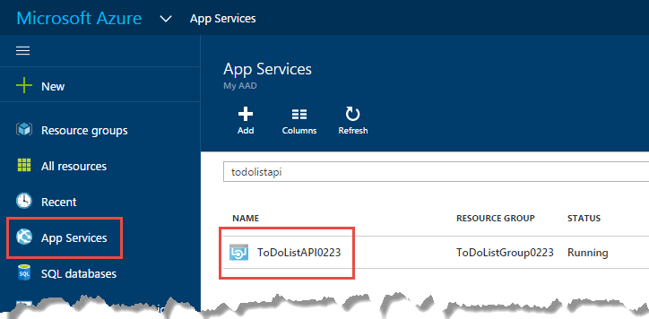

<properties
    pageTitle="支援服務應用程式中的 CORS |Microsoft Azure"
    description="瞭解如何使用 CORS 支援在 Azure Azure 應用程式服務。"
    services="app-service\api"
    documentationCenter=".net"
    authors="tdykstra"
    manager="wpickett"
    editor=""/>

<tags
    ms.service="app-service-api"
    ms.workload="na"
    ms.tgt_pltfrm="dotnet"
    ms.devlang="na"
    ms.topic="get-started-article"
    ms.date="08/27/2016"
    ms.author="rachelap"/>

# 使用從使用 CORS JavaScript API 應用程式

應用程式服務會提供內建的[十字形，資源共用 (CORS)](https://en.wikipedia.org/wiki/Cross-origin_resource_sharing)，讓 JavaScript API 應用程式中進行所裝載的 Api 的跨網域呼叫的用戶端支援。 應用程式服務可讓您無須撰寫程式碼，在您的 API 中設定您的 API CORS 存取。

本文包含兩個區段︰

* [如何設定 CORS](#corsconfig) ] 區段中的一般說明如何設定 CORS API 應用程式、 web 應用程式，或行動應用程式。 適用於平均所支援的應用程式服務，包括.NET、 Node.js，以及 Java 所有架構。 

* 開始使用 [[繼續.NET 快速入門教學課程](#tutorialstart)] 區段中，文件是示範 CORS 支援上您並未在[第一個 API 應用程式快速入門教學課程](app-service-api-dotnet-get-started.md)中建立的教學課程。 

## 如何設定 CORS Azure 應用程式服務

Azure 入口網站中，或使用[Azure 資源管理員](../azure-resource-manager/resource-group-overview.md)工具，您可以設定 CORS。

#### 設定 CORS Azure 入口網站中

8. 在瀏覽器中移至[Azure 入口網站](https://portal.azure.com/)。

2. 按一下 [**應用程式服務**]，然後按一下 [API 應用程式的名稱。

    

10. 在右側的**API 應用程式**刀開啟**設定**刀，尋找**api **一節，然後按一下**CORS**。

    

11. 在文字] 方塊中輸入的 URL 或您想要允許來自 JavaScript 呼叫的 Url。

    例如，如果您部署 JavaScript 應用程式名稱為 todolistangular web 應用程式時，輸入 「 https://todolistangular.azurewebsites.net 」。 或者，您可以輸入星號 （*），指定會接受所有原始網域。

13. 按一下 [**儲存**]。

    ![按一下 [儲存]](./media/app-service-api-cors-consume-javascript/corsinportal.png)

    按一下 [**儲存**後，API 應用程式就會接受指定 Url 的 JavaScript 來電。

#### 使用 Azure 資源管理員工具來設定 CORS

您也可以使用[Azure 資源管理員範本](../resource-group-authoring-templates.md)的命令列工具，例如[PowerShell 的 Azure](../powershell-install-configure.md)和[Azure CLI](../xplat-cli-install.md)API 應用程式的設定 CORS。 

例如，設定 CORS 屬性 Azure 資源管理員範本中，開啟[azuredeploy.json 本教學課程中的範例應用程式存放庫中的檔案](https://github.com/azure-samples/app-service-api-dotnet-todo-list/blob/master/azuredeploy.json)。 尋找 [] 區段的範本，如下列範例所示︰

        "cors": {
            "allowedOrigins": [
                "todolistangular.azurewebsites.net"
            ]
        }

## 繼續進行.NET 快速入門教學課程

如果您追蹤 Node.js 或 Java 快速入門數列的 API 應用程式，您已經完成取得入門的數列。 跳至[下一步](#next-steps)] 區段，若要尋找建議的進一步瞭解 API 應用程式。

本文的其餘部分的.NET 快速入門數列接續並假設您已順利完成[第一個教學課程](app-service-api-dotnet-get-started.md)。

## 部署 ToDoListAngular 專案至新的 web 應用程式

在[第一個教學課程](app-service-api-dotnet-get-started.md)，您可以建立的中間層 API 應用程式並在資料層 API 應用程式。 在本教學課程您建立的單一頁面應用程式] 選項的 web 應用程式的通話中間層 API 應用程式。 搭配使用您選項的都必須啟用 CORS 在中間層 API 應用程式上。 

[ToDoList 範例應用程式](https://github.com/Azure-Samples/app-service-api-dotnet-todo-list)中，ToDoListAngular 的專案是通話中間層 ToDoListAPI Web API 專案的簡單 AngularJS 用戶端。 JavaScript 程式碼*app/scripts/todoListSvc.js*檔案中的通話 API 使用 AngularJS HTTP 提供者。 

        angular.module('todoApp')
        .factory('todoListSvc', ['$http', function ($http) {

            $http.defaults.useXDomain = true;
            delete $http.defaults.headers.common['X-Requested-With']; 
        
            return {
                getItems : function(){
                    return $http.get(apiEndpoint + '/api/TodoList');
                },

                /* Get by ID, Put, and Delete methods not shown */

                postItem : function(item){
                    return $http.post(apiEndpoint + '/api/TodoList', item);
                }
            };
        }]);

### 建立新 web 應用程式 ToDoListAngular 專案

建立新的應用程式服務 web 應用程式，並將其部署專案的程序就像您[建立](app-service-api-dotnet-get-started.md#createapiapp)及部署 API 應用程式第一本系列教學課程中的所見。 唯一的差別是**Web 應用程式**，而不是**API 應用程式**的應用程式類型。  對話方塊的螢幕擷取畫面，請參閱 

1. 在**方案總管]**中，ToDoListAngular 專案，以滑鼠右鍵按一下，然後再按一下 [**發佈**]。

3.  在**發佈網站**精靈] 的 [**設定檔**] 索引標籤中，按一下 [ **Microsoft Azure 應用程式服務**]。

5. 在 [**應用程式服務**] 對話方塊中，按一下 [**新增**]。

3. 在 [**建立應用程式服務**] 對話方塊的 [**裝載**] 索引標籤中，輸入**Web 應用程式名稱** *azurewebsites.net*網域中的唯一。 

5. 選擇您想要使用的 Azure**訂閱**。

6. 在 [**資源群組**] 下拉式清單中，選擇您先前建立的相同資源群組。

4. 在 [**應用程式服務計劃**] 下拉式清單中，選擇您先前建立相同的方案。 

7. 按一下 [**建立**]。

    Visual Studio 建立 web 應用程式、 建立發佈設定檔，並顯示**連線**精靈的步驟**發佈的網頁**。

    這時候還不要按**發佈**。 在下列區段中，您可以設定新的 web 應用程式撥打中間層 API 應用程式執行的應用程式服務。 

### 在 web 應用程式設定中設定的中間層 URL

1. 移至 [ [Azure 入口網站](https://portal.azure.com/)，然後瀏覽至您要建立主控 TodoListAngular （前端） project web app 的**Web 應用程式**刀。

2. 按一下 [**設定 > 應用程式設定**。

3. 在 [**應用程式設定**] 區段中，新增下列索引鍵和值︰

  	|索引鍵|值|範例
  	|---|---|---|
  	|toDoListAPIURL|https://{your 中間層 API 應用程式名稱}.azurewebsites.net|https://todolistapi0121.azurewebsites.net|

4. 按一下 [**儲存**]。

    Azure 中執行的程式碼，此值會覆寫*Web.config*檔案中的本機 URL。 

    取得的設定值的程式碼是*index.cshtml*:

        
        

    *TodoListSvc.js*中的程式碼會使用的設定︰

        return {
            getItems : function(){
                return $http.get(apiEndpoint + '/api/TodoList');
            },
            getItem : function(id){
                return $http.get(apiEndpoint + '/api/TodoList/' + id);
            },
            postItem : function(item){
                return $http.post(apiEndpoint + '/api/TodoList', item);
            },
            putItem : function(item){
                return $http.put(apiEndpoint + '/api/TodoList/', item);
            },
            deleteItem : function(id){
                return $http({
                    method: 'DELETE',
                    url: apiEndpoint + '/api/TodoList/' + id
                });
            }
        };

### 部署 ToDoListAngular web 專案至新的 web 應用程式

*  在 Visual Studio 中，在**連線**精靈的步驟**發佈網站**，按一下 [**發佈**。

    Visual Studio ToDoListAngular 專案部署至新的 web 應用程式，並開啟瀏覽器的 web 應用程式的 url。 

### 沒有啟用 CORS 測試應用程式 

2. 在瀏覽器開發人員工具中，開啟主控台視窗。

3. 在瀏覽器視窗中會顯示在 AngularJS ui 上，按一下**待辦事項清單]**連結。

    JavaScript 程式碼嘗試呼叫中間層 API 應用程式，但通話失敗，因為在不同的網域後端執行前端。 在瀏覽器的開發人員工具主控台視窗會顯示跨原點錯誤訊息。

    

## 設定 CORS 中間層 API 應用程式

在此區段中，您可以設定 CORS Azure 中的設定介 ToDoListAPI API 應用程式。 這項設定可以讓介從 web 應用程式建立的 ToDoListAngular 專案接聽 JavaScript API 應用程式。

8. 在瀏覽器中，移至[Azure 入口網站](https://portal.azure.com/)。

2. 按一下 [**應用程式服務**]，然後按一下 [ToDoListAPI （中間層） API 應用程式。

    

10. 在右側的**API 應用程式**刀開啟**設定**刀，尋找**api **一節，然後按一下**CORS**。

    

12. 在 [文字] 方塊中輸入 ToDoListAngular （前端） web 應用程式的 URL。 例如，如果您是名為 todolistangular0121 web 應用程式部署 ToDoListAngular 專案，允許從 URL 的電話`https://todolistangular0121.azurewebsites.net`。

    或者，您可以輸入星號 （*），指定會接受所有原始網域。

13. 按一下 [**儲存**]。

    ![按一下 [儲存]](./media/app-service-api-cors-consume-javascript/corsinportal.png)

    按一下 [**儲存**後，API 應用程式就會接受 JavaScript 通話從指定的 URL。 在此螢幕擷取畫面，ToDoListAPI0223 API 應用程式就會接受從 ToDoListAngular web app 的 JavaScript 用戶端呼叫。

### 使用 CORS 啟用測試應用程式

* 開啟瀏覽器 HTTPS url 的 web 應用程式。 

    這次應用程式可讓您檢視、 新增、 編輯及刪除待辦事項項目。 

    ![待辦事項清單的範例應用程式] 頁面](./media/app-service-api-cors-consume-javascript/corssuccess.png)

## 應用程式服務與 Web API CORS CORS

在 Web API 專案中，您可以安裝在程式碼中，指定的網域就會接受您的 API JavaScript 通話從[Microsoft.AspNet.WebApi.Cors](https://www.nuget.org/packages/Microsoft.AspNet.WebApi.Cors/) NuGet 套件。
 
支援網頁 API CORS 是比應用程式服務 CORS 支援更有彈性。 比方說，程式碼中您可以指定不同的已接受的來源的其他動作方法時的應用程式服務 CORS 您指定一組已接受的來源，針對您所有的 API 應用程式的方法。

> [AZURE.NOTE] 不要嘗試使用其中一個 API 應用程式中的網頁 API CORS 和應用程式服務 CORS。 應用程式服務 CORS 會優先和 Web API CORS 會有任何效果。 比方說，如果您啟用應用程式服務中的一個 origin 網域，並在您的 Web API 程式碼啟用所有原始網域，Azure API 應用程式就會只會接受來電 Azure 中指定的網域。

### 如何啟用 CORS Web API 程式碼

下列步驟摘要啟用 Web API CORS 支援的程序。 如需詳細資訊，請參閱[啟用 ASP.NET Web API 2 中的十字形，要求](http://www.asp.net/web-api/overview/security/enabling-cross-origin-requests-in-web-api)。

1. 在 Web API 專案中，安裝[Microsoft.AspNet.WebApi.Cors](https://www.nuget.org/packages/Microsoft.AspNet.WebApi.Cors/) NuGet 套件。

1. 包含`config.EnableCors()`一行程式碼的**WebApiConfig**類別，如下列範例所示的 [**註冊**] 方法。 

        public static class WebApiConfig
        {
            public static void Register(HttpConfiguration config)
            {
                // Web API configuration and services
                
                // The following line enables you to control CORS by using Web API code
                config.EnableCors();
    
                // Web API routes
                config.MapHttpAttributeRoutes();
    
                config.Routes.MapHttpRoute(
                    name: "DefaultApi",
                    routeTemplate: "api/{controller}/{id}",
                    defaults: new { id = RouteParameter.Optional }
                );
            }
        }

1. 在您的 Web API 控制器新增`using`陳述式`System.Web.Http.Cors`命名空間，並新增`EnableCors`控制器類別或個別動作方法的屬性。 在下列範例中，CORS 支援適用於整個控制器。

        namespace ToDoListAPI.Controllers 
        {
            [HttpOperationExceptionFilterAttribute]
            [EnableCors(origins:"https://todolistangular0121.azurewebsites.net", headers:"accept,content-type,origin,x-my-header", methods: "get,post")]
            public class ToDoListController : ApiController
 
## Azure API 管理使用 API 應用程式

如果您使用 Azure API 管理的 API 應用程式時，設定 CORS API 管理的 API 應用程式中。 如需詳細資訊，請參閱下列資源︰

* [Azure API 管理概觀 (視訊︰ CORS 開始編號，12:10)](https://azure.microsoft.com/documentation/videos/azure-api-management-overview/)
* [跨網域原則的 API 管理](https://msdn.microsoft.com/library/azure/dn894084.aspx#CORS)
 
## 疑難排解

萬一時進行此教學課程中遇到問題，以下是疑難排解部分資訊。

* 請確定您使用的最新版[Azure SDK.net Visual Studio 2015](http://go.microsoft.com/fwlink/?linkid=518003)。

* 請確認您輸入`https`CORS] 設定，請確定您正在使用`https`執行前端 web 應用程式。

* 請確定在中間層 API 應用程式中，在前端 web 應用程式中，輸入 CORS 設定。

* 如果您在應用程式碼和 Azure 應用程式服務設定 CORS，請注意應用程式服務 CORS 設定會覆寫應用程式碼中正在執行上述程序。 

若要進一步瞭解 Visual Studio 功能，可簡化疑難排解，請參閱[疑難排解 Azure 應用程式服務應用程式，在 Visual Studio 中](../app-service-web/web-sites-dotnet-troubleshoot-visual-studio.md)。

## 後續步驟 

本文中，您會看到如何啟用應用程式服務 CORS 支援，以便用戶端 JavaScript 程式碼可以呼叫 API 在不同的網域。 若要進一步瞭解 API 應用程式，閱讀[簡介應用程式服務中的驗證](../app-service/app-service-authentication-overview.md)，並前往 [[使用者驗證的 API 應用程式](app-service-api-dotnet-user-principal-auth.md)教學課程。
