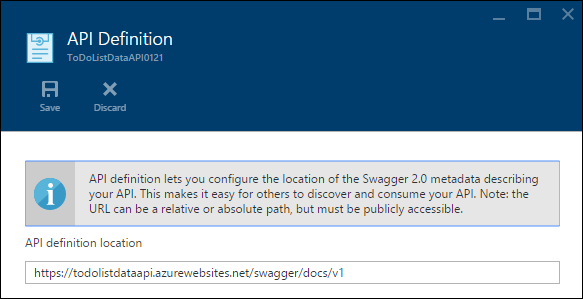
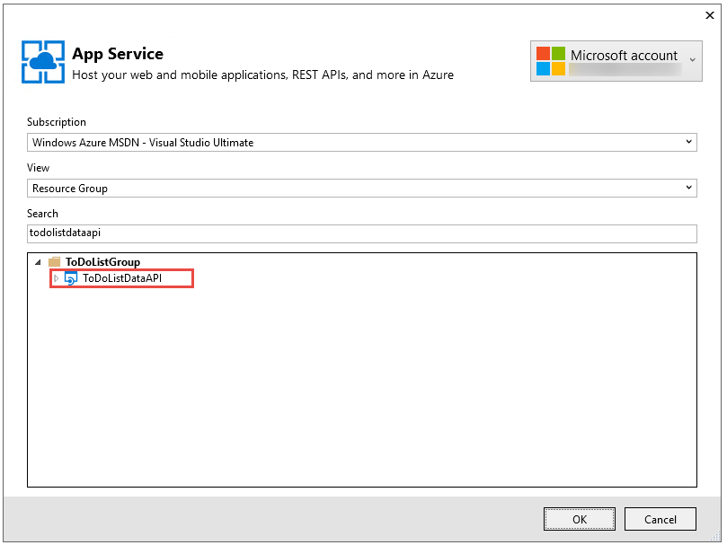

<properties
    pageTitle="開始使用 API 應用程式與服務應用程式中的 ASP.NET |Microsoft Azure"
    description="瞭解如何建立、 部署與使用 ASP.NET API 應用程式在 Azure 應用程式服務中使用 Visual Studio 2015。"
    services="app-service\api"
    documentationCenter=".net"
    authors="tdykstra"
    manager="wpickett"
    editor=""/>

<tags
    ms.service="app-service-api"
    ms.workload="na"
    ms.tgt_pltfrm="dotnet"
    ms.devlang="na"
    ms.topic="hero-article"
    ms.date="09/20/2016"
    ms.author="rachelap"/>

# 快速入門 API 應用程式、 ASP.NET 及 Swagger 中 Azure 應用程式服務

[AZURE.INCLUDE [selector](../../includes/app-service-api-get-started-selector.md)]

這是顯示如何使用 Azure 應用程式服務的開發裝載和 RESTful Api 有用的功能的教學課程系列中的第一個。  本教學課程涵蓋支援 Swagger 格式的 API 中繼資料。

您將學習︰

* 如何建立和使用 Visual Studio 2015 內建的工具來部署 Azure 應用程式服務中的[API 應用程式](app-service-api-apps-why-best-platform.md)。
* 如何使用動態產生 Swagger API 中繼資料的 Swashbuckle NuGet 套件自動化 API 探索。
* 如何使用 Swagger API 中繼資料會自動產生的 API 應用程式的用戶端程式碼。

## 範例應用程式概觀

在本教學課程中，您使用的簡易待辦事項清單範例應用程式。 應用程式有單一頁面應用程式] 選項的前端、 ASP.NET Web API 中間層和 ASP.NET Web API 資料層。

以下是[AngularJS](https://angularjs.org/)前端的螢幕擷取畫面。

Visual Studio 方案包含三個專案︰

* **ToDoListAngular**前端︰ 呼叫介 AngularJS] 選項。

* **ToDoListAPI**介︰ 呼叫資料層執行 CRUD 作業待辦事項項目上的 ASP.NET Web API 專案。

* **ToDoListDataAPI**資料層︰ 執行 CRUD 作業待辦事項項目上的 ASP.NET Web API 專案。

三層架構是的您可以藉由使用 API 應用程式實作只適用於以下示範用許多架構。 每一層的代碼是非常簡單，可能會示範 API 應用程式功能。例如，資料層會使用伺服器記憶體，而非資料庫持續機制。

完成本教學課程中，您必須設定兩個 Web API 專案，並在應用程式服務 API 應用程式中的雲端中執行。

下一個教學課程系列中的部署] 選項的前端至雲端。

## 必要條件

* ASP.NET Web API-教學課程的指示是假設您如何使用 ASP.NET [Web API 2](http://www.asp.net/web-api/overview/getting-started-with-aspnet-web-api/tutorial-your-first-web-api) Visual Studio 中的基本知識。

* Azure 帳戶-您可以[開啟 Azure 帳戶免費](/pricing/free-trial/?WT.mc_id=A261C142F)或[啟動 Visual Studio 訂閱者優點](/pricing/member-offers/msdn-benefits-details/?WT.mc_id=A261C142F)。

    如果您想要快速入門 Azure 應用程式服務註冊 Azure 帳戶之前，請移至[嘗試應用程式服務](http://go.microsoft.com/fwlink/?LinkId=523751)。 您可以立即建立短暫入門應用程式的應用程式服務，**沒有信用卡必要**，請和沒有承諾。

* 使用[.NET Azure SDK](https://azure.microsoft.com/downloads/archive-net-downloads/) -SDK 的 visual Studio 2015 會自動安裝 Visual Studio 2015，如果您沒有。

    * 在 Visual Studio 中，按一下 [說明]-> [關於 Microsoft Visual Studio，並確保您有 「 Azure 應用程式服務工具 v2.9.1 」 或更新版本。

    

    >[AZURE.NOTE] 根據幾 SDK 相依性您已經在電腦上，請安裝 SDK 花很長的時間，從幾分鐘在半小時或更多的時間。

## 下載的範例應用程式

1. 下載[Azure-Samples/app-service-api-dotnet-to-do-list](https://github.com/Azure-Samples/app-service-api-dotnet-todo-list)存放庫。

    您可以按一下 [**下載 ZIP** ] 按鈕，或在您的本機電腦上複製存放庫。

2. 在 Visual Studio 2015 或 2013年中開啟 ToDoList 解決方案。
   1. 您必須信任每一個解決方案。
        

3. 建置解決方案 （CTRL + SHIFT + B） 若要還原的 NuGet 套件。

    如果您想要將其部署之前，請參閱中作業的應用程式，您可以在本機上執行。 請務必 ToDoListDataAPI 啟動專案，並執行方案。 您應該會看到您的瀏覽器中 HTTP 403 錯誤。

## 使用 Swagger API 中繼資料和使用者介面

支援[Swagger](http://swagger.io/) 2.0 API 中繼資料是內建 Azure 應用程式服務。 每一個 API 應用程式，可以指定傳回 API Swagger JSON 格式的中繼資料 URL 結束點。 傳回從該端點的中繼資料可用來產生用戶端程式碼。

ASP.NET Web API 專案可以使用[Swashbuckle](https://www.nuget.org/packages/Swashbuckle) NuGet 套件，以動態方式產生 Swagger 中繼資料。 Swashbuckle NuGet 套件已安裝在您下載 ToDoListDataAPI 和 ToDoListAPI 專案。

在本教學課程此區段中，您查看產生 Swagger 2.0 中繼資料，並嘗試 Swagger 中繼資料為基礎的使用者介面的測試然後。

1. 設定為啟動專案的 ToDoListDataAPI 專案 （**** ToDoListAPI 專案）。

    

2. 按 F5 或按一下**偵錯 > 啟動偵錯**偵錯模式中執行的專案。

    在瀏覽器開啟，並顯示 HTTP 403 錯誤頁面。

3. 在瀏覽器網址列中新增`swagger/docs/v1`結尾線條]，然後按 return 鍵。 (URL 是`http://localhost:45914/swagger/docs/v1`。)

    這是用來傳回 Swagger 2.0 JSON 中繼資料的 API Swashbuckle 預設 URL。

    如果您使用的 Internet Explorer，在瀏覽器提示您下載*v1.json*檔案。

    

    如果您使用 Chrome、 Firefox 或邊緣，在瀏覽器會顯示 JSON 瀏覽器視窗中。 不同的瀏覽器處理 JSON 不同，並在瀏覽器視窗可能看起來不完全相同的範例。

    

    下列範例顯示 API，以取得方式定義 Swagger 中繼資料的第一個區段。 此中繼資料什麼為了讓您使用下列步驟，在 Swagger 使用者介面，而您使用教學課程的更新區段中自動產生用戶端程式碼。

        {
          "swagger": "2.0",
          "info": {
            "version": "v1",
            "title": "ToDoListDataAPI"
          },
          "host": "localhost:45914",
          "schemes": [ "http" ],
          "paths": {
            "/api/ToDoList": {
              "get": {
                "tags": [ "ToDoList" ],
                "operationId": "ToDoList_GetByOwner",
                "consumes": [ ],
                "produces": [ "application/json", "text/json", "application/xml", "text/xml" ],
                "parameters": [
                  {
                    "name": "owner",
                    "in": "query",
                    "required": true,
                    "type": "string"
                  }
                ],
                "responses": {
                  "200": {
                    "description": "OK",
                    "schema": {
                      "type": "array",
                      "items": { "$ref": "#/definitions/ToDoItem" }
                    }
                  }
                },
                "deprecated": false
              },

4. 關閉瀏覽器並停止偵錯時，Visual Studio。

5. 在**方案總管**] 中 ToDoListDataAPI 專案中，開啟*App_Start\SwaggerConfig.cs*檔案，然後向下捲動行 174 並取消下列程式碼的註解。

        /*
            })
        .EnableSwaggerUi(c =>
            {
        */

    當您專案中安裝 Swashbuckle 套件時，會建立*SwaggerConfig.cs*檔案。 檔案提供數種方式來設定 Swashbuckle。

    已取消的程式碼可讓您使用下列步驟在 Swagger ui。 當您建立 Web API 專案使用 API 應用程式專案範本時，將此程式碼會加上註解預設為安全性量值。

6. 再次執行專案。

7. 在瀏覽器網址列中新增`swagger`結尾線條]，然後按 return 鍵。 (URL 是`http://localhost:45914/swagger`。)

8. Swagger UI 頁面出現時，按一下**ToDoList**以查看可用的方法。

    

9. 按一下清單中第一個的 [**開始**] 按鈕。

10. 在 [**參數**] 區段中，輸入星號為的值`owner`參數，然後按一下 [**試試看出**。

    當您新增驗證更新版本的教學課程中時，中間層會提供資料層的實際的使用者識別碼。 現在，所有的工作會有星號為其擁有者 ID 時沒有啟用的驗證執行應用程式。

    

    在 Swagger ui 上呼叫 ToDoList 取得方法和顯示回應碼 JSON 結果。

    ![Swagger UI 試試看] 結果](./media/app-service-api-dotnet-get-started/gettryitout.png)

11. 按一下**文章**，，然後按一下 [] 方塊底下**模型結構描述**。

    按一下 [模型結構描述 prefills [輸入] 方塊，您可以在其中指定文章方法的參數值。 （如果這樣無法使用 Internet Explorer 中，使用不同的瀏覽器或下一個步驟手動輸入參數值）。  

    

12. 變更中的 JSON`todo`參數輸入方塊，讓它看起來像下列範例中，或取代說明文字︰

        {
          "ID": 2,
          "Description": "buy the dog a toy",
          "Owner": "*"
        }

13. 按一下 [**試試看出**]。

    ToDoList API 傳回表示成功 HTTP 204 回應程式碼。

14. 按一下 [第一個**取得**] 按鈕，然後按一下 [頁面的節中的 [**試試看出**] 按鈕。

    取得方法回應現在包含新若要執行的項目。

15. 可省略︰ 也嘗試將，刪除，並取得識別碼方法。

16. 關閉瀏覽器並停止偵錯時，Visual Studio。

Swashbuckle 適用於任何 ASP.NET Web API 專案。 如果您想要新增的現有專案的 Swagger 中繼資料產生，只要安裝 Swashbuckle 套件。

>[AZURE.NOTE] Swagger 中繼資料包含每個 API 作業的唯一識別碼。 根據預設，Swashbuckle 可能會產生重複 Swagger 作業識別碼網頁 API 控制器方法。 如果您的裝置已超載 HTTP 方法，例如，會發生此情況`Get()`和`Get(id)`。 如需如何處理多載，請參閱[自訂 Swashbuckle 產生 API 定義](app-service-api-dotnet-swashbuckle-customize.md)資訊。 如果您建立 Web API 專案，您可以在 Visual Studio 中使用 Azure API 應用程式範本，則會產生唯一識別碼] 作業的程式碼會自動新增至*SwaggerConfig.cs*檔案中。  

## Azure 中建立 API 應用程式及部署程式碼

在此區段中，您可以使用 Azure 工具整合 Visual Studio**發佈網站**精靈 Azure 中建立新的 API 應用程式。 接著您部署 ToDoListDataAPI 專案至新的 API 應用程式，然後呼叫 API 執行 Swagger ui。

1. 在**方案總管]**中，ToDoListDataAPI 專案，以滑鼠右鍵按一下，然後再按一下 [**發佈**]。

    ![按一下 [發佈] 在 Visual Studio 中](./media/app-service-api-dotnet-get-started/pubinmenu.png)

2.  在 [**發佈**精靈] 的**設定檔**步驟中，按一下 [ **Microsoft Azure 應用程式服務**]。

    

3. 如果您有不這麼做，請登入 Azure 帳戶，或如果他們過期，請重新整理您的認證。

4. 在 [應用程式服務] 對話方塊中，選擇您要使用的 Azure**訂閱**，然後按一下 [**新增**]。

    ![按一下 [新增]，請在應用程式服務] 對話方塊中](./media/app-service-api-dotnet-get-started/clicknew.png)

    **建立應用程式服務**] 對話方塊的 [**裝載**] 索引標籤隨即出現。

    您部署的已安裝的 Swashbuckle Web API 專案，因為 Visual Studio 假設您想要建立 API 應用程式。 這被表示**API 應用程式名稱**標題及的 [**變更類型**] 下拉式清單設定為 [ **API 應用程式**。

    ![在應用程式服務] 對話方塊中的應用程式類型](./media/app-service-api-dotnet-get-started/apptype.png)

5. 輸入*azurewebsites.net*網域中是唯一的**API 應用程式的名稱**。 您可以接受 Visual Studio 提出的預設名稱。

    如果您輸入其他人已使用的名稱，您會看到紅色驚嘆號右邊。

    API 應用程式的 URL 會`{API app name}.azurewebsites.net`。

6. 在 [**資源群組**] 下拉式清單，按一下 [**新增**]，然後輸入 「 ToDoListGroup 」 或另一個名稱如果您想。

    資源群組是 Azure 的資源，例如 API 應用程式、 資料庫、 Vm 等的集合。 本教學課程，最好建立新的資源群組，因為，方便您將一次刪除所有 Azure 資源您建立的教學課程。

    此方塊可讓您選取現有的[資源群組](../azure-resource-manager/resource-group-overview.md)，或建立新輸入不同於您的訂閱中任何現有的 [資源] 群組的名稱。

7. 按一下 [**應用程式服務方案**的下拉式清單旁的 [**新增**] 按鈕。

    螢幕擷取畫面顯示範例值的**API 應用程式名稱****的訂閱**，與**資源群組**]，將值會有不同。

    ![建立應用程式服務] 對話方塊](./media/app-service-api-dotnet-get-started/createas.png)

    在下列步驟，您會建立新的資源群組的應用程式服務方案。 應用程式服務方案指定 API 應用程式會在執行計算資源。 例如，如果您選擇的免費層，API 應用程式上執行共用 Vm，某些付費層執行專用 Vm 上時。 應用程式服務方案的相關資訊，請參閱[應用程式服務方案概觀](../app-service/azure-web-sites-web-hosting-plans-in-depth-overview.md)。

8. **設定應用程式服務方案**在對話方塊中，輸入 「 ToDoListPlan 」 或另一個名稱，如果您想。

9. 在 [**位置**] 下拉式清單中，選擇您最接近的位置。

    此設定可以指定您的應用程式會以執行哪些 Azure 資料中心。 選擇一個位置接近您最小化的[延遲](http://www.bing.com/search?q=web%20latency%20introduction&qs=n&form=QBRE&pq=web%20latency%20introduction&sc=1-24&sp=-1&sk=&cvid=eefff99dfc864d25a75a83740f1e0090)。

10. 在 [**大小**] 下拉式清單，按一下 [**免費**]。

    在此教學課程，免費的價格層會提供足夠的效能。

11. 在 [**設定應用程式服務方案**] 對話方塊中，按一下**[確定]**。

    ![按一下 [確定] 設定應用程式服務計劃](./media/app-service-api-dotnet-get-started/configasp.png)

12. 在 [**建立應用程式服務**] 對話方塊中，按一下 [**建立**。

    ![按一下 [建立]，請在建立應用程式服務] 對話方塊中](./media/app-service-api-dotnet-get-started/clickcreate.png)

    Visual Studio 建立 API 應用程式和發佈設定檔含有所有必要的 API 應用程式設定。 然後開啟 [**發佈**精靈，您將會用來部署專案。

    **發佈網站**精靈 」 隨即會開啟**連線**] 索引標籤 （如下所示）。

    在 [**連線**] 索引標籤上 [**伺服器**及**網站名稱**] 設定會指向 API 應用程式。 **使用者名稱**和**密碼**是 Azure 會為您建立的部署認證。 部署之後，Visual Studio 隨即會開啟至**目的地 URL** （亦即**目的地 URL**的唯一目的） 在瀏覽器。  

13. 按一下 [**下一步**]。

    ![在 [連線] 索引標籤的 [發佈網站中 [下一步](./media/app-service-api-dotnet-get-started/connnext.png)

    [下一步] 索引標籤為 [**設定**] 索引標籤 （如下所示）。 這裡，您可以變更部署[遠端](../app-service-web/web-sites-dotnet-troubleshoot-visual-studio.md#remotedebug)偵錯偵錯組建建立組態] 索引標籤。 [] 索引標籤也會提供多個**檔案發佈選項**︰

    * 移除目的地的其他檔案
    * 在發佈先行
    * 排除 App_Data 資料夾中的檔案

    在此教學課程您不需要任何一種。 他們所執行的工作的詳細說明，請參閱[如何︰ 部署 Web 專案使用一-按一下 [發佈] 在 Visual Studio](https://msdn.microsoft.com/library/dd465337.aspx)。

14. 按一下 [**下一步**]。

    ![按一下 [發佈網站的 [設定] 索引標籤中的 [下一步](./media/app-service-api-dotnet-get-started/settingsnext.png)

    下一步是 [**預覽**] 索引標籤 （如下所示） 以查看哪些檔案商機要從您的專案複製到 API 應用程式的事。 當您要部署 API 應用程式，您已經部署較舊版本的專案時，會複製已變更的檔案。 如果您想要查看的複製內容清單中，您可以按一下 [**開始預覽**] 按鈕。

15. 按一下 [**發佈**]。

    ![按一下 [發佈]，請在 [預覽] 索引標籤的 [發佈網站](./media/app-service-api-dotnet-get-started/clickpublish.png)

    Visual Studio 中部署 ToDoListDataAPI 專案至新的 API 應用程式。 **輸出**視窗記錄成功部署，並 「 已成功建立 」 頁面會出現在瀏覽器視窗開啟的 API 應用程式的 url。

    

    

16. 在瀏覽器的網址列中的 URL 新增 「 swagger 」，然後按 enter 鍵。 (URL 是`http://{apiappname}.azurewebsites.net/swagger`。)

    在瀏覽器會顯示在同一個 Swagger ui 上您所見，但現在會在雲端中執行的。 取得方法，請嘗試，您會看到您回到預設 2 待辦事項項目。 您先前所做的變更被儲存在本機電腦的記憶體。

17. 開啟[Azure 入口網站](https://portal.azure.com/)。

    Azure 入口網站是一個網頁介面管理 Azure 的資源，例如 API 應用程式。

18. 按一下 [**更多服務 > 應用程式服務**。

    

19. 在**應用程式服務**刀中，尋找並按一下 [新的 API 應用程式。 （Azure 入口網站中，在右邊開啟的視窗被稱為*刀*）。

    

    兩個刀開啟。 一個刀都有概觀 API 的應用程式，且其中一個冗長的設定，您可以檢視及變更清單。

20. 在**設定**防禦，以尋找**api **一節，按一下**API 定義**。

    

    **API 定義**刀可讓您指定的 URL，傳回 JSON 格式 Swagger 2.0 中繼資料。 Visual Studio 建立 API 應用程式時，將其設定的 API 定義 URL 的預設值的 Swashbuckle 產生的中繼資料之前，看到的是 API 應用程式的基本 URL 加上`/swagger/docs/v1`。

    

    當您選取 API 應用程式，產生用戶端程式碼時，Visual Studio 中從這個 URL 擷取中繼資料。

## 產生資料層的用戶端程式的碼

整合 Swagger 到 Azure API 應用程式的優點之一是自動產生程式碼。 產生的用戶端類別讓您更容易撰寫程式碼，通話 API 應用程式。

ToDoListAPI 專案產生的用戶端程式碼，但下列步驟中，您會將其刪除並重新產生，瞭解如何執行的程式碼產生。

1. 在 Visual Studio**方案總管**] 中，在 ToDoListAPI 專案中，刪除 [ *ToDoListDataAPI*資料夾]。 **注意︰ 刪除只的資料夾，不 ToDoListDataAPI 專案。**

    

    使用您即將瀏覽程式碼產生程序建立此資料夾。

2. ToDoListAPI 專案，以滑鼠右鍵按一下，然後按一下 [**新增 > REST API 用戶端**。

    

3. 在 [**新增 REST API 用戶端**] 對話方塊中，按一下**Swagger URL**，然後按一下**選取 Azure 資產**。

    

4. 在 [**應用程式服務**] 對話方塊中，展開您正在使用此教學課程中，選取您 API 應用程式中，資源群組，然後按一下**[確定]**。

    

    請注意，當您返回 [**新增 REST API 用戶端**] 對話方塊，[文字] 方塊已填入用的 API 定義 URL 您之前在入口網站中看到的值。

    

    >[AZURE.TIP] 若要取得程式碼產生的中繼資料的替代方法是輸入直接，而不是透過 [瀏覽] 對話方塊的 [URL]。 或如果您想要產生用戶端程式碼部署到 Azure 前，您無法在本機上執行 Web API 專案，請移至提供 Swagger JSON 檔案的 URL，儲存檔案，並使用 [**選取現有的 Swagger 中繼資料檔案**的選項。

5. 在 [**新增 REST API 用戶端**] 對話方塊中，按一下**[確定]**。

    Visual Studio 建立名為之後的 API 應用程式的資料夾，並產生用戶端類別。

    

6. 在 ToDoListAPI 專案中，開啟 [ *Controllers\ToDoListController.cs*查看行 40，通話 API 使用產生的用戶端程式碼]。

    下列程式碼片段會顯示如何產生的用戶端物件程式碼，並呼叫取得方法。

        private static ToDoListDataAPI NewDataAPIClient()
        {
            var client = new ToDoListDataAPI(new Uri(ConfigurationManager.AppSettings["toDoListDataAPIURL"]));
            return client;
        }

        public async Task<IEnumerable<ToDoItem>> Get()
        {
            using (var client = NewDataAPIClient())
            {
                var results = await client.ToDoList.GetByOwnerAsync(owner);
                return results.Select(m => new ToDoItem
                {
                    Description = m.Description,
                    ID = (int)m.ID,
                    Owner = m.Owner
                });
            }
        }

    建構函式參數取得端點 URL 從`toDoListDataAPIURL`應用程式設定。 在 web.config，該值設定本機 IIS Express url 的 API 專案，您可以在本機上執行應用程式。 如果您省略建構函式參數，則會預設端點產生的程式碼的 URL。

7. 用戶端課程會產生使用不同的名稱，根據您 API 應用程式的名稱。變更*Controllers\ToDoListController.cs*中的程式碼，好讓類型名稱符合您專案中產生什麼。 比方說，如果名稱您 API 應用程式 ToDoListDataAPI071316 時，您想變更將此程式碼︰

        private static ToDoListDataAPI NewDataAPIClient()
        {
            var client = new ToDoListDataAPI(new Uri(ConfigurationManager.AppSettings["toDoListDataAPIURL"]));

此功能︰

        private static ToDoListDataAPI071316 NewDataAPIClient()
        {
            var client = new ToDoListDataAPI071316(new Uri(ConfigurationManager.AppSettings["toDoListDataAPIURL"]));

## 建立裝載介 API 應用程式

舊版您[建立的資料層 API 應用程式並部署至該程式碼](#createapiapp)。  現在您可以遵循中間層 API 應用程式的相同程序。

1. 在**方案總管]**中，以滑鼠右鍵按一下介 ToDoListAPI 專案 （不在資料層 ToDoListDataAPI）、，然後按一下 [**發佈]**。

    ![按一下 [發佈] 在 Visual Studio 中](./media/app-service-api-dotnet-get-started/pubinmenu2.png)

2.  在**發佈網站**精靈] 的 [**設定檔**] 索引標籤中，按一下 [ **Microsoft Azure 應用程式服務**]。

3. 在 [**應用程式服務**] 對話方塊中，按一下 [**新增**]。

4. 在 [**建立應用程式服務**] 對話方塊的 [**裝載**] 索引標籤中，接受預設的**API 應用程式名稱**或輸入*azurewebsites.net*網域中是唯一的名稱。

5. 選擇您使用的 Azure**訂閱**。

6. 在 [**資源群組**] 下拉式清單，選擇 [相同您先前建立的資源群組]。

7. 在**應用程式服務計劃**] 下拉式清單，選擇您先前建立相同的方案。 它會預設為的值。

8. 按一下 [**建立**]。

    Visual Studio 建立 API 應用程式、 建立發佈設定檔，並顯示**連線**精靈的步驟**發佈的網頁**。

9.  在 [**發佈**精靈**連線**步驟中，按一下 [**發佈**]。

    Visual Studio ToDoListAPI 專案部署至新的 API 應用程式，並開啟瀏覽器的 API 應用程式的 url。 出現 「 已成功建立 」 的頁面。

## 設定介撥打資料層

如果您現在稱為中間層 API 應用程式，它會嘗試呼叫使用本機 URL 仍在 Web.config 檔案中的資料層。 此區段中您輸入的資料層 API 應用程式 URL 環境中設定的中間層 API 應用程式。 當的程式碼的中間層 API 應用程式中擷取資料層 URL 的設定時，會覆寫功能 web.config 環境設定。

1. 移至[Azure 入口網站](https://portal.azure.com/)中，並瀏覽至您建立裝載 TodoListAPI （中間層） 專案的 API 應用程式的**API 應用程式**刀。

2. 在 API 應用程式的**設定**刀，按一下 [**應用程式設定**]。

3. 在 API 應用程式的**應用程式設定**刀，捲動至 [**應用程式設定**] 區段，新增下列索引鍵和值。 值就是您發佈此教學課程中的第一個 API 應用程式的 URL。

  	| **索引鍵** | toDoListDataAPIURL |
  	|---|---|
  	| **值** | https://{your 資料層 API 應用程式名稱}.azurewebsites.net |
  	| **範例** | https://todolistdataapi.azurewebsites.net |

4. 按一下 [**儲存**]。

    ![按一下 [儲存] 應用程式設定](./media/app-service-api-dotnet-get-started/asinportal.png)

    當 Azure 中執行的程式碼時，此值會立即覆寫 Web.config 檔案中的本機 URL。

## 測試

1. 在瀏覽器視窗中，瀏覽至您剛剛建立的 ToDoListAPI 新中間層 API 應用程式的 URL。 您可以取得即可 API 應用程式的主刀在入口網站中的 URL。

2. 在瀏覽器的網址列中的 URL 新增 「 swagger 」，然後按 enter 鍵。 (URL 是`http://{apiappname}.azurewebsites.net/swagger`。)

    在瀏覽器會顯示在同一 Swagger ui 上您看到的較舊版本的 ToDoListDataAPI，但現在`owner`不取得作業，成為必填的欄位，因為中間層 API 應用程式會為您資料層 API 應用程式中傳送的值。 (當您執行驗證教學課程時，介傳送實際的使用者識別碼的`owner`參數; 的現在就硬式編碼星號。)

3. 嘗試取得方法和其他方法來確認中間層 API 應用程式成功呼叫資料層 API 應用程式。

    

## 疑難排解

以避免當您進行本教學課程遇到的問題是一些疑難排解︰

* 請確定您使用的最新版本的[.NET Azure SDK](http://go.microsoft.com/fwlink/?linkid=518003)。

* 兩個專案名稱是類似 (ToDoListAPI，ToDoListDataAPI)。 如果您正在使用專案時所述的指示，看起來項目，，請確定您已經開啟正確的專案。

* 如果您的公司網路，嘗試透過防火牆部署至 Azure 應用程式服務，請確認連接埠 443 和 8172 開啟 Web 部署。 如果您無法開啟這些連接埠，您可以使用其他部署方法。  請參閱[部署至 Azure 應用程式服務應用程式](../app-service-web/web-sites-deploy.md)。

* 「 路由名稱必須是唯一 」 錯誤，您可能會取得這些如果您不小心部署錯誤專案至 API 應用程式，然後稍後部署到正確的項目。 若要修正這個問題，重新部署正確的專案 API 應用程式，然後在 [**發佈**精靈] 的 [**設定**] 索引標籤上的機會會選取**移除目的地的其他檔案**。

Azure 應用程式服務中執行 ASP.NET API 應用程式之後，您可能會想要深入瞭解簡化疑難排解的 Visual Studio 功能。 如記錄的相關資訊，遠端偵錯，及詳細資訊，請參閱[疑難排解 Azure 應用程式服務應用程式，在 Visual Studio 中](../app-service-web/web-sites-dotnet-troubleshoot-visual-studio.md)。

## 後續步驟

您已經看到如何 API 應用程式部署現有網頁 API 專案、 產生 API 應用程式] 中，用戶端程式碼和取用 API.NET 用戶端應用程式。 本系列下一個教學課程介紹如何[使用 CORS 到消耗 API JavaScript 用戶端應用程式](app-service-api-cors-consume-javascript.md)。

如需用戶端程式碼產生的詳細資訊，請參閱[Azure/AutoRest](https://github.com/azure/autorest)存放庫上 GitHub.com。 使用產生的用戶端問題的說明，請開啟[AutoRest 存放庫中的問題](https://github.com/azure/autorest/issues)。

若要從頭開始建立新的 API 應用程式專案，請使用**Azure API 應用程式**範本。

**Azure API 應用程式**專案範本相當於選擇**空白**ASP.NET 4.5.2 範本中，按一下 [新增網頁 API 支援，請核取方塊，以及安裝 Swashbuckle NuGet 套件。 此外，範本加入為了避免重複 Swagger 作業識別碼的建立一些 Swashbuckle 設定程式碼。 一旦您建立的 API 應用程式專案，您可以將其部署至 API 應用程式您在本教學課程中看到的相同方式。
