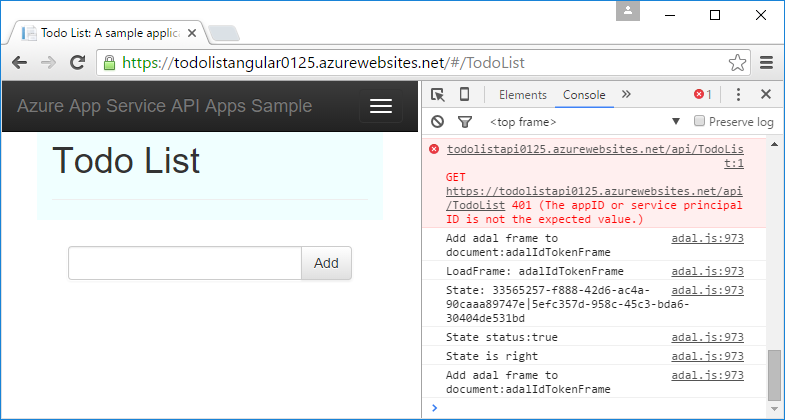

<properties
    pageTitle="Azure 應用程式服務中的 API 應用程式服務本金驗證 |Microsoft Azure"
    description="瞭解如何保護 Azure 應用程式服務中的服務-案例的 API 應用程式。"
    services="app-service\api"
    documentationCenter=".net"
    authors="tdykstra"
    manager="wpickett"
    editor=""/>

<tags
    ms.service="app-service-api"
    ms.workload="na"
    ms.tgt_pltfrm="dotnet"
    ms.devlang="na"
    ms.topic="article"
    ms.date="06/30/2016" 
    ms.author="rachelap"/>

# Azure 應用程式服務中的 API 應用程式服務本金驗證

## 概觀

本文說明如何使用*內部*存取 API 應用程式的應用程式服務驗證。 內部的情況是，您會使用您想要只適用於您的應用程式碼的 API 應用程式。 在 [應用程式服務中實作這種情況的建議的方式是使用 Azure AD 保護稱為的 API 應用程式。 您可以呼叫受保護的 API 應用程式，以從 Azure AD 取得提供應用程式識別碼 （主要的服務） 憑證的承載者權杖。 如需使用 Azure AD 的其他方法，請參閱**服務-服務驗證**的[Azure 應用程式服務驗證概觀](../app-service/app-service-authentication-overview.md#service-to-service-authentication)。

在本文中，您將學習︰

* 如何使用 Azure Active Directory (Azure AD) 來防止未經授權存取的 API 應用程式。
* 如何透過 Azure AD 服務本金 （應用程式識別） 認證取用受保護的 API 應用程式從 API 應用程式、 web 應用程式或行動應用程式。 有關如何使用從邏輯應用程式，請參閱[的使用您自訂的 API 裝載於邏輯應用程式的應用程式服務](../app-service-logic/app-service-logic-custom-hosted-api.md)。
* 如何確認受保護的 API 應用程式無法呼叫從瀏覽器，登入的使用者。
* 如何以確定受保護的 API 應用程式只能呼叫以特定的 Azure AD 服務本金。

本文包含兩個區段︰

* [如何設定服務 Azure 應用程式服務中的本金驗證](#authconfig)] 區段中的一般說明如何設定驗證任何 API 應用程式，以及如何使用受保護的 API 應用程式。 本節也同樣適用於所有應用程式服務，包括.NET、 Node.js，以及 Java 支援的架構。

* 開始使用 [[繼續.NET 快速入門教學課程](#tutorialstart)] 區段中，教學課程會引導您完成設定.NET 範例的應用程式，在應用程式服務中執行的 「 內部存取 「 案例。 

## 如何設定服務本金驗證在 Azure 應用程式服務

本節提供適用於任何 API 應用程式的一般指示。 步驟特定執行清單.NET 範例應用程式，請移至[繼續.NET API 應用程式的教學課程系列](#tutorialstart)。

1. 在[Azure 入口網站](https://portal.azure.com/)，瀏覽至您想要保護，然後尋找**功能**] 區段，並按一下的 API 應用程式**設定**刀**驗證 / 授權**。

    

3. 在 [**驗證 / 授權**刀，按一下 [**上**。

4. 在**執行時要求未經驗證的動作**下拉式清單中，選取 [**登入 Azure Active Directory** 。

5. 在 [**驗證提供者**中，選取**Azure Active Directory**。

    

6. 設定來建立新的**Azure Active Directory 設定**刀 Azure AD 應用程式或使用現有 Azure AD 應用程式如果您已經有您想要使用。

    內部案例通常涉及呼叫 API 應用程式的 API 應用程式。 您可以使用不同的 Azure AD 每一個 API 應用程式的應用程式或只要 Azure AD 應用程式。

    如需此刀的詳細說明，請參閱[如何設定您的應用程式服務應用程式，來使用 Azure Active Directory 登入](../app-service-mobile/app-service-mobile-how-to-configure-active-directory-authentication.md)。

7. 當您完成驗證提供者設定刀時，按一下**[確定]**。

7. 在 [**驗證 / 授權**刀，按一下 [**儲存**]。

    ![按一下 [儲存]](./media/app-service-api-dotnet-service-principal-auth/authsave.png)

應用程式服務完成之後，只允許從中設定來電者要求 Azure AD 租用戶。 在受保護的 API 應用程式不必須使用任何驗證或授權的程式碼。 承載者權杖會傳遞給 API 應用程式，以及 [經常使用的宣告 HTTP 標題中，您可以閱讀以驗證您的要求都來自特定的來電，例如服務主要的程式碼中的資訊。

驗證可使用此功能的支援服務應用程式，包括.NET、 Node.js，以及 Java 所有語言相同的方式。 

#### 如何使用受保護的 API 應用程式

來電者必須提供 Azure AD 承載者權杖 API 通話。 若要取得使用服務的本金認證承載者權杖，來電者使用 Active Directory 驗證庫 (ADAL [.NET](https://www.nuget.org/packages/Microsoft.IdentityModel.Clients.ActiveDirectory)、 [Node.js](https://github.com/AzureAD/azure-activedirectory-library-for-nodejs)，或[Java](https://github.com/AzureAD/azure-activedirectory-library-for-java))。 若要取得權杖，呼叫 ADAL 的程式碼提供 ADAL 下列資訊︰

* Azure AD 租用戶的名稱。
* 用戶端識別碼與來電者相關聯的 Azure AD 應用程式的用戶端私人 （應用程式鍵）。
* Azure AD 應用程式的受保護的 API 應用程式相關聯的用戶端識別碼。 （如果只要 Azure AD 應用程式的使用，這是相同的來電顯示用戶端識別碼）。

這些值，可在[Azure 傳統入口網站](https://manage.windowsazure.com/)的 Azure AD 頁面中。

已取得權杖之後, 來電者其包含在授權標頭中的 HTTP 要求。  應用程式服務會驗證的權杖，並允許邀請達到受保護的 API 應用程式。

#### 如何從 access 中相同的租用戶的使用者保護 API 應用程式

承載者權杖相同的租用戶中的使用者會被視為有效受保護的 API 應用程式。  如果您想要確定只服務主要可以呼叫受保護的 API 應用程式，請在受保護的 API 應用程式中，以驗證從權杖下列宣告新增程式碼︰

* `appid`應該與來電者相關聯的 Azure AD 應用程式的用戶端識別碼。 
* `oid`(`objectidentifier`) 應該來電者之間的服務本金 ID。 

應用程式服務也提供`objectidentifier`宣告 X-MS-用戶端-本金-識別碼標題中。

### 如何保護 API 應用程式從瀏覽器存取

如果您沒有驗證宣告中受保護的 API 應用程式，程式碼，如果您使用不同的 Azure AD 應用程式的受保護的 API 應用程式，請務必 Azure AD 應用程式的回覆 URL 不 API 應用程式的基本 URL 相同。 如果回覆 URL 直接指向受保護的 API 應用程式，相同的 Azure AD 租用戶中的使用者可以瀏覽至 API 應用程式、 登入，並成功呼叫 API。

## 繼續.NET API 應用程式的教學課程

如果您追蹤 Node.js 或 Java 教學課程系列的 API 應用程式，前往 [[下一步](#next-steps)] 區段。 

這篇文章的其餘部分會繼續.NET API 應用程式的教學課程系列，並假設您已完成[使用者驗證教學課程](app-service-api-dotnet-user-principal-auth.md)，而且有執行 Azure 中啟用的使用者驗證範例應用程式。

## 設定 Azure 中的驗證

本節中您設定應用程式服務以便僅 HTTP 要求其允許達到資料層 API 應用程式是具有有效 Azure AD 承載者權杖。 

在下列區段中，您可以設定應用程式的認證傳送至 Azure AD、 返回承載者權杖，以及傳送承載者權杖資料層 API 應用程式的中間層 API 應用程式。 此程序所示的圖表。

如果您追蹤的教學課程的指示時遇到問題，請參閱[疑難排解](#troubleshooting)在本教學課程結尾處。 

1. 在[Azure 入口網站](https://portal.azure.com/)中，瀏覽至您建立的 API 應用程式**設定**刀 ToDoListDataAPI （資料層） API 應用程式，然後再按一下 [**設定**]。

2. **設定**刀中，尋找 [**功能**] 區段，然後按一下**驗證 / 授權**。

    

3. 在 [**驗證 / 授權**刀，按一下 [**上**。

4. 在**執行時要求未經驗證的動作**下拉式清單中，選取 [**登入 Azure Active Directory**。

    這是會以確保只有驗證邀請達到 API 應用程式的應用程式服務的設定。 有有效的承載者權杖的要求，應用程式服務會將沿著權杖傳遞給 API 應用程式，並填入 HTTP 標頭的常用的宣告，可讓該資訊更輕鬆地完成您的程式碼。

5. 按一下 [**驗證提供者**， **Azure Active Directory**。

    

6. 在**Azure Active Directory 設定**刀中，按一下 [**快速**]。

    使用**Express**選項 Azure 自動建立 AAD 應用程式，您 Azure AD[租用戶](https://msdn.microsoft.com/en-us/library/azure/jj573650.aspx#BKMK_WhatIsAnAzureADTenant)。 

    您不需要建立租用戶，因為每個 Azure 帳戶自動有的話。

7. 如果尚未選取，請底下的 [**管理模式**中，按一下 [**建立新的 AD 應用程式**]。

    入口網站可**建立應用程式**輸入的方塊有預設值。 根據預設，Azure AD 應用程式名稱為相同的 API 應用程式。 如果您想要的話，您可以輸入不同的名稱。
    
    

    **附註**︰ 或者，您可以使用單一 Azure AD 呼叫的 API 應用程式] 及 [受保護的 API 應用程式的應用程式。 如果您選擇的替代方案，您就不需要 [**建立新的 AD 應用程式**選項，因為您已經建立 Azure AD 應用程式使用者驗證教學課程中較舊版本。 在此教學課程中，您會使用分隔 Azure AD 呼叫的 API 應用程式和受保護的 API 應用程式的應用程式。

8. 記下**建立應用程式**輸入方塊; 中的值您會看到這個 AAD 應用程式在 Azure 傳統入口網站更新版本設定。

7. 按一下**[確定]**。

10. 在 [**驗證 / 授權**刀，按一下 [**儲存**]。

    ![按一下 [儲存]](./media/app-service-api-dotnet-service-principal-auth/saveauth.png)

    服務應用程式建立的 Azure Active Directory 應用程式**登入**url，並**回覆 URL**自動設定的 API 應用程式的 url。 第二個值可讓您登入和存取 API 應用程式的 AAD 租用戶中的使用者。

### 驗證受到保護的 API 應用程式

1. 在瀏覽器中移至 API 應用程式的 URL︰ 在**API 應用程式**會刀 Azure 入口網站中，按一下 [ **URL**] 下的 [連結。 

    您會重新導向至登入畫面因為達到 API 應用程式不允許未經驗證的要求。 

    如果您的瀏覽器並移至 Swagger 使用者介面，您的瀏覽器可能已登上-在這種情況下，開啟 InPrivate 或 Incognito 視窗，移至 Swagger UI URL。

18. 認證登入您的 AAD 租用戶中的使用者。

    當您登入時，「 已成功建立 」 頁面會顯示在瀏覽器中。

## 設定以取得，並傳送 Azure AD 權杖 ToDoListAPI 專案

此區段中，您會執行下列工作︰

* 使用 Azure AD 應用程式的認證，以取得權杖並 HTTP 要求傳送資料層 API 應用程式的中間層 API 應用程式中新增程式碼。
* 從 Azure AD 取得您所需要的認證。
* 輸入 Azure 應用程式服務執行階段環境設定中間層 API 應用程式的認證。 

### 設定以取得，並傳送 Azure AD 權杖 ToDoListAPI 專案

在 Visual Studio ToDoListAPI 專案中進行下列變更。

1. 取消*ServicePrincipal.cs*檔案中的程式碼的所有註解。

    這是使用.net ADAL 取得 Azure AD 承載者權杖的程式碼。  它會使用您可以稍後設定 Azure 執行階段環境中的數個設定值。 以下是程式碼︰ 

        public static class ServicePrincipal
        {
            static string authority = ConfigurationManager.AppSettings["ida:Authority"];
            static string clientId = ConfigurationManager.AppSettings["ida:ClientId"];
            static string clientSecret = ConfigurationManager.AppSettings["ida:ClientSecret"];
            static string resource = ConfigurationManager.AppSettings["ida:Resource"];
        
            public static AuthenticationResult GetS2SAccessTokenForProdMSA()
            {
                return GetS2SAccessToken(authority, resource, clientId, clientSecret);
            }
        
            static AuthenticationResult GetS2SAccessToken(string authority, string resource, string clientId, string clientSecret)
            {
                var clientCredential = new ClientCredential(clientId, clientSecret);
                AuthenticationContext context = new AuthenticationContext(authority, false);
                AuthenticationResult authenticationResult = context.AcquireToken(
                    resource,
                    clientCredential);
                return authenticationResult;
            }
        }

    **附註︰**將此程式碼需要.NET NuGet 套件 (Microsoft.IdentityModel.Clients.ActiveDirectory)，在 project 中已安裝的 ADAL。 如果您已建立此專案中從頭開始，您必須安裝此套件。 此套件不會自動安裝 API 應用程式的新專案範本。

2. *控制站/ToDoListController*，取消註解中的程式碼`NewDataAPIClient`授權標頭中要求的權杖加入 HTTP 的方法。

        client.HttpClient.DefaultRequestHeaders.Authorization =
            new AuthenticationHeaderValue("Bearer", ServicePrincipal.GetS2SAccessTokenForProdMSA().AccessToken);

3. 部署 ToDoListAPI 專案。 (以滑鼠右鍵按一下專案，然後按一下 [**發佈 > 發佈**。)

    Visual Studio 中部署專案，並開啟 web 應用程式的基本 url 瀏覽器。 這會顯示 403 錯誤頁面，這是標準的 [嘗試從瀏覽器移至 [網路 API 基底 URL。

4. 關閉瀏覽器。

### 取得 Azure AD 設定值

11. 在[Azure 傳統入口網站](https://manage.windowsazure.com/)中，移至**Azure Active Directory**。

12. 在 [**目錄**] 索引標籤中，按一下 [AAD 租用戶。

14. 按一下 [**應用程式 > 應用程式的公司擁有**，然後按一下 [核取記號。

15. 在應用程式清單中，按一下 [啟用驗證 ToDoListDataAPI （資料層） API 應用程式為您建立 Azure 的項目名稱。

16. 按一下 [**設定**] 索引標籤。

5. 複製**用戶端識別碼**值並將其儲存位置，就可以將它從更新版本。 

8. Azure 傳統入口網站中移回至清單的 [**我的公司所擁有的應用程式**，然後按一下 AAD 應用程式建立的中間層 ToDoListAPI API 應用程式 （您在先前教學課程中建立的項目，不在本教學課程中所建立的項目）。

16. 按一下 [**設定**] 索引標籤。

5. 複製**用戶端識別碼**值並將其儲存位置，就可以將它從更新版本。

6. 下**鍵**，請從 [**選取期間**] 下拉式清單中選取**1 年**。

6. 按一下 [**儲存**]。

    

7. 複製的值，並將其儲存位置，就可以將它從更新版本。

    

### Azure AD 設定中的中間層 API 應用程式的執行階段環境

1. 移至[Azure 入口網站](https://portal.azure.com/)中，然後瀏覽到裝載 TodoListAPI （中間層） 專案的 API 應用程式的**API 應用程式**刀。

2. 按一下 [**設定 > 應用程式設定**。

3. 在 [**應用程式設定**] 區段中，新增下列索引鍵和值︰

  	| **索引鍵** | ida︰ 授權單位 |
  	|---|---|
  	| **值** | https://login.microsoftonline.com/ {您 Azure AD 租用戶的名稱。 |
  	| **範例** | https://login.microsoftonline.com/contoso.onmicrosoft.com |

  	| **索引鍵** | ida: ClientId |
  	|---|---|
  	| **值** | 呼叫的應用程式 （中間層-ToDoListAPI） 用戶端識別碼 |
  	| **範例** | 960adec2-b74a-484a-960adec2-b74a-484a |

  	| **索引鍵** | ida: ClientSecret |
  	|---|---|
  	| **值** | 呼叫的應用程式 （中間層-ToDoListAPI） 應用程式索引鍵 |
  	| **範例** | e65e8fc9-5f6b-48e8-e65e8fc9-5f6b-48e8 |

  	| **索引鍵** | ida︰ 資源 |
  	|---|---|
  	| **值** | 用戶端識別碼稱為應用程式 （資料層-ToDoListDataAPI） |
  	| **範例** | e65e8fc9-5f6b-48e8-e65e8fc9-5f6b-48e8 |

    **附註**︰ 如`ida:Resource`，請確定您使用稱為應用程式的**用戶端識別碼**和不其**應用程式識別碼 URI**。

    `ida:ClientId`與`ida:Resource`不同本教學課程中的值，因為您使用的分隔 Azure AD applicaations 中間層和資料層。 如果您使用單一 Azure AD 應用程式的呼叫 API 應用程式，受保護的 API 應用程式，您可以使用相同的值中`ida:ClientId`和`ida:Resource`。

    程式碼會以取得這些值，讓它們無法儲存在專案的 Web.config 檔案或 Azure 執行階段環境中使用 ConfigurationManager。 Azure 應用程式服務中執行 ASP.NET 應用程式時，環境設定自動覆寫 Web.config 設定。 環境設定通常是[更安全的方式儲存比較 Web.config 檔案的機密資訊](http://www.asp.net/identity/overview/features-api/best-practices-for-deploying-passwords-and-other-sensitive-data-to-aspnet-and-azure)。

6. 按一下 [**儲存**]。

    ![按一下 [儲存]](./media/app-service-api-dotnet-service-principal-auth/appsettings.png)

### 測試應用程式

1. 在瀏覽器中移至 HTTPS 的 URL AngularJS 前端 web 應用程式。

2. 按一下 [**待辦事項清單**] 索引標籤，然後使用認證 Azure AD 租用戶中的使用者]。 

4. 新增待辦事項項目，以驗證應用程式正常運作。

    ![待辦事項清單] 頁面](./media/app-service-api-dotnet-service-principal-auth/mvchome.png)

    如果應用程式無法如預期般，請再次檢查所有您輸入 Azure 入口網站中的設定。 如果所有的設定正確，請參閱[疑難排解](#troubleshooting)稍後在本教學課程。

## 保護 API 應用程式從瀏覽器存取

在此教學課程中，您建立不同的 Azure AD ToDoListDataAPI （資料層） API 應用程式的應用程式。 如您所見，應用程式服務建立 AAD 應用程式時，將其設定的 AAD 應用程式可讓使用者移至瀏覽器中的 API 應用程式的 URL，然後登入的方式。 這表示您 Azure AD 租用戶，而不只是主體服務存取 API 某位使用者可能會。 

如果您想要避免無須撰寫程式碼之受保護的 API 應用程式中的瀏覽器存取，您可以變更**回覆 URL** AAD 應用程式中，使其位於不同的 API 應用程式的基本的 URL。 

### 停用瀏覽器存取

1. 在傳統入口網站**設定**] 索引標籤 AAD 應用程式所建立的 TodoListService 變更**回覆 URL** ] 欄位中的值，使其位於有效的 URL，但不是 API 應用程式的 URL。
 
2. 按一下 [**儲存**]。

### 請確認瀏覽器存取不再有效

先前您完成驗證了，您可以前往 API 應用程式 URL 從瀏覽器使用個別使用者的認證登入。 在 [此節]，檢查這是不再可能。 

1. 在新的瀏覽器視窗中，移至 API 應用程式的 URL 一次。

2. 當畫面提示您這麼做，請登入。

3. 登入順利完成，但會造成錯誤頁面。

    您已設定 AAD 應用程式，以便 AAD 租用戶中的使用者無法登入，並從瀏覽器存取 API。 您仍然可以存取的 API 應用程式使用服務本金權杖，您可以驗證的 web 應用程式的 URL，新增更多的待辦事項項目。

## 限制存取某個服務本金  

以滑鼠右鍵，可以為使用者取得權杖任何本機或服務主要 Azure AD 租用戶撥打 （資料層） TodoListDataAPI API 應用程式。 您可能會想要確認的資料層 API 應用程式，只接受通話從 TodoListAPI （中間層） API 應用程式，並僅從特定服務本金。 

您可以加入驗證的程式碼，以便將這些限制`appid`和`objectidentifier`宣告來電。

在此教學課程中，您將驗證應用程式識別碼與服務的主體識別碼直接在您的控制站動作的程式碼。  若要使用自訂的替代方案是`Authorize`屬性，或執行此驗證，您啟動序列 （例如 OWIN 介軟體）。 如需後者的範例，請參閱[這個範例應用程式](https://github.com/mohitsriv/EasyAuthMultiTierSample/blob/master/MyDashDataAPI/Startup.cs)。 

請進行下列變更 TodoListDataAPI 專案。

2. 開啟*Controllers/TodoListController.cs*檔案。

3. 取消註解的線條，設定`trustedCallerClientId`和`trustedCallerServicePrincipalId`。

        private static string trustedCallerClientId = ConfigurationManager.AppSettings["todo:TrustedCallerClientId"];
        private static string trustedCallerServicePrincipalId = ConfigurationManager.AppSettings["todo:TrustedCallerServicePrincipalId"];

4. 取消註解中的 CheckCallerId 方法的程式碼。 這個方法稱為控制器中每個動作方法的開頭。 

        private static void CheckCallerId()
        {
            string currentCallerClientId = ClaimsPrincipal.Current.FindFirst("appid").Value;
            string currentCallerServicePrincipalId = ClaimsPrincipal.Current.FindFirst("http://schemas.microsoft.com/identity/claims/objectidentifier").Value;
            if (currentCallerClientId != trustedCallerClientId || currentCallerServicePrincipalId != trustedCallerServicePrincipalId)
            {
                throw new HttpResponseException(new HttpResponseMessage { StatusCode = HttpStatusCode.Unauthorized, ReasonPhrase = "The appID or service principal ID is not the expected value." });
            }
        }

5. 重新部署 ToDoListDataAPI 專案 Azure 應用程式服務。

6. 在瀏覽器中移至 AngularJS 前端 web 應用程式的 HTTPS URL，然後在 [首頁] 頁面上，按一下 [**待辦事項清單**] 索引標籤。

    應用程式無法運作，因為通話的後端會失敗。 新的程式碼會檢查實際 appid 和 objectidentifier，但還沒有要檢查其針對正確的值。 在瀏覽器開發人員工具主控台報表伺服器會傳回 HTTP 401 錯誤。

    

    您可以在下列步驟中設定預期的值。

8. 使用 PowerShell 的 Azure AD，取得您建立 TodoListWebApp 專案的 Azure AD 應用程式服務主要的值。

    。 瞭解如何安裝 PowerShell 的 Azure 並連線到您的訂閱，請參閱[使用 PowerShell 的 Azure 與 Azure 資源管理員](../powershell-azure-resource-manager.md)的相關指示。

    b。 若要取得服務原則的清單，請執行`Login-AzureRmAccount`] 命令，然後`Get-AzureRmADServicePrincipal`] 命令。

    c。 尋找 objectid 服務主體 TodoListAPI 應用程式，並將其儲存在您可以複製稍後的位置。

7. 在 Azure 入口網站，瀏覽至 API 應用程式刀部署 ToDoListDataAPI 專案的 API 應用程式。

9. 按一下 [**設定 > 應用程式設定**。

3. 在 [**應用程式設定**] 區段中，新增下列索引鍵和值︰

  	| **索引鍵** | todo:TrustedCallerServicePrincipalId |
  	|---|---|
  	| **值** | 服務本金 id 呼叫應用程式 |
  	| **範例** | 4f4a94a4-6f0d-4072-4f4a94a4-6f0d-4072 |

  	| **索引鍵** | todo:TrustedCallerClientId |
  	|---|---|
  	| **值** | 呼叫 [應用程式-TodoListAPI Azure AD 應用程式從複製的用戶端識別碼 |
  	| **範例** | 960adec2-b74a-484a-960adec2-b74a-484a |

6. 按一下 [**儲存**]。

    ![按一下 [儲存]](./media/app-service-api-dotnet-service-principal-auth/trustedcaller.png)

6. 使用瀏覽器返回 web 應用程式的 URL，然後在 [首頁] 頁面上，按一下 [**待辦事項清單**] 索引標籤。

    這次應用程式可如預期般因為受信任的來電顯示應用程式識別碼與服務的本金識別碼預期的值。

    ![待辦事項清單] 頁面](./media/app-service-api-dotnet-service-principal-auth/mvchome.png)

## 建置中從頭開始專案

兩個 Web API 專案所建立的範本**Azure API 應用程式**的專案，並以 ToDoList 控制器取代預設值控制站。 取得 ToDoListAPI 專案中的 Azure AD 服務本金權杖的[Active Directory 驗證文件庫 (ADAL).net](https://www.nuget.org/packages/Microsoft.IdentityModel.Clients.ActiveDirectory/) NuGet 套件已安裝。
 
如需有關如何建立 Web API 後端像 ToDoListAngular AngularJS 單一頁面應用程式的資訊，請參閱[手上實驗室︰ 建立單一頁面應用程式] 選項與 ASP.NET Web API 及 Angular.js](http://www.asp.net/web-api/overview/getting-started-with-aspnet-web-api/build-a-single-page-application-spa-with-aspnet-web-api-and-angularjs)。 如需如何新增 Azure AD 驗證碼，請參閱[設定安全性 AngularJS 單一頁面應用程式搭配使用 Azure AD](../active-directory/active-directory-devquickstarts-angular.md)資訊。

## 疑難排解

[AZURE.INCLUDE [troubleshooting](../../includes/app-service-api-auth-troubleshooting.md)]

* 請確定您請勿混淆 ToDoListAPI （中間層） 和 ToDoListDataAPI （資料層）。 例如，在本教學課程您新增驗證資料層 API 應用程式，**但應用程式鍵必須來自於您建立介層 API 應用程式的 Azure AD 應用程式**。

## 後續步驟

這是 API 應用程式一系列中的最後一個教學課程。 

如需有關 Azure Active Directory 的詳細資訊，請參閱下列資源。

* [Azure AD 開發人員指南](http://aka.ms/aaddev)
* [Azure AD 案例](http://aka.ms/aadscenarios)
* [Azure AD 範例](http://aka.ms/aadsamples)

    [WebApp-WebAPI-OAuth2-AppIdentity-DotNet](http://github.com/AzureADSamples/WebApp-WebAPI-OAuth2-AppIdentity-DotNet)範例就像在本教學課程中，但不使用應用程式服務驗證會顯示的內容。

如要部署至此 API 應用程式的 Visual Studio 專案，使用 Visual Studio 或[自動化部署](http://www.asp.net/aspnet/overview/developing-apps-with-windows-azure/building-real-world-cloud-apps-with-windows-azure/continuous-integration-and-continuous-delivery)從[來源控制系統](http://www.asp.net/aspnet/overview/developing-apps-with-windows-azure/building-real-world-cloud-apps-with-windows-azure/source-control)，其他方法的相關資訊請參閱[如何部署 Azure 應用程式服務應用程式](../app-service-web/web-sites-deploy.md)。
