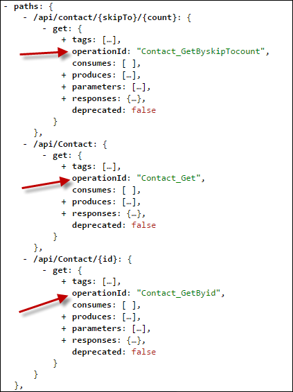

<properties 
    pageTitle="自訂 Swashbuckle 產生 API 定義" 
    description="瞭解如何自訂 Swagger API 定義 Swashbuckle 產生的 API 應用程式中 Azure 應用程式服務。" 
    services="app-service\api" 
    documentationCenter=".net" 
    authors="bradygaster" 
    manager="wpickett" 
    editor="jimbe"/>

<tags 
    ms.service="app-service-api" 
    ms.workload="web" 
    ms.tgt_pltfrm="dotnet" 
    ms.devlang="na" 
    ms.topic="article" 
    ms.date="08/29/2016" 
    ms.author="rachelap"/>

# 自訂 Swashbuckle 產生 API 定義 

## 概觀

本文說明如何自訂 Swashbuckle 處理常見的案例，您可能會想要變更的預設行為︰

* Swashbuckle 產生控制器方法多載重複作業識別碼
* Swashbuckle 假設只有效的回應，方法是 HTTP 200 （確定） 
 
## 自訂作業識別碼產生器

Swashbuckle 產生 Swagger 作業識別碼來造句控制器名稱和方法名稱。 當您有多個多載的方法，此模式會建立問題︰ Swashbuckle 產生重複作業識別碼，這是無效 Swagger JSON。

例如，下列控制器程式碼會造成 Swashbuckle 產生三個 Contact_Get 作業識別碼。

您可以手動平常方法唯一的名稱，例如下列內容以取得此範例中的方式來解決問題︰

* 取得
* GetById
* 提示

替代方案是延伸 Swashbuckle，使其自動產生唯一的作業識別碼。

下列步驟說明如何自訂 Swashbuckle 使用 Visual Studio API 應用程式預覽專案範本所包含的專案*SwaggerConfig.cs*檔案。  您也可以在 Web API 專案以供部署 API 應用程式為您設定的自訂 Swashbuckle。

1. 建立自訂`IOperationFilter`實作 

    `IOperationFilter`介面 Swashbuckle 使用者想要自訂各式各樣的 Swagger 中繼資料程序提供的擴充點。 下列程式碼示範變更作業識別碼產生行為的其中一個方法。 程式碼會將參數名稱附加至作業 id 名稱。  

        using Swashbuckle.Swagger;
        using System.Web.Http.Description;
        
        namespace ContactsList
        {
            public class MultipleOperationsWithSameVerbFilter : IOperationFilter
            {
                public void Apply(
                    Operation operation,
                    SchemaRegistry schemaRegistry,
                    ApiDescription apiDescription)
                {
                    if (operation.parameters != null)
                    {
                        operation.operationId += "By";
                        foreach (var parm in operation.parameters)
                        {
                            operation.operationId += string.Format("{0}",parm.name);
                        }
                    }
                }
            }
        }

2. 電話中*App_Start\SwaggerConfig.cs*檔案`OperationFilter`導致 Swashbuckle 若要使用的新方法`IOperationFilter`實作。

        c.OperationFilter<MultipleOperationsWithSameVerbFilter>();

    

    Swashbuckle NuGet 套件會遭到捨棄*SwaggerConfig.cs*檔案包含的擴充功能的許多標記註解的範例。 其他註解不顯示在這裡。 

    進行這項變更之後, 您`IOperationFilter`實作會使用，而且會使產生的唯一作業識別碼。
 
    

    
## 200 以外的回應代碼

根據預設，Swashbuckle 假設 HTTP 200 （確定） 回應*只*從 Web API 方法合法回應。 在某些情況下，您可能會想要傳回其他回應代碼不會導致用戶端會引發例外狀況。  例如，下列 Web API 程式碼示範您想要接受 200 或為有效的回覆 404 用戶端的案例。

    [ResponseType(typeof(Contact))]
    public HttpResponseMessage Get(int id)
    {
        var contacts = GetContacts();

        var requestedContact = contacts.FirstOrDefault(x => x.Id == id);

        if (requestedContact == null)
        {
            return Request.CreateResponse(HttpStatusCode.NotFound);
        }
        else
        {
            return Request.CreateResponse<Contact>(HttpStatusCode.OK, requestedContact);
        }
    }

在此案例中，依預設會產生的 Swashbuckle Swagger 指定只有一個合法 HTTP 狀態程式碼，HTTP 200。

因為 Visual Studio 使用 Swagger API 定義的用戶端產生的程式碼，它會建立引發例外狀況的任何回應 HTTP 200 以外的用戶端程式碼。 下列程式碼是從這個範例 Web API 方法產生 C# 用戶端。

    if (statusCode != HttpStatusCode.OK)
    {
        HttpOperationException<object> ex = new HttpOperationException<object>();
        ex.Request = httpRequest;
        ex.Response = httpResponse;
        ex.Body = null;
        if (shouldTrace)
        {
            ServiceClientTracing.Error(invocationId, ex);
        }
        throw ex;
    } 

Swashbuckle 提供兩種自訂它所產生的預期 HTTP 回應代碼清單的方式使用 XML 註解或`SwaggerResponse`屬性。 屬性更為簡單，但只會用於 Swashbuckle 5.1.5 或更新版本。 在 Visual Studio 2013 中的 API 應用程式預覽新專案範本包含 Swashbuckle 版本 5.0.0，因此如果您使用的範本，且不想要更新 Swashbuckle，則只能使用 XML 註解。 

### 自訂使用 XML 註解的預期的回應代碼

若要指定回應代碼，如果您 Swashbuckle 版本 5.1.5 比使用這個方法。

1. 首先，將 XML 文件的註解新增在您想要指定 HTTP 回應代碼的方法。 參加範例 Web API 如上所示的動作，並對其套用 XML 文件會導致下列範例之類的程式碼。 

        /// 

        /// Returns the specified contact.
        /// 

        /// <param name="id">The ID of the contact.</param>
        /// <returns>A contact record with an HTTP 200, or null with an HTTP 404.</returns>
        /// <response code="200">OK</response>
        /// <response code="404">Not Found</response>
        [ResponseType(typeof(Contact))]
        public HttpResponseMessage Get(int id)
        {
            var contacts = GetContacts();
        
            var requestedContact = contacts.FirstOrDefault(x => x.Id == id);
        
            if (requestedContact == null)
            {
                return Request.CreateResponse(HttpStatusCode.NotFound);
            }
            else
            {
                return Request.CreateResponse<Contact>(HttpStatusCode.OK, requestedContact);
            }
        }

1. 若要直接使用 XML Swashbuckle *SwaggerConfig.cs*檔案中新增指示文件檔案。

    * 開啟*SwaggerConfig.cs*和*SwaggerConfig*類別指定至文件的 XML 檔案的路徑上建立的方法。 

            private static string GetXmlCommentsPath()
            {
                return string.Format(@"{0}\XmlComments.xml", 
                    System.AppDomain.CurrentDomain.BaseDirectory);
            }

    * 向下捲動*SwaggerConfig.cs*檔案中，直到您看到類似的螢幕畫面下方的程式碼的標記註解的行。 

        
    
    * 若要啟用 Swagger 產生期間處理 XML 註解線條取消註解。 
    
        
    
1. 若要產生 XML 文件檔案，移到專案的屬性並啟用 XML 文件檔案，如下圖所示，在下面的螢幕擷取畫面。 

     

當您執行這些步驟時，產生的 Swashbuckle Swagger JSON 會反映在 XML 註解中所指定的 HTTP 回應代碼。 螢幕擷取畫面下方示範此新 JSON 內容。 

當您使用 Visual Studio 重新產生的您 REST API 的用戶端程式碼時，C# 程式碼會接受 [HTTP [確定] 和 [找不到狀態碼而不會引發例外狀況，讓您使用的程式碼，決定如何處理 null 的 [連絡人] 記錄傳回。 

        if (statusCode != HttpStatusCode.OK && statusCode != HttpStatusCode.NotFound)
        {
            HttpOperationException<object> ex = new HttpOperationException<object>();
            ex.Request = httpRequest;
            ex.Response = httpResponse;
            ex.Body = null;
            if (shouldTrace)
            {
                ServiceClientTracing.Error(invocationId, ex);
            }
                throw ex;
        }

可以在[此 GitHub 存放庫](https://github.com/Azure-Samples/app-service-api-dotnet-swashbuckle-swaggerresponse)中找到這個展示的程式碼。 Web API 以及標示 XML 文件的註解的專案是主控台應用程式專案包含此 API 的產生用戶端。 

### 自訂使用 SwaggerResponse 屬性的預期的回應代碼

[SwaggerResponse](https://github.com/domaindrivendev/Swashbuckle/blob/master/Swashbuckle.Core/Swagger/Annotations/SwaggerResponseAttribute.cs)屬性是用於 Swashbuckle 5.1.5 及更新版本。 萬一您專案中有較舊的版本，此節開始說如何更新 Swashbuckle NuGet 套件，讓您可以使用這個屬性。

1. 在**方案總管]**中，以滑鼠右鍵按一下網頁 API 專案，然後按一下 [**管理 NuGet 套件**。 

    

1. 按一下 [ *Swashbuckle* NuGet 套件] 旁的 [*更新*] 按鈕。 

    

1. 加入您要指定有效 HTTP 回應碼網頁 API 動作方法*SwaggerResponse*屬性。 

        [SwaggerResponse(HttpStatusCode.OK)]
        [SwaggerResponse(HttpStatusCode.NotFound)]
        [ResponseType(typeof(Contact))]
        public HttpResponseMessage Get(int id)
        {
            var contacts = GetContacts();

            var requestedContact = contacts.FirstOrDefault(x => x.Id == id);
            if (requestedContact == null)
            {
                return Request.CreateResponse(HttpStatusCode.NotFound);
            }
            else
            {
                return Request.CreateResponse<Contact>(HttpStatusCode.OK, requestedContact);
            }
        }

2. 新增`using`屬性的命名空間陳述式︰

        using Swashbuckle.Swagger.Annotations;
        
1. 瀏覽至您的專案*/swagger/docs/v1* URL，並會顯示在 Swagger JSON 各種 HTTP 回應碼。 

    

可以在[此 GitHub 存放庫](https://github.com/Azure-Samples/API-Apps-DotNet-Swashbuckle-Customization-MultipleResponseCodes-With-Attributes)中找到這個展示的程式碼。 Web API 以及使用*SwaggerResponse*屬性裝飾的專案是主控台應用程式專案包含此 API 的產生用戶端。 

## 後續步驟

本文顯示如何自訂 Swashbuckle 產生作業識別碼和有效的回應的方式。 如需詳細資訊，請參閱[在 GitHub Swashbuckle](https://github.com/domaindrivendev/Swashbuckle)。
 
