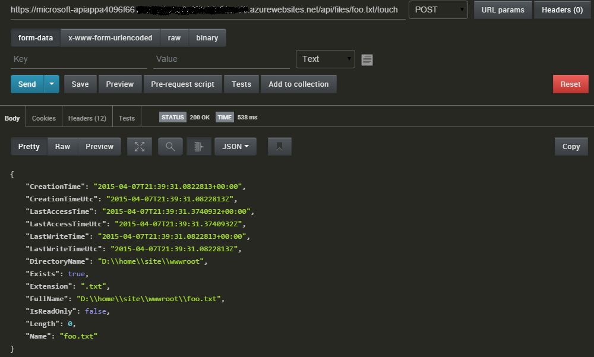

<properties 
    pageTitle="應用程式服務 API 應用程式引動程序 |Microsoft Azure" 
    description="如何在 Azure 應用程式服務 API 應用程式中實作引動程序" 
    services="logic-apps" 
    documentationCenter=".net" 
    authors="guangyang"
    manager="wpickett" 
    editor="jimbe"/>

<tags 
    ms.service="logic-apps" 
    ms.workload="na" 
    ms.tgt_pltfrm="dotnet" 
    ms.devlang="na" 
    ms.topic="article" 
    ms.date="08/25/2016" 
    ms.author="rachelap"/>

# Azure 應用程式服務 API 應用程式引動程序

>[AZURE.NOTE] 此版本，請參閱適用於 API 應用程式 2014年-12-01-預覽結構描述版本。

## 概觀

本文說明如何實作 API 應用程式引動程序，並從邏輯應用程式使用。

本主題中的程式碼片段的所有複製[FileWatcher API 應用程式碼範例](http://go.microsoft.com/fwlink/?LinkId=534802)。 

請注意，您將需要下載下列 nuget 套件中建立並執行本文的程式碼︰ [http://www.nuget.org/packages/Microsoft.Azure.AppService.ApiApps.Service/](http://www.nuget.org/packages/Microsoft.Azure.AppService.ApiApps.Service/)。

## 什麼是 API 應用程式引動程序？

是最常見的案例的 API 應用程式啟動事件，以便用戶端的 API 應用程式可以採取適當的動作，以回應事件。 支援這種情況 REST API 基礎機制稱為 API 應用程式的觸發程序。 

例如，假設您的用戶端程式碼使用[Twitter 連接器 API 應用程式](../app-service-logic/app-service-logic-connector-twitter.md)，而且必須執行的動作，根據新的推文包含特定文字的程式碼。 在此情況下，您可能會設定投票或推入觸發程序以利於進行這項需求。

## 投票觸發程序與推入觸發程序

目前，支援兩種類型的觸發程序︰

- 投票觸發程序的用戶端輪詢 API 適用之應用程式通知有已經引發的事件 
- 當您放開滑鼠按鈕時的 API 應用程式通知推入觸發程序的用戶端 

### 投票觸發程序

投票觸發程序被當作一般的 REST API，並以獲得，若要取得通知預期它的用戶端 （例如邏輯應用程式）。 當用戶端可能會維持狀態時，請投票觸發程序本身沒有狀態。 

下列資訊要求與回應封包說明投票觸發程序合約的一些的重要︰

- 要求
    - HTTP 方法︰ 取得
    - 參數
        - triggerState-選用的參數 」 可讓用戶端指定其狀態，好讓投票觸發程序正確決定是否要傳回通知，或不可以根據指定的狀態。
        - API 專用的參數
- 回應
    - 狀態碼**200** -要求的還有觸發程序的通知。 通知的內容會回應內容。 在回應中的 「 重試-之後 「 頁首會指出必須擷取的後續要求呼叫的其他告知資料。
    - 狀態碼**202** -要求是有效的但沒有新的通知，從 [觸發程序。
    - 狀態碼**4xx** -要求不正確。 用戶端不應該重試要求。
    - 狀態碼**5xx** -要求會導致內部伺服器錯誤及/或暫時發生問題。 用戶端應該重試要求。

下列程式碼片段是如何實作的投票觸發程序的範例。

    // Implement a poll trigger.
    [HttpGet]
    [Route("api/files/poll/TouchedFiles")]
    public HttpResponseMessage TouchedFilesPollTrigger(
        // triggerState is a UTC timestamp
        string triggerState,
        // Additional parameters
        string searchPattern = "*")
    {
        // Check to see whether there is any file touched after the timestamp.
        var lastTriggerTimeUtc = DateTime.Parse(triggerState).ToUniversalTime();
        var touchedFiles = Directory.EnumerateFiles(rootPath, searchPattern, SearchOption.AllDirectories)
            .Select(f => FileInfoWrapper.FromFileInfo(new FileInfo(f)))
            .Where(fi => fi.LastAccessTimeUtc > lastTriggerTimeUtc);

        // If there are files touched after the timestamp, return their information.
        if (touchedFiles != null && touchedFiles.Count() != 0)
        {
            // Extension method provided by the AppService service SDK.
            return this.Request.EventTriggered(new { files = touchedFiles });
        }
        // If there are no files touched after the timestamp, tell the caller to poll again after 1 mintue.
        else
        {
            // Extension method provided by the AppService service SDK.
            return this.Request.EventWaitPoll(new TimeSpan(0, 1, 0));
        }
    }

若要測試此投票觸發程序，請遵循下列步驟︰

1. 部署**公用匿名**驗證設定 API 應用程式。
2. 呼叫 [**觸控**] 作業觸控檔案。 下圖顯示透過郵差範例要求。
   
3. 呼叫投票觸發程序和**triggerState**參數設定為 [步驟 2 之前的時間戳記。 下圖顯示透過郵差範例要求。
   

### 推入觸發程序

推入觸發程序被當作一般的 REST API 的推入通知，以啟動特定事件時收到通知您已註冊的用戶端。

下列資訊要求與回應封包說明推入觸發程序合約有些重要部分。

- 要求
    - HTTP 方法︰ 保留
    - 參數
        - 觸發程式識別碼︰ 要求-不透明字串 （例如 GUID)，表示登錄的推入觸發程序。
        - callbackUrl︰ 所需的回撥時放開滑鼠按鈕叫用的 URL。 引動是一個簡單的文章 HTTP 呼叫。
        - API 專用的參數
- 回應
    - 狀態碼**200** -登錄成功的用戶端的要求。
    - 狀態碼**4xx** -要求不正確。 用戶端不應該重試要求。
    - 狀態碼**5xx** -要求會導致內部伺服器錯誤及/或暫時發生問題。 用戶端應該重試要求。
- 回撥
    - HTTP 方法︰ 文章
    - 要求本文︰ 通知的內容。

下列程式碼片段是如何實作推入觸發程序的範例︰

    // Implement a push trigger.
    [HttpPut]
    [Route("api/files/push/TouchedFiles/{triggerId}")]
    public HttpResponseMessage TouchedFilesPushTrigger(
        // triggerId is an opaque string.
        string triggerId,
        // A helper class provided by the AppService service SDK.
        // Here it defines the input of the push trigger is a string and the output to the callback is a FileInfoWrapper object.
        [FromBody]TriggerInput<string, FileInfoWrapper> triggerInput)
    {
        // Register the trigger to some trigger store.
        triggerStore.RegisterTrigger(triggerId, rootPath, triggerInput);

        // Extension method provided by the AppService service SDK indicating the registration is completed.
        return this.Request.PushTriggerRegistered(triggerInput.GetCallback());
    }

    // A simple in-memory trigger store.
    public class InMemoryTriggerStore
    {
        private static InMemoryTriggerStore instance;

        private IDictionary<string, FileSystemWatcher> _store;

        private InMemoryTriggerStore()
        {
            _store = new Dictionary<string, FileSystemWatcher>();
        }

        public static InMemoryTriggerStore Instance
        {
            get
            {
                if (instance == null)
                {
                    instance = new InMemoryTriggerStore();
                }
                return instance;
            }
        }

        // Register a push trigger.
        public void RegisterTrigger(string triggerId, string rootPath,
            TriggerInput<string, FileInfoWrapper> triggerInput)
        {
            // Use FileSystemWatcher to listen to file change event.
            var filter = string.IsNullOrEmpty(triggerInput.inputs) ? "*" : triggerInput.inputs;
            var watcher = new FileSystemWatcher(rootPath, filter);
            watcher.IncludeSubdirectories = true;
            watcher.EnableRaisingEvents = true;
            watcher.NotifyFilter = NotifyFilters.LastAccess;

            // When some file is changed, fire the push trigger.
            watcher.Changed +=
                (sender, e) => watcher_Changed(sender, e,
                    Runtime.FromAppSettings(),
                    triggerInput.GetCallback());

            // Assoicate the FileSystemWatcher object with the triggerId.
            _store[triggerId] = watcher;

        }

        // Fire the assoicated push trigger when some file is changed.
        void watcher_Changed(object sender, FileSystemEventArgs e,
            // AppService runtime object needed to invoke the callback.
            Runtime runtime,
            // The callback to invoke.
            ClientTriggerCallback<FileInfoWrapper> callback)
        {
            // Helper method provided by AppService service SDK to invoke a push trigger callback.
            callback.InvokeAsync(runtime, FileInfoWrapper.FromFileInfo(new FileInfo(e.FullPath)));
        }
    }

若要測試此投票觸發程序，請遵循下列步驟︰

1. 部署**公用匿名**驗證設定 API 應用程式。
2. 瀏覽至[http://requestb.in/](http://requestb.in/)建立 RequestBin 其做為您的回撥 URL。
3. [撥號給 GUID 為**觸發程式識別碼**與 RequestBin URL 為**callbackUrl**推入觸發程序。
   
4. 呼叫 [**觸控**] 作業觸控檔案。 下圖顯示透過郵差範例要求。
   
5. 請確認 [推入觸發程序回撥叫用的屬性輸出 RequestBin。
   

### 說明中 API 定義觸發程序

實作觸發程序，將您的 API 應用程式部署到 Azure，瀏覽至**API 定義**刀 Azure 預覽入口網站中，您會看到引動程序會自動辨識 Swagger 2.0 API 定義的 API 應用程式會受到在 ui 上。

如果您按一下 [**下載 Swagger** ] 按鈕，開啟 JSON 檔案時，您會看到類似以下的結果︰

    "/api/files/poll/TouchedFiles": {
      "get": {
        "operationId": "Files_TouchedFilesPollTrigger",
        ...
        "x-ms-scheduler-trigger": "poll"
      }
    },
    "/api/files/push/TouchedFiles/{triggerId}": {
      "put": {
        "operationId": "Files_TouchedFilesPushTrigger",
        ...
        "x-ms-scheduler-trigger": "push"
      }
    }

擴充屬性**x-ms-schedular-觸發程序**引動程序的 API 定義所述的方式，並會自動新增的 API 應用程式閘道器如果，要求透過閘道器的 API 定義下列準則的其中一個邀請。 （您也可以新增此屬性手動。）

- 投票觸發程序
    - 如果 HTTP 的方法是**取得**。
    - 如果**operationId**屬性包含字串**觸發程序**。
    - 如果 [**參數**] 屬性中包含參數**名稱**屬性設定為**triggerState**。
- 推入觸發程序
    - 如果 HTTP 的方法是**將**。
    - 如果**operationId**屬性包含字串**觸發程序**。
    - 如果 [**參數**] 屬性中包含參數**名稱**屬性設定為 [**觸發程式識別碼**。

## 使用邏輯應用程式中的 API 應用程式引動程序

### 清單，然後在邏輯應用程式設計工具中設定 API 應用程式引動程序

如果您建立的 API 應用程式為相同的 [資源] 群組中的邏輯應用程式，您可以將其新增至設計畫布中，只要按一下它。 下列圖像說明︰

## 最佳化 API 邏輯應用程式的應用程式觸發程序

您新增至 API 應用程式的觸發程序之後，有您要如何改善體驗邏輯應用程式中使用 API 應用程式的一些事項。

例如， **triggerState**參數投票觸發程序應該會設定為下列運算式中的邏輯應用程式。 此運算式應該評估邏輯應用程式時，從觸發程序的最後一個引動，並傳回的值。  

    @coalesce(triggers()?.outputs?.body?['triggerState'], '')

附註︰ 如上述運算式中使用函數的說明，請參閱上[邏輯應用程式工作流程定義語言](https://msdn.microsoft.com/library/azure/dn948512.aspx)的文件。

邏輯應用程式使用者必須提供的運算式上方**triggerState**參數時使用的觸發程序。 很可能有預設邏輯應用程式設計工具擴充屬性**x ms-排程器建議**透過這個值。  讓參數本身不會顯示在設計工具，可以設定**x-ms-可見度**擴充屬性*內部*的值。  下列程式碼片段說明的。

    "/api/Messages/poll": {
      "get": {
        "operationId": "Messages_NewMessageTrigger",
        "parameters": [
          {
            "name": "triggerState",
            "in": "query",
            "required": true,
            "x-ms-visibility": "internal",
            "x-ms-scheduler-recommendation": "@coalesce(triggers()?.outputs?.body?['triggerState'], '')",
            "type": "string"
          }
        ]
        ...
        "x-ms-scheduler-trigger": "poll"
      }
    }

推入引動程序，**觸發程式識別碼**參數必須唯一識別邏輯應用程式。 建議的最佳作法是設定此屬性的工作流程的名稱，使用下列運算式︰

    @workflow().name

使用**x ms-排程器建議**和**x-ms-可見度**副檔名] 屬性中其 API 定義，能傳達邏輯應用程式設計工具會自動設定的使用者此運算式的 API 應用程式。

        "parameters":[  
          {  
            "name":"triggerId",
            "in":"path",
            "required":true,
            "x-ms-visibility":"internal",
            "x-ms-scheduler-recommendation":"@workflow().name",
            "type":"string"
          },

### 在 [API 定義中新增擴充屬性

在兩種方法之一 API 定義可以新增額外的中繼資料資訊-例如副檔名屬性**x ms-scheduler 建議**和**x-ms-可見度**-: 靜態和動態。

靜態中繼資料，可以直接在專案中編輯*/metadata/apiDefinition.swagger.json*檔案，並手動新增內容。

使用動態中繼資料的 API 應用程式，您可以編輯 SwaggerConfig.cs 檔案新增可以新增這些延伸作業篩選器。

    GlobalConfiguration.Configuration 
        .EnableSwagger(c =>
            {
                ...
                c.OperationFilter<TriggerStateFilter>();
                ...
            }

以下是如何實作此類別，以促進動態中繼資料案例的範例。

    // Add extension properties on the triggerState parameter
    public class TriggerStateFilter : IOperationFilter
    {

        public void Apply(Operation operation, SchemaRegistry schemaRegistry, System.Web.Http.Description.ApiDescription apiDescription)
        {
            if (operation.operationId.IndexOf("Trigger", StringComparison.InvariantCultureIgnoreCase) >= 0)
            {
                // this is a possible trigger
                var triggerStateParam = operation.parameters.FirstOrDefault(x => x.name.Equals("triggerState"));
                if (triggerStateParam != null)
                {
                    if (triggerStateParam.vendorExtensions == null)
                    {
                        triggerStateParam.vendorExtensions = new Dictionary<string, object>();
                    }

                    // add 2 vendor extensions
                    // x-ms-visibility: set to 'internal' to signify this is an internal field
                    // x-ms-scheduler-recommendation: set to a value that logic app can use
                    triggerStateParam.vendorExtensions.Add("x-ms-visibility", "internal");
                    triggerStateParam.vendorExtensions.Add("x-ms-scheduler-recommendation",
                                                           "@coalesce(triggers()?.outputs?.body?['triggerState'], '')");
                }
            }
        }
    }
 
